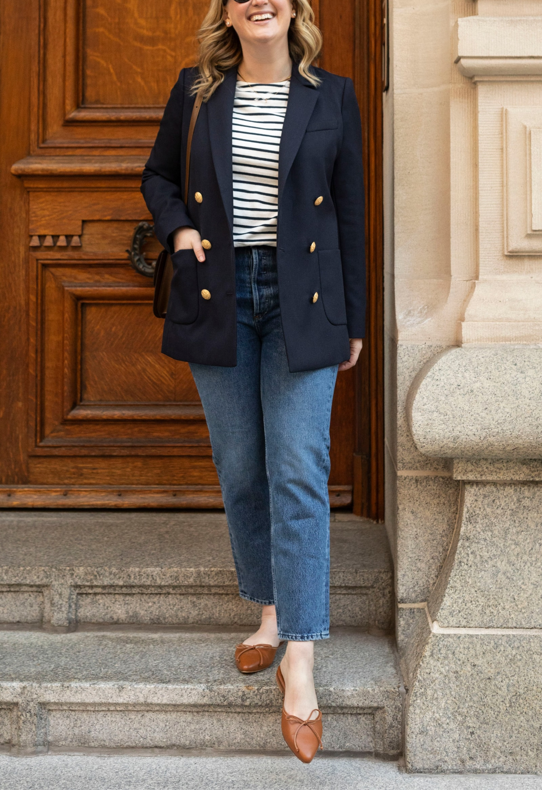

# 法式慵懒（French Effortless）
> **状态**: reviewed | 最后更新: 2026-06-23 | 分类: 欧洲经典 | **趋势**: 🔥 流行趋势

## 📖 概述
- 发源年代: 1960年代（以 Jane Birkin/ Françoise Hardy 为标志），但「法式风格」作为全球时尚标签真正形成于 2000-2010 年代
- 发源地: 法国巴黎（Saint-Germain-des-Prés / Le Marais 街区为精神地理中心）
- 风格关键词（5-8个）: «je ne sais quoi»（难以言喻的妙处）、未完成感、中性色基底、一件亮点、平底鞋、合身但不紧身、条纹衫
- 一句话定义（50字以内）: 看似不经意的精致感——衬衫袖子随意卷起、发型微乱、一点红唇就够了。核心是让精心准备看起来像「随手抓的」。

## 📜 历史文化
- **起源**: 1960年代，Jane Birkin、Françoise Hardy、Catherine Deneuve 等法国 IT Girls 开创了「不费力的时髦」。她们穿着简单的白衬衫+牛仔裤出现在戛纳红毯上，或者拎着菜篮子在巴黎街头被拍——这与当时好莱坞的华丽礼服文化形成尖锐对比。「法式风格」的核心从一开始就是对「过度打扮」的反叛。
- **发展脉络**:
  - **1960-70s**: Jane Birkin 的菜篮子+白T+喇叭牛仔裤定义了法式慵懒的初始公式。Birkin 包（1984年 Hermès 为她定制）后来成为全球最贵的「随意」符号
  - **1980-90s**: Inès de la Fressange（Chanel 首位专属模特）代表了「穿 Chanel 也像穿 T恤」的法式松弛。Isabel Marant 1994年创立品牌，将波西米亚与法式都市感融合
  - **2000s**: Sézane（2013年创立于巴黎）成为法式风格的线上代言人。Rouje（2016年 Jeanne Damas 创立）通过 Instagram 将「巴黎女孩」审美推向全球
  - **2010s**: Phoebe Philo 的 Celine（2008-2018）定义「法式知识分子女性」——白衬衫+阔腿裤+Stan Smith
  - **2020s**: 疫情后「舒适至上」与法式慵懒的「不费力」精神共振。Jacquemus 将南法阳光感加入法式配方
- **文化意义**: 法式慵懒是全球时尚史上最强的「反时尚」符号——它告诉全世界的女性：你不用穿得像去走红毯，白衬衫和平底鞋就够。它把「克制」变成了最高级。

## 🎨 美学特征
- **廓形特点**: 合身但不紧身——衣服跟随身体曲线但不勒。上衣略 oversize（白衬衫、条纹衫），下装高腰直筒或微喇。比例关键：上松下紧，或全身微松。绝不上下同时紧身。
- **色板**:
  - 主色调（法式四色）：海军蓝(#1B2A4A)、纯白(#FFFFF)、正红(#C41E3A)、卡其(#C4A882)
  - 辅助色：灰/米白/黑色/驼色
  - 点缀色：仅红色——红唇、红色芭蕾鞋、一条红色丝巾。一个红色足矣。
  - 禁忌色：荧光色、霓虹色、大面积印花、超过三个颜色同时出现
- **面料偏好**: 棉（白衬衫/条纹衫）> 羊绒（冬装）> 真丝（裹身裙）> 粗花呢（夹克）> 皮质（包+鞋）
- **标志单品表**:

| 单品 | 品牌示例 | 选择要点 |
|------|---------|---------|
| 条纹衫 (Breton Shirt) | Saint James, A.P.C., Sézane | 蓝白条纹、船领、略宽松、法国 Saint James 是原版 |
| 白衬衫 | A.P.C., Sézane, Equipment | 略 oversize、纯棉或真丝、袖口可卷起 |
| 直筒/微喇牛仔裤 | Sézane, A.P.C., Levi's | 高腰、不破洞、蓝色或白色、长度及踝 |
| 裹身裙 (Wrap Dress) | Rouje, Réalisation Par | V领、碎花或纯色、真丝或人造丝、系带收腰 |
| 风衣 (Trench Coat) | Burberry, Sézane, Sandro | 卡其色、双排扣、长度过膝或中长 |
| 针织开衫 | Sézane, Rouje | 略宽松、圆领或V领、羊绒或美利奴羊毛 |
| 芭蕾平底鞋 | Repetto, Chanel, Sézane | 圆头、红色或裸色、法国 Repetto 是原版 |
| 草编包/皮质简约包 | Sézane, Hermès, Polène | 自然材质、无大Logo、可手拎可肩背 |

## 🏷️ 代表品牌

### 核心品牌
| 品牌 | 国家 | 价位 | 一句话 |
|------|------|------|--------|
| Sézane | 法国 | ¥¥ | 2013年创立于巴黎，法式浪漫的线上旗舰，条纹衫+针织开衫+碎花裹身裙=法式三件套 |
| Rouje | 法国 | ¥¥ | Jeanne Damas 2016年创立，定义了 Instagram 时代的「巴黎女孩」范式——红唇+碎花+竹篮包 |
| A.P.C. | 法国 | ¥¥ | 1987年 Jean Touitou 创立，法式基础款之王。原牛+简约衬衫+半月包 |
| Isabel Marant | 法国 | ¥¥¥ | 1994年创立，波西米亚×法式都市感的原创者。坡跟运动鞋曾风靡全球 |
| Sandro | 法国 | ¥¥¥ | 法式都市通勤的优雅代表。粗花呢夹克+蕾丝内搭是经典公式 |
| Maje | 法国 | ¥¥ | Sandro 姐妹牌，更年轻。刺绣+流苏+中性西装混搭 |
| Jacquemus | 法国 | ¥¥¥ | 2009年 Simon Porte Jacquemus 创立，南法阳光感+解构剪裁，Chiquito 迷你包风靡 |
| Lemaire | 法国 | ¥¥¥¥ | Christophe Lemaire 与 Sarah-Linh Tran 主理，松弛知识分子风。宽松廓形+中性色+皮质腰带 |

### 平价替代
| 品牌 | 价位 | 说明 |
|------|------|------|
| Uniqlo U | ¥ | Christophe Lemaire 联名线，法式廓形×平价 |
| & Other Stories | ¥¥ | H&M 集团高端线，法式灵感+北欧品质 |
| COS | ¥¥ | 建筑感极简，可做法式基础款混搭 |
| Arket | ¥¥ | COS 姐妹牌，更日常的法式极简 |
| Massimo Dutti | ¥¥ | 西班牙优雅，法式通勤平价替代 |

### 新兴品牌（2024-2026）
- **Polène**: 法国皮具品牌，极简雕塑感包袋，定价 ¥¥-¥¥¥，被称「平民 Celine」
- **Musier Paris**: 法国博主 Anne-Laure Mais 创立，平价法式少女感

## 👤 风格偶像 & 名人

### 关键推动者
| 人物 | 身份 | 贡献 |
|------|------|------|
| Jane Birkin | 英/法演员/歌手 | 法式慵懒的终极原型——菜篮子+白衬衫+牛仔裤。Hermès Birkin 包以她命名 |
| Coco Chanel | 设计师 | 解放女性身体，让「女装可以不束缚」成为可能 |
| Inès de la Fressange | 模特 | Chanel 首位专属模特，代表了「穿高定也像穿日常」的法式松弛 |
| Phoebe Philo | 设计师 | Celine (2008-2018)创意总监，定义「Old Celine」——法式知识分子女性的标配 |

### 穿着此风格的明星/博主
| 人物 | 身份 | 为什么是 icon |
|------|------|---------------|
| Jeanne Damas | 博主/Rouje 创始人 | Instagram 时代的法式代言人——红唇+碎花裹身裙+竹篮包 |
| Camille Charrière | 法英混血博主 | 法式×英伦混搭，证明「法式可以不是法国人」|
| Léa Seydoux | 演员 | 红毯上的法式克制——她穿 Louis Vuitton 也像穿自己的衣服 |
| Caroline de Maigret | 模特/作家 | 《如何当个巴黎女人》合著者，巴黎 cool girl 代表 |
| Sabina Socol | 博主 | 前 L'Express 编辑，微胖身材的法式示范（证明法式不限尺码）|

## 👗 秀场 & 时装周
- **巴黎时装周 (Paris Fashion Week)**: Chanel/ Dior/ Saint Laurent/ Hermès/ Celine 等所有法系奢侈品牌
- **代表性系列**:
  - Celine SS2010 — Phoebe Philo 的首秀，定义了 2010s 法式知识分子女性形象
  - Chanel Cruise 系列 — 每年选全球不同城市，展示「法式优雅可以适配任何文化背景」
  - Jacquemus SS2020 — 南法薰衣草田秀场，将法式浪漫推向社交媒体峰值
- **巴黎街头**: 巴黎时装周的街拍比秀场更能定义法式慵懒——场外的编辑/买手/博主穿得比模特更有法国味

## 🔗 关联风格
- **父风格**: 法式优雅 (French Chic)
- **子风格**: 法式少女 (French Girl)、法式知识分子 (French Intellectual)
- **平行风格**: 意式 Sprezzatura（意大利版「不费力的优雅」）、北欧极简（共享克制感）
- **对立风格**: 韩系少女——法式刻意制造「随意感」，韩式刻意制造「精致感」
- **与姐妹风格差异**:
  1. vs 极简：法式有一条红唇或一条丝巾作为「破局点」，极简拒绝任何装饰
  2. vs 学院风：法式没有学院体系的阶层编码（校徽/条纹领带/格子裙），更个人化
  3. vs 波西米亚：法式更克制（一件印花就够），波西米亚更繁复（印花叠印花）
  4. vs 暗黑学院：法式拥抱阳光和自然光，暗黑学院偏好阴影和烛光——完全相反的情绪基调

## 📈 流行趋势
- **当前状态**: 持续稳定（法式慵懒是 timeless 的概念，不随潮流波动）
- **流行区域**: 法国本土 > 全球（「法式」是时尚界最强的地理标签之一）
- **发展方向**:
  - 2025-2026：法式慵懒与「静奢」(Quiet Luxury)趋势融合——无Logo、顶级面料、基础款即全部
  - 长期：法式慵懒不会被「取代」，因为它不是一个具体的服装款式系统，而是一种审美态度。只要「过度打扮焦虑」存在，法式慵懒就有市场

## 💡 穿搭建议
- **适合体型**: 沙漏形（高腰下装+裹身裙天然友好，0.95）、梨形（高腰阔腿裤遮盖臀腿，0.90）、直筒形（A字裙+白衬衫经典，0.85）
- **适合肤色**: 所有肤色——法式配色底层是中性色，任何肤色都可以穿
- **适合场合**: 通勤（风衣+白衬衫+直筒裤）、约会（裹身裙+芭蕾平底鞋）、周末（条纹衫+牛仔裤+草编包）
- **入门建议**:
  1. 买一件 Saint James 条纹衫——这是法式最便宜的入门券
  2. 中性色打底，一个红色单品破局——红唇/红色芭蕾鞋/红色丝巾，三选一
  3. 衬衫袖子要卷起，领口不系全——不是不整洁，是「未完成感」
  4. 投资一只无Logo的皮质简约包——法式不崇拜 Logo
  5. 平底 > 高跟——法式女孩走路，不是走秀

---
*本文基于多源研究整理，AI 辅助生成。*
