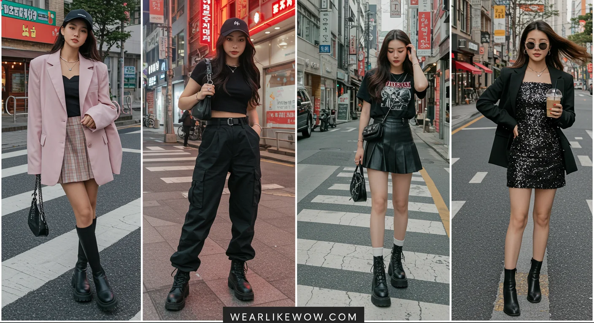

# 韩系少女（Korean Girlie）
> **状态**: reviewed | 最后更新: 2026-06-23 | 分类: 东亚风格 | **趋势**: 🔥 流行趋势

## 📖 概述
- 发源年代: 2010年代中期（2014-2016）
- 发源地: 韩国首尔（弘大 홍대 / 狎鸥亭 압구정 / 圣水洞 성수동）
- 风格关键词（5-8个）: 甜酷平衡、A字廓形、Oversize上装、短裙/高腰、柔和粉彩、奶油色系、层次叠穿
- 一句话定义（50字以内）: 首尔街头少女风——用宽松卫衣平衡A字短裙的甜美，用厚底鞋和及踝短袜制造青春感，甜而不腻、松而不垮。

## 📜 历史文化
- **起源**: 2010年代中期，K-pop（Twice/Red Velvet/Blackpink）和韩剧（《继承者们》《鬼怪》）全球化推动韩系穿搭成为亚洲年轻女性审美主流。Stylenanda 创始人金素熙（Kim So-hee）2004年在弘大创立品牌，2010年代成为韩系少女风格的零售标杆。
- **发展脉络**:
  - **2014-2016**: Stylenanda 3CE彩妆线引爆，韩系「甜酷」公式成型——卫衣+A字裙+厚底鞋
  - **2017-2018**: Chuu 凭借「-5kg Jeans」营销爆红，极致显瘦成为韩系牛仔裤标签；Blackpink 代言 Chanel/Dior/Saint Laurent，韩国时尚获得全球奢侈品牌背书
  - **2019-2020**: Low Classic/ Recto/ Amomento 等独立设计师品牌崛起，「韩系极简」分支出现；Netflix 韩剧（《爱的迫降》《梨泰院Class》）大量露出韩国设计师品牌
  - **2021-2023**: ADER ERROR 解构主义+Matin Kim 街头极简代表新生代审美；韩系少女从「甜美」向「甜中带酷」进化
  - **2024-2025**: Musinsa/ W Concept 等韩国买手平台全球化；韩系少女已成为亚洲 Z 世代女性的默认穿搭语言
- **文化意义**: 韩系少女是第一个由 K-pop 流行文化体系（而非传统时装周）驱动的全球性女性穿搭范式。它证明「大众文化输出 → 时尚审美输出」的路径可行性。

## 🎨 美学特征
- **廓形特点**: 上宽下窄或上紧下宽，二选一。核心比例：Oversize 卫衣/T恤 + A字短裙 + 厚底鞋；或短款紧身上衣 + 高腰阔腿裤。绝不上下同时紧身。
- **色板**:
  - 主色调：奶油白(#FFF8F0)、燕麦色(#D4C5B9)、粉彩系列（薰衣草紫 #C3B1E1、婴儿蓝 #B5D5E8、蜜桃粉 #FFD1C8）
  - 点缀色：牛仔蓝、糖果色（少量用于配饰）
  - 禁忌色：大面积黑色、深棕、荧光色
- **面料偏好**: 针织 > 牛仔 > 西装面料 > 丝绒。卫衣面料（French Terry）是标志性材质。
- **标志单品表**:

| 单品 | 品牌示例 | 选择要点 |
|------|---------|---------|
| Oversize 卫衣 | Stylenanda, Romantic Crown, ADER ERROR | 落肩、长度盖臀、字母/图案印花 |
| A字短裙 | Stylenanda, Chuu, Mixxmix | 高腰、A字摆、长度大腿中部 |
| 高腰百褶裙 | Chuu, Spao | 金属光泽或纯色、配短袜+运动鞋 |
| 短款针织衫 | Low Classic, Dunst | 刚好露腰或塞进高腰下装 |
| 厚底小白鞋 | Nike AF1, Adidas Superstar, Fila | 至少 3cm 底、全白或浅色 |
| 玛丽珍鞋 | Dr.Martens 玛丽珍, 韩国本地品牌 | 厚底、圆头、配白色短袜 |
| 牛角扣大衣 | Dunst, Spao | 冬季外层、米色/卡其色 |
| 帆布包/小方包 | Marhen.J, Find Kapoor | 小巧、浅色、可斜挎 |

## 🏷️ 代表品牌

### 核心品牌
| 品牌 | 国家 | 价位 | 一句话 |
|------|------|------|--------|
| Stylenanda | 韩国 | ¥¥ | 韩系少女标杆，2004年创立于弘大，3CE 彩妆姐妹品牌，2018年被欧莱雅收购 |
| Chuu | 韩国 | ¥ | 「-5kg Jeans」极致显瘦牛仔裤，少女感上衣+亮色针织，韩国国民平价品牌 |
| ADER ERROR | 韩国 | ¥¥¥ | 2014年创立，解构主义+无性别设计+蓝色标志色，首尔时装周常客 |
| Matin Kim | 韩国 | ¥¥ | 街头感+极简剪裁，韩国 Z 世代最爱 |
| Romantic Crown | 韩国 | ¥ | 字母印花卫衣专家，爱豆私服同款 |
| Dunst | 韩国 | ¥¥ | 中性风+实穿主义，国民日常品牌 |
| Mixxmix | 韩国 | ¥ | 爱豆同款平价品牌，以「偶像穿搭」为搜索索引 |
| Andersson Bell | 韩国 | ¥¥ | 北欧灵感×韩系廓形，Netflix 韩剧大量露出 |

### 平价替代
| 品牌 | 价位 | 说明 |
|------|------|------|
| Spao | ¥ | 韩国版优衣库，基础款韩系少女 |
| 8seconds | ¥ | 三星旗下，类似 H&M 定位 |
| Topten | ¥ | 韩国快时尚，卫衣/针织性价比高 |

### 新兴品牌（2024-2026）
- **Glowny**: 甜美+运动混搭，Instagram 爆款
- **Baddie**: 「Bad Girl」韩版，更偏街头甜辣

## 👤 风格偶像 & 名人

### 关键推动者
| 人物 | 身份 | 贡献 |
|------|------|------|
| 金素熙 (Kim So-hee) | Stylenanda 创始人 | 从弘大小店到全球品牌，定义韩系少女视觉语言 |
| Jennie (Blackpink) | 歌手 | 「人间 Chanel」，韩系甜酷的全球代言人 |
| IU (李知恩) | 歌手/演员 | 韩系「邻家少女」终极代表，温柔甜美路线 |

### 穿着此风格的明星/博主
| 人物 | 身份 | 为什么是 icon |
|------|------|---------------|
| Jennie (Blackpink) | 歌手 | 卫衣+短裙+厚底鞋公式的最强示范者 |
| Joy (Red Velvet) | 歌手 | 甜美+复古混搭，韩系少女的「果汁相」代表 |
| 车贞媛 (Cha Jeong-won) | 演员/博主 | 韩系日常穿搭 KOL，Instagram 百万粉 |
| Kimgrey | 韩国穿搭博主 | 极简韩系少女，胶囊衣橱思维 |
| Irene Kim | 模特/博主 | 彩虹发色+韩系配色，国际时装周街拍常客 |

## 👗 秀场 & 时装周
- **首尔时装周 (Seoul Fashion Week)**: ADER ERROR、Low Classic、Recto 等品牌常驻，F/W 和 S/S 两季
- **代表性系列**: ADER ERROR 2024FW — 解构卫衣+不对称层次，韩系少女的「高级版」
- **K-pop 演唱会/打歌舞台**: 虽然不是传统秀场，但是韩系少女穿搭最重要的「展示场景」——爱豆的打歌服 2 周内出现在弘大街头

## 🔗 关联风格
- **父风格**: 韩系休闲 (Korean Casual)
- **子风格**: 韩系极简 (Korean Minimal)、韩系街头 (K-pop Street)
- **平行风格**: 日系 City Girl（日版少女日常）、美式 Preppy（学院甜美向）
- **对立风格**: 法式慵懒——韩系刻意制造「精心感」，法式刻意制造「随意感」
- **与姐妹风格差异**:
  1. vs 日系森系：韩系少女追求「精致可爱」，森系追求「自然朴素」；韩系用厚底鞋+短裙，森系用平底靴+长裙
  2. vs 新中式：韩系建立在西方休闲服体系上（卫衣/牛仔裤），新中式建立在中国传统服饰改良上（盘扣/立领/马面裙）

## 📈 流行趋势
- **当前状态**: 稳定成熟（亚洲 Z 世代默认穿搭语言）
- **流行区域**: 韩国本土 > 中国/东南亚 > 日本（接受度较低，偏好日系）> 欧美（通过 K-pop 粉丝群渗透）
- **发展方向**:
  - 2024-2025：韩系少女与 Gorpcore/Y2K 交叉（冲锋衣+百褶裙；低腰裤回归）
  - 2025-2026：可持续韩系——Reformation 模式的韩国品牌（如 RE;CODE）
  - 长期：韩系审美在全球 Z 世代中的渗透不会消退，但「韩系少女」作为特定风格标签可能被更细分的子风格替代

## 💡 穿搭建议
- **适合体型**: 直筒形（平衡上下比例）、梨形（A字裙遮臀）、倒三角（Oversize 上装已自带）
- **适合肤色**: 暖白/自然肤色最佳（奶油色系衬肤色）
- **适合场合**: 校园/约会/周末 brunch/逛街/咖啡馆
- **入门建议**:
  1. 从「Oversize 卫衣 + A字短裙 + 小白鞋」开始——这是韩系少女的「Hello World」
  2. 白短袜要露出——中筒白袜+运动鞋是少女感的关键配件
  3. 颜色从奶油白+牛仔蓝起步，逐步加入粉彩点缀
  4. 一件 oversized 单品就够——上半身和下半身只选一个 oversize
  5. 包包要小巧——大包破坏少女比例

---
*本文基于多源研究整理，AI 辅助生成。*
