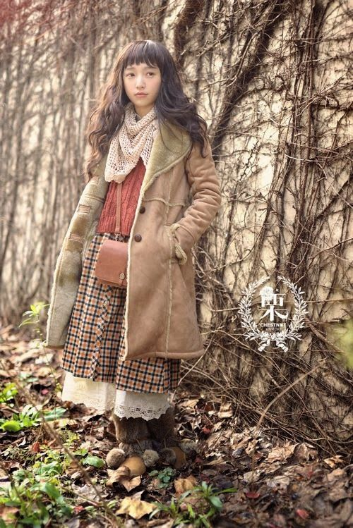

# 日系森系（Mori Kei）
> **状态**: reviewed | 最后更新: 2026-06-23 | 分类: 东亚风格 | **趋势**: 🔥 流行趋势

## 📖 概述
- 发源年代: 2006年
- 发源地: 日本（原宿/下北泽街区 → Mixi 社交网络社区）— 由一名叫 Choco 的女性在 Mixi 上创立「森ガール」社区
- 风格关键词（5-8个）: ゆるふわ（柔软蓬松）、自然面料、层层叠穿、大地色系、古董感、慢时尚、森林生活
- 一句话定义（50字以内）: 像是从森林里走出来的女孩——层层叠叠的棉麻、自然色系、宽松廓形，不追求显瘦或性感，只追求舒适和「被自然包裹」的感觉。

## 📜 历史文化
- **起源**: 2006年，日本女性 Choco 在社交网络 Mixi 上创建「森ガール」（Mori Girl）社区，源于朋友对她说「你看起来像住在森林里」。这个社区迅速增长到 35,000 人，催生了专门的杂志（《Mori Girl Lesson》《SPOON》）、品牌（Wonder Rocket）和 Choco 本人撰写的《Mori Girl Book》。
- **发展脉络**:
  - **2006-2009**: Mixi 社区爆发 → 杂志/品牌/书籍商业生态形成。Wonder Rocket 在 Harajuku 开店，成为森系商业化的标志
  - **2010**: Mori Kei 通过 LiveJournal、Tumblr 传播到国际，西方社区采用「Mori Kei」这个性别中立名称。传入中国后诞生「森女部落」等本土品牌
  - **2010年代中期**: 日本本土森系热度下降。杂志停刊，品牌关店
  - **2017**: Wonder Rocket 原宿店关闭——商业森系时代象征性结束
  - **2019**: 原始 Mixi 社区被删除
  - **2020-2025**: 国际社区通过 Discord、Tumblr、Instagram、BlueSky 维持生命。Cottagecore 浪潮带来新关注者（但两者是不同的风格）。2025年中国时尚媒体注意到「森系穿搭翻红」
- **文化意义**: 森系是少有的「反时尚」女性风格——它不追求显瘦、不追求性感、不追求潮流更新。在一个由快时尚和 Instagram 驱动的时代，它代表了一种「慢下来」的穿衣哲学。也是日本「自然系」(Natural Kei) 大谱系中最有国际辨识度的分支。

## 🎨 美学特征
- **廓形特点**: 全身宽松、不描绘身体曲线。A字裙/帝国腰连衣裙 + 多层开衫/马甲/披肩 + 外层大衣。层次数：至少 3 层，多则 5+ 层。下摆长度不一，制造「不经意」的层次感。绝不塞衣角。
- **色板**:
  - 主色调：奶油白(#FFF8F0)、米色(#D4C5B9)、驼色(#C4A882)、苔绿(#7A8B5B)、森林绿(#4A6741)、海军蓝(#2C3E50)、铁锈红(#B7410E)
  - 点缀色：浆果紫(#722F37)、干枯玫瑰(#C08081)、芥末黄(#D4A82B)
  - 禁忌色：霓虹色、荧光色、大面积纯黑、动物纹
- **面料偏好**: 绝对天然——棉、亚麻、羊毛、丝、皮革。手工感强的面料：蕾丝、钩针编织、刺绣、纱布、针织。禁止合成纤维、大 Logo、品牌印花。
- **标志单品表**:

| 单品 | 品牌示例 | 选择要点 |
|------|---------|---------|
| A字/帝国腰连衣裙 | Wonder Rocket, SM2, Nest Robe | 棉或亚麻、及膝或更长、宽松不系腰 |
| 大号针织开衫 | SM2, earth music & ecology | 落肩、粗棒针、至少大一号 |
| 长及脚踝半身裙 | 古着, Studio Clip | 层叠设计、A字或伞摆、棉麻面料 |
| 披肩/围巾 | 手工编织, 古着 | 粗针织、大地色、可兼做毯子 |
| 蕾丝领衬衫 | Jane Marple, 古着 | 小立领+蕾丝边、叠穿在连衣裙内 |
| 圆头平底鞋/牛津鞋 | Clarks, Dr. Martens | 棕色皮质、圆头、低跟或无跟 |
| 羊毛裤袜 | Muji, 古着 | 厚实、杂色编织、棕色/芥末黄/酒红 |
| 编织草篮/皮质背包 | 手工艺品牌 | 做旧感、天然材质、可装书 |

## 🏷️ 代表品牌

### 核心品牌（日本原生，大多已停业但历史重要）
| 品牌 | 国家 | 价位 | 一句话 |
|------|------|------|--------|
| Wonder Rocket | 日本 | ¥¥ | 森系商业化旗舰品牌，2017年原宿店关闭，象征一个时代的终结 |
| SM2 (Samansa Mos2) | 日本 | ¥¥ | 少数仍在运营的森系遗留品牌，宽松自然廓形 |
| earth music & ecology | 日本 | ¥ | 1999年由石川康晴创立，森系最主流的商业品牌 |
| Nest Robe | 日本 | ¥¥¥ | 自然系代表，顶级天然面料 |
| Studio Clip | 日本 | ¥¥ | 自然系日常品牌，森系可穿 |
| Jane Marple | 日本 | ¥¥¥ | 复古灵感，蕾丝+印花 |

### 2025年可购买森系单品的渠道
- **古着/二手**: Depop、ThredUp、eBay、日本 Yahoo Auctions、本地古着店（最正宗的森系路径）
- **淘宝店铺**: Mucha、Cottagecore Clothes（质量参差，需看评价）
- **独立小品牌**: Forest Girl Clothing、The Ivory Dolls、Sakura Fairy、Little Women Atelier
- **可混搭的西方品牌**: **Dôen**（加州田园）、**Free People**（波西米亚线）、**Margaret Howell**（英伦自然系）

### 新兴品牌（2024-2026）
- 森系在商业层面没有真正的新兴品牌。2025年的森系是一个**社区驱动、古着为主**的风格，不依赖新品发布。

## 👤 风格偶像 & 名人

### 关键推动者
| 人物 | 身份 | 贡献 |
|------|------|------|
| Choco (チョコ) | 森系创始人 | 2006年在 Mixi 创建森ガール社区，撰写《Mori Girl Book》|
| 蒼井優 (Aoi Yu) | 演员 | 被公认为森系美学的终极化身——宽松棉裙、素颜、在咖啡馆读书 |
| 宮崎葵 (Miyazaki Aoi) | 演员 | earth music & ecology 品牌大使，甜美自然的森系代表 |

### 穿着此风格的明星/博主
| 人物 | 身份 | 为什么是 icon |
|------|------|---------------|
| 蒼井優 (Aoi Yu) | 演员 | 森系女神——她本人就是森系审美标准的来源 |
| 上野樹里 (Ueno Juri) | 演员 | 带来一点点男孩气的独立精神，拓宽了森系的性格光谱 |
| forestsandtea | 2025年社区主理人 | BlueSky/YouTube 活跃的森系国际社区建设者 |
| Helena Bonham Carter | 演员 | 国际社区公认的 Dark Mori/ Mori Goth 风格灵感 |

## 👗 秀场 & 时装周
- 森系不是秀场风格——它从未被传统时装周体系接纳。这恰恰是它的精神内核：**反时装周、反潮流、反商业**。
- 但森系美学间接影响了日本设计师的国际表达：Comme des Garçons 的破坏感、Issey Miyake 的褶皱自然观、Yohji Yamamoto 的黑色诗学——它们与森系共享「反工业、尊重面料」的 DNA。

## 🔗 关联风格
- **父风格**: 日本自然系 (Japanese Natural Kei)
- **子风格**: Dark Mori (Mori Goth)、花森 (Flower Mori)、仙森 (Fairy Mori)、都森 (Urban Mori)
- **平行风格**: Cottagecore（共享田园浪漫，但 cottagecore 允许束腰/露肩/亮色花卉）、Lagenlook（欧洲版层叠风）
- **对立风格**: 韩系少女——韩系追求「精致可爱」+厚底鞋，森系追求「自然朴素」+平底鞋
- **与姐妹风格差异**:
  1. vs 韩系少女：森系用棉麻长裙+平底靴，韩系用A字短裙+厚底鞋；森系不画浓妆，韩系注重妆容完整
  2. vs 新中式：森系是日本自然主义，新中式是中国传统改良；森系排斥丝绸这类「贵重面料」，新中式以丝绸为核心

## 📈 流行趋势
- **当前状态**: 在日本本土商业上已死亡（无品牌、无杂志、无街拍），在国际社区中小规模存活
- **流行区域**: 国际 Discord/ Tumblr/ BlueSky 社区 > 中国（森女部落等淘宝品牌维持一定规模） > 日本本土（几乎不可见）
- **发展方向**:
  - 2025-2026：「森系穿搭翻红」+ 与 Cottagecore 交叉（但纯粹主义者会拒绝模糊边界）
  - 长期：森系作为「反时尚」的符号价值大于其商业价值。它不会成为主流，但会作为小众美学永久存在

## 💡 穿搭建议
- **适合体型**: 直筒形（宽松廓形天生友好，0.95）、梨形（长裙遮盖臀腿，0.85）、倒三角（披肩/开衫软化肩线，0.80）。苹果形和沙漏形较难驾驭（不显腰、不显身材）。
- **适合肤色**: 所有暖调肤色——大地色系是暖调肤色的天然朋友。冷白皮可尝试 Dark Mori（黑+深绿+酒红）。
- **适合场合**: 读书/逛美术馆/森林漫步/手作市集/咖啡馆/雨天。不适合正式场合和办公室。
- **入门建议**:
  1. 从古着开始——森系的灵魂在二手店，不在商场
  2. 先买一条及踝棉麻连衣裙+一件 oversized 针织开衫——这是森系的「Hello World」
  3. 层数是核心——连衣裙+开衫+披肩三个层次起步
  4. 放弃显瘦、放弃束腰、放弃高跟鞋——这是最难的心理转变
  5. 研究 Choco 的《Mori Girl Book》扫描版和《Mori Girl Lesson》杂志——森系有自己完整的规则体系

---
*本文基于多源研究整理，AI 辅助生成。*
