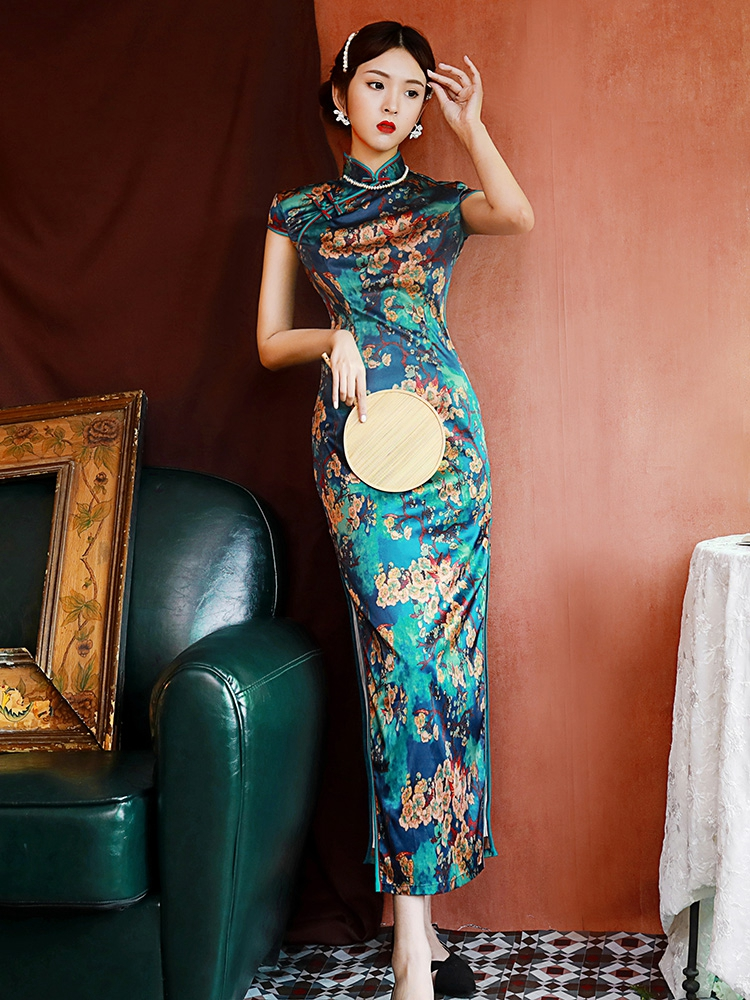

# 新中式（New Chinese）
> **状态**: reviewed | 最后更新: 2026-06-23 | 分类: 东亚风格 | **趋势**: 🔥 流行趋势

## 📖 概述
- 发源年代: 2018年前后（上海时装周为起点），2023-2025年爆发式增长
- 发源地: 中国（上海/北京/广州—深圳—香港轴线）— 以独立设计师品牌集群为策源地
- 风格关键词（5-8个）: 东方美学现代化、盘扣/立领/马面裙改良、传统面料当代剪裁、文化自信、一件中式单品即焦点、真丝/宋锦/香云纱
- 一句话定义（50字以内）: 中国传统服饰元素用现代剪裁语言重新演绎——不是穿古装，而是用现代人的身体和生活方式，去继承五千年的美学基因。

## 📜 历史文化
- **起源**: 2018年前后，上海时装周开始系统性地推动中国独立设计师。Uma Wang、Ms Min 等先驱已经在国际上有影响力。关键催化剂是中国 Z 世代的「文化自信」——不再把「西方大牌」等同于「高级」，开始在自己的文化传统中寻找身份表达。马面裙、汉服、旗袍等传统服饰在社交媒体上（小红书/抖音）的病毒式传播为商业品牌铺平了道路。
- **发展脉络**:
  - **2010-2015**: Uma Wang 成为第一个在巴黎/米兰时装周站稳的中国独立设计师，为后来者打开了「东方美学可以被国际认可」的想象空间
  - **2018-2019**: 上海时装周 Labelhood 平台系统扶持新人设计师。SAMUEL GUI YANG、Shushu/Tong、Angel Chen 等新生代崭露头角
  - **2020-2022**: 疫情期间，中国消费者无法出国购物，目光转向国内品牌。「国潮」概念爆发，李宁等运动品牌的国潮路线为「新中式」创造了消费者心智基础
  - **2023**: 新中式从设计师品牌进入大众消费——JNBY、ICICLE 等商业品牌推出新中式线；马面裙成为小红书年度关键词之一
  - **2024-2025**: 新中式成为 Z 世代主流穿搭选项之一。密扇 Mukzin、M essential 等品牌从小众走向大众。奢侈品牌（Dior/ Prada）也在中国系列中加入东方元素
- **文化意义**: 新中式是当代中国女性第一次用自己的文化语言而非西方借用，来定义「什么是东方的、现代的美」。它是「文化自信」在服装上的具体化。

## 🎨 美学特征
- **廓形特点**: 不对身体进行西方意义上的「雕塑」。偏好直线条和自然垂坠，宽松但有结构。盘扣/立领/斜襟等传统元素出现在现代廓形上（西装/衬衫/连衣裙），而非直接复制古装。
- **色板**:
  - 主色调（中国传统色体系）：月白(#D6E4F0)、墨黑(#2C2C2C)、朱砂红(#C0403B)、靛蓝(#3D4F6A)、玉绿(#7A9A7E)、檀木棕(#8B6B4A)、香槟金(#C9A96E)
  - 点缀色：金银丝刺绣、皇帝黄(#FFD700，极少使用)
  - 禁忌色：荧光色、霓虹色——与东方的克制含蓄美学冲突
- **面料偏好**: 真丝 > 宋锦 > 香云纱 > 天丝麻 > 提花缎 > 重磅棉。面料质感是核心——「穿的不是款式，是面料」。
- **标志单品表**:

| 单品 | 品牌示例 | 选择要点 |
|------|---------|---------|
| 改良旗袍上衣 | Ms Min, M essential, SAMUEL GUI YANG | 保留立领+盘扣，缩短长度、改宽松廓形 |
| 盘扣衬衫 | Ms Min, ICICLE, 之禾 | 立领或小翻领、斜襟盘扣、丝绸或棉质 |
| 改良马面裙 | 密扇 Mukzin, M essential | A字或直筒廓形、保留褶裥结构、日常可穿 |
| 阔腿丝绒裤 | Uma Wang, JNBY | 高腰、垂坠感强、墨黑/酒红/墨绿 |
| 宋锦/真丝外套 | ZI II CI II, Uma Wang | 中式立领+西式廓形、可内搭可外穿 |
| 水墨印花连衣裙 | Shushu/Tong, JNBY | 水墨晕染效果、不对称下摆、真丝面料 |
| 刺绣夹克 | Angel Chen, M essential | 东方图腾（龙/凤/花鸟）+ 现代棒球夹克版型 |
| 天丝麻阔腿裤 | ICICLE, JNBY | 自然垂坠、高腰、中性色 |

## 🏷️ 代表品牌

### 核心品牌
| 品牌 | 国家 | 价位 | 一句话 |
|------|------|------|--------|
| Uma Wang | 中国 | ¥¥¥¥ | 第一个在国际时装周站稳的中国独立设计师，侘寂东方+顶级面料，巴黎时装周常客 |
| Ms Min | 中国 | ¥¥¥¥ | 极简东方美学代表，连卡佛长期合作，被誉为「中国版 The Row」|
| SAMUEL GUI YANG | 中国 | ¥¥¥¥ | 伦敦时装周常客，旗袍解构+东方廓形，2026年将推出 10 周年系列 |
| M essential | 中国 | ¥¥¥ | 海上丝绸之路灵感，东方雅致+当代女装，明星红毯最爱 |
| Shushu/Tong | 中国 | ¥¥¥ | 解构少女感+立体剪裁，蝴蝶结元素标志性，LVMH Prize 入围 |
| ZI II CI II (之禾) | 中国 | ¥¥¥¥ | 东方极简+顶级天然面料，中国版 The Row，全球旗舰店在巴黎 |
| ICICLE | 中国 | ¥¥¥ | 自然面料+东方哲学，环保通勤女装，巴黎时装周官方日程品牌 |
| 密扇 Mukzin | 中国 | ¥¥ | 年轻化新中式标杆，改良马面裙/旗袍最广为人知的平价品牌 |
| JNBY (江南布衣) | 中国 | ¥¥ | 中国最大设计师品牌集团，艺术感日常+东方元素 |

### 平价替代
| 品牌 | 价位 | 说明 |
|------|------|------|
| 密扇 Mukzin | ¥¥ | 改良旗袍/马面裙入门首选 |
| JNBY | ¥¥ | 东方艺术感日常，全国专柜最多 |
| UR (Urban Revivo) | ¥ | 快时尚新中式线，紧跟趋势 |
| 淘宝独立设计师 | ¥-¥¥ | 大量个人设计师提供改良汉服/旗袍 |

### 新兴品牌（2024-2026）
- **Xiao Li**: 针织创新+LVMH Prize 提名，少女感东方廓形
- **Yuhan Wang**: 中央圣马丁毕业，柔美东方浪漫主义
- **Rui Zhou**: 针织镂空设计，Diana Award 得主

## 👤 风格偶像 & 名人

### 关键推动者
| 人物 | 身份 | 贡献 |
|------|------|------|
| 王汁 (Uma Wang) | 设计师 | 第一个在国际时装周站稳的中国独立设计师，证明「东方美学=高级时装」|
| 刘雯 | 超模 | 东方女性审美国际化的代表面孔，她本人就是新中式的活广告 |
| 杜鹃 | 超模/演员 | 东方高级脸代表，新中式大片的首选面孔 |

### 穿着此风格的明星/博主
| 人物 | 身份 | 为什么是 icon |
|------|------|---------------|
| 刘雯 | 超模 | 私服大量穿着 Ms Min/ Uma Wang，让新中式看起来很酷而非「民族风」|
| 倪妮 | 演员 | 高级感东方美人，红毯新中式造型出圈 |
| 舒淇 | 演员 | 国际红毯上的东方优雅，M essential/ SAMUEL GUI YANG 常客 |
| 晚晚 (雷宛萤) | 博主/木木美术馆创始人 | 最早一批推广新中式穿搭的 KOL |
| 李佳琦 | 主播 | 直播间多次带火新中式品牌（密扇/M essential）|

## 👗 秀场 & 时装周
- **上海时装周 (Labelhood)**: SAMUEL GUI YANG/ Shushu/Tong/ Angel Chen/ M essential 等新中式核心品牌的首发展示平台
- **伦敦时装周**: SAMUEL GUI YANG 常驻，2026年将推出 10 周年系列
- **巴黎时装周**: Uma Wang/ ICICLE/ ZI II CI II 官方日程品牌
- **代表性系列**: SAMUEL GUI YANG SS25 — 改良旗袍+解构西装，将中式斜襟融入西式日常通勤

## 🔗 关联风格
- **父风格**: 中国传统服饰 (Hanfu/ Qipao/ Traditional Chinese)
- **子风格**: 极简新中式 (Ms Min/ ZI II CI II)、少女新中式 (Shushu/Tong)、暗黑新中式 (Uma Wang 部分系列)
- **平行风格**: 日系侘寂 (Wabi-sabi — 共享「不完美的美」)、韩系极简 (Korean Minimal — 共享克制感)
- **对立风格**: Y2K —— 新中式追求「千年传承」，Y2K 追求「2000年代的 15 分钟」
- **与姐妹风格差异**:
  1. vs 韩系少女：新中式核心是「文化叙事」（盘扣/立领/马面裙），韩系核心是「流行文化」（K-pop/韩剧）；新中式用丝绸/宋锦，韩系用卫衣面料/针织
  2. vs 日系森系：新中式偏好丝绸/宋锦等「贵重面料」，森系偏好棉麻等「朴素面料」；新中式允许仪式感和华丽度，森系排斥任何形式的华丽

## 📈 流行趋势
- **当前状态**: 强劲上升（Z 世代文化自信 + 国内市场成熟 + 国际关注度增加）
- **流行区域**: 中国（一线城市→二三线渗透中）> 东南亚华人圈 > 欧美（通过奢侈品联名和 KOL 传播）
- **发展方向**:
  - 2025-2026：新中式从「特殊场合」（婚礼/过年/拍照）走向「日常通勤」（之禾/ICICLE 的办公线）
  - 长期：是否会像「日系」一样形成稳定的国际品类标签？取决于中国设计师在国际时装周上的持续话语权

## 💡 穿搭建议
- **适合体型**: 沙漏形（改良旗袍廓形最佳，0.92）、梨形（A字改良裙+阔腿裤遮盖，0.88）、直筒形（直线条廓形友好，0.85）
- **适合肤色**: 所有暖调肤色——中国传统色以暖调为主。冷白皮可选月白/水墨灰/青花蓝路线。
- **适合场合**: 通勤（ICICLE/之禾的极简线）、约会/派对（M essential 的精致线）、重要场合（Uma Wang 的高端线）
- **入门建议**:
  1. 从一件盘扣衬衫开始——搭配你已有的牛仔裤/阔腿裤，验证「新中式可以日常穿」
  2. 传统+现代混搭是黄金法则——改良马面裙配简约针织衫，不穿全套
  3. 一件中式单品即焦点——其他保持现代简约，不需要全身中式
  4. 面料质感是最重要的投资——真丝/宋锦比款式更值钱
  5. 颜色从月白/墨黑/靛蓝起步，这三个颜色可以和任何现代衣橱无缝融合

---
*本文基于多源研究整理，AI 辅助生成。*
