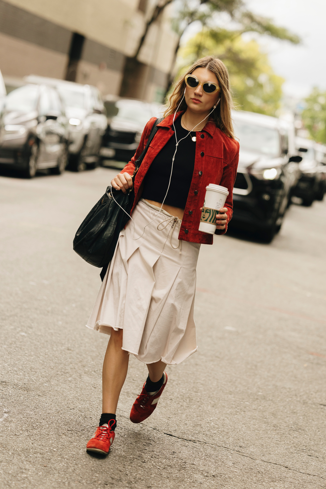

# 美式休闲（American Casual）
> **状态**: reviewed | 最后更新: 2026-06-23 | 分类: 现代都市 | **趋势**: 🔥 流行趋势

## 📖 概述
- 发源年代: 1950年代（James Dean 白T+牛仔裤为标志）
- 发源地: 美国（从西部工作服演化而来，加州/纽约为两个审美极点）
- 风格关键词（5-8个）: 丹宁本位、T恤/卫衣、实用主义、不装不绷、帆布鞋、至少一件牛仔、永不过时
- 一句话定义（50字以内）: 最民主的女性穿搭——一件白T+一条好牛仔裤+一双帆布鞋，不需要任何奢侈品Logo，自信就是最好的配饰。

## 📜 历史文化
- **起源**: 美式休闲的DNA来自两个方向：①美国西部的工作服（Levi's 1873年铆钉牛仔裤专利）；②1950年代青少年反叛文化（James Dean《无因的反叛》白T+牛仔裤+皮夹克，Marilyn Monroe 高腰牛仔裤+白衬衫）。牛仔裤从「矿工穿的」变成「全世界人都穿的」，是美国文化最成功的全球输出之一。
- **发展脉络**:
  - **1873**: Levi Strauss 和 Jacob Davis 获得铆钉牛仔裤专利——现代休闲装的基石诞生
  - **1950s**: James Dean/ Marlon Brando/ Marilyn Monroe——牛仔裤+白T恤成为「酷」的符号
  - **1960-70s**: 嬉皮士和反战一代继续穿牛仔裤，但加了刺绣、补丁、扎染——牛仔裤成为反主流文化的画布
  - **1980s**: Calvin Klein 将牛仔裤带上高级时装广告（Brooke Shields「Nothing comes between me and my Calvins」），设计师牛仔裤（Guess/ Jordache）时代来临
  - **1990s**: Jennifer Aniston 的《Friends》——Rachel Green 的牛仔裤+白T+帆布鞋成了全球女性的周末制服
  - **2000-10s**: Madewell/ J.Crew/ Everlane 将美式休闲从「随便穿的」提升为「认真穿的」——面料、剪裁、可持续性成为卖点
  - **2020s**: 疫情让「在家穿的」和「出门穿的」融为一体——美式休闲的舒适基因比任何时候都更符合时代
- **文化意义**: 美式休闲是服装民主化的终极胜利——它不需要任何T台或时尚编辑的背书，是美国生活方式的直接输出。

## 🎨 美学特征
- **廓形特点**: T恤合身但不紧身，领口精神不松垮。牛仔裤直筒或微喇，高腰优先。外套（牛仔夹克/棒球夹克）略短，突出腰线。核心比例：T恤 + 高腰牛仔裤 + 帆布鞋——这是公式，也是制服。
- **色板**:
  - 主色调：丹宁蓝（从浅蓝到深蓝全谱）、纯白(#FFFFFF)、灰色(#808080)、卡其(#C4A882)
  - 点缀色：正红(#C41E3A)——少量用于配饰
  - 禁忌色：荧光色（过于用力）、金属色（不属于休闲语境）
- **面料偏好**: 丹宁 > 棉（T恤/衬衫） > 针织 > 帆布（鞋）。丹宁重量（oz）是品质关键——12oz以上的牛仔更耐穿。
- **标志单品表**:

| 单品 | 品牌示例 | 选择要点 |
|------|---------|---------|
| 完美白T恤 | Everlane, Madewell, James Perse | 合身、领口挺括、重磅棉（180gsm+）、不透视 |
| 直筒/微喇牛仔裤 | Levi's (501/Ribcage/Wedgie), Madewell, Frame | 高腰、不破洞或微破、蓝色原牛 |
| 牛仔夹克 | Levi's, Madewell, Reformation | 略短款、蓝色原牛或水洗、可内搭可外穿 |
| 条纹长袖T恤 | J.Crew, Everlane, Saint James | 蓝白或黑白条纹、船领或圆领 |
| 连帽卫衣 | Champion, Everlane, Aritzia | 灰色或黑色、略 oversize、内里拉绒 |
| 卡其裤 | J.Crew, Madewell, Everlane | 直筒、高腰、斜纹棉布 |
| 帆布鞋 | Converse (Chuck Taylor), Vans (Old Skool/Authentic) | 白色或黑色、中帮或低帮 |
| 皮质简约运动鞋 | Veja, Nike (AF1), Adidas (Stan Smith) | 白色为主、皮质、低帮 |

## 🏷️ 代表品牌

### 核心品牌
| 品牌 | 国家 | 价位 | 一句话 |
|------|------|------|--------|
| Levi's | 美国 | ¥¥ | 1853年创立，牛仔裤的发明者。501/Ribcage/Wedgie是女性牛仔裤圣经 |
| Madewell | 美国 | ¥¥ | J.Crew 旗下丹宁品牌，1937年创立。「每个美国女孩都有一条 Madewell」 |
| Everlane | 美国 | ¥¥ | 2010年创立，激进透明定价+基础款极致。白T恤和牛仔裤是王牌 |
| J.Crew | 美国 | ¥¥ | 1947年创立，美式中产衣柜。毛衣+卡其裤+西装外套=美式休闲升级版 |
| Reformation | 美国 | ¥¥¥ | 2009年创立于洛杉矶，可持续时髦。碎花裙+牛仔，环保营销标杆 |
| Aritzia | 加拿大 | ¥¥¥ | 1984年创立，北美 Z 世代最爱的日常品牌。Babaton/Wilfred/TNA 多线覆盖 |
| Frame | 美国 | ¥¥¥ | LA牛仔裤+法式极简混血。九分牛仔裤+丝质衬衫=「看起来很有钱」的美式休闲 |

### 平价替代
| 品牌 | 价位 | 说明 |
|------|------|------|
| Uniqlo | ¥ | 基础款之王，白T和牛仔裤的全球仓库 |
| Gap | ¥ | 1969年创立，美式休闲的国民品牌 |
| Levi's | ¥¥ | 牛仔裤最佳性能价格比 |
| Target (A New Day) | ¥ | 美国大众美式休闲，品质近年提升 |

### 新兴品牌（2024-2026）
- **Buck Mason**: 基本款专家，更精致的美式休闲
- **Marine Layer**: 加州「柔软到不像新衣服」的休闲品牌

## 👤 风格偶像 & 名人

### 关键推动者
| 人物 | 身份 | 贡献 |
|------|------|------|
| James Dean | 演员 | 1955年《无因的反叛》——白T+牛仔裤+皮夹克=「酷」的定义 |
| Marilyn Monroe | 演员 | 高腰牛仔裤+白衬衫+芭蕾平底鞋——证明性感可以不用露 |

### 穿着此风格的明星/博主
| 人物 | 身份 | 为什么是 icon |
|------|------|---------------|
| Jennifer Aniston | 演员 | 《Friends》的 Rachel Green——1990s美式休闲的全球教科书 |
| Hailey Bieber | 模特 | 2020s 美式休闲的升级版——牛仔+白T+运动鞋，但配了一只 Bottega 包 |
| Kaia Gerber | 模特 | 90s超模风复兴——直筒牛仔裤+白T+帆布鞋+墨镜 |
| Matilda Djerf | 博主 | 北欧胶囊衣橱×美式休闲混搭 |
| Emma Chamberlain | YouTuber | Gen Z 咖啡跑+宽松牛仔裤+爸爸球鞋=新美式休闲 |

## 👗 秀场 & 时装周
- 美式休闲不是传统意义上的「秀场风格」，但它不断被高级时装引用：
  - **Calvin Klein SS1994** — 白T+牛仔裤上高级时装秀
  - **Yves Saint Laurent SS1966** — 第一次将牛仔裤放上巴黎高定秀
- 美式休闲的「秀场」是**街头**——纽约 SOHO 和洛杉矶 Melrose 的街头穿搭比任何秀场都更定义这个风格

## 🔗 关联风格
- **父风格**: 美式工作服 (American Workwear) + 西部风格 (Western Wear)
- **子风格**: 升级美式休闲 (Elevated American Casual — Aritzia/ Frame 路线)、极简美式 (Minimalist American — Everlane 路线)
- **平行风格**: 运动休闲（共享舒适基因）、学院风 Preppy（共享美式传统）
- **对立风格**: 波西米亚——美式休闲的实用主义 vs 波西米亚的浪漫主义
- **与姐妹风格差异**:
  1. vs 运动休闲：美式休闲用棉/丹宁，运动休闲用科技面料。美式休闲穿帆布鞋，运动休闲穿跑步鞋
  2. vs 都市通勤：美式休闲周五可以穿去上班，运动休闲不可以（除非你的办公室是 Lululemon HQ）
  3. vs Y2K：美式休闲是 timeless 的（501从1873穿到现在），Y2K是 time-specific 的（2000年代的15分钟）

## 📈 流行趋势
- **当前状态**: 稳定（美式休闲的基础单品不会过时，但「美式休闲」作为风格标签的讨论度不高——因为它已经融入了所有人的衣橱）
- **流行区域**: 全球——Levi's 在全球卖到每一块大陆
- **发展方向**: 
  - 2025-2026：可持续丹宁（Reformation/ Everlane 路线）与复古 Levi's 古着（Depop 上501价格飙升）双线并行
  - 长期：牛仔裤不会消失——作为全球最民主的服装单品，它只有一个方向：更可持续、更多元尺码

## 💡 穿搭建议
- **适合体型**: 直筒形（高腰直筒牛仔裤天然友好，0.93）、沙漏形（收腰白T+阔腿牛仔裤显腰，0.88）、梨形（A字牛仔裙遮盖臀腿，0.85）。所有身形基本友好
- **适合肤色**: 所有肤色——蓝/白/灰/卡其是全肤色通用色板
- **适合场合**: 周末/逛街/咖啡馆/非正式办公/Friday Casual
- **入门建议**:
  1. 先找到属于你的那条牛仔裤——这是最重要的投资。去店里试，不要网购第一条
  2. 白T恤要多买几件——领口松了就换。美式休闲的灵魂是一件精神的白T
  3. 帆布鞋不用新的——Converse 越旧越好看
  4. 丹宁+丹宁可以（牛仔裤+牛仔夹克），但两件丹宁的色度要拉开（浅藍+深蓝）
  5. 配饰极简——一对金耳环+一只简约皮包就够了

---
*本文基于多源研究整理，AI 辅助生成。*
