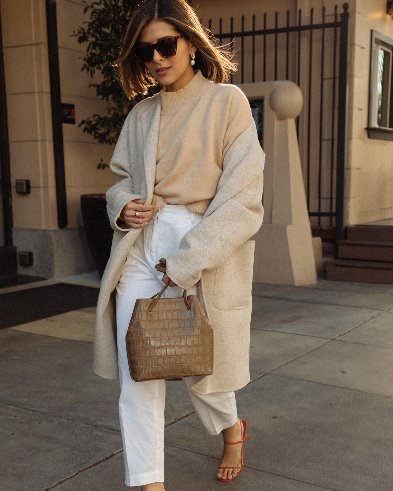

# 极简（Minimalist）
> **状态**: reviewed | 最后更新: 2026-06-23 | 分类: 欧洲经典 | **趋势**: 🔥 流行趋势

## 📖 概述
- 发源年代: 1990年代（Jil Sander/ Helmut Lang/ Calvin Klein 极简主义黄金时代）
- 发源地: 德国（Jil Sander）/ 奥地利（Helmut Lang）/ 美国（Calvin Klein）→ 真正的全球极简运动
- 风格关键词（5-8个）: 少即是多、纯色/单色、建筑感廓形、面料质感至上、无Logo、胶囊衣橱、去装饰化
- 一句话定义（50字以内）: 用最少单品穿出最大气场——去掉了所有装饰后，剩下的只有廓形、面料的品质和穿着者本身。

## 📜 历史文化
- **起源**: 1990年代，Jil Sander（德国）、Helmut Lang（奥地利）、Calvin Klein（美国）三位设计师同时在各自的国家发动了对1980年代浮夸消费主义的时尚反叛——去掉垫肩、去掉亮片、去掉Logo，让衣服回归衣服本身。这既是美学运动，也是政治态度：物质主义的解毒剂。
- **发展脉络**:
  - **1990s**: Jil Sander 的「极简女王」时代——纯白衬衫是圣杯级单品。Helmut Lang 将军事/街头元素用极简语言重构。Calvin Klein 的内衣线定义了美式极简性冷淡风
  - **2000s**: 极简在日本找到第二故乡——Muji/ Uniqlo 将极简民主化（¥而不是 ¥¥¥¥）。COS（2007年创立于伦敦，H&M集团）将建筑感极简变成平价选项
  - **2008-2018**: Phoebe Philo 的 Celine——极简与「知识分子女性」的完美碰撞。白衬衫+阔腿裤+Stan Smith 成为全球女性的通勤公式
  - **2010s**: The Row（Olsen 姐妹 2006 年创立）定义了「安静奢华」(Quiet Luxury)——不显 Logo 的富豪衣橱。Totême（2014年创立于斯德哥尔摩）用「胶囊衣橱」概念让极简可操作
  - **2020s**: 静奢 (Quiet Luxury)因《Succession》和 Gwyneth Paltrow 法庭穿搭爆红。Loro Piana/ Brunello Cucinelli 成为「安静的富豪」代名词
- **文化意义**: 极简是时尚界最持久的「反时尚」力量——每一次浮夸风潮过后，极简都会回来清扫。它也是唯一一个同时被知识分子（Phoebe Philo 粉）、富人（Loro Piana 消费者）和普通人（Uniqlo U 粉丝）共同信奉的风格。

## 🎨 美学特征
- **廓形特点**: 建筑感——衣服像建筑一样有结构。利落的肩线、明确的腰线或不收腰的直筒、裤脚精确的长度。廓形是第一语言，因为去掉了所有印花和装饰。
- **色板**:
  - 核心色（极简五色）：纯白(#FFFFF)、墨黑(#1A1A1A)、灰(#808080到 #D3D3D3)、驼色(#C4A882)、燕麦色(#D4C5B9)
  - 辅助色：深蓝(#1B2A4A)、沙色(#E8D5B7)
  - 禁忌色：任何印花、任何荧光色、任何超过两个颜色同时出现
- **面料偏好**: 面料是极简的「隐形装饰」。羊毛（西装/大衣）> 羊绒（针织）> 重磅棉（衬衫/T恤）> 双面呢（大衣）> 皮质（包/鞋）。廉价面料是极简的死敌——剪裁再好的衣服，面料不够好就是失败。
- **标志单品表**:

| 单品 | 品牌示例 | 选择要点 |
|------|---------|---------|
| 完美白衬衫 | Jil Sander, The Row, COS | 挺括有结构、领口有型、纯棉或丝棉混纺 |
| 阔腿西装裤 | The Row, Totême, COS | 高腰、垂坠感强、无装饰、长度拖地或及踝 |
| 结构感西装 | Jil Sander, Totême, Theory | 不收腰或微收腰、无Logo、深色或驼色 |
| 双面呢大衣 | Loro Piana, Max Mara, COS | 及膝或更长、驼色/黑色/灰色、无扣或单扣 |
| 羊绒圆领毛衣 | Loro Piana, The Row, Uniqlo U | 纯色、无图案、宽松但不垮 |
| 直筒黑裤 | Theory, Vince, COS | 高腰、精确长度、微弹面料 |
| 纯色中长连衣裙 | Jil Sander, COS, Arket | A字或直筒、无图案、及膝或更长 |
| 皮质简约包 | Bottega Veneta, The Row, Polène | 无Logo、结构感、编织或光面皮 |

## 🏷️ 代表品牌

### 核心品牌
| 品牌 | 国家 | 价位 | 一句话 |
|------|------|------|--------|
| Jil Sander | 德国 | ¥¥¥¥ | 极简女王。1968年创立，建筑感剪裁+纯白衬衫圣杯。她的名字就是极简的同义词 |
| The Row | 美国 | ¥¥¥¥¥ | Olsen 姐妹 2006年创立，安静奢华的终极定义者。「不显Logo的富豪衣橱」|
| Totême | 瑞典 | ¥¥¥ | 2014年 Elin Kling 创立，胶囊衣橱哲学——围巾大衣+条纹针织=北欧极简公式 |
| Loro Piana | 意大利 | ¥¥¥¥¥ | 静奢天花板。羊绒无Logo，品质即身份。Baby Cashmere 和 Vicuña 是其招牌 |
| Bottega Veneta | 意大利 | ¥¥¥¥ | Daniel Lee 2018-2021 复兴的意大利极简。编织皮革(intrecciato)+无Logo设计 |
| COS | 瑞典/英国 | ¥¥ | 2007年创立，H&M集团高端线。建筑感极简×平价——Z世代的极简入门 |
| Arket | 瑞典 | ¥¥ | COS姐妹牌，更日常。北欧功能主义+胶囊衣橱 |
| Khaite | 美国 | ¥¥¥¥ | 纽约新极简，廓形感+戏剧性细节。Katie Holmes 的羊绒bra开衫一夜爆红 |

### 平价替代
| 品牌 | 价位 | 说明 |
|------|------|------|
| Uniqlo U | ¥ | Christophe Lemaire 联名，极简廓形×平价 |
| COS | ¥¥ | 建筑感极简最便宜的入口 |
| Arket | ¥¥ | COS姐妹牌，日常极简 |
| Massimo Dutti | ¥¥ | 西班牙优雅极简，意式灵感 |

### 新兴品牌（2024-2026）
- **Gabriela Hearst**: 前 Chloé 创意总监主理，可持续奢华极简
- **Proenza Schouler**: 纽约艺术极简，结构感剪裁+艺术配色
- **St. Agni**: 澳洲极简品牌，无Logo安静通勤

## 👤 风格偶像 & 名人

### 关键推动者
| 人物 | 身份 | 贡献 |
|------|------|------|
| Jil Sander | 设计师 | 「极简女王」——用建筑学思维做衣服，定义了「少即是多」在服装上的具体表达 |
| Phoebe Philo | 设计师 | Celine (2008-2018)创意总监，定义「Old Celine」的女性知识分子美学 |
| Mary-Kate & Ashley Olsen | The Row 创始人 | 把「安静奢华」变成一个可购买的品牌，证明极简可以比浮夸更贵 |
| Miuccia Prada | Prada/Miu Miu 创意总监 | 虽然是意大利人，但她对「知识分子时尚」的定义深远影响了极简美学的精神内核 |

### 穿着此风格的明星/博主
| 人物 | 身份 | 为什么是 icon |
|------|------|---------------|
| Mary-Kate Olsen | The Row 创始人 | 她本人就是品牌的最佳模特——层层叠叠的黑色、超大墨镜、星巴克杯 |
| Gwyneth Paltrow | 演员 | 2023年法庭穿搭（The Row/ Loro Piana/ Prada）引爆「静奢」搜索量 |
| Kendall Roy (Succession) | 虚构角色 | 虽然穿的不是极简，但《Succession》对静奢文化的推动作用无法忽视 |
| Elin Kling | Totême 创始人/博主 | 瑞典胶囊衣橱的活教材 |
| Phoebe Philo | 设计师 | 她的个人穿搭（白衬衫+黑裤+Stan Smith）是极简女性的「制服」|

## 👗 秀场 & 时装周
- **关键秀场**:
  - **Jil Sander SS1996** — 定义了 90s 极简的廓形语言（纯白、利落、建筑感）
  - **Celine SS2010** — Phoebe Philo 的首秀，开启「Old Celine」时代
  - **Bottega Veneta SS2020** — Daniel Lee 的极简革命，Pouch 包+编织方头拖鞋
  - **The Row FW2024** — 安静奢华的巅峰展示，不办秀只做静态展
- **与秀场的关系**: 极简的秀场通常比衣服本身更极简——无音乐、无花哨舞台、模特素颜。Jil Sander 的秀甚至不让模特做表情

## 🔗 关联风格
- **父风格**: 现代主义设计 (Modernist Design — 建筑/艺术领域的极简运动)
- **子风格**: 静奢 (Quiet Luxury)、北欧极简 (Scandi Minimalism)、日系极简 (Japanese Minimalism)
- **平行风格**: 法式慵懒（共享克制感，但法式有一条红唇破局）、暗黑学院（共享单色调偏好）
- **对立风格**: 波西米亚——极简拒绝装饰，波西米亚依赖装饰。Y2K——极简的「零装饰」与 Y2K 的「最大装饰」是风格谱系的两极
- **与姐妹风格差异**:
  1. vs 法式慵懒：极简拒绝装饰品（包括红唇和丝巾），法式允许一个点缀色
  2. vs 学院风：极简没有学院体系的阶层编码（校徽/条纹领带/格子），学院风依赖这些符号
  3. vs 波西米亚：完全对立——极简=去除、波西米亚=叠加
  4. vs 暗黑学院：极简可以是任何颜色（常包含白色），暗黑学院只接受暗色

## 📈 流行趋势
- **当前状态**: 强上升（静奢趋势+经济不确定性=「看起来有钱但不说出来的穿搭」需求增加）
- **流行区域**: 全球都市（纽约/伦敦/斯德哥尔摩/东京/上海核心商圈）
- **发展方向**:
  - 2025-2026：静奢继续上升，但「极简」作为大众风格可能被重新包装为「胶囊衣橱」「50件以下衣橱」等可操作的 lifestyle 概念
  - 长期：极简不会消失——它是永恒的「心理安全区」。每次经济下行都会复兴

## 💡 穿搭建议
- **适合体型**: 直筒形（建筑感廓形天然友好，0.95）、倒三角（结构感西装软化肩线，0.90）、沙漏形（收腰西装显腰，0.85）
- **适合肤色**: 所有肤色——极简五色（黑白灰驼燕麦）是全肤色通用色板
- **适合场合**: 通勤（阔腿西装裤+白衬衫+西装）、正式场合（纯色连衣裙+结构感大衣）、周末（羊绒针织+直筒裤）
- **入门建议**:
  1. 先买一条合身的阔腿西装裤和一件挺括白衬衫——这是极简女性的「Hello World」
  2. 面料是唯一的装饰——投资你能负担的最好的面料
  3. 扔掉所有印花单品（暂时）——练习用纯色穿出一个月的搭配
  4. 配饰极克制——一只皮质简约包+一只手表，就够了
  5. 从 Uniqlo U + COS 开始，确认自己喜欢极简后再投资 The Row/ Jil Sander

---
*本文基于多源研究整理，AI 辅助生成。*
