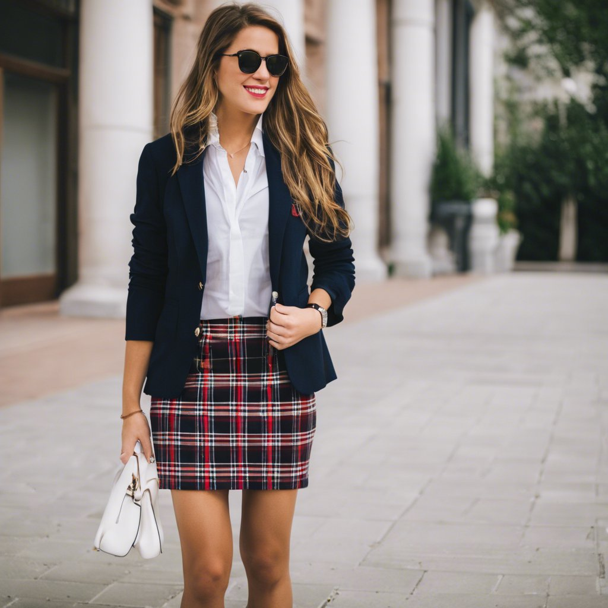

# 学院风 Preppy（Preppy）
> **状态**: reviewed | 最后更新: 2026-06-23 | 分类: 欧洲经典 | **趋势**: 🔥 流行趋势

## 📖 概述
- 发源年代: 1950年代（常春藤盟校学生穿搭体系成型）→ 1980年代 Ralph Lauren 将其商业化全球化
- 发源地: 美国东北部（Harvard/ Yale/ Princeton/ Dartmouth 等常春藤盟校）— 英国贵族公学体系为更早的源头
- 风格关键词（5-8个）: 常春藤校园、格子/菱格/条纹、牛津衬衫+毛衣背心、阶层编码、规矩但不死板、运动基因（马球/赛艇/网球）
- 一句话定义（50字以内）: 常春藤校园风——格子百褶裙+菱形格毛衣背心+牛津衬衫+乐福鞋。不是校服，是精英教育体系的穿衣符号。

## 📜 历史文化
- **起源**: Preppy 这个词源自「Preparatory School」（预备学校），即美国东北部精英家庭送子女入读的私立寄宿高中（如 Phillips Academy Andover、Groton School）。这些学校的着装规范（西装+领带+牛津衬衫）成为学生的日常穿搭，并随着他们升入常春藤盟校而延续。1950年代，常春藤盟校学生将传统英式学院风与美式运动休闲混合，创造了一种新范式。
- **发展脉络**:
  - **1900-1940s**: 英国贵族公学（Eton/ Harrow）+牛津/剑桥——学院风的最早源头。粗花呢西装、条纹领带、格子裙都是这个体系的产品
  - **1950s**: 常春藤盟校学生将英式学院风「美国化」——更宽松、更运动、接受 Polo 衫和卡其裤
  - **1970-80s**: Ralph Lauren（1967年创立 Polo 品牌）将学院风从校园推向全球——他本人不是常春藤毕业，但他创造了常春藤的「视觉神话」
  - **1980-90s**: Tommy Hilfiger/ Lacoste/ Gant将学院风进一步商业化。Brooks Brothers（1818年创立，美国最老服装品牌）继续服务华尔街精英
  - **2000s**: Gossip Girl 电视剧成了学院风的全球活广告——Blair Waldorf 的发带+制服裙=新一代学院风教科书
  - **2010s-20s**: 学院风与街头风融合——Aimé Leon Dore/ Noah 等品牌将 Ivy Style 重新带给新一代男性，女性学院风则与韩系/日系融合
- **文化意义**: Preppy 是少数几个直接携带「阶层信息」的穿搭风格——它诞生自精英教育体系，至今仍然承载着那种「我来自好家庭、上过好学校」的信号。但也正因为这种阶级性，它在当代不断地被重新解读和民主化。

## 🎨 美学特征
- **廓形特点**: 规矩但不死板。上装合身（西装/毛衣背心），下装A字或直筒（百褶裙/卡其裤）。裙长在膝上或膝下（不拖地、不超短）。核心叠穿公式：毛衣背心 + 牛津衬衫（领子翻到毛衣外）。
- **色板**:
  - 学院色：海军蓝(#1B2A4A)、酒红(#722F37)、卡其(#C4A882)、纯白(#FFFFFF)、深绿(#2D5A27)
  - 图案色：菱格纹（argyle）、条纹（repp stripe）、格子（plaid/ tartan）——这些图案携带特定的「校徽/俱乐部」含义
  - 点缀色：黄色(少量用于配饰)
  - 禁忌色：荧光色、金属色、大面积黑色（不是学院色板）
- **面料偏好**: 牛津纺（衬衫）> 羊毛（毛衣/西装）> 斜纹布（卡其裤）> 羊绒（冬季毛衣）> 灯芯绒（秋季裤装）。粗花呢 (Tweed)是英国学院的标志面料。
- **标志单品表**:

| 单品 | 品牌示例 | 选择要点 |
|------|---------|---------|
| 牛津衬衫 | Brooks Brothers, Ralph Lauren, Gant | 领子挺括、可翻到毛衣外、白色或蓝色 |
| 菱形格毛衣背心 | Ralph Lauren, J.Crew, Gant | V领（方便露衬衫领）、菱格图案、羊毛 |
| 格子百褶裙 | Ralph Lauren, Tommy Hilfiger, J.Crew | 膝上长度、毛呢或混纺、格纹清晰 |
| Blazer 西装 | Ralph Lauren, Brooks Brothers, J.Crew | 海军蓝、金扣（黄铜扣是学院标志）、徽章可选 |
| 卡其裤 | J.Crew, Ralph Lauren, Gant | 直筒或微锥、高腰、斜纹棉布 |
| 乐福鞋 | G.H. Bass (Weejuns), Gucci, Tod's | Penny Loafer 或 Horsebit Loafer、棕色或黑色 |
| 牛角扣大衣 | Burberry, Barbour, Ralph Lauren | 英伦学院冬季外套、驼色或海军蓝 |
| 条纹领带/蝴蝶结 | Brooks Brothers, Ralph Lauren | Repp stripe 图案、丝绸 |

## 🏷️ 代表品牌

### 核心品牌
| 品牌 | 国家 | 价位 | 一句话 |
|------|------|------|--------|
| Ralph Lauren | 美国 | ¥¥¥ | 1967年创立，学院风的终极定义者。Polo衫+绞花毛衣+徽章西装=美式学院三件套 |
| Brooks Brothers | 美国 | ¥¥¥ | 1818年创立，美国最老服装品牌。牛津衬衫发明者之一，1818西装系列 |
| Tommy Hilfiger | 美国 | ¥¥ | 美式经典×街头混血，红白蓝Logo文化。1990s嘻哈社区也穿Tommy |
| Gant | 美国 | ¥¥ | 1949年耶鲁校园创立，牛津衬衫+斜纹领带。做衬衫起家 |
| Lacoste | 法国 | ¥¥ | 1933年网球冠军 René Lacoste 创立，鳄鱼Polo衫发明者。法式网球学院 |
| J.Crew | 美国 | ¥¥ | 「第一份工作的西装来自这里」——美国中产学院衣柜 |
| Burberry | 英国 | ¥¥¥¥ | 1856年创立，英伦学院皇室认证。风衣+格纹围巾是标志 |
| Barbour | 英国 | ¥¥¥ | 1894年创立，英国皇室御用油蜡夹克。乡村贵族学院风 |

### 平价替代
| 品牌 | 价位 | 说明 |
|------|------|------|
| J.Crew | ¥¥ | 美式学院最全品类的平价入口 |
| Uniqlo | ¥ | 牛津衬衫+针织背心基础款 |
| Spao | ¥ | 韩国版学院风，韩剧大量露出 |
| Lands' End | ¥¥ | 美国邮购品牌，学院基础款扎实 |

### 新兴品牌（2024-2026）
- **Rowing Blazers**: 纽约品牌，将学院风与街头/流行文化融合（Harry Styles 穿着）
- **Aimé Leon Dore**: 男装为主，对当代 Ivy Style 复兴贡献巨大（女性可借鉴男装线）

## 👤 风格偶像 & 名人

### 关键推动者
| 人物 | 身份 | 贡献 |
|------|------|------|
| Ralph Lauren | 设计师 | 将常春藤学院风从校园推向全球，创造了美国时尚史上最成功的「阶层美学品牌」|
| John F. Kennedy | 美国总统 | 常春藤（Harvard）毕业，以休闲学院风（Polo衫+卡其裤+雷朋）定义了美式男性的轻松优雅 |

### 穿着此风格的明星/博主
| 人物 | 身份 | 为什么是 icon |
|------|------|---------------|
| Blair Waldorf (Gossip Girl) | 虚构角色 | 学院风的电视剧教科书——发带+制服裙+Blazer，影响了整整一代女性 |
| Emma Watson | 演员 | Brown University 毕业，现实版学霸穿搭——西装+牛津衬衫+乐福鞋 |
| Kate Middleton | 英国王妃 | 英伦学院风的当代代表——Reiss 连衣裙+Barbour 夹克+LK Bennett 鞋 |
| Olivia Palermo | 博主 | 上东区学院风+欧洲高端混搭 |
| 戴安娜王妃 | 已故王妃 | 1980-90s 的学院风巅峰——粗花呢西装+绞花毛衣+骑行裤（超前30年）|

## 👗 秀场 & 时装周
- **Ralph Lauren SS2025** — 汉普顿马术俱乐部秀场，美式学院风的终极奢华版
- **Tommy Hilfiger FW2024** — 纽约时装周，街头×学院的持续混血
- **Chanel Métiers d'Art** — 虽然不以学院风为核心，但粗花呢西装+珍珠项链+玛丽珍鞋=法式学院风的最高执行

## 🔗 关联风格
- **父风格**: 英伦学院风 (British Prep/ Savile Row)、常春藤风格 (Ivy League)
- **子风格**: 街头学院 (Street Prep — Tommy Hilfiger 路线)、暗黑学院 (Dark Academia)
- **平行风格**: 法式慵懒（共享克制感）、美式休闲（共享实用主义基因）
- **对立风格**: 波西米亚——学院风讲究规矩和阶层编码，波西米亚讲究反规矩和自由灵魂
- **与姐妹风格差异**:
  1. vs 极简：学院风有菱格/条纹/格子等图案系统，极简拒绝一切图案
  2. vs 法式慵懒：学院风的规矩感（衬衫领子翻出、袜子要可见）与法式的未完成感（领口不系全、袖子随意卷）直接对立
  3. vs 波西米亚：完全对立——学院风=规矩+克制，波西米亚=自由+繁复
  4. vs 暗黑学院：学院风阳光快乐（Polo衫+游艇+草坪派对），暗黑学院阴郁深沉（古老图书馆+狄更斯+烛光）

## 📈 流行趋势
- **当前状态**: 稳定（学院风是 timeless 品类，不随潮流大幅波动）
- **流行区域**: 美国/英国 > 中国/日韩（被本土学院风品牌和风格融合） > 欧洲大陆（接受度较低）
- **发展方向**:
  - 2025-2026：学院风与街头风继续融合；韩系学院（更甜美/更少女）在亚洲的份额增长
  - 长期：学院风携带的「阶层信息」将继续被稀释和民主化——J.Crew买得到不等于Ralph Lauren买不到，但两者都叫Preppy

## 💡 穿搭建议
- **适合体型**: 直筒形（学院廓形天然友好，0.90）、梨形（百褶裙遮盖臀腿，0.85）、沙漏形（收腰Blazer显腰，0.88）
- **适合肤色**: 所有肤色——海军蓝/卡其/白色是全肤色友好。冷白皮配酒红+深绿特别出彩
- **适合场合**: 校园/办公室（保守行业如法律/金融）、周末 brunch/马球赛/赛艇活动
- **入门建议**:
  1. 从一件牛津衬衫+卡其裤开始——这是学院风的「Hello World」
  2. 衬衫领子要翻到毛衣外面——这是学院风的标志性操作
  3. 先买海军蓝 Blazer，再买粗花呢——海军蓝更百搭
  4. 格子/菱格/条纹——每次只穿一个图案
  5. 投资一双好的乐福鞋——G.H. Bass Weejuns 是性价比最高的入门

---
*本文基于多源研究整理，AI 辅助生成。*
