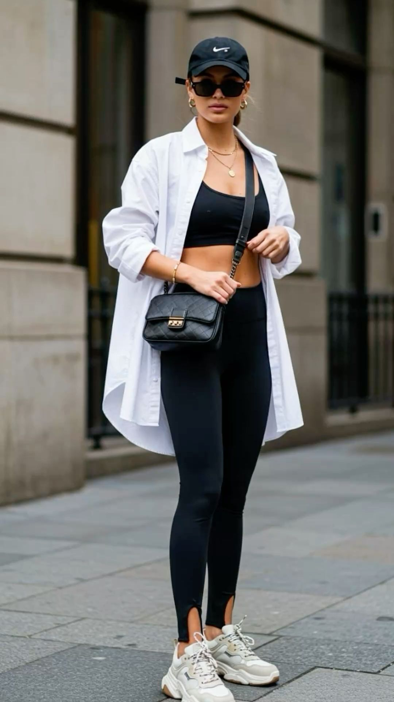

# 运动休闲（Athleisure）
> **状态**: reviewed | 最后更新: 2026-06-23 | 分类: 现代都市 | **趋势**: 🔥 流行趋势

## 📖 概述
- 发源年代: 2014年（被正式收入韦氏词典的年份），但根源在1998年 Lululemon 创立
- 发源地: 加拿大温哥华（Lululemon总部）→ 美国洛杉矶/纽约（全球Athleisure审美中心）
- 风格关键词（5-8个）: 运动服日常化、瑜伽裤/Leggings、运动内衣外穿、oversize帽衫、科技面料、同色系套装、健康生活方式
- 一句话定义（50字以内）: 瑜伽裤走出瑜伽房——高性能运动服与日常穿搭的融合，不是为了去健身房，而是为了从健身房出来后的所有生活场景。

## 📜 历史文化
- **起源**: 1998年 Chip Wilson 在温哥华创立 Lululemon，初衷是为瑜伽爱好者提供更好的运动装备。他发现了一个未被服务的市场：追求健康生活方式的都市女性需要「可以穿一整天」的运动服——从瑜伽课到咖啡店到接孩子，不需要换衣服。Lululemon 的「Align 裸感裤」和「Define Jacket」成了这个品类的 iPhone 时刻。
- **发展脉络**:
  - **1998**: Lululemon 在温哥华创立，最初只是一家白天瑜伽工作室/晚上卖瑜伽裤的小店
  - **2000-2010**: Lululemon 在北美扩张，瑜伽裤从「健身房的」变成「超市穿的」
  - **2014**: 「Athleisure」被正式收入韦氏词典——标志着这个品类获得文化认可
  - **2014-2016**: Gigi Hadid/ Kendall Jenner 开始穿着骑行裤+oversize卫衣出现在街拍中。运动休闲从「瑜伽妈妈的」变成「时尚的」
  - **2017-2019**: Outdoor Voices（「Doing Things」品牌哲学）/ Girlfriend Collective（可持续运动服）/ Alo Yoga（Instagram 最美运动lookbook）相继崛起
  - **2020-2021**: 疫情——运动裤正式成为「工作裤」。运动休闲的穿着场景从「健身房→日常」扩展到「全天24小时」
  - **2022-2024**: 后疫情时代，品牌（Vuori/ Beyond Yoga）继续创新。Lululemon 2023年女装收入超过 50 亿美元
- **文化意义**: Athleisure 是女性时尚史上第一次「功能决定形式」赢得对「形式决定功能」的全面胜利——几亿女性选择穿得更舒服，而不是穿得「应该」。

## 🎨 美学特征
- **廓形特点**: 上松下紧或全松。运动内衣/合身T恤 + 高腰 Leggings + 超大外套（帽衫/Bomber/防风夹克）。Leggings 必须高腰——低腰 leggings 在瑜伽课上会暴露。骑行裤长度在大腿中部。
- **色板**:
  - 基础色：黑色(#1A1A1A)、深灰(#555555)、奶油白(#FFF8F0)
  - 时尚色（季节流行）：鼠尾草绿(#9CAF88)、勃艮第红(#722F37)、电光蓝(#3B5998)、尘粉(#D4A0A0)
  - 禁忌色：过于鲜艳的荧光色单一使用（荧光黄全套是健身教练，不是 athleisure）
- **面料偏好**: Nulu (Lululemon 的裸感面料) / Everlux / Nulux 等专有科技面料 > 弹力棉 > 网眼 > French Terry（帽衫）。面料的「手感」是关键——必须像第二层皮肤。
- **标志单品表**:

| 单品 | 品牌示例 | 选择要点 |
|------|---------|---------|
| 高腰瑜伽 Leggings | Lululemon (Align/Wunder Train), Alo Yoga (Airlift) | 高腰、无侧缝、蹲下不透、25'' 或 28'' 长度 |
| 运动内衣（可外穿） | Lululemon (Energy/Free to Be), Alo Yoga | 中高强度支撑、可单穿、设计感后背 |
| 骑行裤 | Lululemon, Alo Yoga, Aritzia TNA | 长度大腿中部（8''或10''）、高腰 |
| Oversize 帽衫 | Champion, Lululemon (Scuba), Aritzia | 超大号、French Terry或拉绒内里 |
| Define Jacket | Lululemon | 修身款拉链夹克、拇指洞、Nulu面料 |
| Bomber 夹克 | Alo Yoga, Nike, Adidas | 轻量、防风、可叠穿在帽衫外 |
| 老爹鞋/跑步鞋 | Nike (Air Max), New Balance (990), Hoka | 厚底、舒适第一、纯白或复古配色 |
| 运动拖鞋 | UGG, Birkenstock, Nike | 运动后的「解压装备」 |

## 🏷️ 代表品牌

### 核心品牌
| 品牌 | 国家 | 价位 | 一句话 |
|------|------|------|--------|
| Lululemon | 加拿大 | ¥¥¥ | 1998年创立，品类定义者。Align裸感裤+Define Jacket是女性athleisure的圣杯 |
| Alo Yoga | 美国 | ¥¥¥ | 2007年创立于洛杉矶，Instagram时代最会拍lookbook的运动品牌。好莱坞明星首选 |
| Vuori | 美国 | ¥¥¥ | 2015年创立于加州，冲浪×运动休闲。男装起家，女装线增长最快 |
| Outdoor Voices | 美国 | ¥¥ | 2013年创立，快乐运动理念。「Doing Things」slogan文化 |
| Girlfriend Collective | 美国 | ¥¥ | 可持续运动服标杆。回收塑料瓶制瑜伽裤，XXS-6XL尺码包容 |
| Beyond Yoga | 美国 | ¥¥ | 2005年创立，包容性尺码瑜伽。XXS-4X，身材包容标杆 |
| Nike Women | 美国 | ¥¥ | 运动巨头女装线。Air Force 1/Dunk 女性配色 |
| Adidas by Stella McCartney | 英国/德国 | ¥¥¥ | 2005年起跨界合作。运动×可持续×高定 |

### 平价替代
| 品牌 | 价位 | 说明 |
|------|------|------|
| CRZ Yoga | ¥ | 「平替 Lululemon」——Naked Feeling系列极受欢迎 |
| Old Navy Powersoft | ¥ | 美国大众运动休闲，性价比极高 |
| Zella (Nordstrom) | ¥¥ | Nordstrom 自有品牌，品质不错 |
| Aerie OFFLINE | ¥ | American Eagle 运动线，年轻化定价 |

### 新兴品牌（2024-2026）
- **Year of Ours**: LA 女性创立，复古配色+高性能面料
- **Sweaty Betty**: 英国女性运动品牌，印花紧身裤+社区跑团
- **Set Active**: 「套装运动服」概念，每季限量同色系套装

## 👤 风格偶像 & 名人

### 关键推动者
| 人物 | 身份 | 贡献 |
|------|------|------|
| Chip Wilson | Lululemon 创始人 | 发明了「瑜伽裤可以穿一整天」的商业模式 |
| Gigi Hadid | 超模 | 运动休闲街拍女王——紧身裤+帽衫+太阳镜的公式 |

### 穿着此风格的明星/博主
| 人物 | 身份 | 为什么是 icon |
|------|------|---------------|
| Kendall Jenner | 超模 | 骑行裤+超大号卫衣+Bottega包——把运动休闲穿成了奢侈品 |
| Hailey Bieber | 模特 | Alo Yoga 的代言人，运动套装+长袜+运动鞋+太阳镜=「超模下班」|
| Kaia Gerber | 模特 | 90s超模风×运动休闲混搭 |
| Emily Ratajkowski | 模特/作家 | 运动休闲的「纽约版」——紧身裤+运动鞋+大号衬衫 |

## 👗 秀场 & 时装周
- 运动休闲不是秀场风格，但它反向影响了高级时装：
  - **Chanel SS2014** — Karl Lagerfeld 将运动鞋带到 Chanel 高定秀
  - **Dior SS2022** — Maria Grazia Chiuri 的运动鞋+纱裙混搭
- 运动休闲的「秀场」是**街拍**和**Instagram**——Kendall Jenner 的纽约街拍比任何时装周都推动了这个风格

## 🔗 关联风格
- **父风格**: 运动服 (Sportswear) + 休闲服 (Casualwear)
- **子风格**: 奢华运动 (Luxe Athleisure)、街头运动 (Street Athleisure)
- **平行风格**: 美式休闲（共享舒适基因、很多单品交叉）
- **对立风格**: 法式慵懒——法式慵懒的「克制」vs 运动休闲的「功能最大化」
- **与姐妹风格差异**:
  1. vs 美式休闲：Athleisure用科技面料（Nulu/Everlux），美式休闲用天然面料（棉/丹宁）。运动休闲穿跑步鞋，美式休闲穿帆布鞋
  2. vs 都市通勤：后疫情的通勤开始接受运动休闲元素（Lululemon的On The Fly裤系列），但西装+运动鞋尚存争议
  3. vs Y2K：Y2K的运动服是「Juicy Couture天鹅绒套装」，Athleisure的运动服是「Lululemon黑色瑜伽裤」——不同的年代，不同的面料，相同的舒适诉求

## 📈 流行趋势
- **当前状态**: 持续增长——全球运动休闲市场预计2028年超过6600亿美元
- **流行区域**: 北美 > 欧洲 > 亚洲（中国Lululemon门店数已超100家） > 全球
- **发展方向**:
  - 2025-2026：运动休闲与高尔夫的交叉（Alo Yoga进军高尔夫服装）
  - 长期：运动休闲的「天花板」是「所有女性的默认衣橱」——当 Yoga 裤可以穿去任何地方时，它就不再是品类，而是基础

## 💡 穿搭建议
- **适合体型**: 沙漏形（高腰Leggings+Define Jacket 显腰，0.90）、倒三角（宽肩+紧身裤平衡比例，0.88）、直筒形（骑行裤+大帽衫友好，0.92）。苹果形：高腰Leggings+长款帽衫遮盖腰腹
- **适合肤色**: 所有肤色——黑色 leggings 是全肤色通用
- **适合场合**: 健身房/瑜伽课/咖啡店/超市/机场/周末早午餐/WFH。不适合：正式会议/酒会/婚礼
- **入门建议**:
  1. 投资一条好的黑色高腰 Leggings——这是 athleisure 的「Hello World」。蹲下检查是否透视再买
  2. 运动内衣外穿+高腰Leggings+oversize帽衫是万能公式
  3. 同色系套装最省心——黑色全套永远不会错
  4. 鞋要干净——脏运动鞋毁所有（脏帆布鞋可以，脏运动鞋不行）
  5. 从 Lululemon Wunder Train (Everlux面料) 或 CRZ Yoga Naked Feeling 开始

---
*本文基于多源研究整理，AI 辅助生成。*
