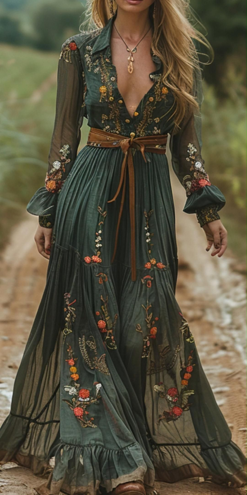

# 波西米亚（Boho）
> **状态**: reviewed | 最后更新: 2026-06-23 | 分类: 欧洲经典 | **趋势**: 🔥 流行趋势

## 📖 概述
- 发源年代: 1960-70年代嬉皮士运动时期，以 2004-05 年 Sienna Miller 引领的 Boho Chic 为商业化巅峰
- 发源地: 19世纪法国巴黎拉丁区（波西米亚艺术家运动的精神源头）→ 1960s 美国旧金山/纽约嬉皮士社区 → 2000s 伦敦/洛杉矶时尚产业
- 风格关键词（5-8个）: 印花长裙、流苏/刺绣/钩针、大地色+宝石色、层叠混搭、反主流、自由灵魂、手工感
- 一句话定义（50字以内）: 吉普赛流浪者的浪漫想象——印花长裙+流苏+刺绣+钩针，层层叠叠的纹理和故事，像是从摩洛哥市集、印度神庙和1969年的伍德斯托克音乐节同时归来。

## 📜 历史文化
- **起源**: 波西米亚 (Bohemian) 这个词最早指19世纪巴黎拉丁区的贫困艺术家群体，他们被主流社会类比为来自波西米亚（今捷克）的吉普赛人——自由、不羁、反主流。这个隐喻后来附着于服装：艺术家穿的不是西装，是宽松的棉麻衬衫和旧外套。1960-70年代的嬉皮士运动将 Boho 从艺术家亚文化推向大众——Woodstock 音乐节上，数十万年轻人穿着流苏背心、印花长裙和头巾。
- **发展脉络**:
  - **1830-40s**: 巴黎拉丁区波西米亚艺术家运动——Henri Murger 的《波西米亚人》小说（后来改编为普契尼歌剧《La Bohème》）定义了波西米亚的生活方式原型
  - **1960-70s**: 嬉皮士运动——Woodstock/ 反越战/ 性解放/ 东方宗教——将 Boho 服装推向大众。The Beatles 去印度学冥想，回来穿着印度印花衬衫
  - **1970s**: Yves Saint Laurent 的「俄罗斯芭蕾」系列——高级时装第一次将民族元素放进奢侈品语境
  - **2004-05**: Sienna Miller + Kate Moss——Boho Chic 巅峰。Sienna Miller 在 Glastonbury 音乐节穿 Ugg 靴+流苏腰带+棕色麂皮夹克的照片定义了整个时代
  - **2005-2010**: Chloé（Phoebe Philo时期，2001-2006）和 Isabel Marant 将 Boho 从音乐节服装提升为奢侈品
  - **2010s**: Coachella 音乐节成为 Boho 的年度「大秀」——Vanessa Hudgens 等明星的 Coachella 穿搭成为 Boho 的新一代教科书
  - **2020s**: Boho 从「音乐节=穿得像吉普赛人」的刻板印象中挣脱，走向更成熟、更日常的方向——Ulla Johnson/ Dôen 代表的「知性波西米亚」
- **文化意义**: Boho 是西方女性时尚史上最持久的「反主流」风格——它不是设计师发明的，是反文化运动、音乐节和一代代「不愿意穿西装的女人」共同塑造的。

## 🎨 美学特征
- **廓形特点**: 宽松飘逸，不束缚身体。长裙+层叠上衣+披肩或开衫。腰线通常靠腰带或服装本身的帝国腰设计来定义。绝不紧身——Boho 从嬉皮士反文化基因里就排斥任何束缚身体的服装。
- **色板**:
  - 底色：大地色系——奶油白(#FFF8F0)、焦糖棕(#C4A060)、骆驼棕(#C19A6B)、陶土红(#C27A5E)
  - 宝石色：橄榄绿(#7A8B5B)、矢车菊蓝(#6495ED)、酒红(#722F37)、紫水晶(#9966CC)
  - 金属色（少量用于配饰）：金/黄铜/银
  - 禁忌色：荧光色、霓虹色、纯黑色（Boho 不接受极简的黑色）——黑色在 Boho 里应该有「洗旧感」
- **面料偏好**: 天然材质+手工感。真丝 > 棉麻 > 蕾丝 > 钩针编织 > 麂皮 > 刺绣布 > 天鹅绒。面料应该有「摸过很多次」的柔软感——崭新的不行。
- **标志单品表**:

| 单品 | 品牌示例 | 选择要点 |
|------|---------|---------|
| 印花 Maxi 长裙 | Chloé, Zimmermann, Free People | 及踝长度、碎花或民族印花、真丝或人造丝 |
| 刺绣衬衫/上衣 | Ulla Johnson, Isabel Marant Étoile | 刺绣细节、灯笼袖或泡泡袖、棉麻或真丝 |
| 钩针/蕾丝开衫 | Free People, Spell & The Gypsy | 手工感钩针、奶油白或大地色、宽松不系扣 |
| 流苏麂皮夹克 | Isabel Marant, AllSaints | 棕色或黑色麂皮、流苏细节、不过腰或及腰 |
| 流苏/刺绣短裤 | Free People, Anthropologie | 宽松、棉麻、流苏或刺绣细节 |
| 角斗士凉鞋 | Ancient Greek Sandals, Chloé | 平底或低跟、皮革绑带、棕色或金色 |
| 麂皮短靴 | Chloé, Isabel Marant | 及踝、棕色或黑色、粗跟 |
| 层叠项链+手镯 | 民族手工艺品牌、古着 | 混搭不同长度/材质/文化来源 |

## 🏷️ 代表品牌

### 核心品牌
| 品牌 | 国家 | 价位 | 一句话 |
|------|------|------|--------|
| Chloé | 法国 | ¥¥¥¥ | 1952年 Gaby Aghion 创立，波西米亚奢华鼻祖。蕾丝+荷叶边+大地色=波西米亚的高定版 |
| Isabel Marant Étoile | 法国 | ¥¥¥ | Isabel Marant 副线，更日常的都市波西米亚。流苏夹克+印花连衣裙 |
| Ulla Johnson | 美国 | ¥¥¥ | 纽约知性波西米亚，手工感+印花+灯笼袖。波西米亚的「知识分子」版 |
| Zimmermann | 澳洲 | ¥¥¥¥ | 1991年创立，浪漫波西米亚——荷叶边+蕾丝+度假长裙。游艇婚礼首选 |
| Free People | 美国 | ¥¥ | 美国波西米亚生活方式品牌。钩针/流苏/长裙/头巾——入门Boho的一站式商店 |
| Anthropologie | 美国 | ¥¥ | 高阶波西米亚家居×服装。刺绣+手工感+艺术印花 |
| Rixo | 英国 | ¥¥¥ | 2015年伦敦创立，手绘印花+真丝混纺。复古波西米亚的现代版 |
| Spell & The Gypsy | 澳洲 | ¥¥¥ | Byron Bay 品牌，音乐节Boho代表。印花+流苏+蕾丝 |

### 平价替代
| 品牌 | 价位 | 说明 |
|------|------|------|
| Free People | ¥¥ | Boho最全品类的平价入口 |
| ASOS Design | ¥ | 快时尚Boho线，紧跟趋势 |
| Zara Woman | ¥ | 季节性Boho胶囊 |
| Mango | ¥ | 西班牙品牌，Boho通勤混搭 |

### 新兴品牌（2024-2026）
- **Dôen**: 加州田园波西米亚，方领连衣裙+草原裙。洛杉矶女性创始
- **Faithfull The Brand**: 巴厘岛度假波西米亚，方领+泡泡袖+碎花
- **Sea**: 纽约品牌，蕾丝领+刺绣+棉麻。知性Boho

## 👤 风格偶像 & 名人

### 关键推动者
| 人物 | 身份 | 贡献 |
|------|------|------|
| Sienna Miller | 演员 | 2004-05年 Boho Chic 全球引爆者。Glastonbury 音乐节流苏腰带+Ugg靴造型改变了时尚史 |
| Kate Moss | 超模 | 2000s Boho 的另一极——更摇滚、更随性、更「刚从夜店出来去音乐节」|
| Talitha Getty | 演员/社交名流 | 1960s 马拉喀什波西米亚的终极化身——在摩洛哥穿 kaftan+头巾 |

### 穿着此风格的明星/博主
| 人物 | 身份 | 为什么是 icon |
|------|------|---------------|
| Sienna Miller | 演员 | Boho Chic 的「零号病人」——2004年那套 Glastonbury 造型 |
| Vanessa Hudgens | 演员/歌手 | Coachella Boho 代表——花环+流苏+角斗士凉鞋 |
| Florence Welch | 歌手 (Florence + The Machine) | 舞台上的暗黑波西米亚——飘动的长裙+戏剧性披肩 |
| Rachel Zoe | 造型师 | 2000s 好莱坞 Boho 审美的幕后推手——她造型了最著名的几套 Boho 红毯 |
| Nicole Richie | 设计师/演员 | 2000s Boho 的日常示范——头巾+超大墨镜+长裙 |

## 👗 秀场 & 时装周
- **Chloé SS2025** — Chemena Kamali 的首秀，复兴了 Chloé 1970s Karl Lagerfeld 档案中的波西米亚基因
- **Isabel Marant SS2024** — 都市波西米亚的持续演进，流苏+印花+及踝靴
- **Zimmermann Resort 系列** — 每年选全球度假地发布，波西米亚高定的最强展示
- **Coachella 音乐节** — 虽然不是秀场，但它是 Boho 的年度「无组织大秀」

## 🔗 关联风格
- **父风格**: 嬉皮士风格 (Hippie Style) + 民族风格 (Ethnic/Folk Style)
- **子风格**: Boho Chic (2000s 奢侈品版)、暗黑波西米亚 (Dark Boho)、都市波西米亚 (Urban Boho)
- **平行风格**: 法式慵懒（共享「不刻意」的态度）、日系森系（共享自然面料+层叠偏好）
- **对立风格**: 极简——Boho=最大装饰、极简=零装饰。学院风——Boho=自由反叛、学院风=规矩克制
- **与姐妹风格差异**:
  1. vs 法式慵懒：Boho 繁复（印花+流苏+刺绣+层叠项链），法式克制（一件印花就够）
  2. vs 极简：完全对立——Boho 的每一层都在做加法，极简的每一层都在做减法
  3. vs 学院风：Boho=自由灵魂+手工感+流浪者气质，学院风=精英编码+规矩感+俱乐部气质
  4. vs 暗黑学院：Boho 拥抱阳光/自然/开朗，暗黑学院偏好阴影/室内/忧郁

## 📈 流行趋势
- **当前状态**: 小幅回升——2024-25年 Chloé 新创意总监带来的 Boho 复兴被称为「Boho Chic 2.0」
- **流行区域**: 北美（Coachella/西海岸）> 澳洲（Byron Bay/Zimmermann）> 欧洲（Chloé/ Isabel Marant）
- **发展方向**:
  - 2025-2026：Boho Chic 2.0——更成熟、更奢侈品、更日常（不是只穿去音乐节了）
  - 长期：Boho 不会消失——它是「反主流」的周期性复兴。每次经济繁荣期之后，人们会渴望「更自由的衣服」

## 💡 穿搭建议
- **适合体型**: 直筒形（宽松廓形友好，0.90）、梨形（长裙遮盖力强，0.85）。沙漏形（宽松廓形不显腰，0.82）——Boho 不强调身体曲线。
- **适合肤色**: 暖调肤色——大地色+金色是暖皮的最佳朋友。冷白皮可选冷调印花（矢车菊蓝+紫水晶）。
- **适合场合**: 音乐节/度假/海滩/周末 brunch/创意产业办公。不适合正式场合和保守行业。
- **入门建议**:
  1. 从一条印花 Maxi 长裙开始——这是 Boho 的「Hello World」
  2. 层叠是灵魂——项链可以叠 3 条不同长度的
  3. 流苏或刺绣或钩针——至少出现一种手工元素
  4. 鞋子要有「走过路」的感觉——麂皮短靴比崭新皮靴更 Boho
  5. 别穿成「吉普赛戏服」——全身 Boho 容易变戏服，混搭现代单品（牛仔裤+刺绣上衣）更日常

---
*本文基于多源研究整理，AI 辅助生成。*
