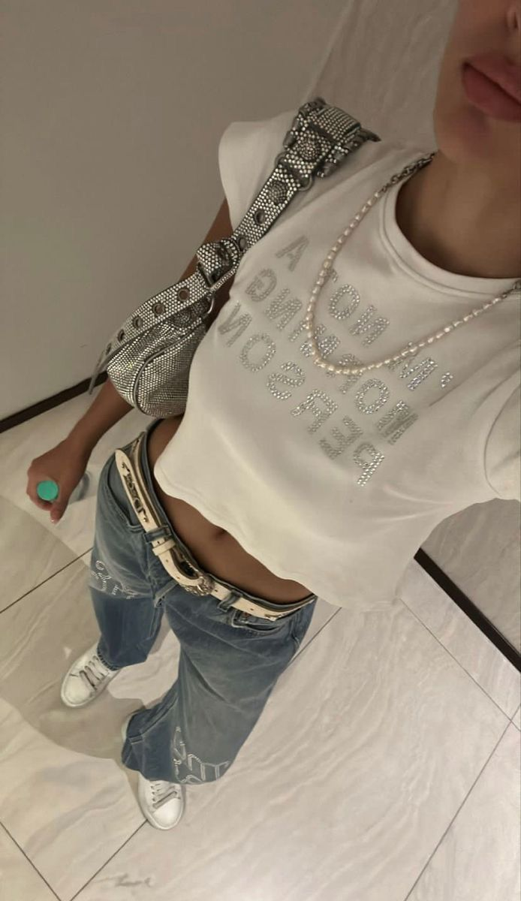

# Y2K 千禧复古（Y2K Revival）
> **状态**: reviewed | 最后更新: 2026-06-23 | 分类: 现代都市 | **趋势**: 🔥 流行趋势

## 📖 概述
- 发源年代: 1998-2004年为原始时期；2020-2022年在 TikTok 上以「Y2K Revival」的形式爆发
- 发源地: 互联网（TikTok/ Instagram）——Y2K 复兴由 Gen Z 在社交媒体上驱动
- 风格关键词（5-8个）: 低腰一切、闪亮/金属/镜面、Baby Tee、蝴蝶元素、天鹅绒运动套装、厚底鞋、身体意识、科技乐观主义
- 一句话定义（50字以内）: 2000年代初的流行美学通过 TikTok 滤镜回到2025——低腰牛仔裤、闪亮面料、蝴蝶发夹和你姐姐2002年穿去毕业趴的那条 Juicy Couture 天鹅绒套装。

## 📜 历史文化
- **起源**: Y2K（Year 2000）原指1990年代末到2000年代初的科技乐观主义和文化审美巅峰。在服装上，这个时期的特征是对「未来」的乐观想象——金属色、镜面、PVC、全息面料、科技感配饰。同时，Paris Hilton/ Britney Spears/ Mean Girls 定义了「坏女孩甜心」的范本——低腰裤、露腹、粉红色一切。
- **发展脉络**:
  - **1998-2004**: 原始 Y2K——Britney Spears 的「...Baby One More Time」造型（低腰裤+露腹衬衫）、Paris Hilton 的粉色 Juicy Couture 天鹅绒套装、Destiny's Child 的金属色紧身衣
  - **2020-2021**: TikTok Gen Z 开始重新发现 Y2K 美学——#Y2Kfashion 标签爆发。Bella Hadid 频繁穿着复古2000s单品（低腰裤+Baby Tee+小墨镜）成为复兴的催化剂
  - **2022-2023**: 奢侈品牌入场——Blumarine（Nicola Brognano 担任创意总监）将 Y2K 核心元素（蝴蝶/粉色/低腰）放在米兰时装周上。Miu Miu 的「微裙」系列引爆「超短下装」讨论
  - **2024-2025**: Y2K 从「TikTok 趋势」走向「成熟商业化」——Diesel 复兴（低腰牛仔裤+D字包+Logo腰带）、Heaven by Marc Jacobs 的 Gen Z 副线
- **文化意义**: Y2K 是第一个由 Gen Z「考古」驱动的时尚复兴——这些年轻人没有经历过原始的 Y2K 时代，他们通过 YouTube 视频、Tumblr 扫描和 TikTok 滤镜重新发现它。它代表了「复古」不再意味着「你妈妈年轻时穿的」，而是「你小时候在 MTV 上看到的」。

## 🎨 美学特征
- **廓形特点**: 身体意识——紧身上衣+低腰下装+露腹=Y2K 的黄金比例。上衣极短（Baby Tee/束腰/镂空），下装极低腰。厚底鞋（至少5cm）拉长腿部。全身比例：短+长+厚底。
- **色板**:
  - 主色调：热粉(#FF69B4)、婴儿蓝(#B5D5E8)、银色(#C0C0C0)、金属色、白色(#FFFFFF)
  - 辅助色：薰衣草紫(#C3B1E1)、酸橙绿(#CCFF00)、黑色(用于配饰)
  - 禁忌色：大地色系（大地色属于森系和波西米亚，不是Y2K）、驼色/米色（太成熟，不是Y2K的少女感）
- **面料偏好**: 天鹅绒（运动套装）> 弹力棉（Baby Tee）> 牛仔（低腰裤）> 尼龙/金属面料（派对装）> 网眼（层次）。面料不追求「质感」——追求「闪亮」和「紧身」。
- **标志单品表**:

| 单品 | 品牌示例 | 选择要点 |
|------|---------|---------|
| Baby Tee（超短T恤） | Miaou, Heaven by Marc Jacobs, I.AM.GIA | 极短、紧身、图案或Logo、长度在肋骨 |
| 低腰牛仔裤 | Diesel, Levi's, Blumarine | 低腰（胯骨以下）、直筒或微喇、破坏可接受 |
| 天鹅绒运动套装 | Juicy Couture, I.AM.GIA | 低腰拉链上衣+低腰裤套装、粉/紫/黑色 |
| 束腰/镂空紧身上衣 | Miaou, Poster Girl, AREA | 金属扣/镂空/系带细节、高弹力 |
| 超短迷你裙/微裙 | Miu Miu, Blumarine | 极短、低腰、格子或纯色 |
| 厚底鞋/厚底靴 | Buffalo London, Naked Wolfe, Dr. Martens | 至少 5cm 底、厚底=Y2K 比例的关键 |
| 蝴蝶发夹/饰品 | 复古/二手/独立品牌 | 蝴蝶图案是Y2K的第一图腾 |
| 小号墨镜 | 复古 Oakley/ Matrix 风格 | 卵形/矩形/护目镜型、浅色镜片 |

## 🏷️ 代表品牌

### 核心品牌
| 品牌 | 国家 | 价位 | 一句话 |
|------|------|------|--------|
| Blumarine | 意大利 | ¥¥¥¥ | Y2K 复兴最主要的奢侈品线。Nicola Brognano 将蝴蝶/粉色/低腰带到米兰时装周 |
| Diesel | 意大利 | ¥¥¥ | 1978年创立，Glenn Martens 复兴的意大利牛仔Y2K。低腰牛仔裤+D字包+Logo腰带 |
| Juicy Couture | 美国 | ¥¥ | 1997年创立，天鹅绒运动套装鼻祖。「Made in the Glamorous USA」口号回归 |
| Heaven by Marc Jacobs | 美国 | ¥¥¥ | Marc Jacobs 的 Gen Z 副线——泰迪熊/双蝴蝶结/婴儿T恤 |
| Miaou | 美国 | ¥¥ | LA Y2K 紧身衣专家。束腰/金属扣/低腰裤。Bella Hadid 带货爆红 |
| I.AM.GIA | 澳洲 | ¥¥ | 网红Y2K品牌。束腰裤+工装裤+紧身套装 |
| Poster Girl | 英国 | ¥¥¥ | 伦敦Y2K派对装。紧身连衣裙+金属环+镂空 |
| AREA | 美国 | ¥¥¥¥ | 水晶装饰+派对Y2K。水晶流苏连衣裙 |

### 平价替代
| 品牌 | 价位 | 说明 |
|------|------|------|
| UNIF | ¥¥ | 洛杉矶品牌，Y2K复兴先驱 |
| Dolls Kill | ¥¥ | 美式Y2K一站式电商 |
| ASOS Design | ¥ | 快时尚Y2K线 |
| Zara | ¥ | 季节性Y2K胶囊 |

### 新兴品牌（2024-2026）
- **Chopova Lowena**: 伦敦品牌，保加利亚民俗×Y2K朋克。百褶裙+登山扣+厚底靴
- **Collina Strada**: 纽约可持续Y2K。印花+手工感+环保激进

## 👤 风格偶像 & 名人

### 关键推动者
| 人物 | 身份 | 贡献 |
|------|------|------|
| Britney Spears | 歌手 | 原始Y2K的「零号病人」——低腰裤+露腹上衣+「...Baby One More Time」造型 |
| Paris Hilton | 名人 | Juicy Couture 天鹅绒套装的全球推广大使 |
| Bella Hadid | 超模 | Y2K复兴的催化剂——2020年开始频繁穿着复古2000s单品 |

### 穿着此风格的明星/博主
| 人物 | 身份 | 为什么是 icon |
|------|------|---------------|
| Bella Hadid | 超模 | 低腰牛仔裤+复古小墨镜+厚底靴+皮夹克=当代Y2K公式 |
| Dua Lipa | 歌手 | 舞台和MV中的Y2K复兴——Blumarine/ Diesel 常客 |
| Olivia Rodrigo | 歌手 | Gen Z Y2K——蝴蝶发夹+低腰裤+厚底鞋 |
| Devon Lee Carlson | 博主 | Wildflower Cases 创始人，Y2K审美的日常化示范 |

## 👗 秀场 & 时装周
- **Blumarine SS2022-2025** — Y2K复兴在奢侈品领域的旗舰系列。蝴蝶、粉色、低腰、厚底
- **Diesel FW2024** — Glenn Martens 的低腰牛仔裤+D字包+Logo腰带复兴
- **Miu Miu SS2022** — 微裙系列引爆「超短下装」全球讨论
- **Heaven by Marc Jacobs** — 每季在纽约的「表演式」发布

## 🔗 关联风格
- **父风格**: 2000年代初流行文化 (Pop Culture — Britney/Paris Hilton 时代)
- **子风格**: Y2K Goth (暗黑2000s)、Y2K Cyber (科技2000s)
- **平行风格**: 运动休闲（共享2000s运动套装文化——Juicy Couture vs Lululemon））
- **对立风格**: 极简——Y2K=最大装饰（闪亮/金属/镂空），极简=零装饰。新中式——Y2K追求「2000年的15分钟」，新中式追求「五千年的传承」
- **与姐妹风格差异**:
  1. vs 美式休闲：Y2K是 time-specific（2000年代的快照），美式休闲是 timeless（从1873穿到现在）
  2. vs 运动休闲：Y2K的运动是「Juicy Couture天鹅绒」，运动休闲的运动是「Lululemon黑色瑜伽裤」。不同的年代，不同的面料，相同的舒适
  3. vs 都市通勤：完全对立——Y2K的低腰/露腹/闪亮与通勤的克制/结构/职业感几乎不重叠

## 📈 流行趋势
- **当前状态**: 从2021-2023的爆发峰值回落，进入「稳定吸收」阶段——Y2K 元素（低腰/厚底/蝴蝶）已被主流品牌吸收为常规产品，不再只是 TikTok 趋势
- **流行区域**: 欧美 Gen Z（TikTok原生用户）> 亚洲（中国/韩国通过社交媒体渗透）> 全球
- **发展方向**:
  - 2025-2026: Y2K 与「Indie Sleaze」（2000s独立音乐场景审美）融合——American Apparel 的复兴
  - 长期: Y2K 作为「风格标签」可能会淡出，但低腰裤和厚底鞋不会很快消失

## 💡 穿搭建议
- **适合体型**: 直筒形（低腰+细腿比，0.88）、沙漏形（紧身上衣+低腰裤显腰，0.85）、苹果形（Baby Tee+高腰替代低腰，0.72）。梨形——低腰裤可能不适合（会卡在最宽处），选择高腰复古牛仔裤替代
- **适合肤色**: 不挑肤色——Y2K是氛围和态度大于肤色匹配
- **适合场合**: 派对/音乐节/演唱会/周末出街。不适合：办公室/正式场合/面试
- **入门建议**:
  1. 从一只蝴蝶发夹或小号墨镜开始——配饰是 Y2K 最便宜的入门券
  2. 不必全身 Y2K——一条低腰牛仔裤+现代上衣比全套 Juicy Couture 更日常
  3. 厚底鞋（至少5cm）改变全身比例——Buffalo London 的 Classic 是入门最佳
  4. Y2K 可以「二手」——去 Depop/闲鱼上搜「vintage Y2K」比买新品牌更 authentic
  5. 低腰裤如果不敢穿——高腰直筒复古牛仔裤+紧身上衣是 Y2K 的安全版

---
*本文基于多源研究整理，AI 辅助生成。*
