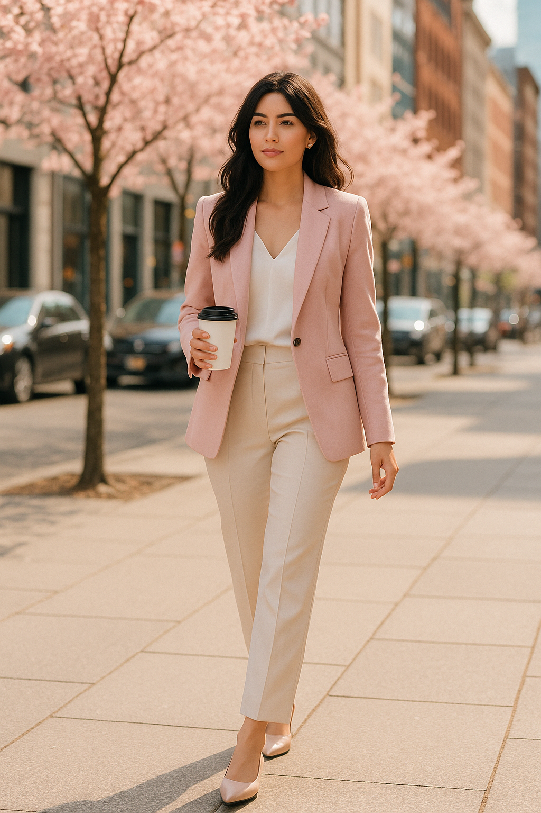

# 都市通勤（City Girl）
> **状态**: reviewed | 最后更新: 2026-06-23 | 分类: 现代都市 | **趋势**: 🔥 流行趋势

## 📖 概述
- 发源年代: 1980年代（女性大规模进入职场，权力套装 Power Suit 时代）→ 2020年代（后疫情混合通勤 Hybrid Workwear 时代）
- 发源地: 美国纽约（全球女性职场穿搭的审美中心）→ 斯德哥尔摩/伦敦/东京为区域极点
- 风格关键词（5-8个）: 西装外套为锚点、阔腿西装裤、真丝衬衫、专业但不失女人味、面料即专业度、从办公室到酒吧无缝切换
- 一句话定义（50字以内）: 为工作穿的，不是为公司穿的——西装外套配牛仔裤就下班，配阔腿西装裤就开会。核心是专业利落但不抹掉性别和个性。

## 📜 历史文化
- **起源**: 1980年代，女性大规模进入职场中层和高层。Giorgio Armani、Donna Karan 等设计师为女性打造「权力套装」(Power Suit)——垫肩、直筒裙、中性色——让女性在男性主导的会议室里获得视觉权威。但这个时期的通勤装是在「模仿男性西装」的基础上建立的。
- **发展脉络**:
  - **1980s**: 权力套装时代——Giorgio Armani（无结构西装）、Donna Karan（Seven Easy Pieces 胶囊通勤概念）定义了第一代女性通勤装
  - **1990s**: 商务休闲 (Business Casual)兴起——硅谷科技公司（Apple/ Microsoft）的 Casual Friday 文化开始侵蚀正装传统
  - **1998**: 在《欲望都市》里，Carrie Bradshaw 的 Manolos 配西装=「通勤可以很时尚」
  - **2000-2010**: Theory 崛起——Andrew Rosen 将「纽约女性通勤装」商业化到极致。西装+阔腿裤+真丝衬衫=新时代女性制服
  - **2020-2021**: 疫情——Zoom 上衣+运动裤下装的「半身通勤」。运动休闲入侵通勤装
  - **2022-2025**: 后疫情混合通勤——一周去办公室3天。通勤装需求从「每天正装」变成「几套好的西装可以循环穿」
- **文化意义**: 都市通勤是女性职场地位的「穿衣翻译」——1980s模仿男性才能获得权威，2020s穿自己的衣服也能获得权威。

## 🎨 美学特征
- **廓形特点**: 结构感西装为锚点（收腰或直筒），搭配高腰阔腿西装裤（垂坠感强）或铅笔裙（及膝）。内搭真丝衬衫或羊绒高领。廓形比例：西装长度盖臀或及腰，西裤长度拖地或及踝。
- **色板**:
  - 核心职场色：黑色(#1A1A1A)、海军蓝(#1B2A4A)、灰色(#808080)、驼色(#C4A882)、纯白(#FFFFFF)
  - 柔和彩色（一件即可）：藕粉(#D4A0A0)、酒红(#722F37)、浅蓝(#B5D5E8)、鼠尾草绿(#9CAF88)
  - 禁忌色：荧光色、大面积印花、过多的亮片/金属（不属于通勤语境）
- **面料偏好**: 羊毛（西装/西裤/大衣）> 真丝（衬衫）> 羊绒（冬季针织）> 重磅棉（夏季衬衫）。面料是通勤装的核心——廉价面料在会议室会被一眼看出来。
- **标志单品表**:

| 单品 | 品牌示例 | 选择要点 |
|------|---------|---------|
| 结构感西装 | Theory, Vince, COS, Arket | 黑色/海军蓝/驼色、收腰或直筒、长度盖臀 |
| 阔腿西装裤 | Theory, Totême, COS, Massimo Dutti | 高腰、垂坠感强、长度拖地或及踝 |
| 真丝衬衫 | Equipment, Theory, Vince | 纯色（白/黑/藕粉）、V领或飘带领 |
| 羊绒高领/圆领毛衣 | Vince, Theory, Uniqlo U | 冬季内搭、纤细不臃肿 |
| 铅笔裙 | Theory, Vince, COS | 及膝或过膝、纯色、微弹面料 |
| 衬衫裙 | COS, Arket, Massimo Dutti | 及膝或中长、棉质或丝棉混纺、可配腰带 |
| 羊毛大衣 | Max Mara, Totême, COS | 及膝或更长、驼色/黑色/灰色 |
| 尖头平底鞋/猫跟鞋 | Mansur Gavriel, Everlane, Sam Edelman | 尖头、低跟（1-5cm）、黑色或裸色 |

## 🏷️ 代表品牌

### 核心品牌
| 品牌 | 国家 | 价位 | 一句话 |
|------|------|------|--------|
| Theory | 美国 | ¥¥¥ | 1997年 Andrew Rosen 创立，纽约女性通勤首选。西装+阔腿裤+真丝衬衫=NYC制服 |
| Vince | 美国 | ¥¥¥¥ | 2002年创立于洛杉矶，奢华极简通勤。羊绒衫+丝质连衣裙+皮质拖鞋 |
| COS | 瑞典/英国 | ¥¥ | 2007年创立，建筑感通勤×平价。西装+阔腿裤+衬衫裙 |
| Massimo Dutti | 西班牙 | ¥¥ | Inditex 集团高端线，意式灵感通勤。西装+针织+皮质配件 |
| Reiss | 英国 | ¥¥¥ | 1971年创立，英国王妃通勤品牌。Kate Middleton 婚礼后爆红 |
| Aritzia (Babaton) | 加拿大 | ¥¥¥ | Babaton 线是北美通勤主力。西装/大衣/针织通勤三件套 |
| The Frankie Shop | 美国 | ¥¥ | 纽约买手店自有品牌。Bea 西装+垫肩T恤=IG爆款通勤 |
| Nanushka | 匈牙利 | ¥¥¥ | 纯素皮革西装/连体裤。可持续+通勤的优雅交集 |

### 平价替代
| 品牌 | 价位 | 说明 |
|------|------|------|
| Massimo Dutti | ¥¥ | 意式灵感，Zara的优雅姐姐 |
| COS | ¥¥ | 建筑感通勤最便宜的入口 |
| Uniqlo | ¥ | 基础款西装+阔腿裤，需要自己搭配 |
| Mango | ¥ | 西班牙快时尚，通勤胶囊 |
| Zara | ¥ | 季节性通勤西装，紧跟趋势 |

### 新兴品牌（2024-2026）
- **St. Agni**: 澳洲极简通勤品牌，无Logo安静通勤
- **Totême**: 瑞典胶囊衣橱品牌，围巾大衣=北欧通勤制服

## 👤 风格偶像 & 名人

### 关键推动者
| 人物 | 身份 | 贡献 |
|------|------|------|
| Donna Karan | 设计师 | 1985年推出「Seven Easy Pieces」——第一个现代女性通勤胶囊衣橱概念 |
| Giorgio Armani | 设计师 | 无结构西装（Unstructured Blazer）发明者，让女性西装从「像男人」变成「像自己」 |
| Andrew Rosen | Theory 创始人 | 将「纽约女性通勤装」商业化——从设计师品牌到每个办公室都能穿 |

### 穿着此风格的明星/博主
| 人物 | 身份 | 为什么是 icon |
|------|------|---------------|
| Amal Clooney | 人权律师 | 职业女性穿搭天花板——Stella McCartney 西装+阔腿裤+尖头高跟鞋 |
| Victoria Beckham | 设计师 | 从辣妹到女企业家的穿搭进化——她的同名品牌就是通勤装 |
| Meghan Markle | 前王室成员 | 现代王妃通勤——白衬衫+阔腿裤+尖头平底鞋（Reiss/ Theory 常客）|
| Christine Lagarde | 欧洲央行行长 | 权力通勤——Chanel 粗花呢西装+爱马仕丝巾+珍珠项链 |

## 👗 秀场 & 时装周
- **Giorgio Armani SS1980** — 无结构女装西装的诞生
- **Donna Karan FW1985** — 「Seven Easy Pieces」首发
- **Theory SS2024** — 纽约通勤装的持续演进，西装+阔腿裤+真丝衬衫的完美三角

## 🔗 关联风格
- **父风格**: 权力套装 (Power Suit) + 商务休闲 (Business Casual)
- **子风格**: 奢华通勤 (Luxe Workwear)、极简通勤 (Minimal Workwear)、创意通勤 (Creative Workwear)
- **平行风格**: 极简（共享克制感和中性色板）、法式慵懒（共享「不要看起来太用力」的态度）
- **对立风格**: Y2K——通勤克制/结构/职业感 vs Y2K低腰/露腹/闪亮。完全不能互穿的两种衣服
- **与姐妹风格差异**:
  1. vs 美式休闲：周五的通勤可以用美式休闲元素（牛仔裤+西装），但周一到周四不行
  2. vs 运动休闲：后疫情通勤开始接受运动鞋，但 leggings 还是不能穿去开会
  3. vs Y2K：完全对立——通勤克制/结构/不露腹 vs Y2K低腰/露腹/闪亮

## 📈 流行趋势
- **当前状态**: 稳定转型中——后疫情混合通勤重新定义了「需要多少套西装」
- **流行区域**: 全球都市——纽约/伦敦/斯德哥尔摩/东京/上海为通勤装的审美策源地
- **发展方向**:
  - 2025-2026：混合通勤西装（结构感保持但面料更舒适）、可持续面料（Nanushka 纯素皮革/ Everlane 羊绒替代品）
  - 长期：通勤装的「正装度」继续下降，但「西装外套」作为单品不会消失——它是女性职场权威最直接的视觉信号

## 💡 穿搭建议
- **适合体型**: 沙漏形（收腰西装+阔腿裤显腰，0.90）、直筒形（西装外套制造肩线，0.92）、梨形（阔腿裤遮盖臀腿+西装外套延长肩宽，0.85）
- **适合肤色**: 所有肤色——职场基础色（黑白灰驼海军蓝）全肤色通用
- **适合场合**: 办公室/客户会议/面试/商务晚宴。不适合：海滩/音乐节/健身
- **入门建议**:
  1. 投资一件合身的黑色西装外套——这是通勤装的「Hello World」。试穿时检查肩线和袖长
  2. 西装外套+牛仔裤=周五，西装外套+阔腿裤=周一。同一件西装，换下装就是不同的场合
  3. 真丝衬衫比白衬衫贵，但比白衬衫好看十倍——投资两件（白色+一个柔和色）
  4. 鞋可以平底、可以粗跟、可以尖头——但不能是运动鞋（除非周五）
  5. 从 Theory/ COS/ Massimo Dutti 开始——它们是通勤装的「信任三角形」

---
*本文基于多源研究整理，AI 辅助生成。*
