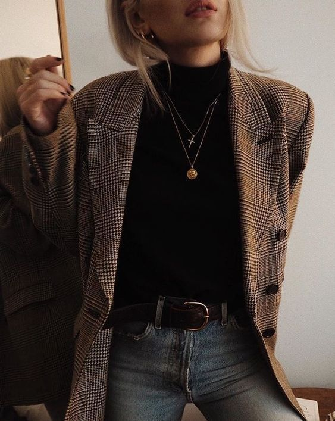

# 暗黑学院（Dark Academia）
> **状态**: reviewed | 最后更新: 2026-06-23 | 分类: 欧洲经典 | **趋势**: 🔥 流行趋势

## 📖 概述
- 发源年代: 2015年前后从 Tumblr 和 Pinterest 兴起，2020年疫情期间在 TikTok 爆发式增长（#darkacademia 标签超过 100 亿次播放）
- 发源地: 互联网（Tumblr → Pinterest → TikTok）——这是第一个纯粹由社交媒体孕育的女性穿搭风格
- 风格关键词（5-8个）: 哥特浪漫主义、古典学术崇拜、暗色调、呢料/羊毛/皮革、高领衬衫叠穿、牛津鞋/乐福鞋、忧郁学者气质
- 一句话定义（50字以内）: 像是从狄更斯小说或 Dead Poets Society 里走出来——黑棕灰调、高领毛衣+白衬衫叠穿、呢料西装+牛津鞋。不是在图书馆，就是刚从一个拉丁文讲座回来。

## 📜 历史文化
- **起源**: 2015年左右，Tumblr 上开始出现一种视觉风格：古老的图书馆、发黄的书页、大理石雕像、昏暗的烛光、年轻人穿着高领毛衣在读希腊悲剧。这不是一个品牌或一个设计师推出的——是一群匿名网友通过图片拼贴(moodboard)和文字叙事共同创作的。2020年疫情期间，「被困在家里、渴望知识、忧郁怀旧」的情绪让 Dark Academia 在 TikTok 爆发。
- **发展脉络**:
  - **2015-2017**: Tumblr——Dark Academia 的「创世纪」。匿名用户通过 reblogging 构建视觉谱系
  - **2018-2019**: Pinterest 接管——DA 从 Tumblr 的「文字+图片」转向 Pinterest 的「纯图片 moodboard」
  - **2020**: 疫情+ TikTok——#darkacademia 标签引爆。Donna Tartt 的《The Secret History》（1992年）销量暴增。年轻人被困在家，用暗黑学院风表达「我想回到校园」
  - **2021-2023**: DA 从亚文化进入主流——品牌（Margaret Howell/ Acne Studios/ A.P.C.）开始回应。批评声音也出现了：DA 过度浪漫化欧洲精英教育体系（古典学/拉丁文/贵族寄宿学校），有西方中心主义和阶级崇拜之嫌
  - **2024-2025**: DA 从「纯粹暗黑」走向「暗黑+日常」——更多人把 DA 元素（高领毛衣+牛津鞋）混搭到日常通勤中
- **文化意义**: Dark Academia 是第一个完全由社交媒体用户（而非设计师或品牌）创造的女性风格。它证明「风格可以不是从秀场到消费者，而是从 Tumblr 到 TikTok 到消费者，最后才到品牌」。同时，DA 对「古典学术」的浪漫化也引发了对西方教育体系阶级性的反思。

## 🎨 美学特征
- **廓形特点**: 宽松但不松垮。高领毛衣+白衬衫叠穿（领子露出）、呢料西装或长大衣为外层、直筒裤或长裙。层次数：至少 2 层（衬衫+毛衣），多则 4 层（衬衫+毛衣背心+西装+大衣）。
- **色板**:
  - 核心色：墨黑(#1A1A1A)、炭灰(#555555)、深棕(#3C2415)、深绿(#2D5A27)、酒红(#722F37)
  - 辅助色：奶油白(#FFF8F0)、燕麦色(#D4C5B9)——用于衬衫/领子，提亮暗色
  - 禁忌色：任何亮色、荧光色、粉彩色——DA 的色板是「阴天和旧图书馆」，不允许阳光
- **面料偏好**: 羊毛/粗花呢（西装/大衣）> 重磅棉（衬衫）> 羊绒（高领毛衣）> 灯芯绒（裤装）> 皮革（包/鞋）。面料要有「年代感」——旧化比崭新更好。
- **标志单品表**:

| 单品 | 品牌示例 | 选择要点 |
|------|---------|---------|
| 黑色高领毛衣 | Margaret Howell, COS, Uniqlo U | 纯色、合身或略宽松、羊毛或羊绒 |
| 白衬衫 | Margaret Howell, A.P.C., COS | 领子挺括（要露在高领毛衣外）、纯棉 |
| 针织背心 | Margaret Howell, J.Crew | V领（方便露衬衫领）、深色、菱形格或纯色 |
| 呢料西装/Blazer | Margaret Howell, Studio Nicholson | 不收腰、粗花呢或羊毛、深棕/炭灰/墨绿 |
| 羊毛长大衣 | Acne Studios, COS, AllSaints | 及膝或更长、深色、双排扣或单排扣 |
| 直筒羊毛裤 | Studio Nicholson, COS | 高腰、直筒或微锥、炭灰/墨黑 |
| 牛津鞋/德比鞋 | Dr. Martens, Church's, G.H. Bass | 黑色或深棕、皮质、厚底可接受 |
| 皮质书包/公文包 | Cambridge Satchel, Mulberry | 深色皮质、复古五金、可装一本厚书 |

## 🏷️ 代表品牌

### 核心品牌
| 品牌 | 国家 | 价位 | 一句话 |
|------|------|------|--------|
| Margaret Howell | 英国 | ¥¥¥ | 英伦知性×中性剪裁，学院风的暗黑版。高领毛衣+粗花呢西装=DA 制服 |
| Studio Nicholson | 英国 | ¥¥¥ | 英伦建筑感极简，结构感西装+阔腿裤。DA 女性的「正式版」|
| Acne Studios | 瑞典 | ¥¥¥ | 瑞典艺术×学院。围巾+廓形大衣是 DA 街头的标配 |
| A.P.C. | 法国 | ¥¥ | 法式基础款暗黑化——黑衬衫+黑裤+黑皮鞋 |
| AllSaints | 英国 | ¥¥ | 英伦暗黑+皮革。做旧感针织和皮夹克是 DA 的「酷」版本 |
| Ann Demeulemeester | 比利时 | ¥¥¥¥ | 安特卫普六君子之一，暗黑浪漫主义。DA 的终极高端 |
| Our Legacy | 瑞典 | ¥¥¥ | 瑞典解构学院——做旧感+中性色+层次。DA 的「未完成版」|

### 平价替代
| 品牌 | 价位 | 说明 |
|------|------|------|
| Uniqlo U | ¥ | 高领毛衣+白衬衫的基础款入口 |
| COS | ¥¥ | 建筑感暗黑学院×平价 |
| Muji | ¥ | 基础款高领毛衣+牛津衬衫 |
| AllSaints | ¥¥ | 英伦暗黑做旧感，DA入门 |
| Zara | ¥ | 季节性暗黑学院线 |

### 新兴品牌（2024-2026）
- DA 作为社交媒体驱动风格，没有特定的「暗黑学院品牌」。DA 穿者更倾向于从不同品牌中挑选符合色板和面料要求的单品，而非购买某个品牌的「DA 线」

## 👤 风格偶像 & 名人

### 关键推动者
| 人物 | 身份 | 贡献 |
|------|------|------|
| Donna Tartt | 作家 | 《The Secret History》（1992）是 DA 的文学圣经——一群古典学学生在精英学院里读书、喝酒、犯罪 |
| Dead Poets Society (1989) | 电影 | Robin Williams+寄宿学校+诗歌+秋天+「Carpe Diem」——DA 的视觉和情绪原型 |

### 穿着此风格的明星/博主
| 人物 | 身份 | 为什么是 icon |
|------|------|---------------|
| 无特定明星 | — | DA 是少数不以个人 icon 为核心、而是以「氛围和场景」为核心的风格。DA 的「icon」是古老图书馆、发黄书页和秋天的落叶，不是任何一个人 |
| Harry Potter 的 Severus Snape | 虚构角色 | 虽然不是女性穿搭，但 Snape 的黑色长袍+高领+阴郁气质是 DA 审美的先驱 |

## 👗 秀场 & 时装周
- DA 不是秀场风格——它从未被时装周体系接纳（也不追求被接纳）。但某些设计师的系列与 DA 美学高度共振：
  - **Margaret Howell FW2024** — 英伦学院暗黑化，粗花呢+羊毛+中性色
  - **Ann Demeulemeester SS2024** — 暗黑浪漫主义，飘动的黑色层次
  - **Yohji Yamamoto FW2023** — 黑色诗学，不对称剪裁+单色调

## 🔗 关联风格
- **父风格**: 英伦学院风 (British Prep) + 哥特亚文化 (Goth Subculture)
- **子风格**: 无——DA 本身还是一个年轻的、未充分分化的风格
- **平行风格**: 学院风 Preppy（共享学院根源，但阳光 vs 阴郁）、极简（共享单色调偏好）
- **对立风格**: 波西米亚——DA 的忧郁室内感 vs Boho 的开朗户外感。韩系少女——DA 的阴郁学术 vs K-pop 的阳光甜美
- **与姐妹风格差异**:
  1. vs 法式慵懒：DA 拥抱阴影/室内/忧郁，法式拥抱阳光/户外/自然。情绪完全相反
  2. vs 极简：DA 接受质地（粗花呢的颗粒感/皮革的皱纹），极简追求光滑无痕
  3. vs 学院风：DA=阴郁古典学系+暗色，学院风=阳光草坪派对+亮色（海军蓝/卡其/白）
  4. vs 波西米亚：DA 是「室内的忧郁学者」，Boho 是「户外的自由流浪者」。两套完全不同的叙事

## 📈 流行趋势
- **当前状态**: 从 TikTok 峰值回落，进入「稳定小众」阶段。2020-21年的爆发不可持续，但留下来的核心社区很扎实
- **流行区域**: 欧美 Tumblr/TikTok/Pinterest 用户 > 亚洲（中国/韩国通过社交媒体渗透）
- **发展方向**:
  - 2025-2026：DA 元素（高领毛衣+白衬衫叠穿、牛津鞋）被主流品牌吸收为常规产品，但「暗黑学院」作为风格标签可能淡化
  - 长期：DA 的核心——「对知识和忧郁的浪漫化」——是一部分人永远的需求。DA 不会消失，只会换名字

## 💡 穿搭建议
- **适合体型**: 直筒形（宽松廓形友好，0.92）、沙漏形（不收腰西装可显腰，0.85）、倒三角（长大衣和围巾软化肩线，0.88）
- **适合肤色**: 冷白皮（暗色调衬出苍白感——DA 追求的就是这个效果）。暖肤可适应深棕+深绿路线。不挑肤色——DA 是氛围大于肤色
- **适合场合**: 大学校园/图书馆/咖啡馆/秋季户外/雨天。不适合：海滩/阳光度假/夏日音乐节
- **入门建议**:
  1. 买一件黑色高领毛衣+一件白衬衫——这是 DA 的「Hello World」（白衬衫领子必须露出来）
  2. 暗色可以全身穿——全黑全灰全棕在 DA 里不是错误，是特征
  3. 面料比款式重要——粗花呢 > 化纤，真皮 > PU，羊毛 > 腈纶
  4. 配饰要有「学术感」——皮书包、古董眼镜、一本旧的 Penguin Classics
  5. 不是戏服——DA 推崇的是「学术气质」不是「万圣节哥特」。日常穿：高领毛衣+白衬衫领+直筒裤+牛津鞋就够

---
*本文基于多源研究整理，AI 辅助生成。*
