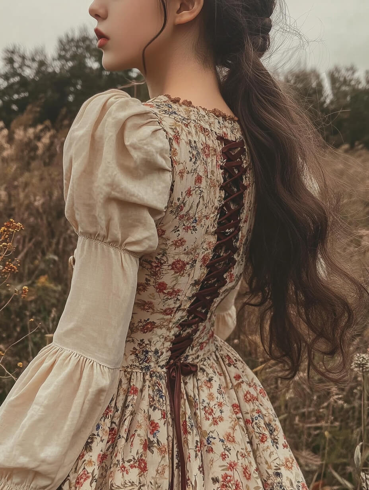

# 田园牧歌（Cottagecore）
> **状态**: reviewed | 最后更新: 2026-06-23 | 分类: 浪漫少女 | **趋势**: 🔥 流行趋势

## 📖 概述
- 发源年代: 2020年疫情期间（TikTok 爆发），美学根源可追溯至 19 世纪浪漫主义对田园的向往
- 发源地: 互联网（TikTok / Tumblr / Instagram），无单一地理中心
- 风格关键词（5-8个）: 田园浪漫、碎花长裙、泡泡袖、钩针编织、莓果采摘、慢生活、手工面包、野花草地
- 一句话定义: 对田园生活的浪漫化想象——穿着碎花连衣裙在野花地里奔跑，回家烤一条手工面包。是对城市快节奏的温柔反叛。

## 📜 历史文化
- **起源**: 2020年 COVID-19 封锁期间，被困城市的年轻人开始在 TikTok 上分享田园逃离幻想。标签 #Cottagecore 在 2020年3-4月爆发式增长（TikTok 播放量超 150 亿）。但美学根源深远——19 世纪浪漫主义对田园的理想化（华兹华斯的诗歌）、1970年代的「回归土地」运动、以及日本「森系」美学都是其精神祖先。
- **发展脉络**:
  - **2017-2018**: Tumblr 上出现田园美学 moodboard，以草莓、野花、手工陶器为核心意象
  - **2019**: 渐成小众互联网亚文化，与「VSCO girl」和「soft girl」平行发展
  - **2020**: 疫情封锁成为引爆点——人们被困家中，田园幻想暴涨。Taylor Swift《folklore》专辑视觉完全同步
  - **2022-2024**: 从线上走向线下——野餐文化、农场 Airbnb、莓果采摘成为城市中产的周末仪式
  - **2025-2026**: 与「quiet luxury」和「slow living」运动融合，变得更加精致化
- **文化意义**: 是对城市异化的浪漫反叛。Cottagecore 不只是一场穿衣运动，而是一种「逃离现代性」的诗意宣言——它告诉你：你可以扔掉手机，搬到乡下，种草莓，穿碎花裙子。

## 🎨 美学特征
- **廓形特点**: 宽松飘逸为主——A字连衣裙、泡泡袖、高腰长半裙。关键：绝不紧身。廓形来自 19 世纪乡村裙装的现代化改良。层叠感：吊带裙外搭钩针开衫。
- **色板**:
  - 主色调：奶油白(#FFFDD0)、鼠尾草绿(#9CAF88)、干玫瑰粉(#C9A6A0)、大地棕(#A0855B)
  - 辅助色：淡黄、天蓝、薰衣草紫
  - 禁忌色：霓虹色、荧光色、黑色（大面积）、金属感
  - 色板逻辑：从自然提取——花园、草甸、田野、浆果的颜色
- **面料偏好**: 棉麻 > 钩针编织 > 蕾丝 > 亚麻 > 薄纱。天然面料绝对优先。手工质感（钩针、刺绣）是灵魂元素。
- **标志单品表**:

| 单品 | 品牌示例 | 选择要点 |
|------|---------|---------|
| 碎花中长连衣裙 | Doen, Christy Dawn, Batsheva | A字或帝国腰、小碎花优于大花、长度过膝 |
| 泡泡袖 blouse | Doen, LoveShackFancy, Sézane | 棉或亚麻、蓬松袖、可系蝴蝶结领口 |
| 钩针开衫/马甲 | 手工品牌、Etsy | 手工感、自然色、可当外套也可单穿 |
| 高腰半身长裙 | Son de Flor, Little Women Atelier | 及踝长度、褶皱或伞摆、亚麻或棉 |
| 围裙连衣裙 (Pinafore) | Christy Dawn, Etsy | 可叠穿在blouse外、亚麻、大地色 |
| 草编包/竹篮包 | Dragon Diffusion, Etsy | 手工编织、可装野餐食物 |
| 玛丽珍平底鞋 | Carel, Chanel, Margaux | 圆头、低跟或平底、可赤脚穿 |

## 🏷️ 代表品牌
### 核心品牌
| 品牌 | 国家 | 价位 | 一句话 |
|------|------|------|--------|
| Doen | 美国 | ¥¥¥ | 2016年创立于加州，Cottagecore 的时尚化标杆——碎花连衣裙+泡泡袖的终极目的地 |
| Christy Dawn | 美国 | ¥¥¥ | 洛杉矶品牌，用 vintage 面料（deadstock）制作田园连衣裙，可持续时尚先驱 |
| Batsheva | 美国 | ¥¥¥ | 纽约设计师 Batsheva Hay，将维多利亚田园裙装现代化，高领+长袖+碎花是其签名 |
| LoveShackFancy | 美国 | ¥¥¥ | 2013年创立，复古蕾丝+碎花+荷叶边的极致浪漫，介于 Cottagecore 与 Coquette 之间 |
| Son de Flor | 立陶宛 | ¥¥ | 亚麻田园裙装专家，经典 A 字廓形+天然亚麻，东欧手工制作 |
| Sézane | 法国 | ¥¥ | 法式品牌中的田园分支——碎花裹身裙+钩针开衫完美适配 Cottagecore |

### 平价替代
| 品牌 | 价位 | 说明 |
|------|------|------|
| Uniqlo（U系列/Ines联名） | ¥ | Ines de la Fressange 联名线常出法式田园碎花单品 |
| H&M（Premium Selection） | ¥ | 亚麻混纺连衣裙是入门之选 |
| Zara（Join Life） | ¥ | 每季都有田园风胶囊系列 |
| Etsy 手工店 | ¥-¥¥ | 真正的手工钩针、刺绣亚麻裙，独一无二 |

### 新兴品牌（2024-2026）
- **Little Women Atelier**: 纽约独立品牌，灵感直接来自《小妇人》，手工制作亚麻田园裙
- **Maison Mirabelle**: 法国田园新秀，南法薰衣草田美学

## 👤 风格偶像 & 名人
| 人物 | 身份 | 贡献 |
|------|------|------|
| Taylor Swift | 歌手 | 2020年《folklore》《evermore》专辑视觉完全定义了现代 Cottagecore——碎花裙+羊毛开衫+森林+木屋 |
| Florence Welch | 歌手 | Florence + the Machine 主唱，自2009年起就是田园浪漫的摇滚版代言人 |
| Beatrix Potter | 作家/插画家 | 彼得兔的作者，她的湖区生活（养羊、种花、穿粗花呢裙）是 Cottagecore 的维多利亚原型 |
| Sara Tasker | 博主/作家 | Instagram (@me_and_orla) 的田园美学先驱，著有《Hashtag Authentic》|

### 穿着此风格的明星/博主
| 人物 | 身份 | 为什么是 icon |
|------|------|---------------|
| Ellie Jean Royden | 博主 | 专门提供 Cottagecore 穿搭内容的时尚博主 |
| Emma Watson | 演员 | 多次以田园碎花裙+草编包造型出街，可持续时尚倡导者 |
| Dakota Johnson | 演员 | 街头造型中的田园元素（碎花裙+平底鞋+草编包）低调但精准 |

## 🔗 关联风格
- **父风格**: 浪漫女性化 (Romantic Feminine)
- **子风格**: 暗黑田园 (Dark Cottagecore)、仙女田园 (Fairycore)、祖母田园 (Grandmacore)
- **平行风格**: 日系森系（WF-03）——共享自然材质、宽松廓形、手工质感
- **对立风格**: Y2K 千禧复古（WF-10）——Cottagecore 追求慢和自然，Y2K 追求快和科技感
- **与姐妹风格差异**:
  1. vs 芭蕾风：Cottagecore 是「乡下花园」，Balletcore 是「城市排练厅」
  2. vs 软妹风：Cottagecore 有历史深度（维多利亚根源），Soft Girl 更扁平/卡通化
  3. vs 田园草地：Cottagecore 强调手工/劳动/制作，Meadowcore 强调野生/自然/躺平

## 📈 流行趋势
- **当前状态**: 成熟稳定期——已从 TikTok 爆发期进入生活方式常态化阶段
- **流行区域**: 北美 > 英国 > 澳大利亚 > 北欧。东亚的「森系」是其平行版本
- **发展方向**:
  - 2025-2026：从「逃离城市」幻想进入「城市田园」实际——阳台种菜、社区花园、手工烘焙成为真实生活方式
  - 面料升级：从快时尚碎花→手工亚麻/有机棉/植物染色

## 💡 穿搭建议
- **适合体型**: 所有体型友好——A字裙遮盖臀腿，高腰设计显腿长，泡泡袖平衡窄肩
- **适合肤色**: 暖肤色穿大地色系（奶油/鼠尾草绿/棕），冷肤色穿冷调碎花（薰衣草紫/天蓝）
- **适合场合**: 周末出游、野餐、度假、农场市集。不适合：办公室（太随意）、正式晚宴（太质朴）
- **入门建议**:
  1. 先从一条碎花中长连衣裙开始——Doen 或 Christy Dawn 的投资款
  2. 加一件钩针开衫——可当外套也可单穿
  3. 配一只草编包——天然材质是关键
  4. 配饰简单——几朵真花插在头发上比任何珠宝都更 Cottagecore
  5. 最重要的是态度——你真的去摘草莓了，不是摆拍

---
*本文基于多源研究整理，AI 辅助生成。*
