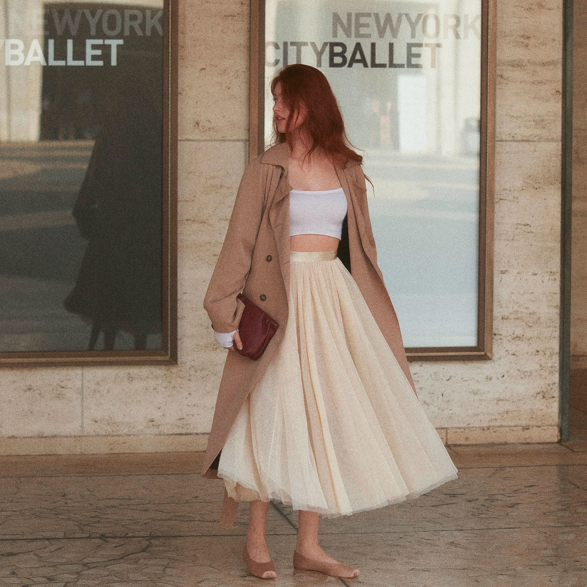

# 芭蕾风（Balletcore）
> **状态**: reviewed | 最后更新: 2026-06-23 | 分类: 浪漫少女 | **趋势**: 🔥 流行趋势

## 📖 概述
- 发源年代: 2022年 TikTok 爆发，但芭蕾美学在时尚界存在已久（1930s 芭蕾舞鞋进入日常穿搭）
- 发源地: 互联网（TikTok / Pinterest），核心品牌 Repetto 源自法国巴黎
- 风格关键词（5-8个）: 裹身针织衫、芭蕾平底鞋、缎面蝴蝶结、袜套（leg warmers）、纱裙、把杆、排练厅
- 一句话定义: 把芭蕾排练厅的穿搭搬到街头——裹身针织衫+纱裙+芭蕾平底鞋，是舞者的优雅与少女的柔软的结合。

## 📜 历史文化
- **起源**: 芭蕾与时尚的交叉由来已久。1930年代，法国芭蕾舞者开始将 Repetto 的练功鞋穿出排练厅；1947年 Rose Repetto 为儿子（芭蕾舞者 Roland Petit）制作了第一双 Repetto 芭蕾平底鞋；1956年 Brigitte Bardot 在《上帝创造女人》中穿着 Repetto 红色芭蕾鞋，将芭蕾鞋推入大众时尚。2022年，TikTok 将「排练厅穿搭」重新打包为 #Balletcore，标签播放量超 30 亿。
- **发展脉络**:
  - **1930-1950s**: Repetto 的创立 + Brigitte Bardot 将芭蕾鞋带入电影和街头
  - **1990s-2000s**: Miu Miu、Chanel 将芭蕾元素（缎面、纱裙、裹身上衣）引入秀场
  - **2010s**: Mary Jane 芭蕾平底鞋复兴，Chanel 双色芭蕾鞋成为经典
  - **2022**: TikTok #Balletcore 爆发——袜套+芭蕾平底鞋+裹身上衣成为公式
  - **2023-2024**: Miu Miu 2022 FW 芭蕾平底鞋+缎面口袋短裤引爆高级时尚界
  - **2025-2026**: 芭蕾风精致化——丝绸、羊绒等高级面料替代快时尚平价替代品
- **文化意义**: 是对「少女时代」（girlhood）的礼赞——柔软、优雅、有纪律但也脆弱。Balletcore 不追求性感（vs 辣妹风），而追求一种精致的脆弱感。

## 🎨 美学特征
- **廓形特点**: 上紧下松或上下贴身——裹身针织衫勾勒上身线条，纱裙或直筒裤在下。多层叠穿：连体衣 → 裹身衫 → 纱裙 → 袜套。核心是舞蹈训练服的「练功感」。
- **色板**:
  - 主色调：芭蕾粉(#F4C2C2)、奶油白(#FFFDD0)、黑色(#000000)、裸色(#E8D5C4)
  - 辅助色：浅灰、淡蓝、勃艮第红
  - 禁忌色：霓虹色、橙色、荧光色
  - 色板逻辑：芭蕾排练厅的颜色——粉色缎面、黑色练功服、裸色芭蕾鞋
- **面料偏好**: 缎面 > 薄纱 > 针织 > 真丝 > 羊绒。必须柔软、飘逸、垂坠。缎面是灵魂。
- **标志单品表**:

| 单品 | 品牌示例 | 选择要点 |
|------|---------|---------|
| 芭蕾平底鞋 | Repetto, Chanel, Miu Miu, Margaux | 圆头、极浅口、可加蝴蝶结或搭扣。Repetto 是原版 |
| 裹身针织衫 | Miu Miu, Paloma Wool, Ganni | V领或船领、合身但不紧、可系带 |
| 纱裙 (Tulle Skirt) | Molly Goddard, Simone Rocha | 中长款、多层面纱、黑色或粉色 |
| 袜套 (Leg Warmers) | Repetto, Free People | 针织、及膝或过膝、白色/奶油/粉色 |
| 缎面蝴蝶结发饰 | Sandy Liang, Jennifer Behr | 可系在发髻或马尾上 |
| 连体衣/紧身衣 | Wolford, Yumiko | 作为打底层、包裹身体线条 |

## 🏷️ 代表品牌
### 核心品牌
| 品牌 | 国家 | 价位 | 一句话 |
|------|------|------|--------|
| Repetto | 法国 | ¥¥ | 1947年创立于巴黎，芭蕾平底鞋的发明者。全球每卖出一双「芭蕾鞋」，就有一双在致敬 Repetto |
| Miu Miu | 意大利 | ¥¥¥¥ | Prada 姐妹牌，2022 FW 系列定义了现代 Balletcore |
| Simone Rocha | 爱尔兰/英国 | ¥¥¥¥ | 薄纱+珍珠+缎面的暗黑浪漫，Balletcore 的艺术化高端版本 |
| Sandy Liang | 美国 | ¥¥¥ | 华裔设计师，缎面蝴蝶结发饰和芭蕾少女美学的纽约代言人 |
| Molly Goddard | 英国 | ¥¥¥ | 伦敦设计师，以巨型纱裙闻名——Balletcore 的「夸张版」|

### 平价替代
| 品牌 | 价位 | 说明 |
|------|------|------|
| Uniqlo | ¥ | 针织裹身上衣+平底鞋有芭蕾感基础款 |
| Zara | ¥ | 每季都出芭蕾平底鞋和缎面单品 |
| & Other Stories | ¥¥ | 北欧设计+芭蕾柔美元素的优雅平衡 |
| Paloma Wool | ¥¥ | 巴塞罗那品牌，针织裹身上衣的平价好选择 |

### 新兴品牌（2024-2026）
- **Margaux**: 纽约 DTC 芭蕾鞋品牌，以舒适度和意大利手工制作著称
- **Yumiko**: 纽约舞蹈服品牌，芭蕾舞者真正的练功服，被时尚博主发现并穿上街头

## 👤 风格偶像 & 名人
| 人物 | 身份 | 贡献 |
|------|------|------|
| Brigitte Bardot | 演员 | 1956年穿着红色 Repetto 芭蕾鞋在电影中出现，将芭蕾鞋从排练厅带入大众文化 |
| Audrey Hepburn | 演员 | 紧身裤+芭蕾平底鞋的搭配是 1950s 的 Balletcore 原型 |
| Natalie Portman | 演员 | 《黑天鹅》(2010) 将芭蕾美学推向全球大众——Rodarte 为该片设计的服装影响了一代设计师 |

### 穿着此风格的明星/博主
| 人物 | 身份 | 为什么是 icon |
|------|------|---------------|
| Camille Charrière | 博主 | 法式×Balletcore 混搭——芭蕾鞋配牛仔裤而非纱裙 |
| Alexa Chung | 博主/设计师 | 2010s 的 Balletcore 先驱——芭蕾鞋+牛仔短裤+针织衫 |
| Sydney Sweeney | 演员 | 多次以 Miu Miu 芭蕾平底鞋+缎面造型出街 |

## 🔗 关联风格
- **父风格**: 浪漫女性化 (Romantic Feminine)
- **子风格**: 暗黑芭蕾 (Dark Balletcore)、运动芭蕾 (Athletic Balletcore)
- **平行风格**: 甜媚少女（WF-15）——共享缎面和粉色元素，但 Coquette 更「挑逗」，Balletcore 更「训练中的自律」
- **对立风格**: 女性街头（WF-28）——Balletcore 柔软精致，街头风硬朗随性
- **与姐妹风格差异**:
  1. vs 甜媚少女：Balletcore 的核心是「练功/纪律/优雅」，Coquette 的核心是「取悦/诱惑/甜美」
  2. vs 运动休闲（WF-08）：Balletcore 穿的是排练厅的运动服，Athleisure 穿的是健身房的运动服
  3. vs 软妹风（WF-16）：Balletcore 有「训练的辛苦」，Soft Girl 只有「可爱」

## 📈 流行趋势
- **当前状态**: 高峰期——Miu Miu 2022-2024 的持续推动使 Balletcore 成为高级时尚和大众快时尚的双重热点
- **流行区域**: 全球（TikTok 驱动，无地域限制）
- **发展方向**:
  - 2025-2026：从「全套芭蕾」转向「芭蕾元素点缀」——一条缎面发带+白衬衫+牛仔裤即可
  - 精品化：快时尚纱裙退潮，真丝缎面、羊绒针织等品质面料成为新标准

## 💡 穿搭建议
- **适合体型**: 所有体型——裹身上衣显腰线，纱裙遮盖臀胯，芭蕾鞋不挑脚型
- **适合肤色**: 粉色系对白皮最友好；黑皮可选黑色练功服+白色纱裙的高对比公式
- **适合场合**: 约会（缎面裙+芭蕾鞋）、逛街（裹身上衣+直筒裤+芭蕾鞋）、下午茶（纱裙+针织衫）
- **入门建议**:
  1. 从一双芭蕾平底鞋开始——Repetto（投资款）或 Margaux（平价）
  2. 加一件裹身针织衫——奶油白或芭蕾粉色
  3. 一条缎面发带——最简单的 Balletcore 入门，比买一条纱裙更实用
  4. 不必穿全套——芭蕾鞋+牛仔裤+白T恤已经很有「下课后的舞者」感

---
*本文基于多源研究整理，AI 辅助生成。*
