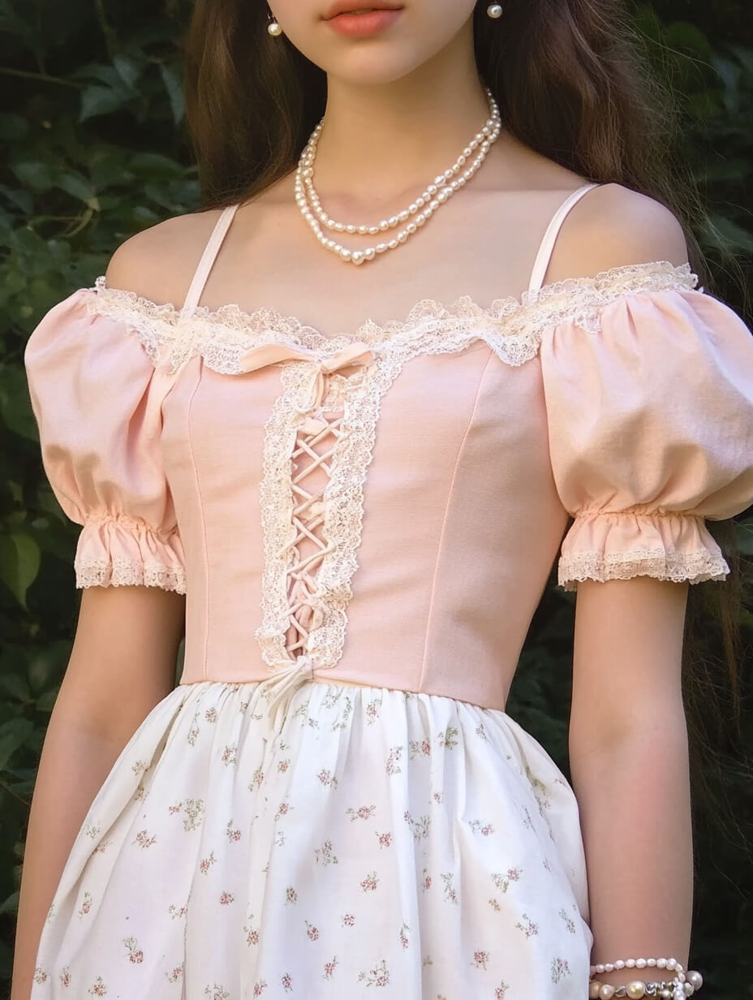

# 甜媚少女（Coquette）
> **状态**: reviewed | 最后更新: 2026-06-23 | 分类: 浪漫少女 | **趋势**: 🔥 流行趋势

## 📖 概述
- 发源年代: 2021-2022年 TikTok 爆发，但「coquette」一词源自法语（意为「会调情的女人」），美学根源在18世纪洛可可和维多利亚时代
- 发源地: 互联网（TikTok / Tumblr），与日本 Lolita 时尚有精神渊源
- 风格关键词（5-8个）: 缎面蝴蝶结、蕾丝领口、珍珠项链、粉色腮红、白色丝袜、爱心首饰、洛可可卷发
- 一句话定义: 像18世纪法国宫廷的调情少女穿越到现代——蝴蝶结+蕾丝+珍珠，甜美到极致但又带着知道自己在做什么的狡黠。

## 📜 历史文化
- **起源**: 「Coquette」最早是法语词，指会调情、懂得用魅力操控局面的女性。文学中的 coquette 原型——简·奥斯汀小说中的 Lydia Bennet、18世纪法国沙龙中的交际花——都是知道如何用甜美做武器的人。TikTok 在2021-2022重新发现这个词，将它与现代「hyperfeminine」美学结合。#Coquette 标签播放量超 100亿。
- **发展脉络**:
  - **18世纪**: 洛可可时期的法国宫廷女性（蓬帕杜夫人），以蝴蝶结、蕾丝、粉彩为视觉语言
  - **1990s-2000s**: Lolita 时尚在日本兴起（特别是 hime lolita），是 Coquette 的亚洲先驱
  - **2010s**: Tumblr 上的「pastel aesthetic」为 Coquette 铺路
  - **2021-2022**: TikTok #Coquette 爆发——蝴蝶结发饰+蕾丝上衣+珍珠项链成为公式
  - **2023-2024**: Lana Del Rey 的音乐美学成为 Coquette 的精神原声带；蝴蝶结成为年度最热门发饰
  - **2025-2026**: 从快时尚蕾丝转向上等棉质蕾丝和真丝缎面
- **文化意义**: Coquette 是关于女性气质作为一种「主动选择」而非「被动接受」的声明。它说：我可以甜美、柔软、粉色——但这不意味着我弱。Coquette 女性知道自己在利用甜美作为社交货币。

## 🎨 美学特征
- **廓形特点**: 上身合身——蕾丝或缎面上衣强调胸线和腰线。下装A字短裙或高腰直筒裤。关键比例：上紧下蓬。蕾丝领口（Peter Pan collar）是灵魂元素。
- **色板**:
  - 主色调：芭蕾粉(#F4C2C2)、象牙白(#FFFFF0)、红色(#C41E3A)、淡紫(#D8BFD8)
  - 辅助色：奶油黄、婴儿蓝、香槟色
  - 禁忌色：黑色（大面积）、灰色、橄榄绿——任何「严肃」的颜色都不 Coquette
  - 色板逻辑：甜点店的颜色——马卡龙、棉花糖、草莓奶昔
- **面料偏好**: 蕾丝 > 缎面 > 薄纱 > 真丝 > 细针织。面料要有「精致感」。蕾丝是灵魂。
- **标志单品表**:

| 单品 | 品牌示例 | 选择要点 |
|------|---------|---------|
| 蕾丝领口 blouse | LoveShackFancy, Self-Portrait, For Love & Lemons | 彼得潘领或维多利亚高领、蕾丝或刺绣、白色或奶油色 |
| 缎面蝴蝶结发饰 | Sandy Liang, Jennifer Behr, Emi Jay | 可夹在头发上也可系在颈部 |
| 珍珠项链/耳环 | Vivienne Westwood, Chanel | 单链或多层、可混搭爱心吊坠 |
| A字迷你裙 | Sandy Liang, Miu Miu, Realisation Par | 高腰、纯色（粉/白/红）或小碎花 |
| 玛丽珍高跟鞋 | Carel, Chanel, Miu Miu | 粗跟或细跟、搭扣设计、红色或裸色 |
| 白色丝袜/及膝袜 | Calzedonia, Falke | 透明或半透明、可带小花边 |

## 🏷️ 代表品牌
### 核心品牌
| 品牌 | 国家 | 价位 | 一句话 |
|------|------|------|--------|
| Sandy Liang | 美国 | ¥¥¥ | 华裔纽约设计师，蝴蝶结发饰和 Coquette 少女美学的 TikTok 时代定义者 |
| LoveShackFancy | 美国 | ¥¥¥ | 复古蕾丝+碎花+蝴蝶结的纽约浪漫品牌，Coquette 的「衣橱供应商」|
| Self-Portrait | 英国 | ¥¥¥ | 马来西亚设计师 Han Chong 创立，蕾丝连衣裙的现代优雅版 |
| Simone Rocha | 爱尔兰/英国 | ¥¥¥¥ | 珍珠+薄纱+缎面的暗黑浪漫，Coquette 的「艺术馆版本」|
| For Love & Lemons | 美国 | ¥¥ | 洛杉矶品牌，蕾丝和薄纱为主，Coquette 的「平价性感版」|
| Miu Miu | 意大利 | ¥¥¥¥ | 虽然不是专门的 Coquette 品牌，但每季都有蝴蝶结+珍珠+短裙单品 |

### 平价替代
| 品牌 | 价位 | 说明 |
|------|------|------|
| H&M | ¥ | 蝴蝶结发饰和蕾丝上衣的入门之选 |
| Zara | ¥ | 珍珠饰品和缎面上衣的季节性供应 |
| & Other Stories | ¥¥ | 法式优雅混搭 Coquette 元素 |
| Emi Jay | ¥ | 洛杉矶发饰品牌，蝴蝶结夹子是 TikTok 爆款 |

## 👤 风格偶像 & 名人
| 人物 | 身份 | 贡献 |
|------|------|------|
| Lana Del Rey | 歌手 | Coquette 的精神女王——歌词中的「sad girl」+视觉上的蝴蝶结+珍珠项链 |
| 蓬帕杜夫人 | 历史人物 | 路易十五的情妇，18世纪洛可可时尚的原型——蝴蝶结、粉彩、羽毛装饰 |
| Marie Antoinette | 历史人物 | Sofia Coppola 2006年电影将她塑造为 Coquette 的终极视觉参考 |

### 穿着此风格的明星/博主
| 人物 | 身份 | 为什么是 icon |
|------|------|---------------|
| Lily-Rose Depp | 演员/模特 | Chanel 代言人，蝴蝶结+珍珠+碎花的现代 Coquette 代言 |
| Alexa Demie | 演员 | 《亢奋》中的 Maddy Perez 是 Coquette 的「暗黑版」|
| Emma Chamberlain | 博主 | 蝴蝶结发饰+复古连衣裙造型频繁出现 |

## 🔗 关联风格
- **父风格**: 浪漫女性化 (Romantic Feminine)
- **子风格**: 暗黑甜媚 (Dark Coquette)、学院甜媚 (Academia Coquette)
- **平行风格**: 芭蕾风（WF-14）——共享缎面和粉色，但 Coquette 更「知道自己在做什么」
- **对立风格**: 极简（WF-06）——Coquette 追求装饰到极致，极简追求零装饰
- **与姐妹风格差异**:
  1. vs 软妹风（WF-16）：Coquette 有「调情」的主动性，Soft Girl 只有「可爱」的被动性
  2. vs 芭蕾风（WF-14）：Coquette 是「舞会后的调情」，Balletcore 是「排练厅的训练」
  3. vs 田园牧歌（WF-13）：Coquette 在巴黎沙龙，Cottagecore 在乡下花园

## 📈 流行趋势
- **当前状态**: 高峰期——蝴蝶结发饰已成为 2023-2024 最大的「一根发饰改变全身」潮流
- **流行区域**: 北美 > 英国 > 东亚（日本/韩国）。中国的「纯欲风」是其平行表达
- **发展方向**:
  - 2025-2026：从「全糖」转向「半糖」——蝴蝶结+西装外套、蕾丝上衣+阔腿牛仔裤的成熟混搭
  - 精致化：从快时尚聚酯蕾丝→法国手工蕾丝（Calais lace）等品质面料

## 💡 穿搭建议
- **适合体型**: 沙漏形（蕾丝上衣+高腰A字裙=经典公式，0.95）、梨形（A字裙遮盖臀胯，0.90）
- **适合肤色**: 冷白皮穿粉色最佳；暖皮可选象牙白+红色点缀
- **适合场合**: 约会（满分场合）、下午茶、生日派对、情人节。不适合：办公室（太甜）、面试（不够严肃）
- **入门建议**:
  1. 从一条缎面蝴蝶结发带开始——最低成本的 Coquette 入场券
  2. 加一件蕾丝领口白衬衫——搭配任何下装都能立刻甜起来
  3. 一串珍珠项链（真的或假的都行）——单链戴在锁骨位置
  4. 不必全套——白T恤+牛仔裤+蝴蝶结发饰+珍珠项链=日常 Coquette

---
*本文基于多源研究整理，AI 辅助生成。*
