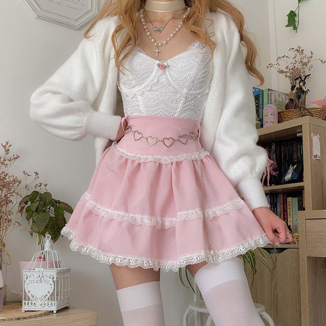

# 软妹风（Soft Girl）
> **状态**: reviewed | 最后更新: 2026-06-23 | 分类: 浪漫少女 | **趋势**: 🔥 流行趋势

## 📖 概述
- 发源年代: 2019年 TikTok 爆发，脱胎于 2018-2019 的 VSCO Girl 和 E-Girl 美学
- 发源地: 互联网（TikTok），无单一地理中心
- 风格关键词（5-8个）: 粉彩/马卡龙色、百褶裙、紧身针织衫、小巧金色首饰、玛丽珍鞋、腮红妆、厚底鞋
- 一句话定义: 被加了粉色滤镜的世界——粉彩百褶裙+紧身针织衫+厚底玛丽珍，像动漫少女走进了现实。

## 📜 历史文化
- **起源**: Soft Girl 是 2010s 末期互联网审美链条上的关键一环。它继承了 VSCO Girl（2018-2019）的马卡龙配色和环保意识，吸收了 E-Girl（2019-2020）的厚底鞋和刘海造型，但比前两者更「软」——去掉 VSCO 的户外感，去掉 E-Girl 的暗黑元素，只剩下纯粹的软萌。TikTok #SoftGirl 标签播放量超 200 亿。
- **发展脉络**:
  - **2018-2019**: VSCO Girl 以 Hydro Flask 水瓶+马卡龙T恤+贝壳项圈定义了「软」的基础配色
  - **2019-2020**: TikTok #SoftGirl 爆发——厚底玛丽珍鞋+及膝白袜+百褶裙成为核心公式
  - **2021**: 与「好女孩美学」（That Girl）短暂交汇——早起routine+绿色果汁+软萌穿搭
  - **2022-2024**: 被 Balletcore 和 Coquette 吸收融合，纯 Soft Girl 声量下降但元素渗透到其他风格
  - **2025-2026**: Soft Girl 2.0——与「香草女孩」（WF-47）融合，面料升级，更接近「柔软的日常穿着」
- **文化意义**: Soft Girl 是 Z 世代对「过度性感」的反叛——在一个 Kardashian 式夸张曲线的时代，Soft Girl 选择了「可爱」而非「性感」。它是 「girlhood」作为一种审美主权的宣言。

## 🎨 美学特征
- **廓形特点**: 上紧下松——紧身针织衫或 crop top 勾勒上身，高腰百褶短裙制造A字。关键比例：「短上衣+高腰下装」的露腰公式。廓形比日系森系更「收」，比美式休闲更「少女」。
- **色板**:
  - 主色调：薰衣草紫(#C3B1E1)、婴儿蓝(#B5D3E7)、草莓粉(#F8C8D8)、奶油黄(#FFF5C0)
  - 辅助色：白色、浅紫、薄荷绿
  - 禁忌色：黑色、深蓝、暗红、大地色——任何重色都不 Soft
  - 色板逻辑：马卡龙盒子里的所有颜色 + 加了柔光滤镜
- **面料偏好**: 细针织 > 灯芯绒 > 棉 > 薄纱。面料要柔软、亲肤、有「可拥抱感」。厚底鞋可以用皮质。
- **标志单品表**:

| 单品 | 品牌示例 | 选择要点 |
|------|---------|---------|
| 紧身针织衫/Crop Top | Brandy Melville, Uniqlo, Paloma Wool | 短款或可塞进高腰裙、粉彩色系 |
| 百褶短裙 | Brandy Melville, American Apparel | 高腰、长度在膝盖以上、网球裙款式 |
| 厚底玛丽珍鞋 | Dr. Martens, UNIF, T.U.K. | 厚底（platform）、搭扣、可配白色短袜 |
| 及膝白袜/蕾丝袜 | Calzedonia, Falke | 半透明或不透明、白色或奶油色 |
| 小巧金色首饰 | Mejuri, Missoma | 细链、小吊坠、戒指叠戴 |
| 刘海+高马尾 | — | 发型是 Soft Girl 的灵魂——齐刘海或空气刘海+高马尾/丸子头 |

## 🏷️ 代表品牌
### 核心品牌
| 品牌 | 国家 | 价位 | 一句话 |
|------|------|------|--------|
| Brandy Melville | 意大利 | ¥ | Soft Girl 的「制服供应商」——百褶裙+紧身针织衫+厚底鞋的完整公式 |
| UNIF | 美国 | ¥¥ | 洛杉矶品牌，厚底鞋和粉彩单品的 Soft Girl 标配 |
| Paloma Wool | 西班牙 | ¥¥ | 巴塞罗那品牌，针织衫的 Soft Girl 升级版（面料更好、更成熟）|
| Ganni | 丹麦 | ¥¥¥ | 北欧 Soft Girl——更廓形、更环保、更适合已经毕业但不想长大的人 |
| Sandy Liang | 美国 | ¥¥¥ | 蝴蝶结+粉彩+少女感的纽约高端版，Soft Girl 的「长大后」|

### 平价替代
| 品牌 | 价位 | 说明 |
|------|------|------|
| Uniqlo | ¥ | 基础针织衫和粉彩色T恤的入门首选 |
| H&M（Divided） | ¥ | 年轻线直接对标 Soft Girl 审美 |
| Brandy Melville | ¥ | 本身就是最便宜的 Soft Girl 核心品牌 |
| YesStyle | ¥ | 东亚 Soft Girl（日韩软妹风）的海淘聚集地 |

## 👤 风格偶像 & 名人
| 人物 | 身份 | 贡献 |
|------|------|------|
| Ariana Grande | 歌手 | 高马尾+厚底鞋+超短裙的公式定义了 2010s 末的 Soft Girl 性感版 |
| Charli D'Amelio | TikToker | TikTok 时代最有影响力的 Soft Girl 代言人——厚底鞋+宽松牛仔裤+紧身上衣 |
| Elle Fanning | 演员 | 红毯和日常中的粉彩公主，Soft Girl 的「好莱坞优雅版」|

## 🔗 关联风格
- **父风格**: 浪漫女性化 (Romantic Feminine)
- **子风格**: 粉彩软妹 (Pastel Soft Girl)、学院软妹 (Preppy Soft Girl)
- **平行风格**: 甜媚少女（WF-15）——Soft Girl 更「被动可爱」，Coquette 更「主动调情」
- **对立风格**: 暗黑女性力（WF-31）——Soft Girl 是柔光粉色，Dark Feminine 是暗黑酒红
- **与姐妹风格差异**:
  1. vs 甜媚少女：Soft Girl 穿去上课，Coquette 穿去调情——目的不同
  2. vs 田园牧歌（WF-13）：Soft Girl 在 TikTok 滤镜里，Cottagecore 在乡下花园里
  3. vs 韩系少女（WF-02）：Soft Girl 是欧美版的「韩系少女」，但廓形更紧更露腰

## 📈 流行趋势
- **当前状态**: 后高峰洗牌期——纯 Soft Girl 声量下降，但粉彩配色+百褶裙+厚底鞋已渗透进主流年轻女性穿搭
- **流行区域**: 全球（TikTok 驱动），北美和西欧为主
- **发展方向**:
  - 2025-2026：Soft Girl 2.0 面料升级——从聚酯百褶裙到羊毛/棉质百褶裙
  - 融入「成人 Soft Girl」——Soft Girl 配色+成熟廓形=可以穿去上班的 Soft Girl

## 💡 穿搭建议
- **适合体型**: 直筒形（短上衣+高腰裙制造曲线，0.85）、梨形（A字裙遮盖臀胯，0.85）。不适合：沙漏形（太贴合可能过于性感，偏离「软」的初衷）
- **适合肤色**: 暖皮穿奶油黄/草莓粉；冷皮穿薰衣草紫/婴儿蓝
- **适合场合**: 上学、逛街、周末 brunch、音乐节。不适合：正式办公室、商务会议
- **入门建议**:
  1. 从一条百褶短裙开始——网球裙款式最百搭，黑色/灰色/粉彩都可以
  2. 加一件紧身短款针织衫——或把宽松T恤塞进高腰裙
  3. 一双厚底玛丽珍鞋——Dr. Martens 或 UNIF
  4. 发型是免费配饰——空气刘海+高马尾

---
*本文基于多源研究整理，AI 辅助生成。*
