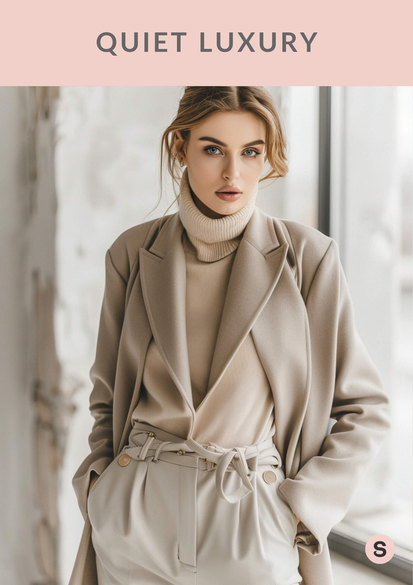

# 静奢风（Quiet Luxury）
> **状态**: reviewed | 最后更新: 2026-06-23 | 分类: 奢华极简 | **趋势**: 🔥 流行趋势

## 📖 概述
- 发源年代: 2023年集中爆发，但「隐形财富」概念在时尚界历史悠久
- 发源地: 美国纽约/洛杉矶，由《Succession》和 Gwyneth Paltrow 法庭穿搭引爆
- 风格关键词（5-8个）: 无Logo、顶级面料、羊绒、量身剪裁、安静有钱、不炫耀、Loro Piana/The Row
- 一句话定义: 只有穿的人和裁缝知道这件衣服多贵——顶级面料+完美剪裁+零Logo。不是「低调的有钱」，是「不需要让别人知道我有钱」。

## 📜 历史文化
- **起源**: 「Quiet Luxury」作为概念并不新鲜——欧洲老钱几百年来一直穿着没有 Logo 但价值连城的衣服。但作为全球时尚现象，它由 2023 年三个事件引爆：① HBO《继承之战》(Succession) 最终季的服装设计（Shiv Roy 的 Loro Piana 羊绒+The Row 西装）；② Gwyneth Paltrow 2023年3月出庭滑雪事故案的「法庭穿搭」（The Row 羊绒开衫+简约白衬衫+Olive oil 色长裤）；③ 后疫情时代「舒适至上」对炫耀性消费的反思。标签 #QuietLuxury 在 TikTok 播放量超 200 亿。
- **发展脉络**:
  - **2000s**: Phoebe Philo 的 Celine（2008-2018）为 Quiet Luxury 铺设了审美基础——白衬衫+阔腿裤+Stan Smith
  - **2010s**: The Row（Olsen 姐妹 2006年创立）缓慢但坚定地建立起「隐形奢侈」的标杆
  - **2020-2022**: 疫情加速「舒适+品质」趋势，Loro Piana 和 Brunello Cucinelli 成为圈内密码
  - **2023**: 全球爆发——从 TikTok 到《Vogue》都在讨论 Quiet Luxury
  - **2025-2026**: Quiet Luxury 从「趋势」进入「常态」——无 Logo 审美已成为新奢侈品默认设定
- **文化意义**: 是对 2010s 街头奢侈（Logo 满身、Supreme × LV 联名）的全面反叛。它宣告：真正的有钱人不需要通过穿 Logo 来让别人知道自己有钱。在一个经济不确定性时代，炫耀性消费变得不合时宜，Quiet Luxury 提供了「有钱但得体」的审美出路。

## 🎨 美学特征
- **廓形特点**: 松弛但有结构——衣服跟随身体但不紧贴。阔腿裤、oversize 西装外套、垂坠感长裙。关键：廓形的「空气感」——衣服和身体之间有空隙，但不邋遢。
- **色板**:
  - 主色调：驼色(#C4A882)、灰褐(#8B7355)、奶油白(#FFFDD0)、深灰(#4A4A4A)
  - 辅助色：黑色、海军蓝、象牙白、鼠尾草绿
  - 禁忌色：荧光色、霓虹色、Logo印花、多色拼接
  - 色板逻辑：羊绒本身的颜色——驼色、奶油、灰褐。从动物身上直接来的颜色
- **面料偏好**: 羊绒 > 真丝 > 美利奴羊毛 > 埃及棉 > 小羊皮。面料是一切——Quiet Luxury 不靠设计取胜，靠「手摸上去的感觉」取胜。
- **标志单品表**:

| 单品 | 品牌示例 | 选择要点 |
|------|---------|---------|
| 羊绒针织衫 | Loro Piana, The Row, Brunello Cucinelli | 圆领或V领、纯色、无图案、手摸即知贵 |
| 羊毛阔腿裤 | The Row, Khaite, Gabriela Hearst | 垂坠感、高腰、及地长度、中性色 |
| 量身西装外套 | The Row, Bottega Veneta, Khaite | 略oversize、无垫肩或极轻垫肩、无Logo |
| 真丝衬衫 | Loro Piana, Equipment, The Row | 领口可敞开、垂坠、象牙白或奶油色 |
| 简约皮包 | Hermès（无Logo面）, The Row, Bottega Veneta | 无Logo、顶级皮革、极简设计 |
| 平底乐福鞋/凉鞋 | The Row, Lemaire, Hermès | 小羊皮、无金属装饰或极简五金 |

## 🏷️ 代表品牌
### 核心品牌
| 品牌 | 国家 | 价位 | 一句话 |
|------|------|------|--------|
| The Row | 美国 | ¥¥¥¥¥ | Mary-Kate & Ashley Olsen 2006年创立，Quiet Luxury 的旗帜——一件 $3000 的羊绒衫，没有 Logo，但懂的人一眼就认出 |
| Loro Piana | 意大利 | ¥¥¥¥¥ | 1924年创立，全球最好的羊绒和骆马毛。一件 LP 羊绒衫可以穿二十年 |
| Brunello Cucinelli | 意大利 | ¥¥¥¥¥ | 1978年创立，「羊绒之王」。哲学：衣服应该为穿它的人服务，而不是反过来 |
| Khaite | 美国 | ¥¥¥¥ | 纽约品牌，Quiet Luxury 的「新锐力量」——廓形更当代，但面料和剪裁同样顶级 |
| Bottega Veneta | 意大利 | ¥¥¥¥ | 1966年创立，Intrecciato 编织是无 Logo 的Logo——只有懂的人认得出 |
| Hermès | 法国 | ¥¥¥¥¥ | 虽然 Birkin/Kelly 是身份的象征，但 Hermès 的成衣线（羊绒大衣/真丝衬衫）是 Quiet Luxury 的基础款巅峰 |

### 平价替代
| 品牌 | 价位 | 说明 |
|------|------|------|
| Uniqlo（U系列） | ¥ | Christophe Lemaire 联名线，$40 的羊绒混纺针织衫 |
| COS | ¥¥ | H&M 集团高端线，建筑感极简=Quiet Luxury 平替 |
| Arket | ¥¥ | COS 姐妹牌，更日常的 Quiet Luxury |
| Massimo Dutti | ¥¥ | 西班牙优雅，羊绒+真丝的入门价位 |
| Vince | ¥¥¥ | 美国品牌，羊绒+真丝，中产版 Quiet Luxury |

### 新兴品牌（2024-2026）
- **Gabriela Hearst**: 乌拉圭裔美国设计师，可持续奢侈的旗帜，Chloé 前创意总监
- **Totême**: 瑞典品牌，北欧版的 Quiet Luxury——少即是多

## 👤 风格偶像 & 名人
| 人物 | 身份 | 贡献 |
|------|------|------|
| Gwyneth Paltrow | 演员/企业家 | 2023年法庭穿搭引爆 Quiet Luxury——The Row 羊绒衫+白衬衫+橄榄色长裤 |
| Mary-Kate & Ashley Olsen | 设计师 | The Row 的创始人，她们本人的穿搭就是 Quiet Luxury 的活体说明书 |
| Phoebe Philo | 设计师 | Old Celine 的创造者，Quiet Luxury 美学的奠基人 |
| Shiv Roy（角色） | 《Succession》 | Sarah Snook 饰演的 Shiv Roy 是 Quiet Luxury 的 TV 终极代言 |

### 穿着此风格的明星/博主
| 人物 | 身份 | 为什么是 icon |
|------|------|---------------|
| Sofia Richie Grainge | 模特/博主 | 2023年婚礼造型定义「安静的优雅」——Chanel 定制但无Logo |
| Rosie Huntington-Whiteley | 模特 | 街头造型几乎全是 The Row + Bottega + Khaite |
| Kendall Jenner | 模特 | 从 Kardashian 张扬转向 Quiet Luxury 高阶版的代表 |
| Tracee Ellis Ross | 演员 | 廓形和颜色的 Quiet Luxury 大师 |

## 🔗 关联风格
- **父风格**: 奢华极简 (Luxe Minimalist)
- **子风格**: 安静运动 (Quiet Athleisure)、安静优雅 (Quiet Elegance)
- **平行风格**: 老钱风（WF-18）——共享「无Logo+品质面料」核心，但 Old Money 更传统（绞花毛衣/珍珠项链），Quiet Luxury 更当代（阔腿裤/羊绒衫）
- **对立风格**: Y2K 千禧复古（WF-10）——Quiet Luxury 反 Logo，Y2K 爱 Logo
- **与姐妹风格差异**:
  1. vs 老钱风（WF-18）：Quiet Luxury 可以是一个赚到钱的科技新贵，Old Money 必须是继承财富的第四代
  2. vs 极简（WF-06）：Quiet Luxury 是「贵而不显」，Minimalist 是「少就是多」——两者面料预算差一个零
  3. vs 干净女孩（WF-19）：Clean Girl 是 Quiet Luxury 的「TikTok 平民版」

## 📈 流行趋势
- **当前状态**: 高峰平台期——已从「趋势」进入「新常态」。无Logo审美已成为新奢侈品默认设定
- **流行区域**: 全球。纽约/洛杉矶 > 伦敦/巴黎 > 东京/上海
- **发展方向**: 
  - 2025-2026：从「纯羊绒」扩展至可持续奢侈面料（有机棉、再生羊绒、植物染色）
  - Quiet Luxury 下沉——Uniqlo U、COS 等平价品牌让更多人能参与「安静地穿得好」

## 💡 穿搭建议
- **适合体型**: 所有体型友好——阔腿裤遮盖臀腿，oversize 西装不减曲线
- **适合肤色**: 中性色板对所有肤色友好
- **适合场合**: 办公室（满分）、商务午宴、高级餐厅、艺术展开幕。不适合：夜店（太安静）
- **入门建议**:
  1. 投资一件好羊绒衫——The Row（投资款）或 Uniqlo U（入门款）
  2. 买一条垂坠感好的阔腿裤——面料比品牌重要
  3. 把身上所有带 Logo 的东西拿掉——包、腰带、鞋，全部 Logo-free
  4. 品质 > 品类——与其买10件快时尚，不如买1件能穿10年的羊绒衫

---
*本文基于多源研究整理，AI 辅助生成。*
