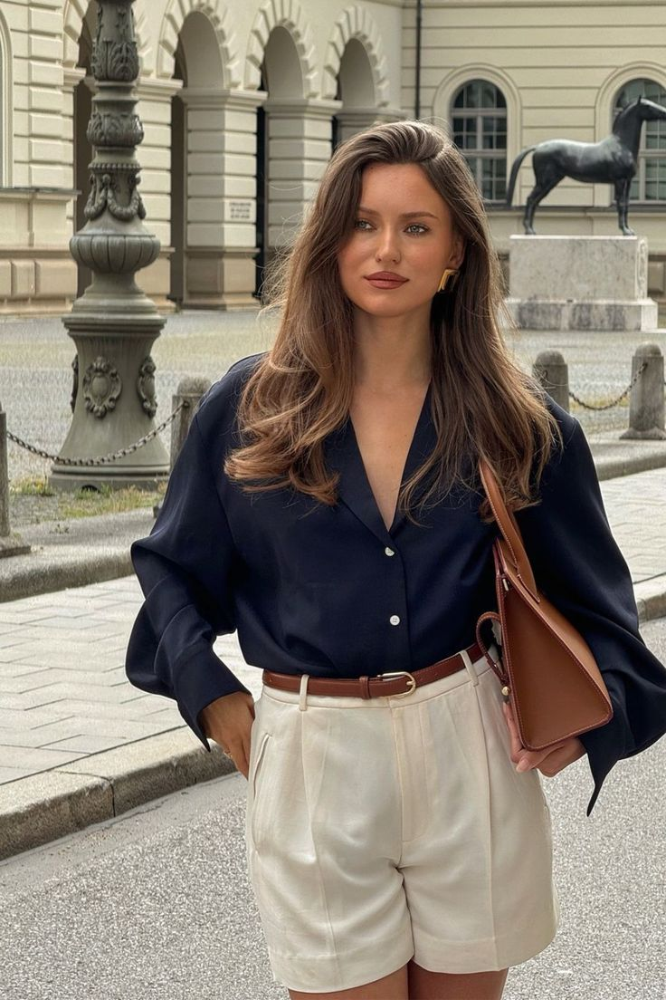

# 老钱风（Old Money）
> **状态**: reviewed | 最后更新: 2026-06-23 | 分类: 奢华极简 | **趋势**: 🏛️ 经典风格

## 📖 概述
- 发源年代: 2022-2023年 TikTok 爆发，但美学根源在美国东海岸 WASP 文化和英国贵族传统
- 发源地: 美国东海岸（常春藤联盟/汉普顿/上东区）+ 英国乡村庄园
- 风格关键词（5-8个）: 绞花毛衣、珍珠项链、乐福鞋、定制西装、传承感、不赶时髦、粗花呢
- 一句话定义: 祖传的优雅——绞花毛衣+珍珠项链+乐福鞋+粗花呢西装。不是「我有钱」，是「我家一直有钱」。

## 📜 历史文化
- **起源**: Old Money 不是一个被某个人「发明」的风格，而是数百年间自然形成的阶层着装密码。美国的 WASP（White Anglo-Saxon Protestant）精英在东海岸建立了常春藤联盟的学院着装体系（后来演化为 Preppy），同时在汉普顿/纽波特建立了度假着装体系。英国的乡村贵族则在庄园中建立了粗花呢+雨靴+蜡棉夹克的庄园着装体系。2022年 TikTok 用 #OldMoney 标签将这些重新打包，播放量超 200 亿。
- **发展脉络**:
  - **1920-1950s**: 常春藤联盟学生将西装、乐福鞋、牛津衬衫系统化为「Ivy Style」。Brooks Brothers 和 J.Press 是制服供应商
  - **1960-1980s**: Ralph Lauren 将 WASP 审美商业化，推出「Polo」品牌——美国老钱风的全球输出
  - **1990s-2000s**: 《绯闻女孩》(Gossip Girl) 将上东区老钱审美推向全球年轻观众——Blair Waldorf 的发带+珍珠项链是千禧 Old Money
  - **2022-2023**: TikTok #OldMoney 爆发——驳斥「新钱」的炫耀（Logo满身/亮片/紧身），推崇「老钱」的克制
  - **2025-2026**: 与 Quiet Luxury 融合，老钱风从「纯复古」进化为「当代经典」
- **文化意义**: Old Money 是关于「阶级」的时尚表达——它告诉世界：你不需要炫耀，因为你没有什么需要证明的。在一个经济焦虑的时代，Old Money 提供了一种「稳定/传承/不焦虑」的美学安慰剂。

## 🎨 美学特征
- **廓形特点**: 合身但不紧——西装有结构但不僵硬，针织衫包裹但不勒。核心是「得体」（decorum）——衬衫扣子扣到倒数第二颗，毛衣搭在肩上但不掉下来。拒绝一切「刻意」或「过度」。
- **色板**:
  - 主色调：海军蓝(#1B2A4A)、奶油白(#FFFDD0)、驼色(#C4A882)、酒红(#722F37)
  - 辅助色：橄榄绿、灰色、卡其色
  - 禁忌色：荧光色、霓虹色、粉色、大面积印花
  - 色板逻辑：常春藤校园的颜色——图书馆的皮革、草坪的绿、划艇队的水蓝、威士忌的酒红
- **面料偏好**: 粗花呢 > 羊绒 > 绞花针织 > 牛津棉 > 小羊皮。面料必须是天然的。化纤不存在于老钱的世界。
- **标志单品表**:

| 单品 | 品牌示例 | 选择要点 |
|------|---------|---------|
| 绞花针织毛衣 | Ralph Lauren, J.Crew, Aran Sweater Market | 奶油白或海军蓝、圆领或V领、厚实质地 |
| 珍珠项链 | Mikimoto, Chanel（复古款）, 祖母传的 | 单链真珍珠、6-8mm、长度在锁骨 |
| 乐福鞋 | G.H.Bass, Gucci, Tod's | 便士乐福鞋（Penny Loafer）是经典、棕色或酒红 |
| 粗花呢夹克 | Chanel, Ralph Lauren, Barbour | 粗花呢或蜡棉、可搭配牛仔裤 |
| 定制西装 | Ralph Lauren, Brooks Brothers, Thom Browne | 合身不紧、海军蓝或灰色、双排扣更正式 |
| 丝巾/方巾 | Hermès, vintage | 系在颈部或包上即可，小方巾优于大方巾 |

## 🏷️ 代表品牌
### 核心品牌
| 品牌 | 国家 | 价位 | 一句话 |
|------|------|------|--------|
| Ralph Lauren | 美国 | ¥¥¥-¥¥¥¥ | Old Money 的全球商业化旗舰——Polo 线覆盖日常，Purple Label 覆盖顶奢 |
| Brooks Brothers | 美国 | ¥¥¥ | 1818年创立于纽约，常春藤风格的「制服店」——纽扣领衬衫的发明者 |
| J.Press | 美国 | ¥¥¥ | 1902年创立于纽黑文（耶鲁隔壁），最纯正的 Ivy Style 品牌 |
| Barbour | 英国 | ¥¥¥ | 1894年创立，蜡棉夹克是英国乡村老钱的标配——一件穿30年 |
| Burberry | 英国 | ¥¥¥¥ | 风衣和格纹是英国老钱的全球标志（但格纹过头就变新钱了）|
| Chanel | 法国 | ¥¥¥¥ | 粗花呢夹克+珍珠项链=老钱风的「女性优雅版」|

### 平价替代
| 品牌 | 价位 | 说明 |
|------|------|------|
| J.Crew | ¥¥ | 1990s-2000s 的 Preppy 之王，老钱风的入门首选 |
| Uniqlo（U系列） | ¥ | 绞花针织衫和牛津衬衫的平价之选 |
| G.H.Bass | ¥ | 美国乐福鞋的始祖品牌（Weejuns），¥800 以内 |
| Massimo Dutti | ¥¥ | 西班牙优雅，西装和针织衫的平价替代 |

## 👤 风格偶像 & 名人
| 人物 | 身份 | 贡献 |
|------|------|------|
| Jacqueline Kennedy Onassis | 第一夫人 | 1960s 的 Old Money 终极 icon——珍珠项链+直筒裙+丝巾包头 |
| Ralph Lauren | 设计师 | 虽然本人是白手起家的「新钱」，但他创造的审美定义了全球对「美国老钱」的想象 |
| Grace Kelly | 演员/王妃 | 摩纳哥王妃，Hermès Kelly 包以她命名——优雅和克制的化身 |
| Carolyn Bessette-Kennedy | 公关/时尚 | 1990s 的极简 Old Money——白衬衫+黑色阔腿裤+零装饰的终极优雅 |

### 穿着此风格的明星/博主
| 人物 | 身份 | 为什么是 icon |
|------|------|---------------|
| Sofia Richie Grainge | 模特/博主 | 虽然不是「真老钱」，但她的 2023 婚礼造型精准复制了 Old Money 审美 |
| Gwyneth Paltrow | 演员 | 2023 法庭穿搭+前几年的日常造型=Old Money 的当代版 |
| Lady Amelia Windsor | 英国王室 | 真正的贵族——她的穿搭是 Old Money 的「原生版」而非「cos版」|

## 🔗 关联风格
- **父风格**: 奢华极简 (Luxe Minimalist)
- **子风格**: 老钱学院 (Old Money Academic)、老钱度假 (Old Money Resort)
- **平行风格**: 学院风（WF-07）——共享常春藤根源，Preppy 是 Old Money 的「上学时穿的」，Old Money 是「毕业后穿的」
- **对立风格**: 黑帮大嫂（WF-30）——Old Money 是「继承的克制」，Mob Wife 是「赚到的炫耀」
- **与姐妹风格差异**:
  1. vs 静奢风（WF-17）：Old Money 是「旧世界」（粗花呢/珍珠/传承），Quiet Luxury 是「新世界」（羊绒/阔腿裤/当代剪裁）
  2. vs 学院风（WF-07）：Old Money 是大人，Preppy 是学生——前者有珍珠项链+西装，后者有校徽+百褶裙
  3. vs 英伦淑女（WF-43）：Old Money 偏美国东海岸，British Lady 偏英国乡村+伦敦

## 📈 流行趋势
- **当前状态**: 经典风格的周期性回温——Old Money 永远每隔 5-10 年就会「重新被发现」一次
- **流行区域**: 北美 > 英国 > 澳大利亚 > 欧洲。东亚的「老钱风」更偏奢侈品（Hermès/Loro Piana），偏 Quiet Luxury 而非传统 Old Money
- **发展方向**:
  - 2025-2026：与可持续时尚融合——「穿祖母的衣服」既是 Old Money 的精神也是可持续的终极答案
  - 年轻化：TikTok Old Money 从「cosplay 有钱人」走向「真正理解得体着装」

## 💡 穿搭建议
- **适合体型**: 所有体型——合身西装+高腰裤是万用公式
- **适合肤色**: 中性色板对所有肤色友好。暖皮选驼色/奶油白，冷皮选海军蓝/灰色
- **适合场合**: 办公室（满分）、早午餐、高尔夫俱乐部、马术比赛、家庭聚会。不适合：夜店、音乐节
- **入门建议**:
  1. 从一件绞花针织衫开始——Ralph Lauren 或 J.Crew，奶油白最百搭
  2. 加一条珍珠项链——真珍珠或高品质仿珠，单链就够了
  3. 一双便士乐福鞋——G.H.Bass Weejuns，¥800 以内就能买到原版
  4. 一件粗花呢夹克——Chanel 风格或 Barbour 风格，投资款但能穿一辈子

---
*本文基于多源研究整理，AI 辅助生成。*
