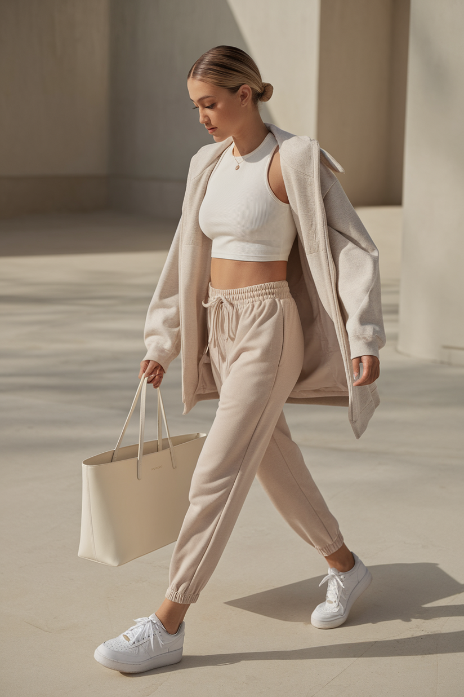

# 干净女孩（Clean Girl）
> **状态**: reviewed | 最后更新: 2026-06-23 | 分类: 奢华极简 | **趋势**: 🔥 流行趋势

## 📖 概述
- 发源年代: 2021年 TikTok 爆发（#CleanGirlAesthetic），与「That Girl」生活方式趋势同步
- 发源地: 互联网（TikTok / Instagram），核心影响者来自美国/英国
- 风格关键词（5-8个）: 紧贴发髻（slicked-back bun）、金色大耳环、中性基础款、水光肌（glowy skin）、普拉提、绿色果汁
- 一句话定义: 「刚洗完脸的精致」——紧贴发髻+金色大耳环+中性色基础款+水光肌。像从有机超市出来直接去普拉提课的路上。

## 📜 历史文化
- **起源**: Clean Girl 是 TikTok 2021年末-2022年初的产物，是对 COVID 期间的「邋遢居家服」的反叛——人们终于能出门了，想要看起来「干净/清爽/有控制感」。与「That Girl」生活方式趋势紧密捆绑：早上5点起床、喝绿色果汁、做普拉提、写感恩日记、穿干净的衣服。它也是「老钱风」审美向大众的渗透——Clean Girl 是在用 Zara 和 COS 做 Quiet Luxury 的事。
- **发展脉络**:
  - **2018-2019**: 「No-makeup makeup」和「glowy skin」现象为 Clean Girl 打下审美基础
  - **2021**: TikTok #CleanGirlAesthetic 爆发——slicked-back bun+金色大耳环成为公式
  - **2022**: 与「Quiet Luxury」和「Old Money」趋势交汇——Clean Girl 成为两者的「平价入口」
  - **2023**: 反噬出现——批评者指出 Clean Girl 审美存在种族和阶层偏见（「干净」被默认为是瘦/白/有钱的）
  - **2025-2026**: Clean Girl 2.0——更包容（不同肤色/体型/预算都可以做 Clean Girl），更聚焦「整洁感」而非特定标准
- **文化意义**: Clean Girl 是关于「掌控感」的审美宣言——在一个混乱的世界里，你的发髻、皮肤、衣服都在说「我掌控着我的生活」。但它也引发了关于审美标准排他性的讨论。

## 🎨 美学特征
- **廓形特点**: 合身但不紧——高腰直筒裤+合身白T恤或针织衫。核心是「利落」（crisp）——没有多余的褶皱、装饰、或层次。像刚从干洗店取出来的衣服。
- **色板**:
  - 主色调：象牙白(#FFFFF0)、米白(#F5F5DC)、驼色(#C4A882)、黑色(#000000)
  - 辅助色：橄榄绿、灰色、海军蓝、奶油色
  - 禁忌色：荧光色、霓虹色、印花、图案
  - 色板逻辑：燕麦、杏仁、牛奶、咖啡——所有「可食用的中性色」
- **面料偏好**: 棉 > 针织 > 亚麻 > 羊绒。面料要挺括（crisp）——白衬衫必须有型，针织衫必须不起球。
- **标志单品表**:

| 单品 | 品牌示例 | 选择要点 |
|------|---------|---------|
| 合身白T恤/白背心 | COS, Arket, Skims | 厚棉、不透、领口不变形 |
| 高腰直筒/阔腿牛仔裤 | Levi's, Agolde, COS | 高腰、直筒或微阔、浅蓝或白色 |
| 金色大耳环 | Mejuri, Missoma, Bottega Veneta | 圆形或椭圆形、金属质感、尺寸要大到能看见 |
| 修身针织衫 | Skims, COS, Uniqlo U | 圆领或半高领、驼色/奶油白/黑色 |
| 简约白球鞋 | Veja, Adidas Stan Smith, Nike Air Force 1 | 白色、干净、看起来像新的 |
| 驼色大衣/风衣 | COS, Massimo Dutti, The Row | 直筒廓形、及膝长度、无多余设计 |

## 🏷️ 代表品牌
### 核心品牌
| 品牌 | 国家 | 价位 | 一句话 |
|------|------|------|--------|
| COS | 瑞典 | ¥¥ | H&M 集团高端线，Clean Girl 的「制服店」——白衬衫+直筒裤+金色耳环的全部公式 |
| Arket | 瑞典 | ¥¥ | COS 姐妹牌，更生活化、更日常 |
| Skims | 美国 | ¥¥ | Kim Kardashian 创立，修身针织衫和打底衫的 Clean Girl 首选 |
| Mejuri | 加拿大 | ¥¥ | 金色耳环和简约首饰的 DTC 之王 |
| Levi's | 美国 | ¥ | 501 和 Ribcage 高腰直筒牛仔裤是 Clean Girl 的「下半身制服」|

### 平价替代
| 品牌 | 价位 | 说明 |
|------|------|------|
| Uniqlo | ¥ | 针织衫、白T恤、直筒裤的基础款之王 |
| H&M | ¥ | 金色耳环和基本针织衫的季节性供应 |
| Zara | ¥ | 驼色大衣和白衬衫的平价首选 |
| Veja | ¥¥ | 白球鞋的 Clean Girl 标配，比 Stan Smith 更具「可持续」光环 |

### 新兴品牌（2024-2026）
- **Leset**: 纽约品牌，精准定位 Clean Girl 衣橱——白衬衫+针织衫+直筒裤
- **Wardrobe.NYC**: 纽约品牌，胶囊衣橱概念，一个系列就是 Clean Girl 的全部衣橱

## 👤 风格偶像 & 名人
| 人物 | 身份 | 贡献 |
|------|------|------|
| Hailey Bieber | 模特/企业家 | Clean Girl 的全球代言人——slicked-back bun+金色耳环+水光肌的公式就是她定义的 |
| Rosie Huntington-Whiteley | 模特 | Clean Girl 的「成熟版」——同样是中性基础款，但更高端（The Row/Bottega）|
| Kendall Jenner | 模特 | 街头造型以白T恤+直筒牛仔裤+白球鞋为主，Clean Girl 的「模特版」|

### 穿着此风格的博主
| 人物 | 身份 | 为什么是 icon |
|------|------|---------------|
| Matilda Djerf | 瑞典博主/Djerf Avenue 创始人 | 虽然偏「瑞典甜美」，但其中性基础款造型精准命中 Clean Girl |
| Brittany Bathgate | 英国博主 | 极简主义的英国 Clean Girl——更建筑感、更艺术感 |

## 🔗 关联风格
- **父风格**: 奢华极简 (Luxe Minimalist)
- **子风格**: 街头干净 (Street Clean)、运动干净 (Athletic Clean)
- **平行风格**: 静奢风（WF-17）——Clean Girl 是 Quiet Luxury 的「平价/年轻/健康版」
- **对立风格**: Y2K 千禧复古（WF-10）——Clean Girl 追求「干净/秩序」，Y2K 追求「混乱/复古」
- **与姐妹风格差异**:
  1. vs 静奢风（WF-17）：Clean Girl 用 Zara/COS/Uniqlo 构建，Quiet Luxury 用 The Row/Loro Piana 构建——预算差一个零但审美同源
  2. vs 老钱风（WF-18）：Clean Girl 是「去普拉提课的年轻女性」，Old Money 是「在汉普顿度假的第四代」
  3. vs 极简（WF-06）：Clean Girl 有「健康生活方式」的语境（普拉提/绿色果汁），Minimalist 只有「设计感」

## 📈 流行趋势
- **当前状态**: 成熟稳定期——已从 TikTok 爆发进入主流日常穿搭范畴
- **流行区域**: 全球（TikTok 驱动），北美/西欧/澳大利亚为主
- **发展方向**:
  - 2025-2026：更包容——不再限于瘦/白/有钱的身体标准
  - 从「全套Clean」到「Clean元素」——白衬衫+牛仔裤+白球鞋=Clean Girl，不需要 slicked-back bun

## 💡 穿搭建议
- **适合体型**: 所有体型——高腰直筒裤是所有身形的朋友，合身针织衫勾勒但不勒
- **适合肤色**: 中性色板对所有肤色友好。金色首饰对暖皮更友好，银色首饰对冷皮更友好
- **适合场合**: 日常通勤（非正式办公室）、周末 brunch、逛街、普拉提课后。不适合：正式晚宴（太简单）、夜店（太干净）
- **入门建议**:
  1. 从一件合身白T恤开始——买厚的棉质（不透），领口不变形的那种
  2. 一条高腰直筒牛仔裤——Levi's Ribcage 或 COS
  3. 一双干净的白球鞋——Stan Smith 或 Veja
  4. 一对金色大耳环——Day-to-night，从早上的咖啡到晚上的约会都适用
  5. 发型就是配饰——Slicked-back bun 需要发蜡/发胶，但「干净的马尾」也够了

---
*本文基于多源研究整理，AI 辅助生成。*
