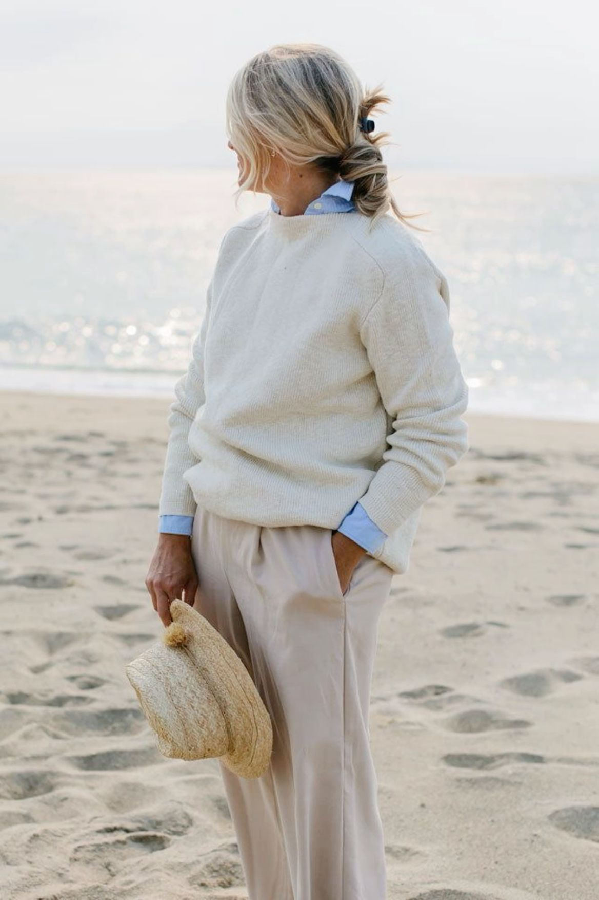

# 海岸祖母（Coastal Grandmother）
> **状态**: reviewed | 最后更新: 2026-06-23 | 分类: 自然田园 | **趋势**: 🔥 流行趋势

## 📖 概述
- 发源年代: 2022年 TikTok 爆发，美学根源在 Nancy Meyers 电影（2000s-2010s）
- 发源地: 美国东北海岸（汉普顿/楠塔基特/玛莎葡萄园），由 TikTok 重新发现
- 风格关键词（5-8个）: 亚麻衬衫、宽腿白裤、草编托特包、中性色、海滩散步、Nancy Meyers 电影感、开衫
- 一句话定义: Nancy Meyers 电影女主角的衣橱——亚麻衬衫+宽腿白裤+草编托特包。像是住在海边大房子里、早上沿着沙滩散步然后回去写小说的女人。

## 📜 历史文化
- **起源**: 「Coastal Grandmother」这个名称是 TikTok 创作者 Lex Nicoleta 在2021年末发明的，用来描述 Nancy Meyers 电影中女主角的审美——Diane Keaton 在《爱是妥协》(2003) 中穿着白色亚麻裤在海边散步，Meryl Streep 在《爱很复杂》(2009) 中穿着奶油色开衫在厨房做可颂。这些角色都有一个共同点：中年或以上的女性，住在美丽的海边房子里，穿着天然面料的中性色衣服，从容/智慧/不需要取悦任何人。TikTok 在2022年将这一审美重新打包给Z世代，#CoastalGrandmother 播放量超 50 亿。
- **发展脉络**:
  - **2000s**: Nancy Meyers 电影建立「海边白房子+亚麻衣橱」的视觉体系
  - **2010s**: Ina Garten（Barefoot Contessa）在汉普顿的烹饪节目成为海岸祖母的生活原型
  - **2022**: TikTok #CoastalGrandmother 爆发——年轻人将「海岸祖母」视为「提前退休」的审美幻想
  - **2023-2024**: 与 Quiet Luxury 和 Cottagecore 交汇——共享天然面料和中性色板
  - **2025-2026**: 从「幻想退休」转向「可实践的慢生活」——亚麻衬衫+宽腿裤本身就是很好的日常穿搭
- **文化意义**: 在一个「hustle culture」的时代，海岸祖母提供了一种「我已经到达了」的审美姿态。她不需要赶时间、不需要吸引注意、不需要向任何人证明自己。她是年轻一代对「burnout」的审美解药。

## 🎨 美学特征
- **廓形特点**: 宽松舒适——不紧身、不勒、不刻意。亚麻衬衫略oversize，宽腿裤垂坠飘逸。核心是「流动感」——衣服随风动。
- **色板**:
  - 主色调：奶油白(#FFFDD0)、沙色(#D2B48C)、海沫绿(#B2D8D8)、石灰色(#C0C0C0)
  - 辅助色：海军蓝、白色、亚麻本色
  - 禁忌色：荧光色、霓虹色、金属感、大面积印花
  - 色板逻辑：沙、石、雾、贝壳——海滩上能捡到的所有颜色
- **面料偏好**: 亚麻 > 棉 > 羊绒 > 府绸。必须是天然的、会呼吸的、会随着穿着产生自然褶皱的面料。
- **标志单品表**:

| 单品 | 品牌示例 | 选择要点 |
|------|---------|---------|
| 亚麻纽扣衬衫 | Eileen Fisher, Jenni Kayne, COS | 略oversize、白色或奶油色、长袖可卷起 |
| 宽腿白裤/亚麻裤 | Vince, Eileen Fisher, Muji | 高腰、垂坠、亚麻或棉、及地长度 |
| 羊绒开衫/针织衫 | Jenni Kayne, Nadaam, Uniqlo U | 圆领或V领、纯色、可搭在肩上 |
| 草编托特包 | Dragon Diffusion, Sézane, Etsy | 大容量、手工编织、可装海滩读物和一条毛巾 |
| 渔夫凉鞋/平底鞋 | The Row, Ancient Greek Sandals | 平底、皮质或草编、可赤脚穿也可配白色短袜 |
| 丝巾/亚麻围巾 | Hermès, vintage, Etsy | 浅色、可系在颈部或包上 |

## 🏷️ 代表品牌
### 核心品牌
| 品牌 | 国家 | 价位 | 一句话 |
|------|------|------|--------|
| Eileen Fisher | 美国 | ¥¥¥ | 1984年创立，亚麻和天然面料的美国女王——可持续/宽松/从容 |
| Jenni Kayne | 美国 | ¥¥¥ | 加州的「海岸祖母」——亚麻衬衫+羊绒开衫+宽腿裤的当代版本 |
| Vince | 美国 | ¥¥¥ | 洛杉矶品牌，高端极简基本款，亚麻和羊绒的「安静奢华」|
| Nadaam | 美国 | ¥¥ | DTC 羊绒品牌，$100 的羊绒衫——海岸祖母的「平价入门」|
| Sézane | 法国 | ¥¥ | 法式亚麻衬衫和草编包的完美供应商 |

### 平价替代
| 品牌 | 价位 | 说明 |
|------|------|------|
| Muji | ¥ | 亚麻衬衫和宽腿裤的平价之王——日本版的天然面料美学 |
| Uniqlo | ¥ | 亚麻混纺衬衫和宽腿裤的季节性供应 |
| COS | ¥¥ | 建筑感亚麻，比海岸祖母更「城市」但可以混搭 |
| J.Crew | ¥¥ | 美式休闲亚麻，海滩度假的标配 |

## 👤 风格偶像 & 名人
| 人物 | 身份 | 贡献 |
|------|------|------|
| Diane Keaton | 演员 | Nancy Meyers 的缪斯，她的《爱是妥协》角色是海岸祖母的终极原型 |
| Nancy Meyers | 导演 | 虽然不穿这个风格，但她电影中的布景和服装定义了海岸祖母的视觉宇宙 |
| Ina Garten | 厨师/作家 | 「赤脚伯爵夫人」——在汉普顿的厨房穿着亚麻衬衫做烤鸡，海岸祖母的生活方式原型 |
| Meryl Streep | 演员 | 《爱很复杂》中穿着奶油色开衫在海边做可颂的场景是海岸祖母的「圣像」|

### 穿着此风格的明星/博主
| 人物 | 身份 | 为什么是 icon |
|------|------|---------------|
| Gwyneth Paltrow | 演员 | Goop 时代的她就是海岸祖母的「现实版」——亚麻+羊绒+海滩别墅 |
| Julia Roberts | 演员 | 多个角色和日常造型都精准命中海岸祖母审美 |

## 🔗 关联风格
- **父风格**: 自然逃离 (Nature Escape)
- **子风格**: 都市祖母 (Urban Grandmother)、楠塔基特风 (Nantucket Style)
- **平行风格**: 静奢风（WF-17）——共享「无Logo/天然面料/从容」，但海岸祖母更「度假」更「海风」
- **对立风格**: 黑帮大嫂（WF-30）——海岸祖母是「我已经不需要证明」，Mob Wife 是「我要让所有人看到我」
- **与姐妹风格差异**:
  1. vs 田园牧歌（WF-13）：海岸祖母在汉普顿海边别墅，Cottagecore 在乡下农舍花园
  2. vs 度假逃逸（WF-37）：海岸祖母是「每年夏天都去同一个海滩」，Resort Escape 是「今年去一个新的海岛」
  3. vs 地中海番茄（WF-21）：海岸祖母偏美国东海岸/冷色，Tomato Girl 偏南意大利/暖色

## 📈 流行趋势
- **当前状态**: 稳定期——已从 TikTok 爆发进入生活方式美学常态。亚麻衬衫和宽腿白裤已成为夏季标配
- **流行区域**: 北美 > 英国 > 澳大利亚。海岸/湖区/度假城市是核心区域
- **发展方向**:
  - 2025-2026：从「幻想」进入「实践」——更多人将亚麻衬衫+宽腿裤穿成日常，而不只是度假
  - 年轻化：Z 世代用 Vintage Levi's+亚麻衬衫混搭出青春版海岸祖母

## 💡 穿搭建议
- **适合体型**: 所有体型友好——宽松廓形包容但不邋遢
- **适合肤色**: 中性色板对所有肤色友好
- **适合场合**: 海滩度假、周末出游、早午餐、艺术展开幕、在家办公
- **入门建议**:
  1. 从一件白亚麻衬衫开始——它比白棉衬衫更有质感，褶皱不是问题，是魅力
  2. 一条宽腿白裤——亚麻或棉，高腰、及地
  3. 一只草编托特包——不必贵，但要大，要能装下一条海滩毛巾和一本小说
  4. 姿态最重要——海岸祖母不急。她从不赶时间。

---
*本文基于多源研究整理，AI 辅助生成。*
