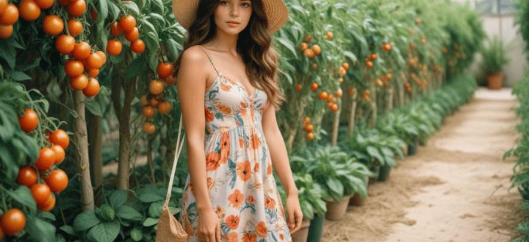

# 地中海番茄（Tomato Girl）
> **状态**: reviewed | 最后更新: 2026-06-23 | 分类: 自然田园 | **趋势**: 🔥 流行趋势

## 📖 概述
- 发源年代: 2023年 TikTok 爆发（#TomatoGirl 标签），美学根源在南意大利地中海沿岸
- 发源地: 南意大利（阿马尔菲海岸/西西里/普利亚），由 TikTok 重新发现和命名
- 风格关键词（5-8个）: 红/橙色系、白色亚麻、草编鞋、番茄红、地中海夏日、季节性穿搭、印花丝巾
- 一句话定义: 地中海夏日的视觉化——白色亚麻衬衫+红色半裙+草编鞋，像是刚从阿马尔菲海岸的市场买了一袋番茄回家。

## 📜 历史文化
- **起源**: Tomato Girl 是 TikTok 将南意大利夏日生活美学「产品化」的结果。与传统时尚风格不同，它更像一种「季节+地点+食物」的感官组合——番茄的红、橄榄的绿、柠檬的黄、海水的蓝。它的视觉参考来自 1950-60年代意大利电影的夏日场景（费里尼的《甜蜜的生活》、安东尼奥尼的《奇遇》），以及当代旅行博主在阿马尔菲/Puglia 度假时拍摄的内容。TikTok #TomatoGirl 播放量超 60 亿。
- **发展脉络**:
  - **1950-60s**: 意大利新现实主义电影中的夏日穿搭——Sophia Loren 的印花裙+草编鞋
  - **1990s-2000s**: 《托斯卡纳艳阳下》(2003) 等旅行电影将南意大利生活审美推向美国观众
  - **2010s**: 旅行 Instagram 的「阿马尔菲热潮」——Positano 的彩色房子+柠檬树+白色亚麻
  - **2023**: TikTok #TomatoGirl 爆发——红色+白色+草编成为公式
  - **2024-2026**: 与「欧洲夏日」趋势融合——所有人都在学意大利人的夏季穿搭
- **文化意义**: Tomato Girl 是关于「活在当下」的季节性宣言——在冬天穿黑色的大衣，在夏天就要像一颗番茄那样红。它是一种对北欧冷淡风（灰/黑/白）的温暖反叛。

## 🎨 美学特征
- **廓形特点**: 轻盈飘逸——亚麻衬衫随意敞开一两颗扣子，半裙A字或伞摆。关键：必须露出皮肤——敞开领口、光着脚穿草编鞋、手腕上一串贝壳手链。衣服是「刚够遮住身体就行」。
- **色板**:
  - 主色调：番茄红(#E63946)、白色(#FFFFFF)、橄榄绿(#556B2F)、柠檬黄(#F4D03F)
  - 辅助色：陶土橙、海蓝色、焦糖棕
  - 禁忌色：黑色、灰色、霓虹色、金属色
  - 色板逻辑：南意大利菜市场的一篮食材——番茄+橄榄+柠檬+罗勒
- **面料偏好**: 亚麻 > 棉 > 府绸 > 钩针编织。必须透气、轻盈、会随风飘。天然面料是唯一选择——化纤在地中海夏天就是你的敌人。
- **标志单品表**:

| 单品 | 品牌示例 | 选择要点 |
|------|---------|---------|
| 白色亚麻衬衫/上衣 | Positano 本地店、Zara、Sézane | 略宽松、敞领、短袖或长袖卷起 |
| 红色/印花中长半裙 | Rouje, Réalisation Par, Positano 手工 | A字或伞摆、番茄红或柠檬印花、长度过膝 |
| 草编鞋/渔夫凉鞋 | Castaner, Ancient Greek Sandals | 平底或楔形跟、草编底、可绑带 |
| 印花丝巾 | Hermès, vintage, 本地市场 | 可系头发（包头）、系颈部、或系包柄 |
| 草编包/竹篮包 | Dragon Diffusion, Positano 手工 | 大容量、可装市场买的柠檬和番茄 |
| 贝壳/珊瑚首饰 | 本地手工、Etsy | 不是高级珠宝——就是海边随手捡的那种感觉 |

## 🏷️ 代表品牌
### 核心品牌
| 品牌 | 国家 | 价位 | 一句话 |
|------|------|------|--------|
| Castaner | 西班牙 | ¥¥ | 1927年创立，草编坡跟鞋的发明者——Tomato Girl 的「鞋柜之神」|
| Rouje | 法国 | ¥¥ | Jeanne Damas 的法国品牌，红色碎花裙和裹身裙的 Tomato Girl 完美供应商 |
| Réalisation Par | 英国/澳大利亚 | ¥¥ | Instagram 的「印花钱裙之王」——The Alexandra 红裙是 Tomato Girl 圣物 |
| La DoubleJ | 意大利 | ¥¥¥ | 米兰品牌，极致印花——Tomato Girl 的「最大化版本」|
| Positano 本地手工 | 意大利 | ¥-¥¥ | 阿马尔菲海滩边的手工店——亚麻衬衫+手工凉鞋+印花裙，原汁原味 |

### 平价替代
| 品牌 | 价位 | 说明 |
|------|------|------|
| Zara | ¥ | 每季都有红色半裙和白色亚麻衬衫 |
| Mango | ¥ | 西班牙品牌，地中海审美的平价主力 |
| H&M | ¥ | 季节性提供亚麻混纺和印花半裙 |
| Etsy（手工草编包） | ¥-¥¥ | 真正的意大利手工草编包比品牌包更 Tomato Girl |

## 👤 风格偶像 & 名人
| 人物 | 身份 | 贡献 |
|------|------|------|
| Sophia Loren | 演员 | 1950-60s 意大利电影中的终极 Tomato Girl——印花裙+草编鞋+猫眼墨镜 |
| Monica Bellucci | 演员 | 现代意大利性感的 Tomato Girl 版——黑色卷发+红色裙子+橄榄色皮肤 |
| Jeanne Damas | 博主/Rouje 创始人 | 虽然不是意大利人，但她的 Rouje 品牌为全球提供了 Tomato Girl 的制服 |

### 穿着此风格的明星/博主
| 人物 | 身份 | 为什么是 icon |
|------|------|---------------|
| Sienna Miller | 演员 | 多次被拍到穿着白色亚麻+红色印花裙在意大利度假 |
| Alexa Chung | 博主 | 她的 Positano 度假造型精准命中 Tomato Girl 公式 |

## 🔗 关联风格
- **父风格**: 自然逃离 (Nature Escape)
- **子风格**: 柠檬女孩 (Lemon Girl)、阿马尔菲风 (Amalfi Style)
- **平行风格**: 地中海番茄的姐妹——海岸祖母（WF-20）偏美国海岸/冷色；田园牧歌（WF-13）偏英式田园/碎花
- **对立风格**: 北欧冷淡（WF-36）——Tomato Girl 是暖色+阳光+热情，Scandi Cool 是冷色+简约+克制
- **与姐妹风格差异**:
  1. vs 田园牧歌（WF-13）：Tomato Girl 在意大利柠檬树下，Cottagecore 在英国野花地里
  2. vs 度假逃逸（WF-37）：Tomato Girl 特指「南意大利的夏天」，Resort Escape 可以是任何热带海岛
  3. vs 海岸祖母（WF-20）：Tomato Girl 更年轻、更性感、更「热情的意大利」；海岸祖母更成熟、更克制

## 📈 流行趋势
- **当前状态**: 高峰期——每年夏季#TomatoGirl 都会重新登上 TikTok 趋势榜
- **流行区域**: 全球（季节性），欧洲和北美为主。东亚的「地中海风」是其平行版本
- **发展方向**:
  - 2025-2026：从「全套番茄」到「番茄元素」——一条红色半裙+白T恤=日常版 Tomato Girl
  - 2026+：可能与「欧洲夏日」趋势融合，延伸到希腊/西班牙等其他地中海目的地

## 💡 穿搭建议
- **适合体型**: 所有体型——A字裙遮盖臀胯，白色亚麻上衣提亮肤色
- **适合肤色**: 暖皮穿番茄红+橄榄绿是绝配；冷皮可选白色+柠檬黄的组合
- **适合场合**: 夏日度假、户外 brunch、农贸市场、海滩散步、意大利旅行。不适合：办公室（偏休闲）、冬季（季节不对）
- **入门建议**:
  1. 从一条红色中长半裙开始——最直观的「番茄」信号
  2. 加一件白色亚麻衬衫——敞开穿，内搭白色小背心
  3. 一双草编凉鞋——Castaner 楔形跟或平底绑带都行
  4. 头发用一条丝巾包头——这是 Tomato Girl 最省钱的「升级配件」

---
*本文基于多源研究整理，AI 辅助生成。*
