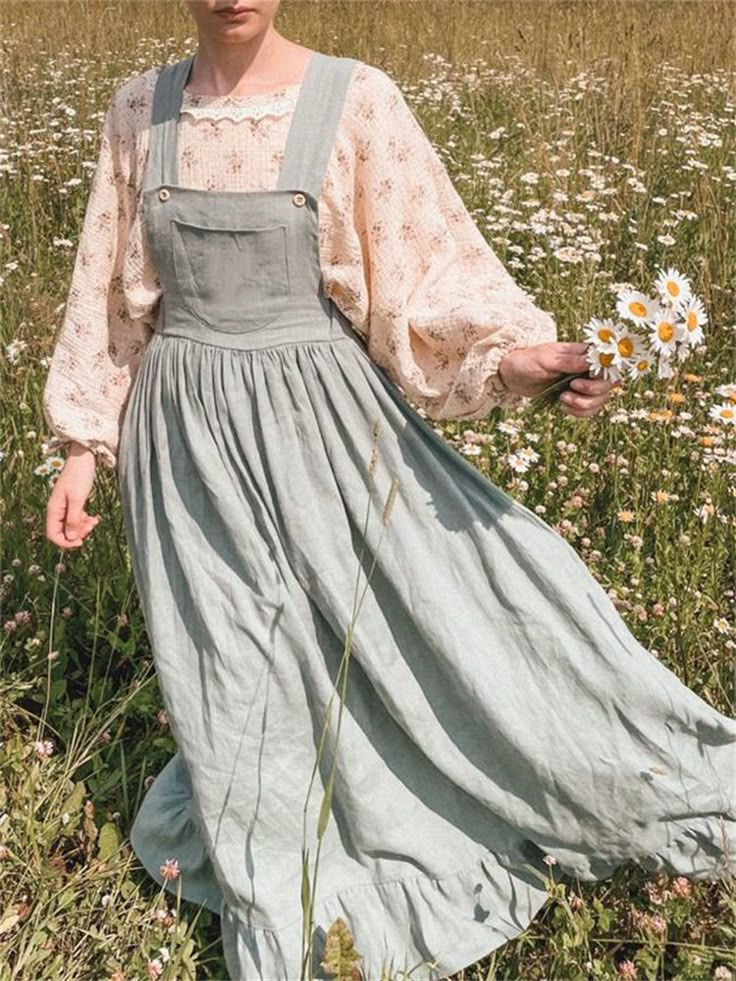

# 田园草地（Meadowcore）
> **状态**: reviewed | 最后更新: 2026-06-23 | 分类: 自然田园 | **趋势**: 🔥 流行趋势

## 📖 概述
- 发源年代: 2022-2023年作为 Cottagecore 分支在 TikTok 出现
- 发源地: 互联网（TikTok / Pinterest），视觉参考来自英式野花草甸和印象派绘画
- 风格关键词（5-8个）: 褪色碎花、鼠尾草绿、尘粉色调、褪色格纹、野花草甸、朦胧柔焦、草编
- 一句话定义: 比 Cottagecore 更柔和、更朦胧的田园——褪色碎花+鼠尾草绿+尘粉色调，像透过柔焦镜头看一片雨后的野花草甸。

## 📜 历史文化
- **起源**: Meadowcore 是 Cottagecore 的自然分支。如果说 Cottagecore 是关于「在田园里劳动」（烤面包、种草莓、挤牛奶），Meadowcore 就是关于「在田园里躺平」——不劳动，只躺在草地上看云、采野花、读诗。美学参考包括印象派绘画（莫奈的草地、雷诺阿的花园）和 1970年代的花童文化（Flower Child）。TikTok #Meadowcore 播放量约 30 亿。
- **发展脉络**:
  - **2020-2021**: Cottagecore 爆发，Meadowcore 作为其「更安静的小妹妹」在地下酝酿
  - **2022**: TikTok 正式命名 #Meadowcore——褪色滤镜+野花+草丛中的身影
  - **2023**: 与 「fairycore」和「pixiecore」交汇，形成更魔幻的田园美学
  - **2024-2025**: 作为一个更小众的审美，在 Cottagecore 退潮后仍保持稳定的地下追随者
  - **2026**: 与「自然染色」和「植物印花」的可持续时尚趋势融合
- **文化意义**: Meadowcore 是对「生产力焦虑」的审美拒绝。在一个告诉你「每秒钟都要创造价值」的文化中，Meadowcore 说：「躺在草地上就够了」。它是浪漫主义「崇高自然」的当代互联网表达。

## 🎨 美学特征
- **廓形特点**: 超宽松——连衣裙像睡衣一样柔软垂坠，开衫可以当披肩。核心是「不被衣服束缚」——雨后的草地不需要腰线。
- **色板**:
  - 主色调：鼠尾草绿(#B2C9AB)、尘粉(#D4A5A5)、薰衣草灰(#C3B1D1)、奶油黄(#F5F0D0)
  - 辅助色：苔藓绿、灰蓝、奶油白
  - 禁忌色：荧光色、霓虹色、金属色、正红（太强烈）、黑色（太沉重）
  - 色板逻辑：把野花草甸的照片调低饱和度和对比度——所有颜色都蒙上一层灰/雾
- **面料偏好**: 棉 > 薄纱 > 钩针编织 > 亚麻。面料要柔软、轻薄、会随风微动。不能挺括——挺括是城市的，Meadowcore 是野地的。
- **标志单品表**:

| 单品 | 品牌示例 | 选择要点 |
|------|---------|---------|
| 碎花/小印花中长连衣裙 | Doen, Christy Dawn, Free People | 褪色碎花（不是鲜艳印花）、A字或无腰线、及踝长度 |
| 钩针/针织开衫 | 手工品牌、Etsy、Free People | 宽松、可当披肩也可当外套、自然色 |
| 棉布褶皱半裙 | Son de Flor, Etsy | 及踝长度、A字、亚麻或棉 |
| 草编/花环发饰 | Etsy 手工、DIY | 干花/野花/草编——不要用塑料花 |
| 绑带平底凉鞋 | Ancient Greek Sandals, Free People | 平底、皮质或布质、越少设计越好 |
| 棉布手提袋 | Baggu, Etsy | 印花帆布、可装一本诗集和一瓶柠檬水 |

## 🏷️ 代表品牌
### 核心品牌
| 品牌 | 国家 | 价位 | 一句话 |
|------|------|------|--------|
| Free People | 美国 | ¥¥ | 波西米亚的自由精神，褪色碎花裙和宽松开衫的大众首选 |
| Doen | 美国 | ¥¥¥ | 碎花连衣裙的加州诗学——Meadowcore 和 Cottagecore 的共享供应商 |
| Christy Dawn | 美国 | ¥¥¥ | 用 vintage 面料制作的田园连衣裙，每一件都不一样 |
| With Nothing Underneath | 英国 | ¥¥ | 简约棉布衬衫和裙装，Meadowcore 的「英式克制版」|

### 平价替代
| 品牌 | 价位 | 说明 |
|------|------|------|
| Uniqlo | ¥ | 棉麻开衫和棉布裙的平价入门 |
| H&M（Premium） | ¥ | 亚麻混纺连衣裙的季节性供应 |
| Etsy 手工 | ¥-¥¥ | 真正的「独一无二」手工作品 |
| YesStyle | ¥ | 东亚田园风（与日系森系共享部分供应链）|

## 👤 风格偶像 & 名人
| 人物 | 身份 | 贡献 |
|------|------|------|
| Florence Welch | 歌手 | Florence + the Machine 的视觉美学中有强烈的 Meadowcore 元素——草地、野花、风中飘动的裙摆 |
| 莫奈 (Claude Monet) | 画家 | 虽然不穿衣服，但他的画作（特别是《罂粟花田》和《吉维尼花园》）是 Meadowcore 的色彩圣经 |
| Stevie Nicks | 歌手 | Fleetwood Mac 主唱，1970s 的「草地女巫」——飘逸长裙+披肩+草地上的旋转 |

### 穿着此风格的博主
| 人物 | 身份 | 为什么是 icon |
|------|------|---------------|
| Sara Tasker | 博主 | Instagram (@me_and_orla) 的田园美学先驱 |
| Emily Schuman | 博主 | Cupcakes and Cashmere 创始人，田园+城市的混搭 |

## 🔗 关联风格
- **父风格**: 自然逃离 (Nature Escape)
- **子风格**: 仙女核 (Fairycore)、精灵核 (Pixiecore)
- **平行风格**: 田园牧歌（WF-13）——Meadowcore 是 Cottagecore 的「躺平版」
- **对立风格**: 都市通勤（WF-11）——Meadowcore 在草地，City Girl 在写字楼
- **与姐妹风格差异**:
  1. vs 田园牧歌（WF-13）：Cottagecore 强调「手工/劳动」（烤面包/钩针），Meadowcore 强调「躺平/发呆」
  2. vs 仙女垃圾（WF-26）：Meadowcore 是「纯粹的草地」，Fairy Grunge 是「草地+暗黑魔幻」
  3. vs 日系森系（WF-03）：Meadowcore 是欧洲野花草地，Mori Kei 是日本森林

## 📈 流行趋势
- **当前状态**: 小众稳定——不如 Cottagecore 大，但有一群忠实的追随者
- **流行区域**: 北美 > 英国 > 北欧。野花/草地的视觉与这些地区的自然景观一致
- **发展方向**:
  - 2025-2026：与「森林浴」(Forest Bathing) 和自然疗愈趋势融合
  - Meadowcore 染色：植物染色（鼠尾草/花瓣/泥土）的天然色调成为小众时尚的新方向

## 💡 穿搭建议
- **适合体型**: 所有体型——超宽松廓形包容一切
- **适合肤色**: 暖皮穿鼠尾草绿/奶油黄；冷皮穿薰衣草灰/尘粉
- **适合场合**: 草地野餐、乡下周末、诗歌朗诵会、自然疗愈 retreat。不适合：办公室、正式场合
- **入门建议**:
  1. 从一条褪色碎花连衣裙开始——像是已经在衣柜里放了十年、洗了五十次的那种褪色感
  2. 一件宽松的开衫——钩针编织或轻针织，可以在草地上当毯子
  3. 头发上插一朵真花——这是最便宜也最能瞬间 Meadowcore 的配饰
  4. 不用化妆——Meadowcore 的脸是「刚在草地上睡了一觉」的脸

---
*本文基于多源研究整理，AI 辅助生成。*
