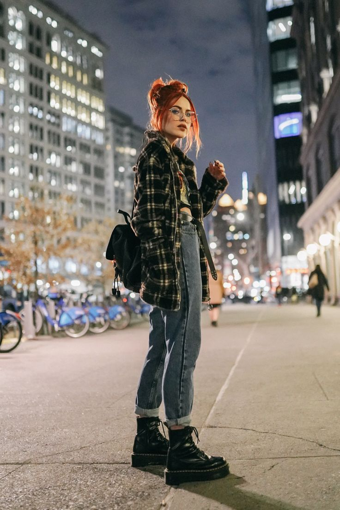

# 软垃圾摇滚（Soft Grunge）
> **状态**: reviewed | 最后更新: 2026-06-23 | 分类: 另类酷感 | **趋势**: 🎭 小众领域

## 📖 概述
- 发源年代: 2010-2014年 Tumblr 全盛期，2022年后在 TikTok 再度复兴
- 发源地: Tumblr / 独立音乐场景（西雅图 90年代 Grunge 的互联网后代）
- 风格关键词（5-8个）: 格纹衬衫、做旧针织、军靴、暗色花卉、撕裂牛仔裤、暗黑学院的前身
- 一句话定义: 90年代 Grunge 的 Tumblr 柔和版——格纹衬衫+做旧针织+军靴+暗色花卉。Kurt Cobain 如果活在 Tumblr 时代，大概就是这样。

## 📜 历史文化
- **起源**: Soft Grunge 是 2010年代早期 Tumblr 的原生审美，将 90年代西雅图 Grunge（Nirvana/Pearl Jam/Hole）的粗糙/愤怒/工业感进行「柔化处理」——加了柔焦滤镜、暗色花卉、和 Tumblr 式的伤感情诗。核心标签 #softgrunge 在 Tumblr 上积累了数百万帖子。它被视为 2020年代 Dark Academia 和 Fairy Grunge 的精神前辈。2022年后在 TikTok 重新被Z世代发现，#SoftGrunge 播放量超 40 亿。
- **发展脉络**:
  - **1991-1994**: 西雅图 Grunge 爆炸——Kurt Cobain 的格纹衬衫+破洞牛仔裤+Converse 成为本源的 Grunge 公式
  - **2010-2014**: Tumblr #SoftGrunge 将 Grunge 柔化——加了暗色花卉、黑白色调和伤感情感的 Tumblr 诗
  - **2015-2018**: 「E-Girl」和「E-Boy」吸收了 Soft Grunge 的部分元素（暗色系/格纹/厚底鞋）
  - **2022-2023**: TikTok Grunge 复兴——新一代发现 Nirvana 和 Soft Grunge，用 Vintage 格纹衬衫+军靴+暗色花卉重新定义
  - **2025-2026**: Soft Grunge 2.0——面料升级（真正的 vintage Levi's 而不是快时尚做旧），更可持续的「旧衣美学」
- **文化意义**: Soft Grunge 是关于「在不完美的世界里找到美感」——它把 Grunge 的反建制愤怒软化为一种安静的悲伤和接纳。它告诉年轻人的是：你可以不 Okay，而且不 Okay 也可以是美的。

## 🎨 美学特征
- **廓形特点**: 宽松颓废——格纹衬衫当外套，oversize 乐队T恤内搭，紧身/直筒牛仔裤在下。核心是「不在乎」的廓形——不是法式慵懒那种精心制造的随意，而是真的不在乎。
- **色板**:
  - 主色调：褪色黑(#2A2A2A)、暗绿(#4A5D4A)、暗酒红(#5C2A34)、灰(#808080)
  - 辅助色：深蓝、芥末黄、奶油白（做旧感）
  - 禁忌色：荧光色、霓虹色、粉彩、亮白
  - 色板逻辑：所有颜色都必须在脑子里想象被洗了五十遍之后的样子——褪色、灰蒙蒙、有故事
- **面料偏好**: 旧棉 > 牛仔 > 做旧针织 > 法兰绒。面料必须是旧的/旧的/旧的。一件全新的东西在 Soft Grunge 的世界里是不合群的。
- **标志单品表**:

| 单品 | 品牌示例 | 选择要点 |
|------|---------|---------|
| 格纹法兰绒衬衫 | Vintage Pendleton, thrift stores | 真的 vintage、oversize、可当外套 |
| 复古乐队T恤 | Vintage/thrift, Urban Outfitters | Nirvana/Pearl Jam/Hole/Tumblr 时代的独立乐队 |
| 撕裂/做旧牛仔裤 | Vintage Levi's, thrift stores | 直筒或紧身、蓝色或黑色、有真的磨损 |
| 军靴/厚底靴 | Dr. Martens, vintage army boots | 黑色、系带、穿过至少一个冬天的 |
| 暗色花卉连衣裙 | Vintage, thrift, Dolls Kill | 黑色底+暗色花卉印花、可叠穿在T恤下 |
| 毛线帽/冷帽 | Vintage, thrift | 黑色或暗色、不花哨——就是冬天戴的那种 |

## 🏷️ 代表品牌
### 核心品牌
| 品牌 | 国家 | 价位 | 一句话 |
|------|------|------|--------|
| Dr. Martens | 英国 | ¥¥ | 1460 八孔靴是 Grunge 和 Soft Grunge 的共享灵魂单品 |
| Urban Outfitters | 美国 | ¥¥ | 商业化 Soft Grunge 的主力军——乐队T恤+做旧牛仔裤 |
| UNIF | 美国 | ¥¥ | 洛杉矶品牌，暗黑+做旧+厚底——Soft Grunge 的商业化升级版 |
| Levi's Vintage | 美国 | ¥¥ | 真正的 vintage 501——比任何做旧仿品都好 |

### 平价替代
| 品牌 | 价位 | 说明 |
|------|------|------|
| Thrift stores | ¥ | Soft Grunge 的本源——二手店才是这个风格的真正「品牌」|
| Depop/Vinted | ¥ | 在线二手平台——找 vintage 格纹衬衫和乐队T恤 |
| H&M（Divided） | ¥ | 格纹衬衫和做旧牛仔裤的入门之选 |
| ASOS（Collusion） | ¥ | 年轻线，暗色系+做旧+格纹 |

## 👤 风格偶像 & 名人
| 人物 | 身份 | 贡献 |
|------|------|------|
| Kurt Cobain | 音乐人 | Nirvana 主唱，虽然他不是 Soft Grunge 而是「真 Grunge」，但他的穿搭是这个风格的圣经 |
| Courtney Love | 音乐人 | Hole 主唱，1990s 的「暗色花卉连衣裙+军靴」公式的原创者 |
| Effy Stonem（角色） | Skins | 《皮囊》中的 Effy 是 Tumblr 时代 Soft Grunge 的审美原爆点——烟熏妆+格纹+做旧 |

### 穿着此风格的博主
| 人物 | 身份 | 为什么是 icon |
|------|------|---------------|
| Halsey | 歌手 | 早期造型有强烈的 Soft Grunge 影响——蓝色头发+做旧T恤+军靴 |
| Hayley Williams | 歌手 | Paramore 主唱，虽然不是全套 Soft Grunge，但她将 Grunge 元素带入流行朋克 |

## 🔗 关联风格
- **父风格**: 另类酷感 (Edgy Alternative)
- **子风格**: 仙女垃圾 (Fairy Grunge)、暗黑学院 (Dark Academia)
- **平行风格**: 独立颓废（WF-24）——共享「Tumblr 时代+做旧美学」，但 Indie Sleaze 更「派对」，Soft Grunge 更「独处」
- **对立风格**: 法式慵懒（WF-01）——Soft Grunge 是真的不在乎，French Effortless 是精心设计的不在乎
- **与姐妹风格差异**:
  1. vs 独立颓废（WF-24）：Soft Grunge 在房间里听 Nirvana，Indie Sleaze 在地下派对上被 Cobrasnake 拍照
  2. vs 仙女垃圾（WF-26）：Soft Grunge 是「西雅图的雨」，Fairy Grunge 是「妖精森林的迷雾」
  3. vs 暗黑学院（WF-12）：Soft Grunge 是「辍学的音乐人」，Dark Academia 是「在校的诗人」

## 📈 流行趋势
- **当前状态**: 周期性复兴——每 5-7 年 Grunge 就会重新回来一次
- **流行区域**: 北美 > 英国 > 澳大利亚。Tumblr 一代已经长大，TikTok 一代正在重新发现
- **发展方向**:
  - 2025-2026：从「快时尚做旧」转向「真正的 vintage」——可持续时尚和二手购物是 Soft Grunge 的最佳伴侣
  - 与「暗黑女性力」交汇——更女性化的 Soft Grunge（暗色花卉连衣裙+军靴）

## 💡 穿搭建议
- **适合体型**: 所有体型——oversize 廓形包容一切
- **适合肤色**: 所有人都能穿黑色。暗绿/暗酒红对暖皮更友好，灰/蓝对冷皮更友好
- **适合场合**: 独立音乐演出、周末逛街、与朋友在小酒馆聚会。不适合：办公室、正式晚宴
- **入门建议**:
  1. 去二手店买一件真的 vintage 格纹衬衫——必须是法兰绒，必须是旧的
  2. 一件真正的 vintage 乐队T恤（不是 Urban Outfitters 仿品）
  3. 一双 Dr. Martens 1460——穿旧比穿新好看
  4. 不要「搭配」——Soft Grunge 的精髓是「随手抓的」，不是「精心配的」

---
*本文基于多源研究整理，AI 辅助生成。*
