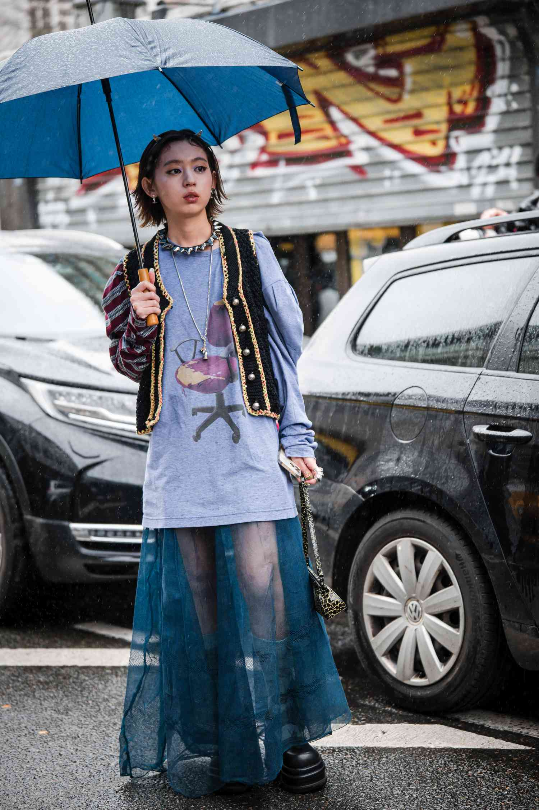

# 独立颓废（Indie Sleaze）
> **状态**: reviewed | 最后更新: 2026-06-23 | 分类: 另类酷感 | **趋势**: 🎭 小众领域

## 📖 概述
- 发源年代: 2008-2014年（全球金融危机后的独立音乐和派对场景），2022年 TikTok 重新发现
- 发源地: 纽约下东区 / 伦敦东区 / 洛杉矶 Echo Park
- 风格关键词（5-8个）: 复古乐队T恤、紧身牛仔裤、闪粉眼影、烟熏妆、闪光摄影、乱糟糟、凌晨五点
- 一句话定义: 2010年代的派对后清晨——复古乐队T恤+紧身牛仔裤+花掉的烟熏妆+闪光摄影。像是在一个被 Cobrasnake 拍过照的地下派对上待到凌晨5点，然后直接去吃早餐。

## 📜 历史文化
- **起源**: Indie Sleaze 是 2008年金融危机后涌起的一股反奢华、反精致的时尚浪潮。当全球经济崩塌时，「穿得贵」突然变得不合时宜——取而代之的是从二手店买来的 $5 乐队T恤、自己剪短的牛仔裤、以及「昨晚没卸妆」的妆容。摄影师 The Cobrasnake（Mark Hunter）记录了洛杉矶和纽约的这场美学革命——他的闪光摄影定义了 Indie Sleaze 的视觉语言。核心音乐场景包括 The Strokes/LCD Soundsystem/The Yeah Yeah Yeahs 等 2000s 独立摇滚，以及 American Apparel 这个品牌。TikTok 在2022年重新挖出 #IndieSleaze，播放量超 80 亿。
- **发展脉络**:
  - **2001-2007**: 纽约独立摇滚复兴——The Strokes/Yeah Yeah Yeahs/Interpol 的音乐和造型为 Indie Sleaze 铺路
  - **2008-2014**: Indie Sleaze 全盛期——American Apparel 的紧身牛仔裤+金属色紧身衣、Cobrasnake 的派对摄影、Hipster Runoff 博客文化
  - **2015-2020**: 被「Instagram 精致美学」压制——Indie Sleaze 太乱、太脏、太不「品牌友好」
  - **2022**: TikTok #IndieSleaze 复兴——Z世代发现他们的哥哥姐姐在2010年看起来「很糟糕但很有趣」
  - **2025-2026**: Indie Sleaze 2.0——保留「乱糟糟」精神但面料更好更可持续
- **文化意义**: 是对「过度策划/过度精致」的反叛。在一个 Instagram 要求每一张照片都完美的时代，Indie Sleaze 说：最有趣的照片永远是闪光灯下、凌晨4点、你不知道有人在拍的那一张。

## 🎨 美学特征
- **廓形特点**: 紧身/短/露——American Apparel 的紧身牛仔裤或 disco 热裤，上身紧身T恤或吊带。廓形是「出门前花了3分钟穿衣服」。乱是核心——衣服皱的、头发乱的、妆是昨晚的。
- **色板**:
  - 主色调：黑色(#000000)、银色/金属(#C0C0C0)、褪色黑(#2A2A2A)、芥末黄(#D4B830)
  - 辅助色：深蓝、血红色、白色（做旧）
  - 禁忌色：粉彩、马卡龙色、驼色——这些颜色在凌晨4点的地下派对格格不入
  - 色板逻辑：闪光摄影下的颜色——高对比、有颗粒感、所有颜色都偏蓝/偏冷
- **面料偏好**: 做旧棉 > 牛仔 > 金属色针织 > 人造皮。面料不重要——重要的是它看起来像从二手店买来然后穿了一百次。
- **标志单品表**:

| 单品 | 品牌示例 | 选择要点 |
|------|---------|---------|
| 复古乐队T恤 | American Apparel (vintage), thrift | 真的 vintage、做旧感、合身偏紧 |
| 紧身牛仔裤/热裤 | American Apparel, Cheap Monday | 紧身、高腰或低腰、黑色或水洗蓝 |
| 金属色/亮片紧身衣 | American Apparel, UNIF | 银色/金色/全息色、可当上衣也可打底 |
| 人造皮夹克 | vintage, AllSaints, Zara | 黑色、做旧感、略oversize |
| 厚底踝靴 | Dr. Martens, Jeffrey Campbell | 黑色、厚底或粗跟、穿旧的 |
| 闪粉眼影/烟熏妆 | MAC, Urban Decay | 不需要完美——花掉比精致更 Indie Sleaze |

## 🏷️ 代表品牌
### 核心品牌
| 品牌 | 国家 | 价位 | 一句话 |
|------|------|------|--------|
| American Apparel | 美国 | ¥¥ | 2000s-2010s 的 Indie Sleaze 制服供应商——金属色紧身衣+紧身牛仔裤+高腰热裤 |
| Cheap Monday | 瑞典 | ¥ | 超紧身牛仔裤之王，Indie Sleaze 的「下半身标配」|
| Dr. Martens | 英国 | ¥¥ | 1460 八孔靴+紧身牛仔裤=地下派对的公式 |
| UNIF | 美国 | ¥¥ | American Apparel 倒闭后接手了 Indie Sleaze 的衣钵——厚底鞋+做旧T恤 |

### 平价替代
| 品牌 | 价位 | 说明 |
|------|------|------|
| Thrift stores / Depop | ¥ | Indie Sleaze 的本源——真正的 vintage 乐队T恤和做旧牛仔裤 |
| ASOS（Collusion） | ¥ | 做旧T恤和紧身牛仔裤的入门选择 |
| Zara | ¥ | 人造皮夹克和金属色单品的季节性供应 |

## 👤 风格偶像 & 名人
| 人物 | 身份 | 贡献 |
|------|------|------|
| The Cobrasnake (Mark Hunter) | 摄影师 | 虽然不是「穿的人」，但他的闪光摄影定义了 Indie Sleaze 的视觉语言 |
| Karen O | 音乐人 | Yeah Yeah Yeahs 主唱，2000s 独立摇滚造型的 Indie Sleaze 先驱 |
| Sky Ferreira | 歌手/模特 | 2010s 的 Indie Sleaze 面容——乱糟糟的金发+烟熏妆+做旧T恤 |
| Alexa Chung | 博主/设计师 | 虽然不是全套 Indie Sleaze，但她的 2010s 造型中有强烈的派对后清晨感 |

### 穿着此风格的博主
| 人物 | 身份 | 为什么是 icon |
|------|------|---------------|
| Charli XCX | 歌手 | 2013-2014 的 Tumblr 时代造型（特别是《True Romance》时期）是 Indie Sleaze 的商业化版本 |
| Effy Stonem（角色） | Skins | 虽然不是「独立摇滚」而是「派对少女」，但她的造型与 Indie Sleaze 大量重叠 |

## 🔗 关联风格
- **父风格**: 另类酷感 (Edgy Alternative)
- **子风格**: 派对后清晨 (Morning After)、独立摇滚 (Indie Rock)
- **平行风格**: 软垃圾摇滚（WF-23）——共享「Tumblr/二手/做旧」，但 Indie Sleaze 是「派对上的」，Soft Grunge 是「独处时的」
- **对立风格**: 静奢风（WF-17）——Indie Sleaze 是「全身上下$50二手货」，Quiet Luxury 是「一件羊绒衫$3000」
- **与姐妹风格差异**:
  1. vs 软垃圾摇滚（WF-23）：Indie Sleaze 需要闪光摄影和派对人潮，Soft Grunge 需要耳机和空房间
  2. vs 都市酷感（WF-25）：Indie Sleaze 是凌晨4点的混乱，Downtown Cool 是下午3点的从容
  3. vs 摇滚chic（WF-42）：Indie Sleaze 更「地下/DIY」，Rock Chic 更「时装化/奢侈化」

## 📈 流行趋势
- **当前状态**: 周期性复兴——每隔几年就被重新发现一次
- **流行区域**: 纽约/洛杉矶 > 伦敦 > 柏林。地下音乐场景活跃的城市
- **发展方向**:
  - 2025-2026：Indie Sleaze 2.0——保留「乱糟糟」精神，但面料来自可持续品牌和真正的 vintage
  - 与「反社交媒体审美」趋势融合——在 BeReal/Photo Dump 的时代，Indie Sleaze 的「不完美」重新变得珍贵

## 💡 穿搭建议
- **适合体型**: 所有体型——但紧身牛仔裤+合身T恤的经典公式对沙漏/直筒形更友好
- **适合肤色**: 黑色+金属色对所有肤色友好
- **适合场合**: 地下音乐会、独立乐队演出、朋友家派对、凌晨之后的所有地方
- **入门建议**:
  1. 去二手店买一件真正的 vintage 乐队T恤——The Strokes/LCD Soundsystem/Arcade Fire
  2. 一条紧身牛仔裤——American Apparel vintage 或 Cheap Monday
  3. 一双黑色厚底靴——Dr. Martens 或 vintage combat boots
  4. 妆容可以不卸——这不是不整洁，这是 Indie Sleaze

---
*本文基于多源研究整理，AI 辅助生成。*
