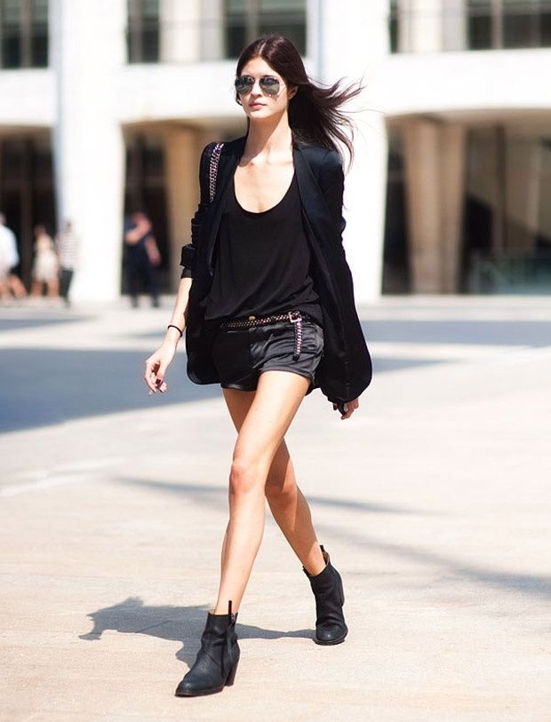

# 都市酷感（Downtown Cool）
> **状态**: reviewed | 最后更新: 2026-06-23 | 分类: 另类酷感 | **趋势**: 🎭 小众领域

## 📖 概述
- 发源年代: 2010年代，美学根源在纽约 SOHO/东村和伦敦 Shoreditch 的创意阶层
- 发源地: 纽约下城 / 伦敦东区 / 柏林 Mitte——城市中「还没有被完全士绅化」的创意街区
- 风格关键词（5-8个）: 皮夹克、单色调、利落基础款、大墨镜、都市态度、不费力、建筑感
- 一句话定义: 都市创意工作者的日常气场——皮夹克+单色基础款+大墨镜。不是要去时装周，这就是她每天去工作室的样子。

## 📜 历史文化
- **起源**: Downtown Cool 不是被 TikTok 命名的——它是一个更有机的、来自城市创意阶层的着装态度。它的根源在 1970-80年代纽约下城的艺术场景（Basquiat/Warhol/Factory 时代），在 1990年代的极简主义（Helmut Lang/Jil Sander），在 2000年代 Alexander Wang 的「off-duty model」审美。它不是一个有明确标签的「流行现象」，而是都市创意圈的一种共识：穿得好但不要看起来像「穿得好」。
- **发展脉络**:
  - **1970-80s**: 纽约下城艺术场景——Basquiat 的西装外套+白T恤、Debbie Harry 的皮夹克+牛仔裤
  - **1990s**: Helmut Lang 将「都市酷感」系统化为时装——黑白灰+建筑廓形+功能面料
  - **2000s**: Alexander Wang 的「off-duty model」审美——模特下班后的穿搭（皮夹克+白T恤+紧身裤）
  - **2010s**: 纽约/伦敦的创意工作者（设计师/编辑/艺术家）将 Downtown Cool 变成一种职业着装
  - **2020s**: 疫情期间的「在家办公」让 Downtown Cool 沉寂了两年
  - **2023-2026**: 重返办公室+重返城市——Downtown Cool 复活，但更松弛（oversize 西装替代紧身夹克）
- **文化意义**: Downtown Cool 是关于「酷的不费力」——它告诉你：真正的酷不需要通过颜色、印花、或 Logo 来证明。一件黑皮夹克+白T恤+黑裤已经是最有力的时尚声明。

## 🎨 美学特征
- **廓形特点**: 结构感+松弛感的平衡——西装外套有肩线但不僵硬，裤子高腰但垂坠。核心是「建筑感」——衣服像是被一位建筑师设计过的，每个面都有意图。
- **色板**:
  - 主色调：黑色(#000000)、白色(#FFFFFF)、深灰(#4A4A4A)、驼色(#C4A882)
  - 辅助色：深蓝、炭灰、酒红色（极少使用，用作破局）
  - 禁忌色：荧光色、粉彩、印花、多色组合
  - 色板逻辑：黑白摄影的颜色——去掉颜色，只看形态和廓形
- **面料偏好**: 皮质 > 羊毛 > 棉 > 丝绸。面料要有「质感」——不一定要贵，但摸上去/看上去必须有分量。
- **标志单品表**:

| 单品 | 品牌示例 | 选择要点 |
|------|---------|---------|
| 皮夹克/皮大衣 | Acne Studios, AllSaints, The Row | 黑色、无铆钉/流苏等多余装饰、摩托车款或西装款 |
| 白T恤/白衬衫 | COS, Arket, Vince | 厚棉、挺括、不透 |
| 高腰直筒/阔腿裤 | The Row, COS, Vince | 高腰、垂坠、黑色或驼色 |
| 大墨镜 | Celine, Ray-Ban, Le Specs | 黑色边框、大尺寸、遮半张脸 |
| 建筑感西装外套 | Helmut Lang, Jil Sander, COS | 略oversize、黑色或炭灰、无Logo |
| 极简踝靴/乐福鞋 | The Row, Gucci, COS | 黑色、尖头或方头、低跟 |

## 🏷️ 代表品牌
### 核心品牌
| 品牌 | 国家 | 价位 | 一句话 |
|------|------|------|--------|
| Helmut Lang | 奥地利/美国 | ¥¥¥ | 1990s 定义了「都市酷感」的时装语言——建筑廓形+功能面料+黑白灰 |
| Jil Sander | 德国 | ¥¥¥¥ | 极简主义的德国女王——她的西装外套和大衣是 Downtown Cool 的圣物 |
| Acne Studios | 瑞典 | ¥¥¥ | 北欧创意圈的最爱——皮夹克和极简西装外套的当代标杆 |
| Alexander Wang | 美国 | ¥¥¥ | 2000s 的「off-duty model」美学——皮夹克+白T恤+紧身裤 |
| COS | 瑞典 | ¥¥ | Downtown Cool 的「平价制服供应商」——建筑师感的基础款 |

### 平价替代
| 品牌 | 价位 | 说明 |
|------|------|------|
| COS | ¥¥ | 本身就是 Downtown Cool 的平价核心品牌 |
| Arket | ¥¥ | COS 姐妹牌，更日常更舒适 |
| Massimo Dutti | ¥¥ | 西班牙优雅，西装和皮夹克的平价选择 |
| Uniqlo U | ¥ | Christophe Lemaire 联名线，¥300 的极简T恤和裤子 |

## 👤 风格偶像 & 名人
| 人物 | 身份 | 贡献 |
|------|------|------|
| Phoebe Philo | 设计师 | Old Celine 的创造者，她的个人穿搭（白衬衫+阔腿黑裤+Stan Smith）是 Downtown Cool 的圣经 |
| Debbie Harry | 音乐人 | Blondie 主唱，1970s 纽约下城的 Downtown Cool 原型——皮夹克+金发+态度 |
| Carolyn Bessette-Kennedy | 公关 | 1990s 纽约的 Downtown Cool 终极 icon——白衬衫+黑色阔腿裤+零装饰+绝不解释 |

### 穿着此风格的明星/博主
| 人物 | 身份 | 为什么是 icon |
|------|------|---------------|
| Kendall Jenner | 模特 | 街头造型几乎全是 Downtown Cool 公式——皮夹克+白T恤+直筒裤+大墨镜 |
| Rosie Huntington-Whiteley | 模特 | Downtown Cool 的「高端版」——The Row/Bottega/Khaite |
| Brittany Bathgate | 英国博主 | 极简主义的英国 Downtown Cool——建筑感+单色+比例游戏 |

## 🔗 关联风格
- **父风格**: 另类酷感 (Edgy Alternative)
- **子风格**: 都市极简 (Urban Minimalist)、创意工作者 (Creative Professional)
- **平行风格**: 极简（WF-06）——共享黑白灰+建筑廓形，但 Downtown Cool 更「有态度/更酷」
- **对立风格**: 田园牧歌（WF-13）——Downtown Cool 在城市画廊，Cottagecore 在乡下花园
- **与姐妹风格差异**:
  1. vs 极简（WF-06）：Downtown Cool 有一件皮夹克作为「态度锚点」，Minimalist 拒绝所有「态度单品」
  2. vs 静奢风（WF-17）：Downtown Cool 可以穿 COS/Arket（¥¥），Quiet Luxury 穿 The Row/Loro Piana（¥¥¥¥）
  3. vs 法式慵懒（WF-01）：Downtown Cool 是纽约的「酷」，French Effortless 是巴黎的「随意」

## 📈 流行趋势
- **当前状态**: 稳定共识——不是 TikTok 趋势，而是都市创意阶层的默认着装
- **流行区域**: 纽约 > 伦敦 > 柏林 > 哥本哈根 > 东京。在创意产业或有艺术氛围的城市更常见
- **发展方向**:
  - 2025-2026：oversize 廓形进一步软化——西装外套从「建筑结构」转向「绸缎般的垂坠」
  - 可持续面料：The Row 和 COS 都在推进可持续皮质和再生羊毛

## 💡 穿搭建议
- **适合体型**: 所有体型——高腰阔腿裤+oversize 西装是万用公式
- **适合肤色**: 黑色对所有肤色友好；驼色/白色对暖皮更友好
- **适合场合**: 创意办公室、画廊开幕、展览、咖啡馆、周末逛街。最适合：不需要穿正装但有品味要求的创意工作
- **入门建议**:
  1. 投资一件好皮夹克——Acne Studios（投资款）或 AllSaints（中端）或 COS（平价款）
  2. 五件白T恤——因为你会每天穿，买好的棉
  3. 一条高腰黑色阔腿裤——COS 或 The Row
  4. 一副大墨镜——这是 Downtown Cool 最低成本的「态度配件」

---
*本文基于多源研究整理，AI 辅助生成。*
