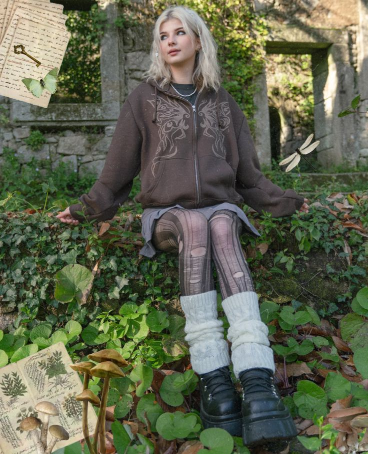

# 仙女垃圾（Fairy Grunge）
> **状态**: reviewed | 最后更新: 2026-06-23 | 分类: 另类酷感 | **趋势**: 🎭 小众领域

## 📖 概述
- 发源年代: 2021-2022年 TikTok 爆发，融合了 Soft Grunge 和 Fairycore 的双重基因
- 发源地: 互联网（TikTok / Pinterest），无单一地理中心
- 风格关键词（5-8个）: 暗色花卉、撕裂蕾丝、做旧针织、苔藓绿、妖精翅膀暗示、森林魔幻、褪色紫
- 一句话定义: 像在魔法森林里住了太久的妖精——暗色花卉+撕裂蕾丝+苔藓绿+军靴。Soft Grunge 和 Fairycore 的孩子，喜欢在月光下的森林里赤脚走路。

## 📜 历史文化
- **起源**: Fairy Grunge 是 TikTok 上两个小众审美的碰撞产物——Soft Grunge（暗黑/做旧/Grunge）和 Fairycore（妖精/森林/魔幻）。它在 2021-2022 年间自然生长，没有单一引爆点。视觉参考包括《仲夏夜之梦》的森林妖精、《指环王》的精灵、以及 1990s 的黑暗奇幻电影。TikTok #FairyGrunge 播放量超 30 亿。
- **发展脉络**:
  - **1990s**: 黑暗奇幻电影和 Grunge 音乐为 Fairy Grunge 的双重基因埋下种子
  - **2010-2014**: Tumblr Soft Grunge 提供了「暗色做旧」的审美基础
  - **2019-2020**: Fairycore 在 TikTok 上爆发——妖精翅膀、森林、魔幻
  - **2021-2022**: Fairy Grunge 在 TikTok 上被正式命名
  - **2023-2026**: 保持小众但忠实的粉丝群——Fairy Grunge 很满足于做「森林暗黑少女」的审美归宿
- **文化意义**: Fairy Grunge 是关于「拥抱内在的野生/黑暗/魔幻」——它告诉女孩们：你可以同时是柔软的和危险的，可以同时是妖精的和人类的。

## 🎨 美学特征
- **廓形特点**: 层叠+不对称——暗色花卉连衣裙外搭做旧开衫，撕裂蕾丝叠穿在T恤上。核心是「被森林弄乱的」——裙摆被树枝刮破、袖口沾了苔藓、头发里有树叶。
- **色板**:
  - 主色调：苔藓绿(#5C6E4F)、褪色紫(#6B5B7B)、暗灰(#6B6B6B)、午夜蓝(#1B2A4A)
  - 辅助色：褪色黑、尘粉、深棕、骨白色
  - 禁忌色：荧光色、霓虹色、亮白、糖果色
  - 色板逻辑：夜晚森林的颜色——树影、苔藓、月光、湿泥、枯叶
- **面料偏好**: 做旧棉 > 蕾丝 > 钩针编织 > 薄纱。面料要有「被时间磨损过」的质感。
- **标志单品表**:

| 单品 | 品牌示例 | 选择要点 |
|------|---------|---------|
| 暗色花卉连衣裙 | Vintage, thrift, Dolls Kill | 黑色/暗蓝底+暗色花卉、及膝或中长 |
| 撕裂蕾丝开衫/披肩 | Vintage, thrift, Etsy | 真的 vintage 蕾丝、边缘有自然磨损 |
| 做旧厚针织衫 | Vintage, thrift | oversize、颜色像从泥土里挖出来的 |
| 厚底军靴/系带靴 | Dr. Martens, vintage | 黑色、厚底、穿过至少一个雨季 |
| 苔藓绿/深色紧身裤 | UNIF, vintage | 黑色或苔藓绿、可叠穿在连衣裙下 |
| 藤蔓/树枝状首饰 | Etsy 手工、vintage | 像从森林里捡来的——树根/藤蔓形态 |

## 🏷️ 代表品牌
### 核心品牌
| 品牌 | 国家 | 价位 | 一句话 |
|------|------|------|--------|
| Dr. Martens | 英国 | ¥¥ | 军靴是 Fairy Grunge 的「扎根地面」——让妖精不至于太飘 |
| Dolls Kill | 美国 | ¥¥ | 暗黑少女+哥特+亚文化的大集合，暗色花中裙的最佳供应商 |
| UNIF | 美国 | ¥¥ | 暗色做旧的洛杉矶品牌，Fairy Grunge 的商业化版本 |
| Killstar | 英国 | ¥¥ | 哥特/巫术/暗黑少女——Fairy Grunge 的「黑魔法」装备 |

### 平价替代
| 品牌 | 价位 | 说明 |
|------|------|------|
| Thrift stores / Depop | ¥ | 依然是最好的来源——vintage 暗色花卉裙和做旧针织 |
| H&M（Divided） | ¥ | 暗色花卉连衣裙的季节性供应 |
| Etsy 手工 | ¥-¥¥ | 手工蕾丝开衫和藤蔓首饰 |

## 👤 风格偶像 & 名人
| 人物 | 身份 | 贡献 |
|------|------|------|
| Stevie Nicks | 歌手 | 1970s 的「白女巫」——披肩+飘逸长裙+树林中的旋转。Fairy Grunge 的「光明面」原型 |
| Florence Welch | 歌手 | Florence + the Machine 的森林/魔幻/妖精视觉美学 |
| Alice Glass | 音乐人 | Crystal Castles 前主唱，暗黑+做旧+撕裂美学的电子/噪音版 |

## 🔗 关联风格
- **父风格**: 另类酷感 (Edgy Alternative)
- **子风格**: 暗黑仙女 (Dark Fairycore)、哥特妖精 (Goth Pixie)
- **平行风格**: 软垃圾摇滚（WF-23）——共享「做旧/暗色/Grunge基因」，Fairy Grunge 加了「妖精/魔幻/森林」
- **对立风格**: 田园牧歌（WF-13）——Cottagecore 是「阳光下的野花」，Fairy Grunge 是「月光下的苔藓」
- **与姐妹风格差异**:
  1. vs 软垃圾摇滚（WF-23）：Fairy Grunge 有蕾丝和暗色花卉的「柔」，Soft Grunge 只有格纹和军靴的「硬」
  2. vs 田园草地（WF-22）：Meadowcore 是中午的草地，Fairy Grunge 是午夜的森林
  3. vs 暗黑女性力（WF-31）：Dark Feminine 更「城市的/夜店的/红酒的」，Fairy Grunge 更「森林的/月光的/苔藓的」

## 📈 流行趋势
- **当前状态**: 小众稳定——不会成为大众趋势，但有非常忠实的追随者
- **流行区域**: 北美 > 英国 > 北欧。森林/自然风景好的地区更容易滋生
- **发展方向**: 与「森林浴」和「自然灵性」生活方式融合

## 💡 穿搭建议
- **适合体型**: 所有体型——层叠+宽松廓形包容一切
- **适合肤色**: 冷皮穿苔藓绿/褪色紫最出色；暖皮可选暗棕/暗酒红
- **适合场合**: 森林徒步、独立音乐演出、篝火聚会
- **入门建议**:
  1. 去二手店找一条暗色花卉连衣裙——黑色底+暗色印花
  2. 一件做旧针织开衫——像在森林里穿了一整个冬天的那种
  3. 一双 Dr. Martens——把妖精的脚扎根在地面上
  4. 往头发里插一根真的小树枝——最 Fairy Grunge 的免费配饰

---
*本文基于多源研究整理，AI 辅助生成。*
