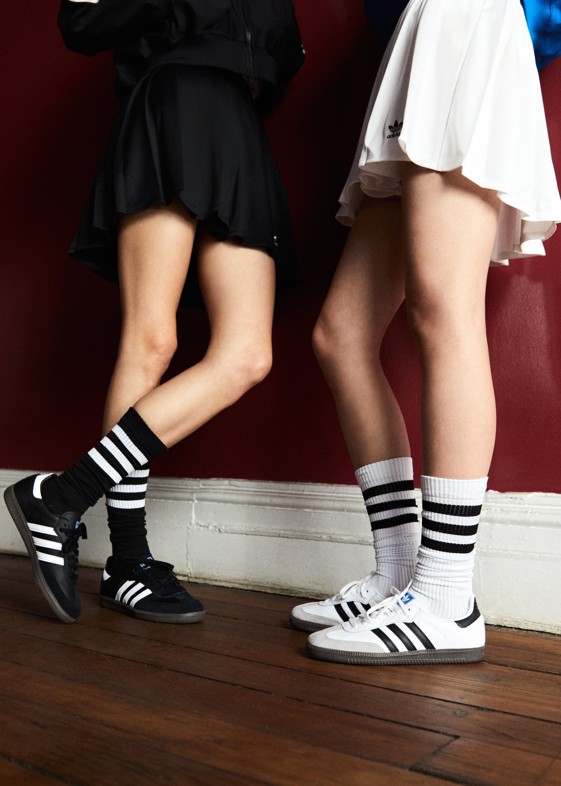

# 运动少女混搭（Blokette）
> **状态**: reviewed | 最后更新: 2026-06-23 | 分类: 都市街头 | **趋势**: 🔥 流行趋势

## 📖 概述
- 发源年代: 2024年 TikTok 爆发（#Blokette 标签），根源在英国足球看台文化和 1990s 的运动混搭
- 发源地: 互联网（TikTok）+ 英国足球看台文化
- 风格关键词（5-8个）: 足球/橄榄球球衣、百褶裙、运动袜+运动鞋、运动×女性化、看台文化、混搭
- 一句话定义: 「Blokette」=「Bloke」（英国俚语「哥们」）+「Coquette」（甜媚风）——足球球衣+百褶裙+运动袜+运动鞋。把足球看台文化和少女美学焊在一起。

## 📜 历史文化
- **起源**: Blokette 是 TikTok 2024年最有趣的风格发明之一。它把两个看似矛盾的世界——英国足球看台上的「bloke」文化（球衣/运动裤/啤酒）和 Coquette 的少女精致（蝴蝶结/百褶裙/粉色）——强行焊在一起，结果出乎意料地好。视觉参考包括 1990s 英国流行文化中的 Spice Girls（特别是 Sporty Spice+Baby Spice 的混搭）、2000s 的足球 WAGs 文化（球员女友/妻子的穿搭），以及当代女足运动员的时尚化趋势。TikTok #Blokette 播放量超 40 亿。
- **发展脉络**:
  - **1996-1998**: Spice Girls 时代——Sporty Spice 穿球衣/tracksuit，Baby Spice 穿粉色迷你裙，两者的混搭预演了 Blokette
  - **2000-2006**: 足球 WAGs 文化——Victoria Beckham/Cheryl Cole 等球员女友将球衣+高跟鞋变成流行
  - **2022-2023**: Coquette 爆发，女性对「极致甜美」的兴趣达到峰值
  - **2024**: TikTok #Blokette——球衣+百褶裙+运动袜+Adidas Samba 成为公式
  - **2025-2026**: 从「刻意混搭」转向「自然融合」——运动元素和女性化元素的边界越来越模糊
- **文化意义**: Blokette 是关于「女性可以同时是球迷和少女」的声明——它拒绝「喜欢足球就不能穿裙子，穿裙子就不能看球」的二元对立。它是体育文化中的女性赋权。

## 🎨 美学特征
- **廓形特点**: 上松下紧或上下对比——oversize 球衣在上，迷你百褶裙在下。核心是「反差」——球衣的粗犷（oversize/聚酯/球队Logo）vs 百褶裙的精致（合身/棉质/褶皱）。
- **色板**:
  - 主色调：球队颜色（红/蓝/条纹等）、白色(#FFFFFF)、粉色(#F4C2C2)、黑色(#000000)
  - 辅助色：银色（首饰/鞋扣）、灰色（运动袜）
  - 禁忌色：没有绝对禁忌——Blokette 就是为了打破规则
  - 色板逻辑：你喜欢的球队的颜色 + Coquette 的粉色系
- **面料偏好**: 聚酯球衣 > 棉质百褶裙 > 尼龙运动裤 > 针织。运动面料和精致面料的碰撞。
- **标志单品表**:

| 单品 | 品牌示例 | 选择要点 |
|------|---------|---------|
| 足球/橄榄球球衣 | Vintage football kits, Umbro, Nike | 真的 vintage 球衣更好，或任何你支持的球队的球衣 |
| 百褶迷你裙 | American Apparel, Brandy Melville | 高腰、网球裙或校服裙款式、白色/灰色/粉色 |
| 运动袜（及膝） | Adidas, Nike, Converse | 白色为主、及膝、带条纹 |
| 复古运动鞋 | Adidas Samba/Gazelle, Nike Cortez | 复古足球鞋款——Samba 是 Blokette 的灵魂鞋 |
| 运动夹克/tracksuit | Adidas Originals, vintage | 三叶草是标配、可搭在肩上 |
| 蝴蝶结发饰 | Sandy Liang, 平价 | 运动+精致的混搭——蝴蝶结是「Coquette」的基因标记 |

## 🏷️ 代表品牌
### 核心品牌
| 品牌 | 国家 | 价位 | 一句话 |
|------|------|------|--------|
| Adidas Originals | 德国 | ¥¥ | Blokette 的制服供应商——Samba+三叶草球衣+tracksuit |
| Umbro | 英国 | ¥¥ | 1924年创立，英国足球文化的本土品牌——真正看台上的球衣 |
| Nike | 美国 | ¥¥ | 运动袜+运动鞋+球衣的「全球运动硬件」供应商 |
| Brandy Melville | 意大利 | ¥ | 百褶裙和针织衫的 Blokette 少女面 |

### 平价替代
| 品牌 | 价位 | 说明 |
|------|------|------|
| Vintage shops / Depop | ¥ | 真正的 vintage 球衣——比新球衣更有 Blokette 精神 |
| H&M | ¥ | 百褶裙和运动袜的入门之选 |
| Uniqlo | ¥ | 基础款运动元素（棉质运动裤/白T恤） |

## 👤 风格偶像 & 名人
| 人物 | 身份 | 贡献 |
|------|------|------|
| Sporty Spice (Mel C) | 歌手 | Spice Girls 的 Sporty Spice——球衣+tracksuit+厚底运动鞋的 90s 原型 |
| Victoria Beckham | 设计师/前歌手 | 2000s WAGs 文化的时尚化身——球衣+牛仔裤+高跟鞋 |
| Alexia Putellas | 足球运动员 | 巴萨和西班牙女足队长，Blokette 的「真实版」——她本身就是顶级球员，穿球衣不是为了混搭 |

### 穿着此风格的博主
| 人物 | 身份 | 为什么是 icon |
|------|------|---------------|
| TikTok #Blokette 创作者 | TikTok | 百万普通女孩用球衣+百褶裙+Samba 创造了这个风格的视觉库 |
| Grace Beverley | 博主/企业家 | 英国博主，运动×时尚混搭的 Blokette 精神代表 |

## 🔗 关联风格
- **父风格**: 都市街头 (Urban Street)
- **子风格**: 足球少女 (Footy Girl)、运动甜心 (Athletic Coquette)
- **平行风格**: 运动休闲（WF-08）——共享运动基因，但 Athleisure 是「健身房到咖啡馆」，Blokette 是「足球看台到酒吧」
- **对立风格**: 皇室浪漫（WF-32）——Blokette 在看台喝啤酒，Royalcore 在宫廷喝茶
- **与姐妹风格差异**:
  1. vs 运动休闲（WF-08）：Blokette 的核心是「反差/混搭」，Athleisure 的核心是「统一/功能性」
  2. vs 甜媚少女（WF-15）：Blokette 是 Coquette 抢了男朋友的球衣穿，Coquette 是 Coquette 精心挑选的蕾丝
  3. vs 女性街头（WF-28）：Blokette 有明确的「女性化/精致化」意图，Streetwear Women 更 hardcore

## 📈 流行趋势
- **当前状态**: 上升期——2024年 TikTok 爆发后仍在快速扩大受众
- **流行区域**: 英国 > 美国 > 欧洲。足球文化强的地区 Blokette 更 native
- **发展方向**:
  - 2025-2026：从「刻意混搭」转向「自然融合」——球衣剪裁更合身、百褶裙更运动化
  - 女足热潮推动——2023女足世界杯后，更多女孩开始将球衣穿成日常

## 💡 穿搭建议
- **适合体型**: 所有体型——oversize 球衣+高腰百褶裙制造A字曲线
- **适合肤色**: 球衣的颜色随你喜欢的球队走——米兰的红黑、巴萨的红蓝、阿根廷的蓝白
- **适合场合**: 看球赛（当然）、周末逛街、朋友聚会、音乐节
- **入门建议**:
  1. 从你支持的球队的 vintage 球衣开始——或任何你觉得好看的球衣
  2. 一条高腰百褶短裙——白色/黑色/灰色最百搭
  3. 一双 Adidas Samba——复古足球鞋是 Blokette 的灵魂
  4. 及膝白色运动袜——把运动袜拉到膝盖以下，制造「刚踢完球」的随意感

---
*本文基于多源研究整理，AI 辅助生成。*
