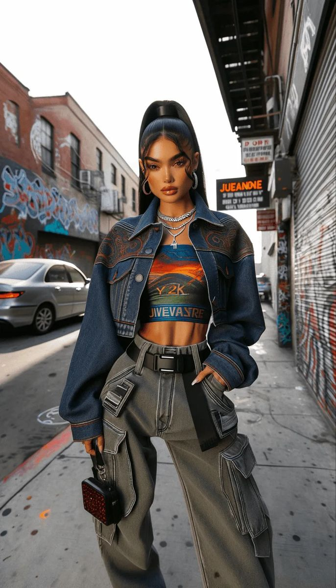

# 女性街头（Streetwear Women）
> **状态**: reviewed | 最后更新: 2026-06-23 | 分类: 都市街头 | **趋势**: 🎭 小众领域

## 📖 概述
- 发源年代: 2010年代中期兴起，根源在 1980-90s 纽约嘻哈和加州滑板文化
- 发源地: 纽约 / 洛杉矶 / 东京——街头文化的三大圣城
- 风格关键词（5-8个）: 大号帽衫、限量球鞋、运动裤、街头Logo、叠穿、滑板/嘻哈文化、功能性
- 一句话定义: 嘻哈和滑板文化的女性版——大号帽衫+限量球鞋+运动裤+街头Logo。不追求「显瘦」或「优雅」，追求的是「酷」。

## 📜 历史文化
- **起源**: 女性街头风格是街头文化自然「破圈」的结果。最初的街头风格是男性的——1980s 纽约嘻哈场景（Run-DMC 的 Adidas 运动服+球鞋）、1990s 加州滑板文化（Stüssy/Supreme/Thrasher）、2000s 日本里原宿（A Bathing Ape/Undercover）。女性在很长一段时间里只是「借用」男性街头单品，直到 2010年代中期——Rihanna 的 Fenty x Puma、Virgil Abloh 的 Off-White、以及 Instagram 上的女性球鞋收藏者——让「女性街头」成为一个独立的审美范畴，而不仅仅是「穿男装」。
- **发展脉络**:
  - **1980s**: 纽约嘻哈——Run-DMC 穿 Adidas Superstar + tracksuit，开启了「球鞋即身份」的文化
  - **1990s**: 加州滑板+日本里原宿——Supreme (1994) 和 A Bathing Ape (1993) 将限量/drop culture 机制引入街头
  - **2000s**: Pharrell Williams 和 Kanye West 将街头×奢侈的跨界变成可能
  - **2010s**: Rihanna 的 Fenty x Puma (2016) 和 Virgil Abloh 的 Off-White 将「女性街头」变成流行
  - **2018-2022**: 球鞋文化爆炸——Jordan 1/Dunk/Yeezy 的女性球鞋市场急剧扩大
  - **2023-2026**: 女性街头成熟——从「抢男友的衣服」到「设计师专门为女性剪裁的街服」
- **文化意义**: 女性街头是关于「女性也可以穿得宽松/有力量/不以取悦为目的」——它拒绝「女装必须显身材」的传统规则，用 oversize 和球鞋宣告：「我定义什么是女人味」。

## 🎨 美学特征
- **廓形特点**: oversize 主导——大号帽衫到臀部以下，宽松工装裤或运动裤，oversize T恤当连衣裙。核心是「不勾勒身体线条」——在女装被「显腰身」统治的世界里，女性街头选择「不显」。
- **色板**:
  - 主色调：黑色(#000000)、白色(#FFFFFF)、灰色(#808080)、军绿(#4A5D4A)
  - 辅助色：品牌色（Supreme 红/Nike 橙/Off-White 黄等）、迷彩
  - 禁忌色：粉彩、马卡龙色（太「甜」不符合街头态度）
  - 色板逻辑：城市环境的颜色——混凝土灰、沥青黑、涂鸦彩、军装绿
- **面料偏好**: 重磅棉 > 尼龙 > 牛仔 > 皮革。面料要有「厚度」——一件好的帽衫是 400gsm 以上的法国毛圈棉。
- **标志单品表**:

| 单品 | 品牌示例 | 选择要点 |
|------|---------|---------|
| 大号帽衫/卫衣 | Supreme, Off-White, Nike ACG | oversize、重磅棉、有态度 |
| 限量球鞋 | Nike/Jordan, Adidas/Yeezy, New Balance | AJ1/AJ4/Dunk/Samba/Yeezy 350——球鞋是身份符号 |
| 工装裤/宽松运动裤 | Carhartt WIP, Nike ACG, Stüssy | 宽松、多口袋、黑色/军绿/灰色 |
| 棒球帽/渔夫帽 | Supreme, Nike, vintage | 棒球帽平檐或弯檐均可，颜色要干净 |
| 腰包/胸包 | Supreme, Off-White, Nike | 可斜挎可胸前可腰间 |
| Logo T恤 | Supreme, Stüssy, Palace, Off-White | 街头品牌的核心——Logo 就是一切 |

## 🏷️ 代表品牌
### 核心品牌
| 品牌 | 国家 | 价位 | 一句话 |
|------|------|------|--------|
| Supreme | 美国 | ¥¥¥-¥¥¥¥ | 1994年创立于纽约，街头品牌的教皇——每周四的 drop 是街头文化的礼拜仪式 |
| Off-White | 美国/意大利 | ¥¥¥¥ | Virgil Abloh 2012年创立，将「引号」和「警戒线」变成街头奢侈的视觉语言 |
| Stüssy | 美国 | ¥¥-¥¥¥ | 1980年创立，冲浪/滑板文化的始祖——比 Supreme 更老/更 chill |
| Palace | 英国 | ¥¥-¥¥¥ | 2009年创立，伦敦滑板品牌——英国街头的幽默版 Supreme |
| Carhartt WIP | 美国/德国 | ¥¥ | Carhartt 的欧洲街头支线——工装裤和帽衫的街头标配 |
| Nike/Jordan | 美国 | ¥¥-¥¥¥¥ | 球鞋即信仰——AJ1 Retro High 是女性街头的「正装鞋」|

### 平价替代
| 品牌 | 价位 | 说明 |
|------|------|------|
| Uniqlo U | ¥ | 基础款帽衫和宽松裤的入门之选 |
| H&M（Divided） | ¥ | 街头风格基础款 |
| ASOS（Collusion） | ¥ | 年轻街头线 |

## 👤 风格偶像 & 名人
| 人物 | 身份 | 贡献 |
|------|------|------|
| Rihanna | 歌手/企业家 | 2016 Fenty x Puma 将「女性街头」变成了全球现象——oversize hoodie+高跟球鞋 |
| Virgil Abloh | 设计师 | Off-White 创始人，将街头文化带入奢侈品世界的建筑师 |
| Aleali May | 设计师/模特 | 女性球鞋文化的开创者——Jordan Brand 的首位女性合作者 |
| Yoon Ahn | 设计师 | AMBUSH 创始人，将日本街头文化+女性视角带入 Dior Homme |

### 穿着此风格的明星/博主
| 人物 | 身份 | 为什么是 icon |
|------|------|---------------|
| Bella Hadid | 模特 | 街头造型是 2010s-2020s 女性街头的教科书 |
| Hailey Bieber | 模特 | oversize 帽衫+球鞋+紧身裤的日常公式 |
| Emily Oberg | 设计师 | 前 Kith 女装创意总监，女性街头的「正统派」代表 |

## 🔗 关联风格
- **父风格**: 都市街头 (Urban Street)
- **子风格**: 球鞋少女 (Sneakerhead Girl)、运动奢华 (Athluxury)
- **平行风格**: 运动休闲（WF-08）——共享「舒适」精神，但 Streetwear 更「有态度/有文化」
- **对立风格**: 皇室浪漫（WF-32）——街头是「在街上」，Royalcore 是「在宫廷」
- **与姐妹风格差异**:
  1. vs 运动休闲（WF-08）：街头有 Logo/限量/品牌信仰，Athleisure 只有功能性
  2. vs 嘻哈华丽（WF-39）：街头偏滑板/冲浪/极简，Hip Hop Glam 偏奢华/金饰/珠宝
  3. vs 运动少女混搭（WF-27）：街头更 hardcore/正统，Blokette 更混搭/精致化

## 📈 流行趋势
- **当前状态**: 主流成熟——街头风格已经从「亚文化」进入「主流大时尚」，Louis Vuitton x Supreme (2017) 是标志
- **流行区域**: 全球。纽约/洛杉矶/东京/伦敦/上海
- **发展方向**:
  - 2025-2026：女性街头的「成熟化」——更高品质的面料、更精致的剪裁、但保留 street attitude
  - 可持续街头——Pangaia 等品牌将环保面料引入街头范畴

## 💡 穿搭建议
- **适合体型**: 所有体型——oversize 廓形天然包容
- **适合肤色**: 黑色/灰色/军绿对所有肤色友好
- **适合场合**: 周末街头、球鞋发布会、潮流展览、音乐节
- **入门建议**:
  1. 从一件重磅棉帽衫开始——Carhartt WIP 或 Supreme
  2. 一双经典的球鞋——AJ1 或 Dunks 或 Adidas Samba
  3. 一条宽松工装裤——Carhartt 或 Nike ACG
  4. 品牌不只是 Logo——了解品牌背后的文化故事才让你从「跟风的」变成「真的懂街头的」

---
*本文基于多源研究整理，AI 辅助生成。*
