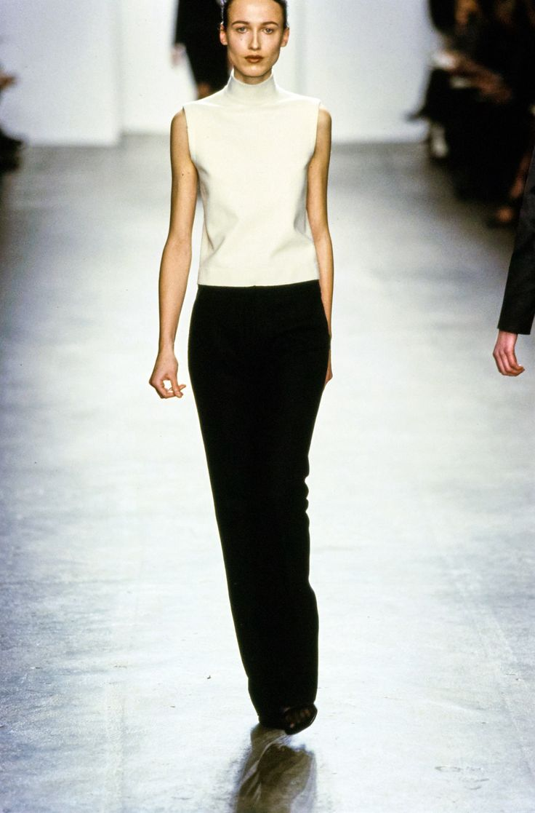

# 90年代复古（Vintage 90s）
> **状态**: reviewed | 最后更新: 2026-06-23 | 分类: 都市街头 | **趋势**: 🏛️ 经典风格

## 📖 概述
- 发源年代: 1990年代（原始），2020年代全面复兴
- 发源地: 纽约/伦敦/东京——90年代极简主义的三大中心
- 风格关键词（5-8个）: 吊带裙、直筒牛仔裤、无Logo、极简90s、Carolyn Bessette-Kennedy、妈妈牛仔裤、细带凉鞋
- 一句话定义: 90年代的极简主义回潮——真丝吊带裙+直筒牛仔裤+细带凉鞋。Carolyn Bessette-Kennedy 的衣橱穿越到了现在，依然不过时。

## 📜 历史文化
- **起源**: 1990年代是时尚史上最「干净」的十年之一——1980s 的浮夸（垫肩/亮片/权力套装）退潮后，一股极简主义的清风吹遍全球时尚。Calvin Klein 的 Kate Moss 广告、Helmut Lang 的建筑廓形、Jil Sander 的极简面料、Carolyn Bessette-Kennedy 的「不费力」穿搭——这些定义了 90s 的审美。2020年代，当 Quiet Luxury 和「no-makeup makeup」成为主流，90s 复古自然回归。TikTok #90sFashion 播放量超 200 亿。
- **发展脉络**:
  - **1990-1995**: 极简主义崛起——Calvin Klein (Kate Moss 的 CK One 时代)、Helmut Lang、Jil Sander
  - **1996-1999**: Carolyn Bessette-Kennedy 成为全球时尚 icon——白衬衫+黑色阔腿裤+零装饰
  - **2010s**: 90s 开始回潮——Vetements 和 Demna Gvasalia 将 90s 的「丑陋」重新带回
  - **2020-2023**: 90s 极简全面复兴——吊带裙+直筒牛仔裤+细带凉鞋成为 Z世代标配
  - **2025-2026**: 从「复刻90s」到「90s 灵感」——用 90s 的精神做2020s的衣服
- **文化意义**: 90s 复古是对「过度消费/过度曝光」的审美反抗——在一个 Instagram 要求你每件衣服都「能拍照」的时代，90s 说：「一件纯白T恤+牛仔裤就够了。」

## 🎨 美学特征
- **廓形特点**: 修身但不紧——直筒牛仔裤（非紧身非阔腿），吊带裙贴身但不勒，西装外套合身但有空气感。核心是「滑落感」——衣服像是从身上自然垂落的。
- **色板**:
  - 主色调：黑色(#000000)、白色(#FFFFFF)、灰色(#808080)、驼色(#C4A882)
  - 辅助色：海军蓝、巧克力棕、深酒红
  - 禁忌色：荧光色、霓虹色、大面积印花、Logo
  - 色板逻辑：1990年代 Calvin Klein 广告的调色盘——黑白灰+驼色
- **面料偏好**: 真丝 > 羊绒 > 棉 > 羊毛。面料要「好」——不是「贵」的好，是「摸上去」和「垂坠感」的好。
- **标志单品表**:

| 单品 | 品牌示例 | 选择要点 |
|------|---------|---------|
| 真丝吊带裙 (Slip Dress) | Calvin Klein 1990s vintage, Reformation, Ganni | 及膝或中长、真丝或仿丝、可单穿也可叠T恤 |
| 高腰直筒牛仔裤 (Mom Jeans) | Levi's 501, Agolde, Re/Done | 高腰、直筒、轻微做旧、不破洞 |
| 白衬衫 | COS, Vince, Equipment | 合身略宽松、纯棉、无刺绣/Logo |
| 细带凉鞋 | The Row, Staud, By Far | 极细搭带、中跟或平底、黑色或裸色 |
| 极简西装外套 | Helmut Lang, COS, The Frankie Shop | 合身、单排扣、黑色或灰色 |
| 黑色小墨镜 | 1990s vintage, Le Specs | 窄框/椭圆/猫眼——不要巨大的那种 |

## 🏷️ 代表品牌
### 核心品牌
| 品牌 | 国家 | 价位 | 一句话 |
|------|------|------|--------|
| Calvin Klein | 美国 | ¥¥-¥¥¥ | 1990s 极简的旗舰——Kate Moss+CK One+真丝吊带裙定义了时代 |
| Helmut Lang | 奥地利/美国 | ¥¥¥ | 1990s 建筑感极简的代名词——「少即是多」的时装化最高表达 |
| Jil Sander | 德国 | ¥¥¥¥ | 极简主义的德国女王——她的 1990s 系列是 Vintage 90s 的圣物 |
| Levi's | 美国 | ¥ | 501 直筒牛仔裤——90s 「妈妈牛仔裤」的原版 |
| Reformation | 美国 | ¥¥ | 可持续时尚的 90s 复兴者——真丝吊带裙+直筒牛仔+碎花 |

### 平价替代
| 品牌 | 价位 | 说明 |
|------|------|------|
| Uniqlo U | ¥ | Christophe Lemaire 设计的 90s 极简基础款 |
| COS | ¥¥ | 本身就是 Helmut Lang 的平价精神继承者 |
| Arket | ¥¥ | 瑞典极简，90s 北欧版的衣橱 |

## 👤 风格偶像 & 名人
| 人物 | 身份 | 贡献 |
|------|------|------|
| Carolyn Bessette-Kennedy | 公关 | 1990s 极简的终极 icon——白衬衫+黑色阔腿裤+零装饰。她死后20多年，Pinterest 上她的照片仍在被疯狂收藏 |
| Kate Moss | 模特 | 1990s 的面容——Calvin Klein 广告中的她定义了「heroin chic」和真丝吊带裙 |
| Gwyneth Paltrow | 演员 | 1990s 红毯造型（特别是 1999 奥斯卡的 Ralph Lauren 粉裙）和日常穿搭都精准命中 90s 极简 |
| Winona Ryder | 演员 | 1990s 的「暗黑少女」——皮夹克+吊带裙+军靴的 Grunge 版 90s |

### 穿着此风格的现代博主
| 人物 | 身份 | 为什么是 icon |
|------|------|---------------|
| Kendall Jenner | 模特 | 日常造型大量参考 90s 极简——吊带裙+直筒牛仔+细带凉鞋 |
| Matilda Djerf | 瑞典博主 | 虽然偏「瑞典甜美」，但她的直筒牛仔裤+白衬衫造型精准复刻 90s |

## 🔗 关联风格
- **父风格**: 都市街头 (Urban Street)
- **子风格**: 90s 极简 (90s Minimalism)、90s Grunge (90s Grunge)
- **平行风格**: 极简（WF-06）——共享「少即是多」，Vintage 90s 是极简的「1990s 特定版本」
- **对立风格**: Y2K 千禧复古（WF-10）——Vintage 90s 是「安静的极简」，Y2K 是「吵闹的复古」
- **与姐妹风格差异**:
  1. vs 极简（WF-06）：Vintage 90s 有年代感（吊带裙/细带凉鞋/窄墨镜），Minimalist 更 timeless
  2. vs 静奢风（WF-17）：Vintage 90s 可以穿 vintage Levi's（¥200），Quiet Luxury 穿 The Row（¥¥¥¥）
  3. vs 都市酷感（WF-25）：Vintage 90s 更「软/丝/吊带裙」，Downtown Cool 更「硬/皮/建筑感」

## 📈 流行趋势
- **当前状态**: 持续高热度——90s 复古已经是 Z世代和千禧一代的共同审美语言
- **流行区域**: 全球——90s 极简是真正的「全球审美」
- **发展方向**:
  - 2025-2026：从「复刻」到「进化」——用可持续面料做 90s 版型的衣服
  - 90s+Y2K 混搭——吊带裙（90s）+ 厚底鞋（Y2K）的跨年代混搭

## 💡 穿搭建议
- **适合体型**: 所有体型——直筒牛仔裤+吊带裙+西装外套是万用公式
- **适合肤色**: 黑白灰驼对所有肤色友好
- **适合场合**: 日常通勤、周末 brunch、约会、逛街。适合几乎所有非正式场合
- **入门建议**:
  1. 从一条 vintage Levi's 501 直筒牛仔裤开始——eBay/Depop/二手店
  2. 一件真丝吊带裙——可单穿也可叠白T恤，一衣两穿
  3. 一双细带凉鞋——The Row（投资款）或 Staud（平价）
  4. 发型和妆容也很 90s——中分直发或松散的低马尾+棕色唇线

---
*本文基于多源研究整理，AI 辅助生成。*
