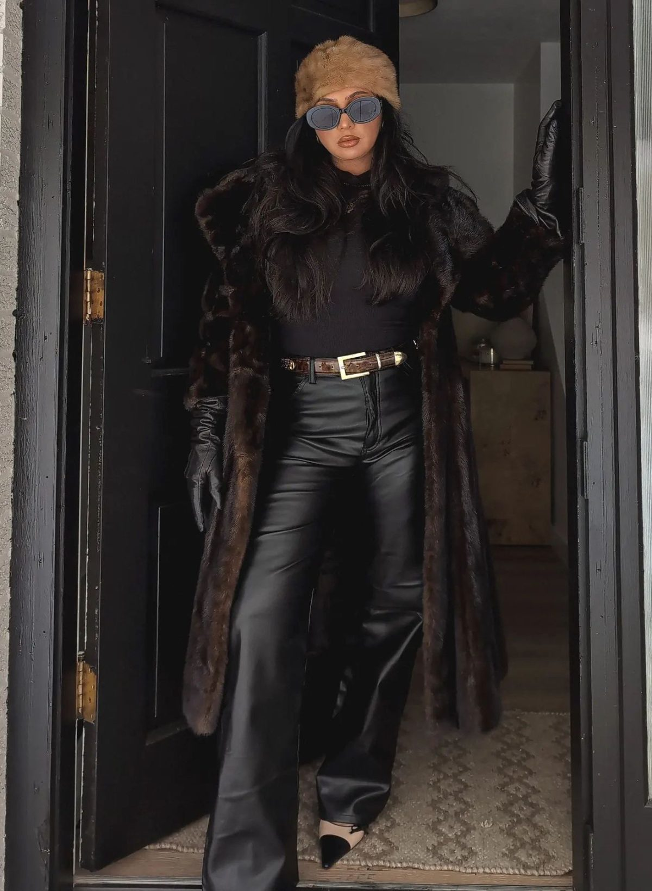

# 黑帮大嫂（Mob Wife）
> **状态**: reviewed | 最后更新: 2026-06-23 | 分类: 戏剧张力 | **趋势**: 🔥 流行趋势

## 📖 概述
- 发源年代: 2024年 TikTok 爆发（#MobWife），美学根源在黑帮电影和 1980-90s 意大利裔美国文化
- 发源地: 互联网 + 黑帮电影（《好家伙》《赌城风云》《黑道家族》）
- 风格关键词（5-8个）: 人造皮草、豹纹、大号金饰、超大墨镜、暗色华丽、不好惹、法国美甲、红唇
- 一句话定义: 黑帮电影里大哥的女人——人造皮草大衣+豹纹连衣裙+大号金耳环+超大墨镜。看起来像是刚参加完一个你不该问的会议。

## 📜 历史文化
- **起源**: Mob Wife 是 TikTok 对黑帮电影美学的重新发现和挪用。2024年1月，TikTok 创作者 Sarah Jordan Arcuri（一位意大利裔美国女性）发布了她的「Mob Wife」造型视频——皮草大衣+豹纹+金饰+墨镜+「别跟我废话」的态度，引发了一场全球审美海啸。视觉根源来自1970-90s 的黑帮电影：《教父》《好家伙》(1990)、《赌城风云》(1995)、《黑道家族》(1999-2007)中的女性角色——特别是 Lorraine Bracco（《好家伙》中的 Karen Hill）和 Edie Falco（《黑道家族》中的 Carmela Soprano）。TikTok #MobWife 播放量超 150 亿。
- **发展脉络**:
  - **1972-1990**: 《教父》(1972) 和《好家伙》(1990) 定义了黑帮审美——暗色+皮草+金饰+红唇
  - **1999-2007**: 《黑道家族》将「郊区黑帮大嫂」审美带入电视——Carmela Soprano 的皮草+金链+法国美甲
  - **2022**: 「Clean Girl」和「Old Money」审美主导——克制/安静/不炫耀
  - **2024 年1月**: TikTok #MobWife 爆发——对「安静」审美的全面反叛。Mob Wife 说：「我不仅不安静，我还要让整条街都知道我来了」
  - **2025-2026**: Mob Wife 从「季节性病毒」进入「审美选项」——不再每天都是 Mob Wife，但它成为了女性「权力造型」工具包的一部分
- **文化意义**: Mob Wife 是对 Quiet Luxury/Old Money「安静克制」的全面反叛。它宣告：女性不需要「安静」才能有权力——你可以大声、华丽、不好惹、穿豹纹，同时依然掌控局面。Mob Wife 是「反安静美学」的旗帜。

## 🎨 美学特征
- **廓形特点**: 体积感+收腰——皮草/毛呢大衣在外面制造体积和存在感，里面是合身连衣裙勾勒曲线。核心是「不可忽视」——这身穿搭进入房间时，所有人都会转头。
- **色板**:
  - 主色调：黑色(#000000)、豹纹(#C49A2A+#000000)、酒红(#722F37)、金色(#D4AF37)
  - 辅助色：深棕、白色（极少使用，作为反差）、墨黑色（墨镜）
  - 禁忌色：粉彩、荧光、柔和色——任何看起来「温柔」的颜色都不在 Mob Wife 的词典里
  - 色板逻辑：黑暗俱乐部 + 黄金珠宝 + 红酒 + 雪茄灰
- **面料偏好**: 人造皮草 > 皮革 > 丝绒 > 真丝 > 羊毛。面料必须有「重量」和「质感」——廉价的轻面料是 Mob Wife 的敌人。
- **标志单品表**:

| 单品 | 品牌示例 | 选择要点 |
|------|---------|---------|
| 人造皮草大衣 | vintage, Shrimps, Apparis | 黑色/棕色/豹纹，必须看起来像真的（但最好是假的）|
| 豹纹连衣裙/上衣 | Saint Laurent, Réalisation Par, Ganni | 豹纹是 Mob Wife 的灵魂图案——越大胆越好 |
| 大号金耳环 | Jennifer Fisher, Bottega Veneta | 圈形或吊坠、必须大到能被墨镜挡住 |
| 超大墨镜 | Celine, Saint Laurent, vintage | 黑色、挡住半张脸、怀疑一切的态度 |
| 皮革长裤/紧身皮裤 | Saint Laurent, Khaite, Zara | 紧身、黑色、有光泽 |
| 法国美甲+红唇 | — | 法国美甲（白色指尖）+ 暗红色或鲜红色唇膏 |

## 🏷️ 代表品牌
### 核心品牌
| 品牌 | 国家 | 价位 | 一句话 |
|------|------|------|--------|
| Saint Laurent | 法国 | ¥¥¥¥ | YSL 的暗黑/危险/性感就是 Mob Wife 的「时装版本」|
| Versace | 意大利 | ¥¥¥¥ | 金色+豹纹+皮草+华丽——没有哪个品牌比 Versace 更 Mob Wife |
| Dolce & Gabbana | 意大利 | ¥¥¥¥ | 西西里的黑帮审美——豹纹/黑色蕾丝/金色十字架 |
| Jennifer Fisher | 美国 | ¥¥¥ | 大号金耳环的 Mob Wife 首选——每一对都像是拥有者的力量宣言 |

### 平价替代
| 品牌 | 价位 | 说明 |
|------|------|------|
| Zara | ¥ | 人造皮草大衣和豹纹连衣裙的季节性供应 |
| H&M | ¥ | 豹纹上衣和皮革长裤的入门之选 |
| Shrimps | ¥¥ | 伦敦品牌，人造皮草的彩色/图案版本 |
| Apparis | ¥¥ | 纽约品牌，人造皮草的 DTC 之王 |

## 👤 风格偶像 & 名人
| 人物 | 身份 | 贡献 |
|------|------|------|
| Lorraine Bracco | 演员 | 《好家伙》中的 Karen Hill——她是 Mob Wife 审美的「原爆点」|
| Edie Falco | 演员 | 《黑道家族》中的 Carmela Soprano——皮草+金链+法式美甲的 TV icon |
| Michelle Pfeiffer | 演员 | 《疤面煞星》(1983) 中的 Elvira Hancock——金发+红唇+暗色礼服的终极 Mob Wife |
| Sharon Stone | 演员 | 《赌城风云》(1995) 中的 Ginger——皮草+金饰+危险的魅力 |

### 穿着此风格的明星/博主
| 人物 | 身份 | 为什么是 icon |
|------|------|------|
| Dua Lipa | 歌手 | 2024 年多次以 Mob Wife 造型出现——皮草大衣+金饰+暗色连衣裙 |
| Kendall Jenner | 模特 | 2024 年 Bottega Veneta 造型中有强烈的 Mob Wife 元素 |
| Sarah Jordan Arcuri | TikToker | 她的 TikTok 视频直接引爆了 #MobWife 趋势 |

## 🔗 关联风格
- **父风格**: 戏剧张力 (Dramatic Statement)
- **子风格**: 办公室大嫂 (Office Mob Wife)、意裔美国人风 (Italian-American Aesthetic)
- **平行风格**: 暗黑女性力（WF-31）——共享「权力/暗色/危险」，Mob Wife 是「黑帮电影版」，Dark Feminine 是「神秘/蛇蝎美人版」
- **对立风格**: 静奢风（WF-17）——Mob Wife 是 Quiet Luxury 的全面反面
- **与姐妹风格差异**:
  1. vs 暗黑女性力（WF-31）：Mob Wife 更「意大利/家庭/接地气」，Dark Feminine 更「欧洲/个人/神秘」
  2. vs 老钱风（WF-18）：Mob Wife 是赚到的（或抢来的）财富，Old Money 是继承的财富——两个都是「有钱」，但表达方式完全相反
  3. vs 皇室浪漫（WF-32）：Mob Wife 是「地下王国的女王」，Royalcore 是「天上的公主」

## 📈 流行趋势
- **当前状态**: 后病毒期——2024年1月 TikTok 爆发后，从「审美病毒」进入「审美选项」稳定期
- **流行区域**: 全球（TikTok 驱动），北美/英国为主
- **发展方向**:
  - 2025-2026：Mob Wife 被「正常化」——皮草大衣+豹纹成为冬季的正当穿搭选择
  - 可持续：人造皮草替代真皮草，vintage 皮草外套的复古再利用

## 💡 穿搭建议
- **适合体型**: 所有体型——oversize 皮草大衣+合身内搭=经典公式
- **适合肤色**: 暖皮穿豹纹+金饰绝配；冷皮可选黑色+银色首饰的变体
- **适合场合**: 晚间社交场合、派对、晚餐、约会——不适合办公室（除非你是老板）
- **入门建议**:
  1. 从一件人造皮草大衣开始——黑色或棕色比豹纹更容易入门
  2. 一件豹纹单品——连衣裙或上衣，但在 Mob Wife 模式中「豹纹不嫌多」
  3. 一副大墨镜——Saint Laurent 风格或 vintage
  4. 法国美甲+红唇——这是 Mob Wife 最便宜但却最强的「态度配件」

---
*本文基于多源研究整理，AI 辅助生成。*
