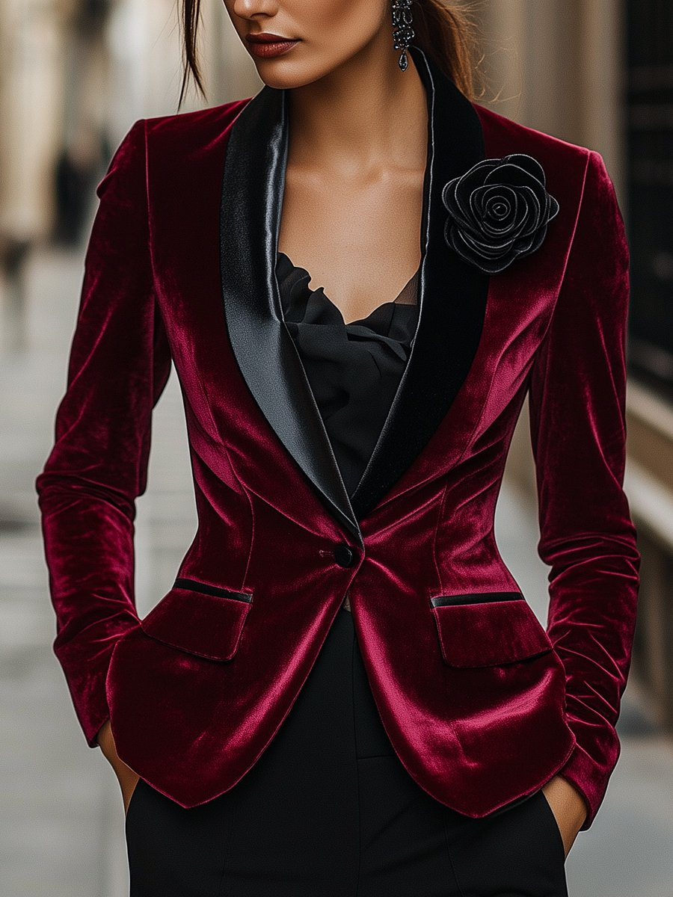

# 暗黑女性力（Dark Feminine）
> **状态**: reviewed | 最后更新: 2026-06-23 | 分类: 戏剧张力 | **趋势**: 🔥 流行趋势

## 📖 概述
- 发源年代: 2023年 TikTok 爆发（#DarkFeminine），美学根源在 1940-50s 的「蛇蝎美人」(Femme Fatale)
- 发源地: 互联网（TikTok / Pinterest），电影 noir 是其终极审美参考
- 风格关键词（5-8个）: 收腰西装、束身胸衣、宝石色调、丝绒/真丝/皮革、权力感、神秘、红酒杯
- 一句话定义: Femme Fatale（蛇蝎美人）的现代版——收腰西装+束身胸衣+勃艮第红/墨绿色调+丝绒。不是「等待拯救」的公主，是「别挡我的路」的女王。

## 📜 历史文化
- **起源**: Dark Feminine 是将「蛇蝎美人」这一经典电影/文学原型进行 TikTok 时代改造的产物。蛇蝎美人是 1940-50s 电影 noir 的核心角色——她穿着紧身丝绒连衣裙，拿着一杯红酒，用眼神就能控制整个房间的氛围。2023年，TikTok 将这一原型重新包装为 #DarkFeminine——不只是穿搭风格，更是一种「女性力量」的哲学宣言：用神秘、冷静、和蓄积的权力来运作世界。TikTok #DarkFeminine 播放量超 120 亿。
- **发展脉络**:
  - **1940-1950s**: 电影 noir 的蛇蝎美人——Barbara Stanwyck/Lauren Bacall/Rita Hayworth
  - **1990s**: 「Office Siren」和「Power Dressing」在 90s 职场出现——收腰西装+暗色口红
  - **2010s**: Tumblr 上的「Dark Academia」和「Witchy Aesthetic」为 Dark Feminine 铺路
  - **2023**: TikTok #DarkFeminine 爆发——收腰西装+束身胸衣+宝石色调成为公式
  - **2025-2026**: Dark Feminine 成熟——从「cosplay 蛇蝎美人」到「日常化暗色权力穿搭」
- **文化意义**: Dark Feminine 是关于女性权力的「暗面」表达——在一个鼓励女性「微笑/甜美/温柔」的文化中，它说：「不，我选择神秘、冷静、和不解释。」它是「不像女孩的女孩」的审美宣言。

## 🎨 美学特征
- **廓形特点**: 收腰+结构——西装外套必须掐腰（belted或收腰剪裁），内搭束身胸衣或真丝衬衫勾勒上身，下装阔腿裤或紧身铅笔裙制造对比。核心是「腰线+廓形」——沙漏型的权力。
- **色板**:
  - 主色调：勃艮第红(#722F37)、墨绿(#2D4A3E)、黑色(#000000)、深紫(#4A2C5A)
  - 辅助色：金色（首饰）、深灰、暗蓝色
  - 禁忌色：粉彩、马卡龙色、白色（大面积）、亮色——任何「轻浮」的颜色
  - 色板逻辑：宝石的颜色——红宝石、翡翠、紫水晶、黑钻石
- **面料偏好**: 丝绒 > 真丝 > 皮革 > 羊毛 > 蕾丝。面料必须有「深度的光泽」——丝绒的漫反射、真丝的液光、皮革的反光。
- **标志单品表**:

| 单品 | 品牌示例 | 选择要点 |
|------|---------|---------|
| 收腰西装外套 | Khaite, Saint Laurent, The Attico | 黑色或暗色、腰带设计或收腰剪裁、有垫肩但不夸张 |
| 束身胸衣/腰封 | Miaou, Dion Lee, vintage | 可当内搭也可外穿、丝绒或缎面、收紧腰线 |
| 丝绒/真丝连衣裙 | Saint Laurent, Réalisation Par, Ganni | 及膝或中长、勃艮第红/墨绿/黑色、暗光泽 |
| 高腰阔腿裤 | The Row, Khaite, COS | 黑色或暗色、垂坠、及地长度 |
| 金色/珠宝首饰 | Bottega Veneta, Jennifer Fisher, vintage | 厚重、有明显的存在感——不是 delicate，是 bold |
| 暗色口红 | MAC（Diva/Dark Side）, NARS, Charlotte Tilbury | 勃艮第红/深紫/暗莓色——唇就是武器 |

## 🏷️ 代表品牌
### 核心品牌
| 品牌 | 国家 | 价位 | 一句话 |
|------|------|------|--------|
| Saint Laurent | 法国 | ¥¥¥¥ | 暗黑/危险/性感的法国巅峰——一套西装就能让你变蛇蝎美人 |
| Khaite | 美国 | ¥¥¥¥ | 纽约品牌，收腰西装和丝绒连衣裙的 Dark Feminine 当代标杆 |
| The Attico | 意大利 | ¥¥¥¥ | 米兰品牌，夸张而华丽的暗色派对装——Dark Feminine 的「晚上版本」|
| Dion Lee | 澳大利亚 | ¥¥¥ | 束身胸衣和建筑感剪裁——Dark Feminine 的「结构派」代表 |

### 平价替代
| 品牌 | 价位 | 说明 |
|------|------|------|
| Zara | ¥ | 收腰西装和丝绒连衣裙的季节性供应 |
| Mango | ¥ | 暗色西装的西班牙平价之选 |
| COS | ¥¥ | 极简暗色系的北欧 Dark Feminine |
| Abercrombie & Fitch | ¥¥ | 丝绒连衣裙和收腰西装的新生代平价替代 |

## 👤 风格偶像 & 名人
| 人物 | 身份 | 贡献 |
|------|------|------|
| Angelina Jolie | 演员 | 2000s-2010s 的现代蛇蝎美人——黑色丝绒+红唇+神秘微笑 |
| Monica Bellucci | 演员 | 意大利的 Dark Feminine 终极化身——暗色连衣裙+黑色卷发+深度眼神 |
| Morticia Addams | 虚构角色 | 虽然不是真人，但她的黑色丝绒长裙+长黑发+绝不解释的态度是 Dark Feminine 的教母 |
| Eva Green | 演员 | 暗黑/神秘/魔幻气质的现代 Dark Feminine——Penny Dreadful 和 Casino Royale 中的她也算 |

### 穿着此风格的明星/博主
| 人物 | 身份 | 为什么是 icon |
|------|------|---------------|
| Zendaya | 演员 | 多次以收腰西装+暗色造型出现在红毯和街头 |
| Bella Hadid | 模特 | 街头和红毯中的暗色系+收腰+神秘感的完美平衡 |

## 🔗 关联风格
- **父风格**: 戏剧张力 (Dramatic Statement)
- **子风格**: 办公室海妖 (Office Siren)、神秘夫人 (Mysterious Femme)
- **平行风格**: 黑帮大嫂（WF-30）——共享「权力/暗色/不解释」，但 Dark Feminine 更「神秘/精致/欧洲」，Mob Wife 更「接地气/意大利/张扬」
- **对立风格**: 软妹风（WF-16）——Dark Feminine 是「别挡我的路」，Soft Girl 是「你可以牵我的手」
- **与姐妹风格差异**:
  1. vs 黑帮大嫂（WF-30）：Dark Feminine 喝红酒，Mob Wife 喝威士忌。Dark Feminine 穿丝绒，Mob Wife 穿皮草
  2. vs 办公室海妖（WF-41）：Office Siren 是 Dark Feminine 的「上班版本」
  3. vs 暗黑学院（WF-12）：Dark Academia 在图书馆读诗，Dark Feminine 在红酒杯后面操控局面

## 📈 流行趋势
- **当前状态**: 高峰期——Dark Feminine 是 TikTok 上最热的「女性赋权美学」之一
- **流行区域**: 全球（TikTok 驱动），欧美为主
- **发展方向**:
  - 2025-2026：从「晚上去派对」到「白天去上班」——Dark Feminine 的职业化版本
  - 与「安静奢华」交汇——暗色系+收腰+顶级面料的混搭

## 💡 穿搭建议
- **适合体型**: 沙漏形（收腰西装+阔腿裤=完美公式，0.95）、梨形（阔腿裤遮盖臀胯，0.90）。不适合：长方形（需要腰线来制造曲线）
- **适合肤色**: 勃艮第红/墨绿对所有肤色友好；深紫对冷皮最友好
- **适合场合**: 晚宴、红酒酒吧、剧院、画廊开幕、需要「气场全开」的工作场合
- **入门建议**:
  1. 从一件收腰西装外套开始——Khaite（投资款）或 Zara（平价）
  2. 一条丝绒连衣裙——勃艮第红或墨绿
  3. 一支暗色口红——MAC Diva 或类似色号
  4. 姿态比衣服重要——Dark Feminine 的终极配饰是「我不需要你的认同」的表情

---
*本文基于多源研究整理，AI 辅助生成。*
