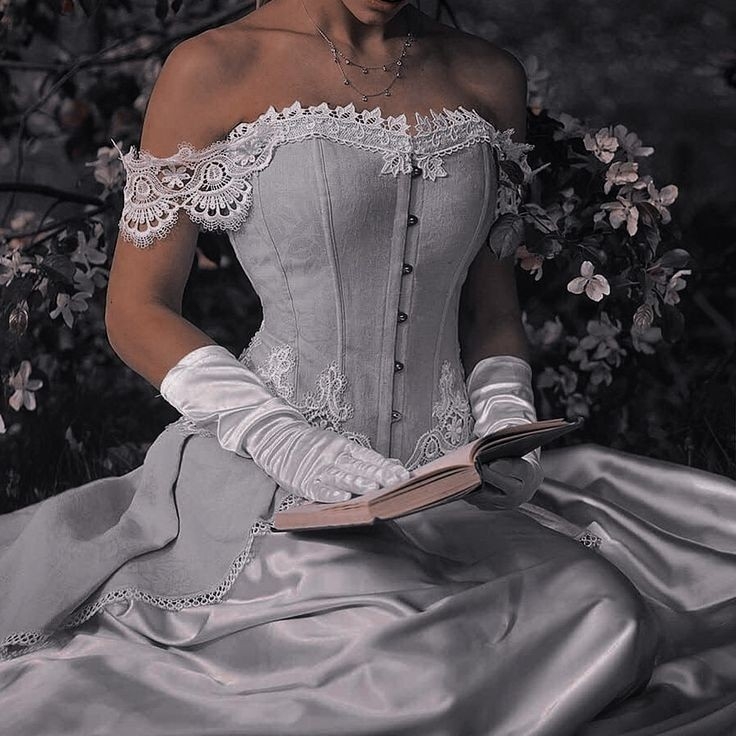

# 皇室浪漫（Royalcore）
> **状态**: reviewed | 最后更新: 2026-06-23 | 分类: 戏剧张力 | **趋势**: 🔥 流行趋势

## 📖 概述
- 发源年代: 2020年 TikTok 和《布里奇顿》同步引爆，美学根源在欧洲皇室（凡尔赛宫/白金汉宫）
- 发源地: 互联网 + 《布里奇顿》Netflix + 欧洲皇室美学
- 风格关键词（5-8个）: 束身胸衣、丝绒、珍珠/宝石装饰、巴洛克/洛可可元素、地板长裙、皇冠/头饰
- 一句话定义: 像是从《布里奇顿》或凡尔赛宫里借了一套衣服——束身胸衣+丝绒+珍珠，去参加一个不存在于现代的皇室舞会。

## 📜 历史文化
- **起源**: Royalcore 是 TikTok 和 Netflix 的共生产物。2020年12月，Netflix 推出《布里奇顿》(Bridgerton)——一部设定在摄政时代（1811-1820）伦敦的浪漫剧，其服装设计师 Ellen Mirojnick 用现代面料和鲜艳色彩重新想象了摄政时代的皇室着装（束身胸衣+帝国腰连衣裙+珍珠+羽毛头饰）。同月，TikTok 上的 #Royalcore 标签开始爆发，将这个美学从「看剧cosplay」扩展到一种完整的审美生活方式——喝茶、写书信、逛花园、学宫廷舞。视觉参考还包括：凡尔赛宫的洛可可风格、维多利亚时代的皇室画像、戴安娜王妃的婚纱和出访造型。TikTok #Royalcore 播放量超 100 亿。
- **发展脉络**:
  - **18世纪**: 洛可可时期的法国宫廷——蓬帕杜夫人/玛丽·安托瓦内特，以粉彩/蕾丝/蝴蝶结/高发髻为标志
  - **19世纪**: 维多利亚时代的英国皇室——束身胸衣+层叠裙摆+黑玉珠宝
  - **1981**: 戴安娜王妃的世纪婚礼——巨型婚纱+皇冠+玻璃马车
  - **2020年12月**: 《布里奇顿》首播+#Royalcore TikTok 爆发——束身胸衣+帝国腰裙成为公式
  - **2022-2023**: 英国女王伊丽莎白二世去世+查尔斯三世加冕——现实中的皇室再次成为全球焦点
  - **2025-2026**: Royalcore 从「cosplay」走向「皇室灵感日常」——束身胸衣外穿+珍珠+蓬裙的日常化
- **文化意义**: Royalcore 是逃离现代平庸的浪漫主义飞翔——在一个「穿什么都无所谓」的 Athleisure 时代，它说：「我想穿得像要去参加宫廷舞会。」它是年轻女性对「仪式感」和「尊严」的审美渴望。

## 🎨 美学特征
- **廓形特点**: 收腰+蓬开——束身胸衣或腰封制造极细的腰线，帝国腰连衣裙（Empire waist）或蓬裙在下半身展开。核心是「宫廷舞会廓形」——从腰以下，布料可以无限制地展开。
- **色板**:
  - 主色调：皇家蓝(#1B2A4A)、勃艮第红(#722F37)、象牙白(#FFFFF0)、金色(#D4AF37)
  - 辅助色：粉色、淡紫、薰衣草色、银色
  - 禁忌色：荧光色、霓虹色、纯黑色（极少用——皇室晚上穿深色，但不是「all black」）
  - 色板逻辑：白金汉宫和凡尔赛宫的颜色——蓝色血统、金色王座、象牙白婚纱、皇家花园的粉色玫瑰
- **面料偏好**: 丝绒 > 真丝 > 缎面 > 蕾丝 > 塔夫绸。面料必须有「重量」和「光泽」——衣服要能 hold 住金碧辉煌的房间。
- **标志单品表**:

| 单品 | 品牌示例 | 选择要点 |
|------|---------|---------|
| 束身胸衣/腰封 | Vivienne Westwood, Miaou, Selkie | 缎面或丝绒、系带或钩眼扣、可外穿 |
| 帝国腰连衣裙 | Selkie, LoveShackFancy, Erdem | 高腰线（胸下位置）、及地长度、缎面或薄纱 |
| 珍珠珠宝（多层） | Chanel, Vivienne Westwood, vintage | 多层珍珠项链是 Royalcore 的「身份证明」|
| 歌剧长手套 | vintage, Cornelia James | 及肘或过肘、真丝或缎面、白色或黑色 |
| 皇冠/头饰/发箍 | Jennifer Behr, Lelet NY, vintage | 不必是真的钻石——但必须有水晶/珍珠/金属装饰 |
| 丝绒斗篷/披肩 | vintage, Etsy | 及地长度、丝绒、深色或皇家蓝 |

## 🏷️ 代表品牌
### 核心品牌
| 品牌 | 国家 | 价位 | 一句话 |
|------|------|------|--------|
| Vivienne Westwood | 英国 | ¥¥¥¥ | 英国朋克女王+皇室元素——她的束身胸衣是 Royalcore 的「叛逆版」|
| Erdem | 英国/加拿大 | ¥¥¥¥ | 皇家印花+真丝+蕾丝——英国皇室成员常穿的品牌 |
| Selkie | 美国 | ¥¥-¥¥¥ | 帝国腰蓬裙的 TikTok 时代定义者——《布里奇顿》风的平民国货 |
| LoveShackFancy | 美国 | ¥¥¥ | 蕾丝+珍珠+缎面——Royalcore 的「少女花园版」|
| Simone Rocha | 爱尔兰/英国 | ¥¥¥¥ | 珍珠+薄纱+缎面——Royalcore 的「艺术馆版本」|

### 平价替代
| 品牌 | 价位 | 说明 |
|------|------|------|
| Selkie | ¥¥-¥¥¥ | 本身已经是最平价的 Royalcore 核心品牌 |
| ASOS（Bridgerton 联名） | ¥ | ASOS 与 Netflix 合作推出的《布里奇顿》灵感系列 |
| Etsy 手工 | ¥-¥¥ | 找 vintage 手套/头饰/珍珠首饰的最佳去处 |
| Zara | ¥ | 束身胸衣和蓬裙的季节性流行款 |

## 👤 风格偶像 & 名人
| 人物 | 身份 | 贡献 |
|------|------|------|
| 戴安娜王妃 | 英国王室 | 1981年世纪婚礼婚纱+皇冠定义了现代 Royalcore 的原型 |
| Marie Antoinette | 历史人物 | 法国王后，Sofia Coppola 2006年电影将她塑造成 Royalcore 的洛可可女神 |
| Daphne Bridgerton（角色） | 《布里奇顿》 | Phoebe Dynevor 饰演的 Daphne——帝国腰裙+珍珠+羽毛头饰的 Royalcore 圣像 |

### 穿着此风格的明星/博主
| 人物 | 身份 | 为什么是 icon |
|------|------|---------------|
| Rihanna | 歌手/企业家 | 多次以皇室灵感造型出现——巨型头饰+蓬裙（如 2018 Met Gala 教皇造型）|
| Zendaya | 演员 | 红毯造型大量引用皇室元素——蓬裙+束身胸衣+珍珠 |
| Bridgerton 演员群 | 演员 | 剧组的全球宣传造型持续喂养 TikTok 的 Royalcore 审美 |

## 🔗 关联风格
- **父风格**: 戏剧张力 (Dramatic Statement)
- **子风格**: 小公主核 (Princesscore)、摄政时代 (Regencycore)
- **平行风格**: 甜媚少女（WF-15）——共享珍珠/缎面/蝴蝶结，但 Royalcore 是「皇室」，Coquette 是「调情少女」
- **对立风格**: 女性街头（WF-28）——Royalcore 在宫殿里，Streetwear 在街头
- **与姐妹风格差异**:
  1. vs 甜媚少女（WF-15）：Royalcore 是即将继承王位的公主，Coquette 是在宫廷舞会上调情的少女
  2. vs 浪漫歌剧（WF-40）：Royalcore 是「视觉的皇室」，Romantic Opera 是「声音的皇室」——受歌剧文化启发的穿搭
  3. vs 马术优雅（WF-48）：Royalcore 在宫殿里，Equestrian 在马厩里——但英国皇室两者都穿

## 📈 流行趋势
- **当前状态**: 高峰期——《布里奇顿》每季播出都会重新引爆 Royalcore 热度
- **流行区域**: 全球（Netflix 驱动），北美/英国/欧洲为主
- **发展方向**:
  - 2025-2026：从「全套宫廷」到「皇室元素日常化」——束身胸衣外穿+牛仔裤+珍珠的多层项链
  - Royalcore 婚礼——蓬裙+束身胸衣+珍珠+长手套的皇室灵感婚礼持续流行

## 💡 穿搭建议
- **适合体型**: 所有体型——帝国腰线对所有身形友好，蓬裙遮盖臀腿
- **适合肤色**: 象牙白对白皮友好；皇家蓝和勃艮第红对所有肤色友好
- **适合场合**: 婚礼、舞会、下午茶、歌剧院、任何「我需要华丽的理由」的场合
- **入门建议**:
  1. 从一条帝国腰连衣裙开始——Selkie 的蓬裙或任何高腰线的缎面裙
  2. 一条多层珍珠项链——假的没关系，多层的比单层的好
  3. 一对歌剧长手套——vintage 或 Cornelia James
  4. 头发里夹一个珍珠发箍——这是最低成本的 Royalcore 入场券

---
*本文基于多源研究整理，AI 辅助生成。*
