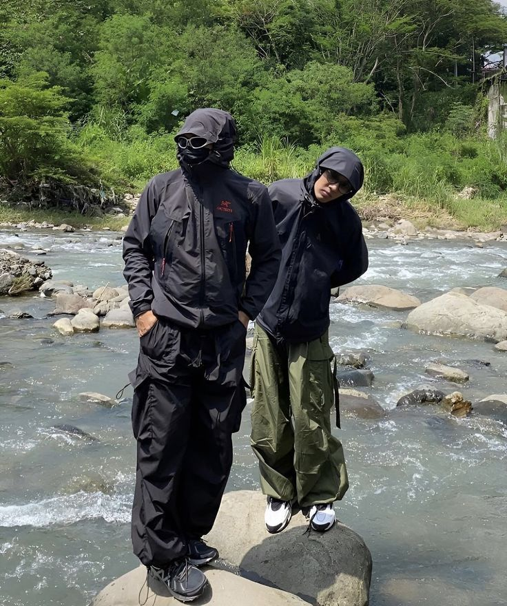

# 户外机能（Gorpcore）
> **状态**: reviewed | 最后更新: 2026-06-23 | 分类: 现代都市 | **趋势**: 🔥 流行趋势

## 📖 概述
- 发源年代: 2017年 The Cut 首次命名「Gorpcore」，2020-2022年全面爆发
- 发源地: 纽约/伦敦，街头与户外的碰撞地带
- 风格关键词（5-8个）: 冲锋衣、工装裤、登山鞋、功能性、实用主义、户外装备日常化、多口袋
- 一句话定义: 把功能性户外装备穿进城市日常——Arc'teryx 冲锋衣+Patagonia 抓绒+Salomon 登山鞋+多口袋工装裤。不是要去登山，这就是你的城市制服。

## 📜 历史文化
- **起源**: 「Gorpcore」一词最早由 The Cut（纽约杂志）的时尚编辑 Jason Chen 在 2017年创造——「Gorp」是徒步者俚语「Good Ol' Raisins and Peanuts」（传统路粮）的缩写。它描述的是一种将纯粹的功能性户外装备作为日常城市穿着的审美。不同于「运动休闲」（Athleisure）穿的是健身房的衣服，Gorpcore 穿的是珠峰大本营的衣服。这一趋势在 2020-2022年疫情封锁期间爆炸——当所有人都在寻找「舒适」和「户外」的解药时，Arc'teryx 和 Salomon 从专业户外店走进了潮流买手店。
- **发展脉络**:
  - **2017**: The Cut 首次命名「Gorpcore」
  - **2018-2019**: Frank Ocean 穿着 Arc'teryx 冲锋衣出席活动，Virgil Abloh 在 Off-White 2020 FW 中引入户外元素
  - **2020-2021**: 疫情引爆 Gorpcore——Arc'teryx 成为「潮人制服」，Salomon XT-6 成为年度球鞋
  - **2022**: Gorpcore 进入高级时尚——Gucci x The North Face 联名、Jil Sander x Arc'teryx 联名
  - **2023-2026**: Gorpcore 主流化——从「潮人专属」到「人人都在穿冲锋衣」
- **文化意义**: Gorpcore 是关于「功能即美学」——在一个气候危机和城市生存焦虑的时代，穿一件能防暴雨的冲锋衣去上班，不只是审美的选择，也是实用的宣言。

## 🎨 美学特征
- **廓形特点**: oversize+功能性——冲锋衣宽松到能套在多层中间，工装裤有多口袋但不臃肿。核心是「技术廓形」——衣服不是「随便大」，是「为了活动空间和叠穿而大」。
- **色板**:
  - 主色调：黑色(#000000)、军绿(#4A5D4A)、灰色(#808080)、大地色(#8B7355)
  - 辅助色：荧光黄（安全色）、橙色（户外信号色）、深蓝
  - 禁忌色：粉色、粉彩——功能性户外装备很少是粉色的
  - 色板逻辑：户外品牌的经典配色——Arc'teryx 的黑灰、Patagonia 的大地色、The North Face 的荧光黄
- **面料偏好**: Gore-Tex > 抓绒 (PolarTec) > 尼龙 > 防撕裂面料 > Primaloft 保暖棉。面料就是科技——Gorpcore 崇拜面料技术。
- **标志单品表**:

| 单品 | 品牌示例 | 选择要点 |
|------|---------|---------|
| 冲锋衣 (Shell Jacket) | Arc'teryx, Patagonia, The North Face | Gore-Tex、防水、有腋下拉链、越大越好 |
| 抓绒中层 (Fleece Mid-layer) | Patagonia, Arc'teryx, Uniqlo | 摇粒绒、可当内搭也可外穿 |
| 登山鞋/越野跑鞋 | Salomon (XT-6), Hoka, ROA | 专业户外鞋底+潮流配色、Salomon 是 Gorpcore 的灵魂鞋 |
| 工装裤/户外裤 | Arc'teryx, Nike ACG, Gramicci | 多口袋、防水或速干、可调节裤脚 |
| 功能性背包 | Arc'teryx, Patagonia, Osprey | 技术背负系统+城市适用外观 |
| 渔夫帽/鸭舌帽 | Patagonia, The North Face, Arc'teryx | 防晒/防水功能+复古户外Logo |

## 🏷️ 代表品牌
### 核心品牌
| 品牌 | 国家 | 价位 | 一句话 |
|------|------|------|--------|
| Arc'teryx | 加拿大 | ¥¥¥¥ | 1989年创立于温哥华，户外装备的「技术之王」——一件 Alpha SV 冲锋衣可以穿十年。Gorpcore 的「终极制服」|
| Salomon | 法国 | ¥¥¥ | 1947年创立于阿尔卑斯山区，XT-6 越野跑鞋是 Gorpcore 的「球鞋之王」|
| Patagonia | 美国 | ¥¥¥ | 1973年创立，环保使命+抓绒的发明者——Synchilla 摇粒绒是 Gorpcore 的「打底圣物」|
| The North Face | 美国 | ¥¥-¥¥¥ | 1966年创立，从户外店走进 Supreme 联名——Nuptse 羽绒服是冬天的 Gorpcore 标配 |
| Nike ACG | 美国 | ¥¥-¥¥¥ | All Conditions Gear——Nike 的户外支线，1990s 的 ACG 款现在是 vintage 市场的宠儿 |

### 平价替代
| 品牌 | 价位 | 说明 |
|------|------|------|
| Uniqlo（Blocktech） | ¥ | 平价功能性外套和摇粒绒的入门首选 |
| Patagonia（二手） | ¥¥ | Worn Wear 二手平台——一件旧Patagonia比新的更有Gorpcore态度 |
| Gramicci | ¥¥ | 攀岩文化品牌，工装裤的Gorpcore平价之选 |

## 👤 风格偶像 & 名人
| 人物 | 身份 | 贡献 |
|------|------|------|
| Frank Ocean | 歌手 | 2019年穿着 Arc'teryx 冲锋衣出席活动，将 Gorpcore 引入潮流文化 |
| Virgil Abloh | 设计师 | Off-White 2020 FW 将户外元素带入高级时尚，LV 2021 FW 引入登山靴 |
| A$AP Rocky | 音乐人 | 多个街头造型中将 Arc'teryx 和 Salomon 穿成潮流单品 |
| Emily Oberg | 设计师 | 前 Kith 女装创意总监，她的户外+都市混搭是女性 Gorpcore 的模板 |

## 🔗 关联风格
- **父风格**: 都市实用 (Urban Utility)
- **子风格**: 技术服饰 (Techwear)、户外潮流 (Outdoor Hype)
- **平行风格**: 运动休闲（WF-08）——共享「运动品牌」，但 Gorpcore 是「户外/登山/越野」，Athleisure 是「健身房/瑜伽/跑步」
- **对立风格**: 皇室浪漫（WF-32）——Gorpcore 是「在暴雨中徒步」，Royalcore 是「在宫殿里喝茶」
- **与姐妹风格差异**:
  1. vs 运动休闲（WF-08）：Gorpcore 崇拜 Gore-Tex 和户外科技，Athleisure 崇拜 Lululemon 和舒适感
  2. vs 女性街头（WF-28）：Gorpcore 更「功能性/户外」，Streetwear 更「嘻哈/滑板/潮流」
  3. vs 日系阿美咔叽（WF-44）：Gorpcore 是现代户外科技，Amekaji 是 vintage 美式户外复古

## 📈 流行趋势
- **当前状态**: 主流化——Arc'teryx 和 Salomon 已从户外品牌变成潮流品牌
- **流行区域**: 全球。纽约/伦敦/东京/首尔/上海——气候越恶劣的城市 Gorpcore 越合理
- **发展方向**:
  - 2025-2026：Gorpcore 2.0——更精致的剪裁+同样的高性能面料=可以穿去高级餐厅的冲锋衣
  - 与可持续深度绑定——Patagonia 的「不买新」运动、二手户外装备市场的崛起

## 💡 穿搭建议
- **适合体型**: 所有体型——oversize 冲锋衣+宽松工装裤是万用公式
- **适合肤色**: 黑色/军绿/大地色对所有肤色友好
- **适合场合**: 日常通勤、周末徒步、雨天/恶劣天气的任何场合、逛街。不适合：正式晚宴
- **入门建议**:
  1. 投资一件好冲锋衣——Arc'teryx Beta AR（投资款）或 Patagonia Torrentshell（平价款）
  2. 一件抓绒中层——Patagonia Synchilla 或 Uniqlo 摇粒绒
  3. 一双 Salomon XT-6——Gorpcore 的「认证标志」
  4. 不要怕把功能性单品穿到非户外场合——Gorpcore 的精髓就是「我在城市里但随时可以去徒步」

---
*本文基于多源研究整理，AI 辅助生成。*
