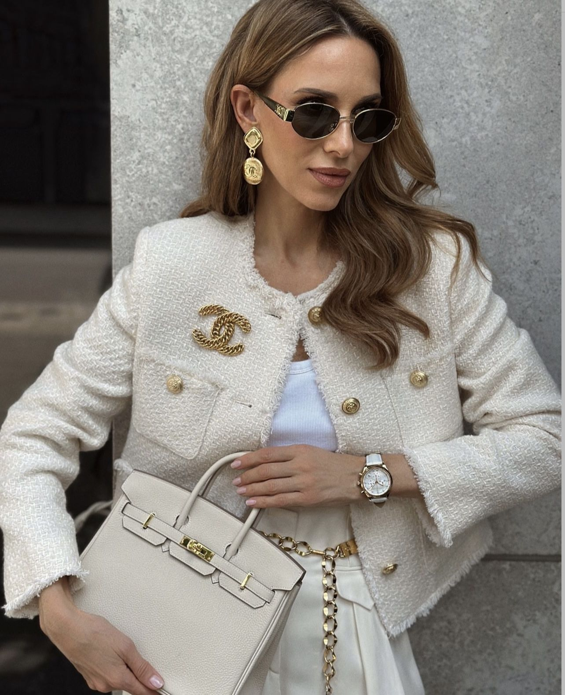

# 巴黎 Chic（Parisian Chic）
> **状态**: reviewed | 最后更新: 2026-06-23 | 分类: 欧洲经典 | **趋势**: 🏛️ 经典风格

## 📖 概述
- 发源年代: 1950-60s Coco Chanel/Audrey Hepburn 时代奠定，是「巴黎女人」作为全球时尚符号的浓缩
- 发源地: 法国巴黎（Saint-Germain-des-Prés / Le Marais / 16区）
- 风格关键词（5-8个）: 黑色小礼服、粗花呢、珍珠项链、红唇、芭蕾平底鞋、不费力、Coco Chanel
- 一句话定义: 巴黎女人衣橱的「精华版」——粗花呢夹克+黑色小礼服+珍珠项链+红唇。Parisian Chic 是有意图的优雅，French Effortless 是随意的优雅——前者去歌剧院，后者去咖啡馆。

## 📜 历史文化
- **起源**: Parisian Chic 与 French Effortless（法式慵懒）共享巴黎地理基因，但前者更「精致/正式」。Parisian Chic 的灵魂人物是 Coco Chanel——她将粗花呢/珍珠/黑色带入了女性日常，并发明了「少即是多」的奢侈哲学。如果说法式慵懒是巴黎女人的「周末」，Parisian Chic 就是巴黎女人的「晚上」——去歌剧院、高级晚宴、或塞纳河畔的正式约会。
- **发展脉络**:
  - **1920-30s**: Coco Chanel 革命——粗花呢套装+珍珠项链+LBD（小黑裙）= 现代 Parisian Chic 的基石
  - **1950s**: Audrey Hepburn（Givenchy）+ Grace Kelly（Hermès Kelly 包）= 将 Parisian Chic 全球化
  - **1980s**: Inès de la Fressange 成为 Chanel 首位专属模特——「穿高定也像穿日常」的巴黎优雅
  - **2000s-2020s**: Parisian Chic 成为全球「优雅女性」的模板——每个城市都有穿粗花呢夹克+珍珠项链的女人
  - **2025-2026**: 更新换代的 Parisian Chic——年轻设计师（如 Jacquemus）将街头元素注入经典优雅
- **文化意义**: Parisian Chic 是全球「优雅」的通用语言——不管你来自哪里，穿一套粗花呢夹克+珍珠项链，你就等于在说「我懂优雅」。

## 🎨 美学特征
- **廓形特点**: 合身而有结构——粗花呢夹克有轻微的垫肩但不过度，铅笔裙或A字裙勾勒下半身线条。核心是「量身就做」（tailored）——离身体1-2cm，不紧也不松。
- **色板**:
  - 主色调：黑色(#000000)、奶油白(#FFFDD0)、海军蓝(#1B2A4A)、驼色(#C4A882)
  - 辅助色：红色（唇/鞋/包）、香槟色、深灰
  - 禁忌色：荧光色、霓虹色、大面积印花、运动面料
  - 色板逻辑：巴黎高级公寓的颜色——黑色铁艺楼梯、奶油白墙面、金色画框、深蓝色丝绒沙发
- **面料偏好**: 粗花呢 > 真丝 > 羊绒 > 缎面 > 小羊皮。面料必须是好的——Parisian Chic 不崇拜 Logo，但崇拜面料。
- **标志单品表**:

| 单品 | 品牌示例 | 选择要点 |
|------|---------|---------|
| 粗花呢夹克 | Chanel, Sandro, Maje, Ba&sh | 合身、圆领或无领、金色纽扣、粗花呢或羊毛混纺 |
| 小黑裙 (LBD) | Chanel, Saint Laurent, Sandro | 及膝或略上、收腰、可日可夜——Coco Chanel 1926年的发明至今有效 |
| 珍珠项链 | Chanel, Mikimoto, vintage | 单链或多层、真珍珠或仿珠、锁骨长度 |
| 红唇 (Rouge à Lèvres) | Chanel, Dior, Guerlain | 正红色或酒红色——一只红唇可以替代所有首饰 |
| 芭蕾平底鞋/细高跟鞋 | Chanel, Repetto, Louboutin | 白天芭蕾平底鞋、晚上细高跟 |
| 绗缝链条包 | Chanel (2.55/Classic Flap), YSL, Polène | 有链条、可斜挎也可手拎、黑色或酒红 |

## 🏷️ 代表品牌
### 核心品牌
| 品牌 | 国家 | 价位 | 一句话 |
|------|------|------|--------|
| Chanel | 法国 | ¥¥¥¥¥ | Coco Chanel 的遗产——粗花呢夹克+LBD+珍珠+2.55包的终极 Parisian Chic |
| Saint Laurent | 法国 | ¥¥¥¥ | YSL 的黑色丝绒+西装+红唇定义了 Parisian Chic 的「夜晚版」|
| Dior | 法国 | ¥¥¥¥ | 1947年 New Look 的创造者——Bar Jacket 的收腰+蓬裙是 Parisian Chic 的「日装版」|
| Hermès | 法国 | ¥¥¥¥¥ | 丝巾+Kelly/Birkin包的 Parisian Chic 顶奢——一条丝巾可以系在颈/包/头发上 |

### 平价替代
| 品牌 | 价位 | 说明 |
|------|------|------|
| Sandro | ¥¥¥ | 法式都市优雅的平价 Channel——粗花呢夹克是镇店之宝 |
| Maje | ¥¥¥ | Sandro 姐妹牌，更年轻更街头 |
| Ba&sh | ¥¥¥ | 法式优雅的日常版——真丝衬衫+粗花呢+针织 |
| Polène | ¥¥ | 巴黎皮具品牌，极简雕塑感包袋——「平民 Hermès」|

## 👤 风格偶像 & 名人
| 人物 | 身份 | 贡献 |
|------|------|------|
| Coco Chanel | 设计师 | Parisian Chic 的建筑师——粗花呢夹克+LBD+珍珠+2.55包的发明者 |
| Audrey Hepburn | 演员 | 《蒂凡尼的早餐》中的小黑裙+珍珠项链是 Parisian Chic 的全球「圣像」|
| Inès de la Fressange | 模特 | Chanel 首位专属模特，代表「穿高定也像穿日常」的巴黎优雅 |
| Catherine Deneuve | 演员 | 1960s-至今的 Parisian Chic 代言——YSL 的缪斯 |

## 🔗 关联风格
- **父风格**: 欧洲经典 (European Classic)
- **子风格**: 巴黎优雅 (Parisian Elegance)、巴黎女士 (Parisian Lady)
- **平行风格**: 法式慵懒（WF-01）——Parisian Chic 是晚上/正式的，French Effortless 是白天/休闲的
- **对立风格**: 女性街头（WF-28）——Parisian Chic 在歌剧院，Streetwear 在滑板场
- **与姐妹风格差异**:
  1. vs 法式慵懒（WF-01）：Chic 去歌剧院穿粗花呢，Effortless 去咖啡馆穿条纹衫
  2. vs 英伦淑女（WF-43）：Parisian Chic 是「塞纳河畔/香奈儿」，British Lady 是「伦敦花园/巴宝莉」

## 📈 流行趋势
- **当前状态**: 永恒经典——Parisian Chic 不会被「取代」，它是时尚的基准线
- **流行区域**: 全球。每一个有「优雅」概念的城市都有一个 Parisian Chic 的女人
- **发展方向**:
  - 2025-2026：可持续奢侈——vintage Chanel 粗花呢夹克比新款的更有 Parisian Chic 精神

## 💡 穿搭建议
- **适合体型**: 所有体型——粗花呢夹克+高腰裤/铅笔裙是万用公式
- **适合肤色**: 黑色/海军蓝/驼色对所有肤色友好
- **适合场合**: 晚宴/歌剧/高级餐厅/正式约会/画廊开幕
- **入门建议**:
  1. 从一条小黑裙开始——这是 Parisian Chic 最便宜的入场券
  2. 加一串珍珠项链——真的或仿的，单链就行
  3. 一支正红色唇膏——Chanel Rouge Allure 或 Dior 999
  4. 姿态——Chic 不是衣服，是态度。步伐放慢、声音放低、不急着解释。

---
*本文基于多源研究整理，AI 辅助生成。*
