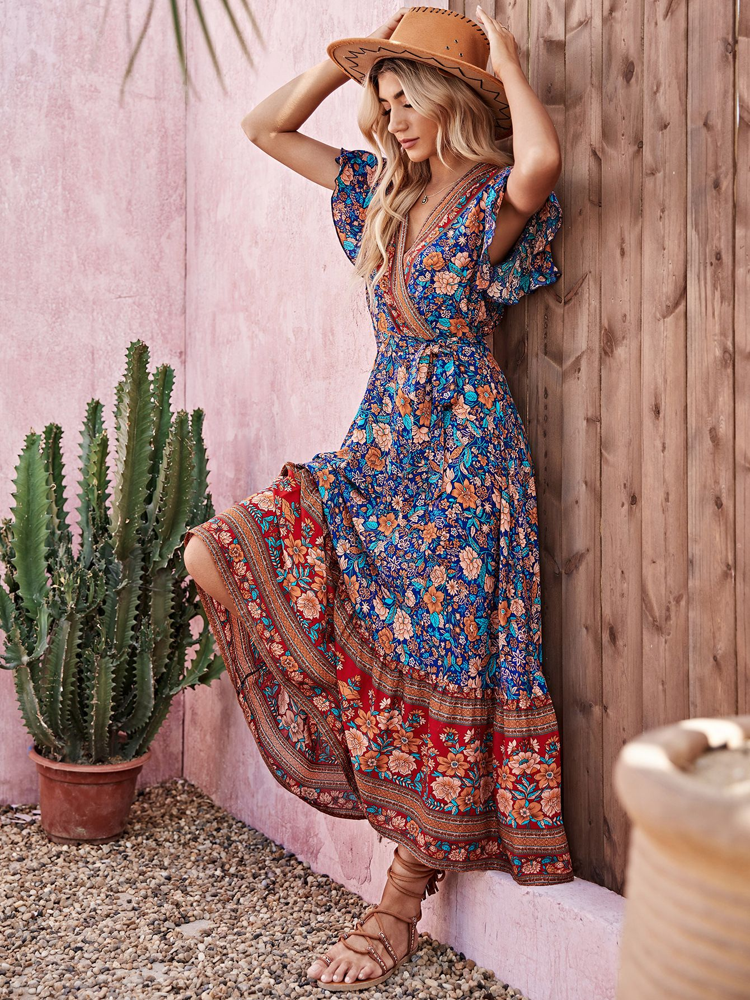

# 意式风情（Italian Donna）
> **状态**: reviewed | 最后更新: 2026-06-23 | 分类: 欧洲经典 | **趋势**: 🏛️ 经典风格

## 📖 概述
- 发源年代: 1950-60s 意大利电影（「甜蜜的生活」时代）奠定，是意大利式女性魅力的浓缩
- 发源地: 意大利（米兰/罗马/那不勒斯/佛罗伦萨）
- 风格关键词（5-8个）: 色彩鲜艳、印花、金色首饰、墨镜、高跟鞋、曲线、自信、地中海热情
- 一句话定义: 意大利女人的自信与华丽——色彩鲜艳的印花裙+大号金耳环+超大墨镜+高跟鞋。不是「低调的优雅」，是「我存在，我知道，我很美」。

## 📜 历史文化
- **起源**: Italian Donna（「意大利女人」之意）不是 TikTok 创造的——它是几个世纪以来意大利女性气质的自然积累。它的现代版本起源于 1950-60年代意大利电影的黄金时代——Sophia Loren 穿着印花裙和草编鞋在那不勒斯街头、Gina Lollobrigida 的紧身连衣裙和丰厚卷发。与法式优雅的「克制/中性色」完全相反，意大利女人拥抱色彩、曲线、和「更多」——更多的金色、更多的印花、更多的自信。品牌如 Dolce & Gabbana 和 Versace 将这种「意大利式华丽」全球化。
- **发展脉络**:
  - **1950-60s**: 意大利电影黄金时代——Sophia Loren/Gina Lollobrigida/Claudia Cardinale 定义了意式女性魅力
  - **1970-80s**: Gianni Versace 和 Dolce & Gabbana 将「意式华丽」带入全球高级时尚
  - **1990s**: Monica Bellucci 成为新世纪的意式性感代言人
  - **2000s-2020s**: 「Italian Donna」成为全球女性追求「自信/性感/不解释」的审美模板
  - **2025-2026**: 意式风情的「日常化」——不是每天都是 Sophia Loren，但一件印花裙+金耳环就可以
- **文化意义**: Italian Donna 是关于「女性魅力不需要道歉」的声明——在一个告诉女性「穿得低调/安全/不引人注目」的世界里，它说：「不，我要穿印花/红色/金色，因为我想。」

## 🎨 美学特征
- **廓形特点**: 裹身+曲线——裹身裙 (wrap dress) 和铅笔裙勾勒身体曲线，翻领衬衫敞开一两颗扣子。核心是「女性线条」——意大利女人不藏曲线，不穿 oversize 来掩盖身形。
- **色板**:
  - 主色调：番茄红(#E63946)、地中海蓝(#0077B6)、金色(#D4AF37)、黑色(#000000)
  - 辅助色：柠檬黄、奶油白、印花（任何颜色都可以）
  - 禁忌色：灰色（大面积）、极简黑白灰（太北欧了）
  - 色板逻辑：意大利国旗+地中海——红、蓝、金、白
- **面料偏好**: 真丝 > 蕾丝 > 缎面 > 棉质印花 > 皮革。面料要有「光泽」和「质感」——意大利女人喜欢能「被看见」的面料。
- **标志单品表**:

| 单品 | 品牌示例 | 选择要点 |
|------|---------|---------|
| 印花裹身裙/连衣裙 | Dolce & Gabbana, Pucci, La DoubleJ | 鲜艳花卉/几何印花、裹身设计、及膝或中长 |
| 大号金耳环 | Bottega Veneta, Pomellato, vintage | 圈形或吊坠、大到能被墨镜挡住 |
| 翻领真丝衬衫 | Equipment, La DoubleJ, Dolce & Gabbana | 印花或纯色、V领敞开、塞进高腰裤 |
| 超大墨镜 | Gucci, Prada, vintage | 黑色或玳瑁色、尺寸要大——意大利太阳强 |
| 高跟鞋/细带凉鞋 | Aquazzura, Gianvito Rossi, Ferragamo | 细高跟或粗跟、露出脚踝、拉长腿部 |
| 金色搭扣腰带 | Gucci, Ferragamo | 搭大Logo或马衔扣——腰线就是一切 |

## 🏷️ 代表品牌
### 核心品牌
| 品牌 | 国家 | 价位 | 一句话 |
|------|------|------|--------|
| Dolce & Gabbana | 意大利 | ¥¥¥¥ | 西西里的巴洛克华丽——花卉印花+蕾丝+金饰+红唇=意式风情的「最大化版本」|
| Versace | 意大利 | ¥¥¥¥ | 1978年创立，金色+印花+黑色皮革+Medusa Logo——意式奢华的全球符号 |
| Gucci | 意大利 | ¥¥¥¥ | 1921年创立于佛罗伦萨，马衔扣乐福鞋+印花真丝衬衫+竹节包=意式优雅 |
| Prada | 意大利 | ¥¥¥¥ | 1913年创立于米兰，意式知识女性的优雅——更低调但依然有态度 |
| Pucci | 意大利 | ¥¥¥¥ | 1947年创立，漩涡几何印花是它的DNA——一件 Pucci = 整个意式夏日的浓缩 |

### 平价替代
| 品牌 | 价位 | 说明 |
|------|------|------|
| La DoubleJ | ¥¥¥ | 米兰品牌，极致印花的「平民 Dolce」 |
| Mango | ¥ | 西班牙品牌，印花连衣裙的平价选择 |
| Zara | ¥ | 每季都有印花裹身裙和真丝衬衫 |
| & Other Stories | ¥¥ | 北欧设计+意式印花的优雅混合 |

## 👤 风格偶像 & 名人
| 人物 | 身份 | 贡献 |
|------|------|------|
| Sophia Loren | 演员 | 1950-60s 的终极 Italian Donna——印花裙+曲线+眼神+自信 |
| Monica Bellucci | 演员 | 1990s-至今的现代 Sophia Loren——黑色连衣裙+丰厚卷发+不解释的性感 |
| Gina Lollobrigida | 演员 | 1950-60s 的意式性感偶像——紧身连衣裙+印花+大号首饰 |
| Donatella Versace | 设计师 | 虽然她是创造者而非穿着者，但她本人就是 Italian Donna 的活体化身 |

### 穿着此风格的现代明星
| 人物 | 身份 | 为什么是 icon |
|------|------|---------------|
| Chiara Ferragni | 博主/企业家 | 意大利最知名的时尚博主——她的穿搭是「全球化 Italian Donna」 |
| Amal Clooney | 律师 | 虽然不是意大利人，但她的印花连衣裙+大墨镜+高跟鞋造型精准命中 Italian Donna |

## 🔗 关联风格
- **父风格**: 欧洲经典 (European Classic)
- **子风格**: 西西里华丽 (Sicilian Glamour)、米兰优雅 (Milanese Elegance)
- **平行风格**: 法式慵懒（WF-01）——Italian Donna 是「更多/更色彩/更曲线」，French Effortless 是「更少/更中性/更随意」
- **对立风格**: 北欧冷淡（WF-36）——Italian Donna 是「暖+色彩+情感」，Scandi Cool 是「冷+简约+克制」
- **与姐妹风格差异**:
  1. vs 法式慵懒（WF-01）：意大利女人说「看我多美」，法国女人说「我都没打扮」——相同的自信，不同的表达
  2. vs 巴黎 Chic（WF-34）：Italian Donna 更「热情/曲线/印花」，Parisian Chic 更「克制/结构/粗花呢」

## 📈 流行趋势
- **当前状态**: 永恒经典——Italian Donna 是意大利的文化出口品，不会过时
- **流行区域**: 全球。任何有「夏天/阳光/热情」的地方都有 Italian Donna 的影子
- **发展方向**:
  - 2025-2026：从「全套华丽」到「意式元素日常化」——一件印花真丝衬衫+牛仔裤+金耳环=日常版 Italian Donna

## 💡 穿搭建议
- **适合体型**: 沙漏形（裹身裙+高跟=完美公式，0.95）、梨形（铅笔裙+真丝衬衫遮盖臀胯，0.90）
- **适合肤色**: 暖皮穿红色/金色/印花绝配；冷皮可选地中海蓝+黑色的变体
- **适合场合**: 约会（满分）、下午茶、派对、晚宴、意大利度假
- **入门建议**:
  1. 从一条印花裹身裙开始——Dolce & Gabbana（投资款）或 Zara（平价）
  2. 一对大号金耳环——圈形最百搭
  3. 一副超大墨镜——Gucci 或 Prada 风格
  4. 自信是终极配饰——Italian Donna 不穿衣服，衣服穿她

---
*本文基于多源研究整理，AI 辅助生成。*
