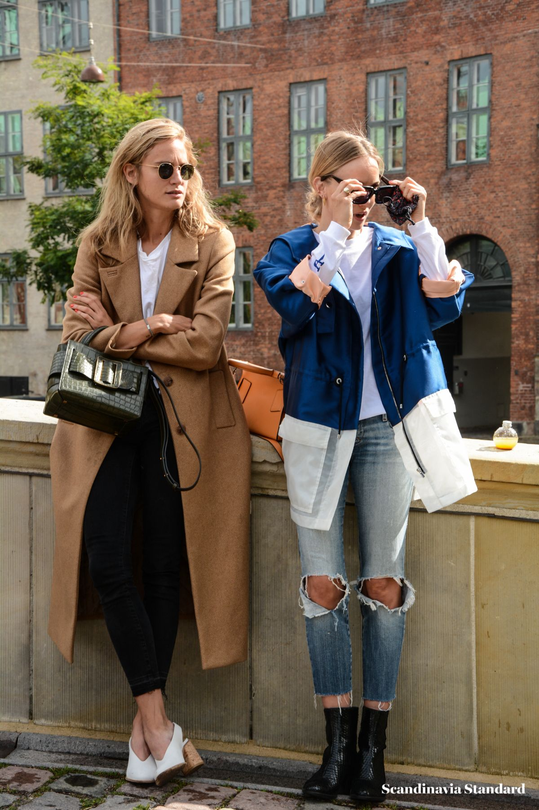

# 北欧冷淡（Scandi Cool）
> **状态**: reviewed | 最后更新: 2026-06-23 | 分类: 现代都市 | **趋势**: 🏛️ 经典风格

## 📖 概述
- 发源年代: 2010年代全面兴起，美学根源在 1950-60s 北欧现代主义设计
- 发源地: 哥本哈根/斯德哥尔摩——北欧设计的全球输出中心
- 风格关键词（5-8个）: 建筑廓形、中性色、可持续面料、功能性、极简但不冷、Hygge 舒适感
- 一句话定义: 北欧设计的穿衣版——建筑感廓形+中性色+可持续面料+功能性。不是「冷淡」的极简（那是日本的），是「有温度的极简」——像一间有阳光、羊毛毯、和木质家具的哥本哈根公寓。

## 📜 历史文化
- **起源**: Scandi Cool 是北欧设计 DNA 在服装上的表达。北欧设计（家具/建筑/产品）以「功能+简约+人性」闻名——Arne Jacobsen 的椅子、Alvar Aalto 的花瓶、Bang & Olufsen 的音响。当这种设计哲学被穿在身上时，就产生了 Scandi Cool：廓形像建筑一样有结构，颜色像北欧天空一样灰蓝调，面料像北欧人一样实用（羊毛/棉/亚麻）。「Cool」一词在此不是「冷淡」，而是「冷静/从容/不尖叫」。加上「Hygge」（丹麦语，意为温暖舒适的生活）的影响，Scandi Cool 成为「可以拥抱的极简主义」。
- **发展脉络**:
  - **1950-60s**: 北欧现代主义设计的黄金时代——Arne Jacobsen/Alvar Aalto 的家具设计影响了一代审美
  - **1990s**: H&M（1947年创立于瑞典）将北欧平价时尚全球化
  - **2000s**: Acne Studios（1996年创立）和 COS（2007年创立）将北欧极简美学带入高端时尚
  - **2010s**: Ganni（2000年创立）将北欧「酷女孩」审美全球化——有色彩的极简
  - **2017-2023**: 「Scandi Style」成为 Pinterest 和 Instagram 上搜索量最高的风格词之一
  - **2025-2026**: 可持续成为 Scandi Cool 的核心——哥本哈根时装周已经是全球可持续时尚的先锋阵地
- **文化意义**: Scandi Cool 是资本主义过剩的北欧解药——在一个「买更多/快更快」的时代，它说：「买更少，但更好。」它是慢时尚/可持续/品质的审美先锋。

## 🎨 美学特征
- **廓形特点**: 建筑感 oversize——宽肩西装、气球袖连衣裙、阔腿裤的垂坠像北欧建筑的线条。核心是「空气感」——衣服和身体之间有空间，让面料和廓形说话而不是让身体线条说话。
- **色板**:
  - 主色调：灰色(#808080)、灰蓝(#7B8FA1)、驼色(#C4A882)、奶油白(#FFFDD0)
  - 辅助色：黑色、炭灰、苔藓绿、燕麦色
  - 禁忌色：荧光色、霓虹色、金色、大面积印花
  - 色板逻辑：北欧天空的颜色——冬日灰蓝色的天、夏日燕麦色的麦田、哥本哈根港口的灰蓝色水面
- **面料偏好**: 羊毛 > 亚麻 > 棉 > 回收聚酯。面料必须是可持续的/天然的/有「手感」的——哥本哈根时装周即将要求所有品牌遵循可持续准则。
- **标志单品表**:

| 单品 | 品牌示例 | 选择要点 |
|------|---------|---------|
| 建筑感西装外套 | Acne Studios, COS, Filippa K | 略oversize、宽肩或圆肩、灰色/驼色 |
| 气球袖/蓬袖连衣裙 | Ganni, Cecilie Bahnsen, Stine Goya | 蓬袖+A字或直筒、及膝或中长、纯色优先 |
| 阔腿羊毛裤 | Acne Studios, COS, Totême | 高腰、垂坠、羊毛或羊毛混纺 |
| 极简皮质托特包 | Acne Studios, ATP Atelier, Little Liffner | 大面积皮革、无Logo、可装笔记本电脑 |
| 功能性外套/雨衣 | Stutterheim, Rains, Ganni | 防水、简约设计、适合北欧天气 |
| 厚底乐福鞋/切尔西靴 | Acne Studios, Ganni, Vagabond | 黑色、厚底、可搭配袜子 |

## 🏷️ 代表品牌
### 核心品牌
| 品牌 | 国家 | 价位 | 一句话 |
|------|------|------|--------|
| Acne Studios | 瑞典 | ¥¥¥-¥¥¥¥ | 1996年创立于斯德哥尔摩，北欧酷感的旗舰——皮夹克+建筑廓形+创意性 |
| Ganni | 丹麦 | ¥¥-¥¥¥ | 2000年创立，北欧「酷女孩」的全球代言——蓬袖连衣裙+可持续面料+有态度的甜美 |
| COS | 瑞典 | ¥¥ | 2007年创立，建筑感极简的平价之王——阔腿裤+白衬衫+羊毛大衣 |
| Totême | 瑞典 | ¥¥¥-¥¥¥¥ | 2014年创立，北欧版的 Quiet Luxury——驼色大衣+阔腿裤+丝巾的「胶囊衣橱」概念 |
| Filippa K | 瑞典 | ¥¥¥ | 1993年创立，可持续极简的先驱——北欧版的「少即是多」|
| Cecilie Bahnsen | 丹麦 | ¥¥¥¥ | 蓬袖+薄纱+手工细节——北欧浪漫主义的最高表达 |

### 平价替代
| 品牌 | 价位 | 说明 |
|------|------|------|
| COS | ¥¥ | 本身已经是 Scandi Cool 的平价核心 |
| Arket | ¥¥ | COS 姐妹牌，更日常更舒适 |
| & Other Stories | ¥¥ | H&M 集团高端线，北欧设计+巴黎灵感 |
| Weekday | ¥ | H&M 集团，北欧极简的「最平价」入口 |

## 👤 风格偶像 & 名人
| 人物 | 身份 | 贡献 |
|------|------|------|
| Pernille Teisbaek | 丹麦博主 | 北欧极简+建筑廓形的全球代言人——她的穿搭是 Scandi Cool 的教科书 |
| Emili Sindlev | 丹麦博主 | 北欧「极繁」版——用色彩和印花突破极简的边界 |
| Matilda Djerf | 瑞典博主/Djerf Avenue 创始人 | 北欧「甜美酷」——蓬袖+牛仔+金色首饰的日常 Scandi |
| Sophia Roe | 丹麦博主 | 北欧可持续时尚的倡导者——每一套造型都包含 vintage/二手元素 |

## 🔗 关联风格
- **父风格**: 奢华极简 (Luxe Minimalist)
- **子风格**: 北欧浪漫 (Scandi Romance)、哥本哈根酷 (Copenhagen Cool)
- **平行风格**: 极简（WF-06）——共享「少即是多」，但 Scandi Cool 更「有温度的/有色彩的/可持续的」
- **对立风格**: 意式风情（WF-35）——Scandi Cool 是灰冷/克制/功能，Italian Donna 是暖色/热情/曲线
- **与姐妹风格差异**:
  1. vs 极简（WF-06）：Scandi Cool 有「Hygge 舒适感」（一件温暖的羊毛大衣），Minimalist 更「哲学/冷酷」
  2. vs 静奢风（WF-17）：Scandi Cool 的「不炫耀」来自北欧社会民主文化，Quiet Luxury 的「不炫耀」来自美国精英圈
  3. vs 法式慵懒（WF-01）：Scandi Cool 更「功能性/建筑感/可持续」，French Effortless 更「随意感/性感/不费力」

## 📈 流行趋势
- **当前状态**: 全球影响力持续上升——哥本哈根时装周已成为第三大时装周（仅次于巴黎/米兰）
- **流行区域**: 北欧 > 欧洲 > 北美 > 东亚。城市化/受教育程度高的地区更容易接受 Scandi Cool
- **发展方向**:
  - 2025-2026：可持续将成为 Scandi Cool 的「准入门槛」而非「加分项」
  - 北欧二手市场爆发——vintage Filippa K 和二手 Acne Studios 成为新一代北欧女孩的衣柜来源

## 💡 穿搭建议
- **适合体型**: 所有体型——oversize 廓形包容一切
- **适合肤色**: 灰/驼对暖皮友好；灰蓝/炭灰对冷皮友好
- **适合场合**: 日常通勤（创意/设计行业）、逛街、咖啡馆、画廊
- **入门建议**:
  1. 投资一件好羊毛大衣——Acne Studios（投资款）或 COS（平价款）
  2. 一双厚底乐福鞋——Acne Studios 或 Vagabond
  3. 一条阔腿羊毛裤——COS 或 Totême
  4. 一件蓬袖上衣——Ganni 或 Cecilie Bahnsen（如果你想要北欧浪漫版）

---
*本文基于多源研究整理，AI 辅助生成。*
