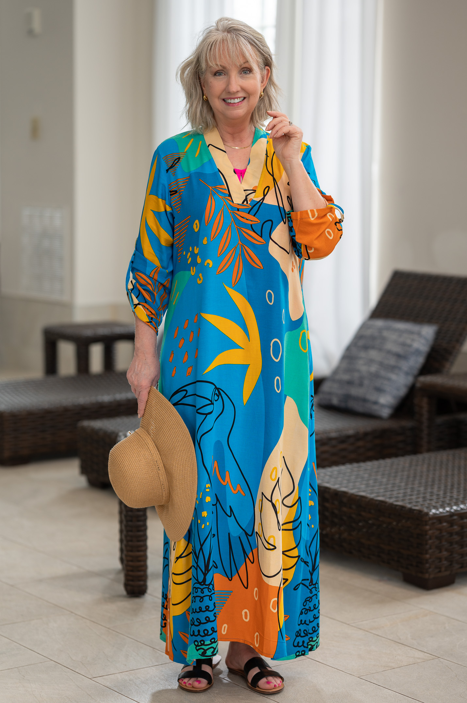

# 度假逃逸（Resort Escape）
> **状态**: reviewed | 最后更新: 2026-06-23 | 分类: 自然田园 | **趋势**: 🏛️ 经典风格

## 📖 概述
- 发源年代: 1970-80s 「度假系列」(Resort/Cruise Collection) 的概念被奢侈品牌引入，但作为日常审美在 2010s Instagram 时代全面爆发
- 发源地: 全球热带/海岛度假目的地——加勒比海/地中海/东南亚/墨西哥
- 风格关键词（5-8个）: 亚麻长裙、宽檐草帽、细带凉鞋、印花罩衫、编织包、热带色彩、落日
- 一句话定义: 像是在一个永无止境的热带假期里——亚麻长裙+宽檐草帽+细带凉鞋+编织包。不是「去度假」，是「把度假穿在身上」。

## 📜 历史文化
- **起源**: 「Resort」作为时尚概念起源于 20 世纪初——当时富裕的欧美阶层会在冬季逃离到地中海或加勒比海，需要一整套「冬季穿的夏装」。奢侈品牌开始在传统的春夏/秋冬时装周之间推出「Resort 系列」(也称 Cruise 系列) 来满足这一需求。Chanel 的 Cruise 系列（每年在全球选一个异域地点办秀）是这个概念的巅峰。与此同时，Instagram 在 2010s 将「度假美学」从富裕阶层专属变成了大众的视觉消费和生活方式向往。
- **发展脉络**:
  - **1920-30s**: Coco Chanel 率先推出「Cruise」系列——为法国里维耶拉的度假女性设计
  - **1970-80s**: 奢侈品牌将 Resort 系列制度化为第三大时装季
  - **2010s**: Instagram 引爆「度假美学」——#ResortWear 标签搜索量爆炸
  - **2020-2022**: 疫情封锁期间「度假幻想」暴涨——人们不能去度假，但可以穿得像在度假
  - **2023-2026**: 「报复性旅行」+度假审美从「只有度假才穿」变成「夏天就是天天度假」
- **文化意义**: Resort Escape 是日常生活的审美逃离——当你的办公室窗外是灰暗的城市，一件亚麻长裙+宽檐帽可以让你在心里已经到达了海边。

## 🎨 美学特征
- **廓形特点**: 飘逸+宽松——长裙垂坠到脚踝，罩衫随风飘动，宽腿裤有海浪般的流动感。核心是「没有约束」——没有紧身、没有勒带、没有任何让你在 35°C 的天气里不舒服的东西。
- **色板**:
  - 主色调：白色(#FFFFFF)、海蓝(#0077B6)、珊瑚红(#FF6F61)、绿松石(#40E0D0)
  - 辅助色：沙色、柠檬黄、热带印花（棕榈叶/芙蓉花）
  - 禁忌色：黑色（太吸热）、灰色（太城市）
  - 色板逻辑：热带海滩的颜色——白沙、蓝海、红珊瑚、绿棕榈
- **面料偏好**: 亚麻 > 棉质薄纱 > 真丝 > 钩针编织。面料必须能「呼吸」——在热带阳光下不能让你出汗。
- **标志单品表**:

| 单品 | 品牌示例 | 选择要点 |
|------|---------|---------|
| 亚麻/棉质长裙 | Zimmerman, Johanna Ortiz, Faithfull The Brand | 及踝长度、飘逸、白色或热带印花 |
| 印花罩衫 (Kaftan) | Missoni, Emilio Pucci, Eres | 宽松、可当外套也可单穿、热带图案或几何印花 |
| 宽檐草帽 | Eugenia Kim, Lack of Color, H&M | 帽檐要大——能遮住脸+肩膀 |
| 细带凉鞋/草编鞋 | Castaner, Ancient Greek Sandals, The Row | 平底或中跟、细搭带、可赤脚穿 |
| 编织托特包/竹篮包 | Dragon Diffusion, Prada, Kayu | 超大容量、可装海滩毛巾和一本小说 |
| 连体泳衣/比基尼打底 | Eres, Solid & Striped, Hunza G | 可当内搭在罩衫里、高腰高叉均可 |

## 🏷️ 代表品牌
### 核心品牌
| 品牌 | 国家 | 价位 | 一句话 |
|------|------|------|--------|
| Zimmerman | 澳大利亚 | ¥¥¥¥ | 澳式度假美学的巅峰——印花亚麻长裙+蕾丝+荷叶边 |
| Johanna Ortiz | 哥伦比亚 | ¥¥¥¥ | 拉丁度假风——荷叶边+露肩+热带印花，拉丁女性的度假制服 |
| Missoni | 意大利 | ¥¥¥¥ | 1953年创立，Z字形针织和色彩——度假罩衫的「意大利贵族」|
| Faithfull The Brand | 巴厘岛/澳大利亚 | ¥¥ | 巴厘岛手工制作的亚麻连衣裙和罩衫——Resort Escape 的平价灵魂 |
| Eres | 法国 | ¥¥¥ | 法国奢侈泳装和度假装——最精致的海滩衣橱 |

### 平价替代
| 品牌 | 价位 | 说明 |
|------|------|------|
| Faithfull The Brand | ¥¥ | 本身已经是 Resort Escape 的平价首选 |
| H&M | ¥ | 每季都有亚麻连衣裙和草编配饰的季节性供应 |
| Mango | ¥ | 西班牙品牌，度假单品的平价主力 |
| Zara | ¥ | 每年春季推出 Resort/Cruise 灵感系列 |

## 👤 风格偶像 & 名人
| 人物 | 身份 | 贡献 |
|------|------|------|
| Bianca Jagger | 演员/活动家 | 1970s 的度假风格 icon——白色亚麻套装+宽檐帽+草编包 |
| Talitha Getty | 演员/模特 | 1960s 摩洛哥度假美学的终极化身——印花罩衫+宽檐帽+马拉喀什的日落 |
| Elizabeth Taylor | 演员 | 1950-60s 的度假女王——她的地中海和加勒比度假造型定义了 Resort Escape |
| Rihanna | 歌手/企业家 | 现代度假美学的 queen——她的 Fenty x Puma 和 Savage x Fenty 度假造型 |

## 🔗 关联风格
- **父风格**: 自然逃离 (Nature Escape)
- **子风格**: 热带奢华 (Tropical Luxe)、海岛流浪 (Island Nomad)
- **平行风格**: 地中海番茄（WF-21）——共享「夏日/度假/热情」，Resort Escape 更「泛热带」，Tomato Girl 更特指「南意大利」
- **对立风格**: 北欧冷淡（WF-36）——Resort Escape 在加勒比海滩，Scandi Cool 在哥本哈根冬日的灰色天空下
- **与姐妹风格差异**:
  1. vs 海岸祖母（WF-20）：Resort Escape 更「热带/印花/色彩」，Coastal Grandmother 更「美国东海岸/中性色」
  2. vs 地中海番茄（WF-21）：Resort Escape 可以在任何热带地方，Tomato Girl 必须在南意大利

## 📈 流行趋势
- **当前状态**: 永恒经典——每年度假系列都会重新定义「逃离日常」的审美
- **流行区域**: 全球（季节性），热带地区全年适用
- **发展方向**:
  - 2025-2026：可持续度假——有机亚麻/再生棉/植物染色的度假装
  - 「Staycation 度假」——即使不出门，也穿度假装过周末

## 💡 穿搭建议
- **适合体型**: 所有体型——宽松廓形+高腰设计包容一切
- **适合肤色**: 热带色彩对所有肤色友好。白皮穿珊瑚红，黑皮穿白色+金色首饰
- **适合场合**: 热带度假（当然）、周末 brunch、海滩婚礼、泳池派对
- **入门建议**:
  1. 从一条白色亚麻长裙开始——这是 Resort Escape 的「白T恤」
  2. 一件印花罩衫——可当外套也可单穿
  3. 一顶宽檐草帽——这是 Resorts 的「态度保障」
  4. 一只编织托特包——大到能装下你的海滩必需品

---
*本文基于多源研究整理，AI 辅助生成。*
