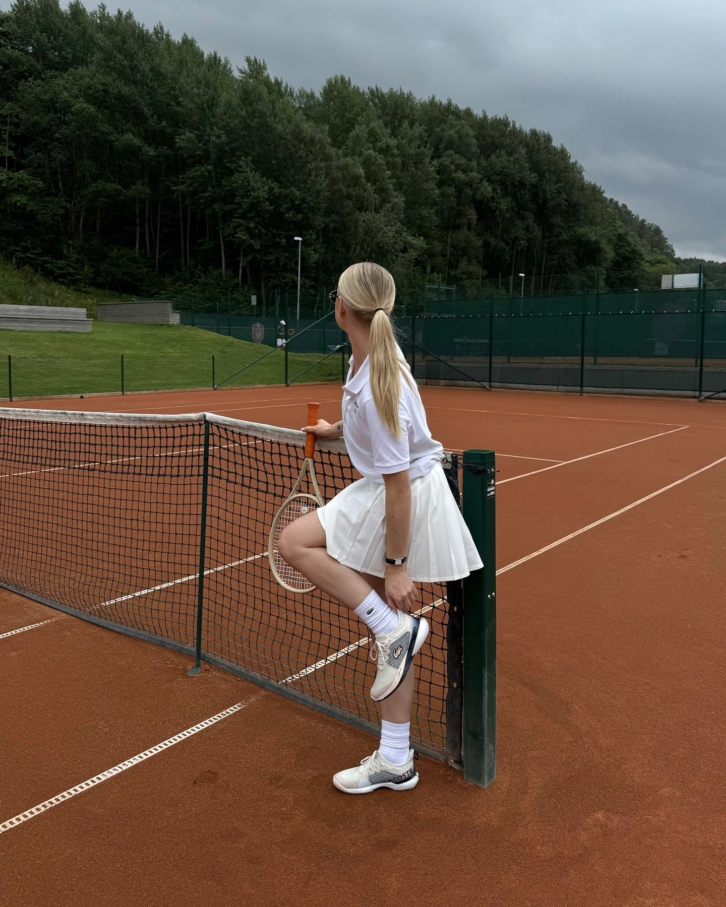

# 网球名媛（Tenniscore）
> **状态**: reviewed | 最后更新: 2026-06-23 | 分类: 现代都市 | **趋势**: 🔥 流行趋势

## 📖 概述
- 发源年代: 2022-2023年 TikTok 爆发，美学根源在 1970-80s 的网球俱乐部文化和《挑战者》电影
- 发源地: 互联网 + 温布尔登/美国乡村俱乐部
- 风格关键词（5-8个）: 百褶网球裙、Polo 衫、白色运动袜+运动鞋、V领针织、遮阳帽、俱乐部优雅
- 一句话定义: 像是刚从温布尔登球场下来直接去吃早午餐——白色百褶网球裙+Polo衫+V领针织衫搭在肩上+白色运动鞋。运动与优雅的完美交集。

## 📜 历史文化
- **起源**: Tenniscore 的视觉根源在 1970-80s 的网球俱乐部文化——不是职业球员的赛场装备，而是「打完网球后坐在俱乐部阳台上喝柠檬水」的周末精英社交审美。这个时代的关键人物包括 Chris Evert（1970s 网球女王的蕾丝头带+百褶裙）和后来的戴安娜王妃（穿着 oversized 卫衣+单车裤去看网球）。2022-2023年，TikTok 和 Miu Miu 2022 SS 系列（网球裙+卫衣）共同引爆了 Tenniscore。2024年 Luca Guadagnino 电影《挑战者》(Challengers) 将网球审美推向新高峰。
- **发展脉络**:
  - **1970-80s**: 网球俱乐部黄金时代——Chris Evert/John McEnroe/Björn Borg 定义了「网球场上的时尚」
  - **1990s**: 戴安娜王妃将网球审美带入日常街头——oversize 卫衣+单车裤+运动鞋+棒球帽
  - **2000s**: Lacoste 和 Fred Perry 将网球风格商品化为日常休闲服
  - **2022**: Miu Miu 2022 SS 引爆 Tenniscore——百褶网球裙+卫衣成为年度最热门单品
  - **2024**: 电影《挑战者》(Zendaya 主演) 将网球审美推向电影荧幕
  - **2025-2026**: Tenniscore 从「病毒趋势」进入「夏季常规穿搭」
- **文化意义**: Tenniscore 是关于「运动+优雅可以共存」——它把运动服的舒适和精英俱乐部的优雅融合在一起，是 Athleisure 的「有钱版」。

## 🎨 美学特征
- **廓形特点**: 上松下紧或上下平衡——Polo衫/V领针织合身，网球裙 A字或百褶，V领针织衫搭在肩上制造「不在打球但刚打完」的氛围。
- **色板**:
  - 主色调：白色(#FFFFFF)、奶油白(#FFFDD0)、海军蓝(#1B2A4A)、草地绿(#4CAF50)
  - 辅助色：酒红、柠檬黄、灰色
  - 禁忌色：荧光色、霓虹色、黑色（大面积在阳光下）
  - 色板逻辑：温布尔登的颜色——严格的全白着装规定 + 草地绿色 + 海军蓝外衣
- **面料偏好**: 棉质 Pike 针织 > 华夫格棉 > 府绸 > 羊绒。面料要「挺括」——Polo 衫领口要立起来，百褶裙要能保持褶痕。
- **标志单品表**:

| 单品 | 品牌示例 | 选择要点 |
|------|---------|---------|
| 百褶网球裙 | Lacoste, Alo, Tory Sport, Wilson | A字、高腰、白色首选、可带内置短裤 |
| Polo 衫 | Lacoste, Ralph Lauren, Fred Perry | 修身、棉质 Pike 针织、两扣或三扣 |
| V领针织衫（搭在肩上）| Ralph Lauren, Uniqlo, J.Crew | 羊绒或棉、奶油白/海军蓝、不是穿是搭 |
| 白色运动袜+白球鞋 | Nike Court, Adidas Stan Smith, Veja | 白色、干净、看起来像随时能上场 |
| 遮阳帽/棒球帽 | Lacoste, Ralph Lauren, Nike | 白色、有帽檐、可防晒 |
| 运动款腕表 | Rolex (Datejust), Timex, Casio | 功能性+优雅——在网球场上也能戴 |

## 🏷️ 代表品牌
### 核心品牌
| 品牌 | 国家 | 价位 | 一句话 |
|------|------|------|--------|
| Lacoste | 法国 | ¥¥-¥¥¥ | 1933年由网球冠军 René Lacoste 创立——Polo 衫的发明者（之一），鳄鱼 Logo 是 Tenniscore 的圣徽 |
| Ralph Lauren | 美国 | ¥¥¥ | Polo 线是网球俱乐部审美的商业化巅峰——百褶裙+Polo衫+V领针织 |
| Fred Perry | 英国 | ¥¥ | 英国网球冠军 Fred Perry 1952年创立，月桂冠 Logo——更 Mod/更英伦的 Tenniscore |
| Tory Sport | 美国 | ¥¥¥ | Tory Burch 的运动线——网球审美的「女性奢侈版」|
| Wilson | 美国 | ¥-¥¥ | 网球装备的原生品牌——球拍/球鞋/服装，是真正的「网球场上穿的」|

### 平价替代
| 品牌 | 价位 | 说明 |
|------|------|------|
| Uniqlo | ¥ | Polo 衫和百褶裙的平价首选——特别是 Uniqlo U 线 |
| H&M | ¥ | 网球裙的季节性供应 |
| Alo Yoga | ¥¥ | 虽然是瑜伽品牌，但网球裙和 Polo 连衣裙准确命中了 Tenniscore |

## 👤 风格偶像 & 名人
| 人物 | 身份 | 贡献 |
|------|------|------|
| Chris Evert | 网球运动员 | 1970s 网球女王的蕾丝头带+百褶裙+腕带——Tenniscore 的原始 icon |
| 戴安娜王妃 | 英国王室 | 将网球俱乐部审美带入日常——oversize 卫衣+单车裤+运动鞋 |
| Zendaya | 演员 | 2024年《挑战者》全球宣传期间穿的网球灵感造型定义了「电影级 Tenniscore」|
| Serena Williams | 网球运动员 | 不仅是网球史上最伟大的球员之一，她在场上的 Off-White/Nike 定制网球裙也是 Tenniscore 的高端版 |

### 穿着此风格的博主
| 人物 | 身份 | 为什么是 icon |
|------|------|---------------|
| Matilda Djerf | 瑞典博主 | 多次以网球裙+Polo衫+V领针织衫搭肩造型出现 |
| Sofia Richie Grainge | 模特 | 她的「安静的奢华」造型中常融入 Tenniscore 元素 |

## 🔗 关联风格
- **父风格**: 运动休闲 (Smart Casual)
- **子风格**: 高尔夫核 (Golfcore)、划艇核 (Rowing Blazer)
- **平行风格**: 运动休闲（WF-08）——共享「运动品牌/舒适」，Tenniscore 更「精英/优雅/俱乐部」
- **对立风格**: 女性街头（WF-28）——Tenniscore 在俱乐部阳台喝柠檬水，Streetwear 在滑板场喝能量饮料
- **与姐妹风格差异**:
  1. vs 运动休闲（WF-08）：Tenniscore 有「精英俱乐部的阶层感」，Athleisure 是「大众健身房的舒适感」
  2. vs 学院风（WF-07）：Tenniscore 是 Preppy 的「体育课版本」
  3. vs 马术优雅（WF-48）：Tenniscore 在网球场，Equestrian 在马术场——都是「运动+优雅+有钱」

## 📈 流行趋势
- **当前状态**: 高峰期——《挑战者》电影+ Miu Miu 持续推动，Tenniscore 正值巅峰
- **流行区域**: 北美 > 英国 > 欧洲。网球俱乐部的文化土壤决定 Tenniscore 的接受度
- **发展方向**:
  - 2025-2026：从「全套网球」到「网球元素」——一条网球裙+白T恤+凉鞋=日常版 Tenniscore

## 💡 穿搭建议
- **适合体型**: 所有体型——A字百褶裙对所有身形友好
- **适合肤色**: 白色对所有肤色友好；可以加一件海军蓝或草地绿的单品做配色
- **适合场合**: 周末 brunch（满分）、逛街、网球场（当然）、夏日音乐会
- **入门建议**:
  1. 从一条百褶网球裙开始——Lacoste 或 Alo Yoga
  2. 一件修身 Polo 衫——Ralph Lauren 或 Uniqlo
  3. 一件V领针织衫——不要穿，搭在肩上，这是 Tenniscore 的「灵魂姿态」
  4. 白色运动袜+白球鞋——Stan Smith 或 Veja

---
*本文基于多源研究整理，AI 辅助生成。*
