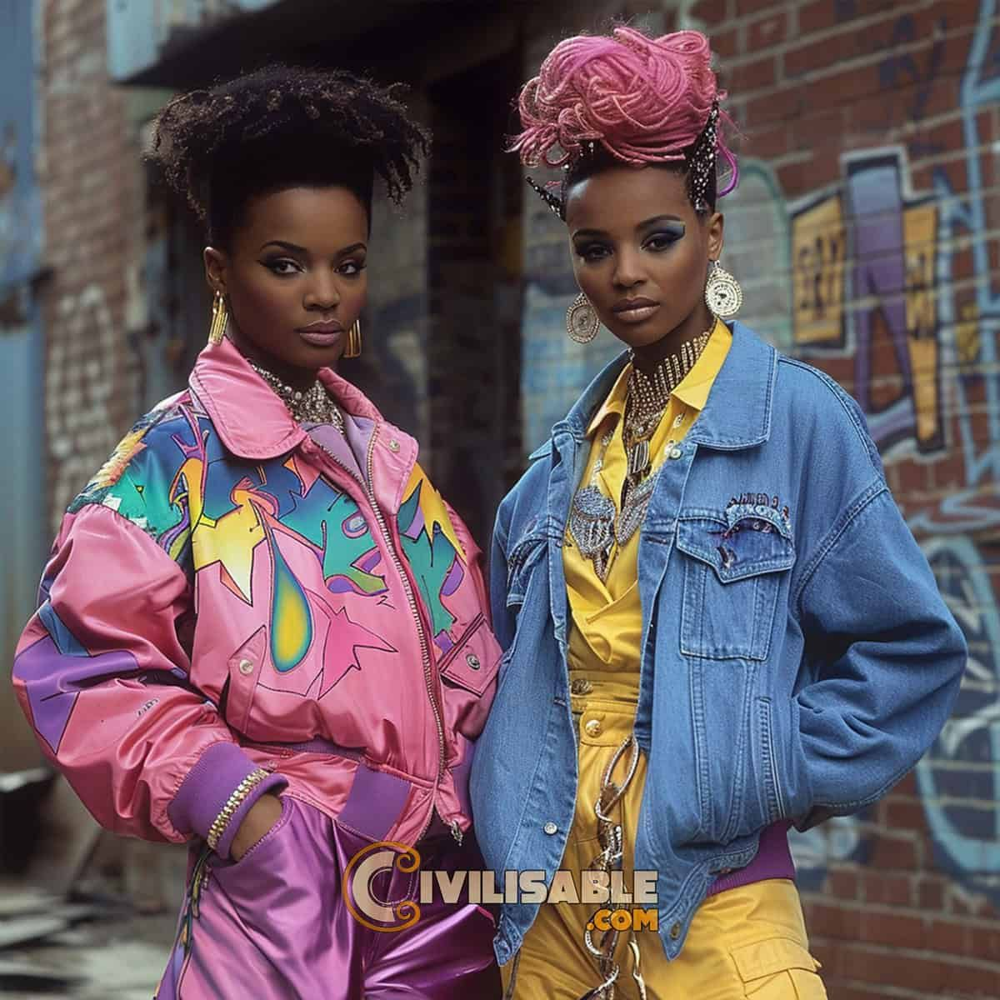

# 嘻哈华丽（Hip Hop Glam）
> **状态**: reviewed | 最后更新: 2026-06-23 | 分类: 都市街头 | **趋势**: 🔥 流行趋势

## 📖 概述
- 发源年代: 1990s-2000s 嘻哈文化中自然生长，2010s 后在高级时尚界得到承认
- 发源地: 纽约布朗克斯/哈莱姆 + 洛杉矶 + 亚特兰大
- 风格关键词（5-8个）: 大号金链、运动服套装、球鞋、皮草、Logo 狂热、钻石、自信
- 一句话定义: 嘻哈文化的「赚到钱了」的豪华表达——大号金链+名牌 tracksuit+限量球鞋+设计师 Logo。不是「安静的财富」，是「我成功了，让全世界看到」。

## 📜 历史文化
- **起源**: Hip Hop Glam 是嘻哈文化中「success story」的审美表达。1980年代，Run-DMC 穿着 Adidas Superstar+金链+运动服登上舞台，将「街头的酷」带入了大众视野。1990s-2000s，随着 Jay-Z/Puff Daddy/Lil' Kim/Missy Elliott 等嘻哈巨星积累财富，他们开始用奢侈品牌（Gucci/Louis Vuitton/Versace）替代街头品牌，创造了「街头+奢侈」的混搭——这是 Hip Hop Glam 的核心公式。2010s 后，高级时尚界开始「回馈」嘻哈文化——Louis Vuitton x Supreme (2017)、Dior x Jordan (2020)、Pharrell Williams 成为 LV 男装创意总监（2023）。
- **发展脉络**:
  - **1980s**: Run-DMC 和 LL Cool J——Adidas 运动服+金链+Kangol 帽子=Hip Hop Glam 的原型
  - **1990s**: Puff Daddy 和 Lil' Kim 将奢侈品牌带入嘻哈——Gucci 套装+Versace 印花+钻石
  - **2000s**: Jay-Z 和 Beyoncé——Rocawear 和 House of Dereon 将「嘻哈企业」变成时尚品牌
  - **2010s**: A$AP Rocky 和 Kanye West——将嘻哈时尚「高端化」到时装周前排
  - **2017-2023**: 奢侈品牌与嘻哈的正式联姻——Supreme x LV/Pharrell at LV
  - **2025-2026**: Hip Hop Glam 的「女性化」——Cardi B/Megan Thee Stallion 等女性 rapper 将嘻哈华丽推向新的曲线和性感维度
- **文化意义**: Hip Hop Glam 是关于「我是从底层上来的，我要让世界知道我现在成功了」——它是嘻哈文化中「励志叙事」的视觉化。

## 🎨 美学特征
- **廓形特点**: 宽松+大尺寸——oversize 运动服套装、大号皮草大衣、宽松牛仔裤或运动裤。核心是「能装下我的成功」——衣服要大，Logo 要大，链子要粗。
- **色板**:
  - 主色调：金色(#D4AF37)、黑色(#000000)、红色(#C41E3A)、白色(#FFFFFF)
  - 辅助色：迷彩、紫色（皇室的颜色）、银色
  - 禁忌色：没有禁忌——Hip Hop Glam 不相信「太多」
  - 色板逻辑：金链的颜色+红底鞋的颜色+黑豪车的颜色
- **面料偏好**: 皮革 > 尼龙运动面料 > 人造皮草 > 丹宁。面料要有「光泽」和「存在感」——不能被忽视。
- **标志单品表**:

| 单品 | 品牌示例 | 选择要点 |
|------|---------|---------|
| 大号金链/项链 | Jacob & Co., Tiffany, 平价金链 | 黄金色、粗链、可以有吊坠（十字架/钱币/名牌）|
| 运动服套装 (Tracksuit) | Adidas Originals, Gucci, Palm Angels | 三叶草或三条纹、成套穿、黑/红/白 |
| 限量球鞋 | Air Jordan, Nike Dunk, Adidas Yeezy | Jordan 1/Dunk SB/Yeezy 350——球鞋是身份符号 |
| 皮草大衣 | vintage, Shrimps, Apparis | 人造皮草、大尺寸、可搭在运动服外面 |
| 设计师包/腰带 | Louis Vuitton, Gucci, Off-White | 大 Logo、老花或 GG 印花——Logo 就是一切 |
| 钻石/闪亮首饰 | Jacob & Co., Ben Baller, 平价替代 | 耳钉/戒指/手链——钻石不一定要真的，但要闪 |

## 🏷️ 代表品牌
### 核心品牌
| 品牌 | 国家 | 价位 | 一句话 |
|------|------|------|--------|
| Adidas Originals | 德国 | ¥¥ | 1986 Run-DMC 唱「My Adidas」后，三叶草成为嘻哈的制服 |
| Nike/Jordan | 美国 | ¥¥-¥¥¥¥ | Air Jordan 是嘻哈球鞋文化的圣杯 |
| Louis Vuitton | 法国 | ¥¥¥¥¥ | Pharrell Williams 2023年出任男装创意总监——嘻哈正式接管 LV |
| Gucci | 意大利 | ¥¥¥¥ | GG Logo 和 Gucci tracksuit 是 2000s 嘻哈的标配 |
| Versace | 意大利 | ¥¥¥¥ | Medusa Logo+巴洛克印花=Hip Hop Glam 的「终极奢华版」|

### 平价替代
| 品牌 | 价位 | 说明 |
|------|------|------|
| Adidas Originals | ¥¥ | 本身已经是 Hip Hop Glam 的平价核心 |
| Palm Angels | ¥¥¥ | 意大利品牌，运动服套装的「高端街头版」 |
| A Bathing Ape | ¥¥¥ | 日本街头品牌，鲨鱼帽衫+迷彩=Bape 的嘻哈遗产 |

## 👤 风格偶像 & 名人
| 人物 | 身份 | 贡献 |
|------|------|------|
| Run-DMC | 音乐人 | 1986年「My Adidas」将 Adidas Superstar+金链变成嘻哈制服 |
| Lil' Kim | 音乐人 | 1990s-2000s 女性 Hip Hop Glam 的先锋——彩色皮草+Versace+钻石 |
| Missy Elliott | 音乐人 | 1990s-2000s 的创新嘻哈造型——垃圾袋套装到闪亮 adidas tracksuit |
| Pharrell Williams | 音乐人/设计师 | 将嘻哈风格带入高级时尚——2023年成为 LV 男装创意总监 |
| Cardi B | 音乐人 | 2010s-2020s 女性 Hip Hop Glam 的当代女王——Mugler+Versace+钻石 |
| A$AP Rocky | 音乐人 | 将「街头+奢侈」混搭变成高级时尚语言 |

## 🔗 关联风格
- **父风格**: 街头文化 (Street Culture)
- **子风格**: 奢侈品街头 (Luxury Street)、篮球华丽 (Basketball Glam)
- **平行风格**: 女性街头（WF-28）——共享「街头/球鞋」，Hip Hop Glam 更「奢侈/豪华/金色」
- **对立风格**: 静奢风（WF-17）——Hip Hop Glam 是 Quiet Luxury 的全面反面：大声的财富、可见的 Logo
- **与姐妹风格差异**:
  1. vs 女性街头（WF-28）：Hip Hop Glam 是「嘻哈明星在 MTV 颁奖礼」，Streetwear 是「滑手在滑板场」
  2. vs 黑帮大嫂（WF-30）：Hip Hop Glam 是「我赚到的」，Mob Wife 是「我嫁的/抢的」

## 📈 流行趋势
- **当前状态**: 主流成熟——嘻哈已经取代摇滚成为全球最强大的音乐+时尚文化力量
- **流行区域**: 全球。北美 > 欧洲 > 亚洲（韩国 K-hiphop 是平行的亚洲版本）
- **发展方向**:
  - 2025-2026：女性 Hip Hop Glam 的持续崛起——更多女性 rapper 成为时尚品牌合作对象
  - 「安静嘻哈」可能萌芽——嘻哈中的 Quiet Luxury（如 A$AP Rocky 的极简造型）

## 💡 穿搭建议
- **适合体型**: 所有体型——oversize 运动服包容一切
- **适合肤色**: 金色对所有肤色友好——特别是深肤色配金色是 Hip Hop Glam 的视觉盛宴
- **适合场合**: 派对、演唱会、球鞋发布会、需要「我成功了」的氛围的场合
- **入门建议**:
  1. 从一套 Adidas Originals tracksuit 开始——三叶草是最低成本的 Hip Hop Glam 入场券
  2. 一条大号金链——真的或仿的，粗链或者古巴链
  3. 一双限量球鞋——AJ1 或 Dunks
  4. 态度是一切——Hip Hop Glam 不穿衣服，态度穿衣服

---
*本文基于多源研究整理，AI 辅助生成。*
