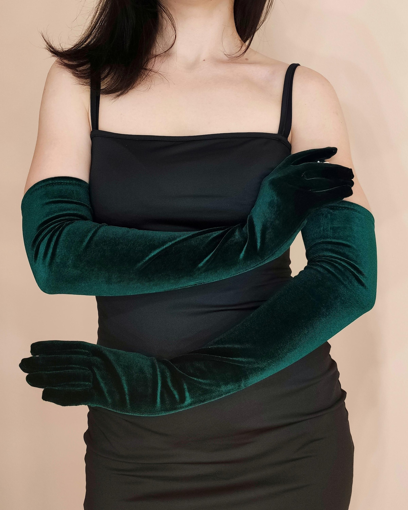

# 浪漫歌剧（Romantic Opera）
> **状态**: reviewed | 最后更新: 2026-06-23 | 分类: 浪漫少女 | **趋势**: 🎭 小众领域

## 📖 概述
- 发源年代: 2022-2023年 TikTok 出现，美学根源在 19 世纪歌剧（特别是意大利和法国歌剧）
- 发源地: 互联网 + 欧洲歌剧院（米兰斯卡拉/巴黎加尼叶/维也纳国立歌剧院）
- 风格关键词（5-8个）: 歌剧手套、丝绒斗篷、珍珠、金色面具暗示、剧院红丝绒、手拿扇、金色歌剧镜
- 一句话定义: 像是 19 世纪的歌剧女主角来到现代——及地丝绒斗篷+歌剧手套+珍珠+金色细节。不是去歌剧院看剧，是刚从舞台上下来。

## 📜 历史文化
- **起源**: Romantic Opera 是 Royalcore 的小众姐妹——如果说 Royalcore 是关于「皇室宫殿」，Romantic Opera 就是关于「歌剧院的夜晚」。它的视觉参考来自 19世纪欧洲歌剧的黄金时代——威尔第/普契尼/瓦格纳时代的女性观众着装（及地丝绒披风+长手套+珍珠+手拿扇），以及歌剧女主角（Prima Donna）在台上的华丽戏服。TikTok 上 #RomanticOpera 和 #OperaCore 标签总播放量约 25 亿。
- **发展脉络**:
  - **19世纪**: 欧洲歌剧黄金时代——歌剧院是社交的核心场所，观众穿得比舞台上还华丽
  - **1950s**: Maria Callas 成为「歌剧女神」——她的优雅造型影响了时尚界
  - **2000s**: 《歌剧魅影》音乐剧和电影——水晶吊灯+面具+歌剧院的浪漫黑暗
  - **2022-2023**: TikTok OperaCore 出现——长手套+丝绒+珍珠成为「歌剧院夜晚」的配方
  - **2025-2026**: 保持小众——不是所有人都想去歌剧院，但想去的都非常投入
- **文化意义**: Romantic Opera 是关于「仪式感」和「戏剧性」的美学宣言——在一个穿运动裤去任何地方的时代，它坚持：有些场合值得盛装。

## 🎨 美学特征
- **廓形特点**: 垂坠+层叠——及地斗篷或披肩在外面，合身丝绒裙在内。核心是「进入角色」——穿得像你即将登上舞台。
- **色板**:
  - 主色调：剧院红(#8B0000)、黑色(#000000)、金色(#D4AF37)、象牙白(#FFFFF0)
  - 辅助色：深紫、墨绿、香槟色
  - 禁忌色：荧光色、霓虹色、粉彩——这些颜色在歌剧院里格格不入
  - 色板逻辑：歌剧院内部的颜色——红丝绒座椅、金箔装饰、暗木舞台、水晶吊灯的光
- **面料偏好**: 丝绒 > 真丝 > 缎面 > 蕾丝 > 塔夫绸。面料必须有「剧院级的光泽」——丝绒的漫反射像舞台幕布。
- **标志单品表**:

| 单品 | 品牌示例 | 选择要点 |
|------|---------|---------|
| 及地丝绒斗篷/长外套 | vintage, Etsy, Zara | 及踝长度、丝绒、深色（红/黑/墨绿）|
| 歌剧手套 (Opera Gloves) | Cornelia James, vintage | 过肘、真丝或缎面、黑色或白色或红色 |
| 丝绒/缎面连衣裙 | Réalisation Par, Ganni, Sandro | 及膝或中长、收腰、纯色 |
| 珍珠多层项链/耳环 | Chanel, vintage, 平价珍珠 | 多层、真珠或仿珠、锁骨及以下长度 |
| 手拿扇 (Folding Fan) | vintage, Etsy | 丝质扇面、金色或黑色扇骨、可真的用来扇 |
| 金色细节手拿包 | Bottega Veneta, YSL, vintage | 金链或金色五金、可装歌剧票和一支口红 |

## 🏷️ 代表品牌
### 核心品牌
| 品牌 | 国家 | 价位 | 一句话 |
|------|------|------|--------|
| Saint Laurent | 法国 | ¥¥¥¥ | 暗黑/浪漫/危险的法国巅峰——一套丝绒 Le Smoking 西装就是整场歌剧 |
| Dolce & Gabbana | 意大利 | ¥¥¥¥ | 意大利歌剧的巴洛克华丽——金色+丝绒+蕾丝 |
| Valentino | 意大利 | ¥¥¥¥ | 1960年创立，「Valentino 红」是歌剧院的颜色——及地丝绒裙+红色 |
| Alexander McQueen | 英国 | ¥¥¥¥ | 戏剧性+浪漫+黑暗——每一场 McQueen 秀本身就是一部歌剧 |

### 平价替代
| 品牌 | 价位 | 说明 |
|------|------|------|
| Zara | ¥ | 丝绒连衣裙和斗篷的季节性供应 |
| Mango | ¥ | 冬季丝绒单品的平价选择 |
| Cornelia James | ¥¥ | 英国手套品牌，歌剧手套的最佳平价供应商 |
| Etsy vintage | ¥-¥¥ | 找真正的 vintage 丝绒披风和珍珠首饰 |

## 👤 风格偶像 & 名人
| 人物 | 身份 | 贡献 |
|------|------|------|
| Maria Callas | 歌剧演唱家 | 20世纪最伟大的歌剧女主角——不仅是声音，她的优雅和风格定义了「歌剧女神」|
| Christine Daaé（角色） | 《歌剧魅影》 | 歌剧院地下室的浪漫女主角——白色歌剧手套+丝绒披风 |
| Angelina Jolie | 演员 | 红毯造型中多次引用歌剧元素——丝绒+长手套+深色口红 |

### 穿着此风格的现代博主
| 人物 | 身份 | 为什么是 icon |
|------|------|---------------|
| Mina Le | YouTuber | 时尚评论 YouTuber，她的个人风格有强烈的「歌剧/复古/暗黑浪漫」元素 |
| Karolina Żebrowska | YouTuber | 复古时尚 YouTuber，她的 19 世纪+1920s 风格经常出现歌剧元素 |

## 🔗 关联风格
- **父风格**: 浪漫女性化 (Romantic Feminine)
- **子风格**: 歌剧核 (Operacore)、剧院浪漫 (Theatre Romance)
- **平行风格**: 皇室浪漫（WF-32）——Romantic Opera 在歌剧院，Royalcore 在宫殿——共享「华丽/仪式感」但场景不同
- **对立风格**: 运动休闲（WF-08）——Romantic Opera 穿着丝绒斗篷，Athleisure 穿着瑜伽裤
- **与姐妹风格差异**:
  1. vs 皇室浪漫（WF-32）：Opera 更「戏剧性/黑暗/舞台感」，Royalcore 更「明亮/花卉/宫廷」
  2. vs 暗黑女性力（WF-31）：Opera 是「舞台上的戏剧女性」，Dark Feminine 是「现实中的蛇蝎美人」

## 📈 流行趋势
- **当前状态**: 稳定小众——不会有大众爆发，但在复古/歌剧/戏剧圈层非常稳定
- **流行区域**: 欧洲（歌剧院文化强的地区）> 北美。米兰/巴黎/维也纳/伦敦是核心
- **发展方向**:
  - 2025-2026：歌剧手套成为冬季的「小众配饰热点」——不只是去歌剧院才戴

## 💡 穿搭建议
- **适合体型**: 所有体型——及地斗篷+收腰连衣裙=任何身形都能驾驭
- **适合肤色**: 剧院红/黑色对所有肤色友好
- **适合场合**: 歌剧院（当然）、正式晚宴、婚礼、交响音乐会
- **入门建议**:
  1. 从一双歌剧手套开始——黑色或白色，过肘长
  2. 一件丝绒连衣裙——剧院红或黑色
  3. 一条多层珍珠项链——歌剧院的灯光会让珍珠发光
  4. 一本歌剧节目单作为配饰——这是最低成本的 Romantic Opera 态度声明

---
*本文基于多源研究整理，AI 辅助生成。*
