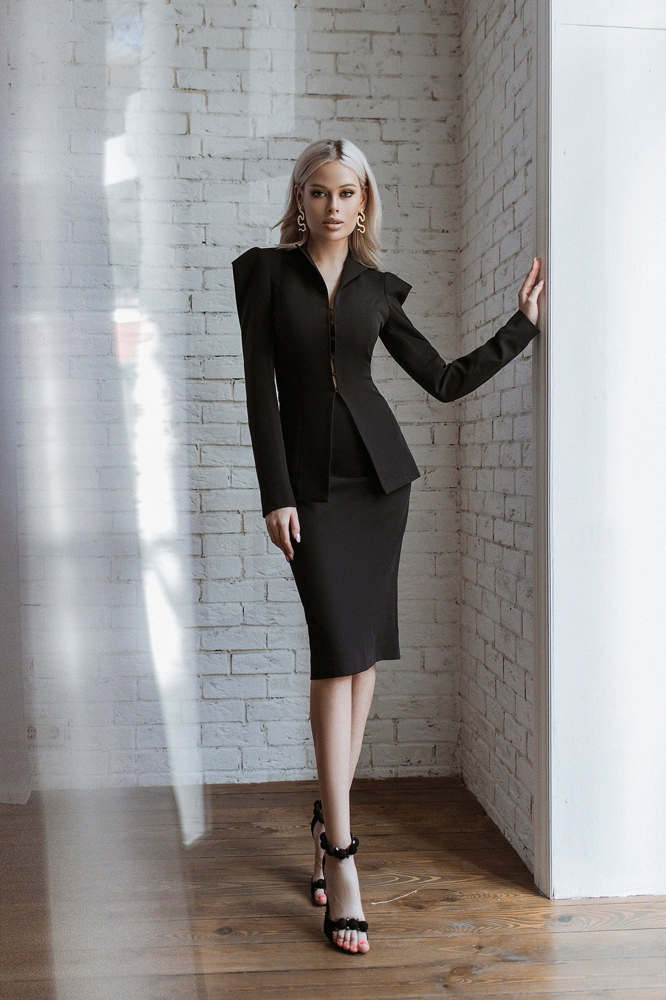

# 办公室海妖（Office Siren）
> **状态**: reviewed | 最后更新: 2026-06-23 | 分类: 戏剧张力 | **趋势**: 🔥 流行趋势

## 📖 概述
- 发源年代: 2023年 TikTok 爆发（#OfficeSiren），美学根源在 1990-2000s 职场电影和「Power Dressing」
- 发源地: 互联网 + 纽约/伦敦/米兰的摩天大楼办公室
- 风格关键词（5-8个）: 收腰西装、铅笔裙、尖头高跟鞋、无框眼镜、暗色口红、办公室、权力但不凶
- 一句话定义: 办公室里的蛇蝎美人——收腰西装+铅笔裙+尖头高跟鞋+无框眼镜。不是「女秘书」，是「即将接手你职位的女人」。她知道每一份文件在哪里，也知道自己的魅力在哪里。

## 📜 历史文化
- **起源**: Office Siren 是 Dark Feminine（暗黑女性力）的「职业版」——将蛇蝎美人的神秘和权力感带入办公室环境。它的视觉参考包括：1990s 的「Power Dressing」（大垫肩/收腰西装）、1994年电影《Disclosure》中的 Demi Moore（西装+高跟鞋+电脑）、以及 2000s 《穿普拉达的女王》中的 Miranda Priestly。TikTok 2023年将这一审美重新打包为 #OfficeSiren——不是「职场性骚扰」的刻板印象，而是「我在办公室里也可以有吸引力并且我掌控局面」。TikTok #OfficeSiren 播放量超 60 亿。
- **发展脉络**:
  - **1980s**: Power Dressing——大垫肩+收腰西装，女性进入高层职场的「盔甲」
  - **1990s**: Demi Moore 在《Disclosure》中的造型——办公室里的蛇蝎美人
  - **2000s**: 《穿普拉达的女王》——Miranda Priestly 定义「时尚职场权力女性」
  - **2022**: 「Quiet Luxury」和「Office Core」趋势为 Office Siren 铺路
  - **2023**: TikTok #OfficeSiren 爆发——收腰西装+铅笔裙+无框眼镜+尖头高跟鞋成为公式
  - **2025-2026**: Office Siren 从「话题」进入「日常职场穿搭选项」——更多女性在工作中穿得精致而有力量
- **文化意义**: Office Siren 是关于「女性在工作中也可以有吸引力，而这种吸引力不削弱她的专业度」——它挑战了「职场女性必须藏起性别特征才能被尊重」的困境。

## 🎨 美学特征
- **廓形特点**: 收腰+合身——西装外套必须掐腰（腰带或收腰剪裁），铅笔裙裹臀但不紧，阔腿裤垂坠但有结构。核心是「专业但有曲线」——不是 oversize（那是男人的职场），也不是过于暴露（那是夜店）。
- **色板**:
  - 主色调：深灰(#4A4A4A)、黑色(#000000)、白色(#FFFFFF)、驼色(#C4A882)
  - 辅助色：酒红、深蓝、橄榄绿
  - 禁忌色：荧光色、粉彩、印花——办公室不需要「可爱」
  - 色板逻辑：办公大楼的颜色——钢灰色、白纸白、黑色墨水、驼色皮质笔记本
- **面料偏好**: 羊毛混纺 > 真丝 > 棉府绸 > 羊绒。面料要有「结构」和「质感」——西装必须挺括，衬衫必须有型。
- **标志单品表**:

| 单品 | 品牌示例 | 选择要点 |
|------|---------|---------|
| 收腰西装外套 | The Row, Khaite, COS, Massimo Dutti | 合身/收腰、黑色或灰色、单排扣或双排扣 |
| 铅笔裙/包臀裙 | COS, Vince, Wolford | 及膝或略上、包裹但不紧、黑色或驼色 |
| 尖头高跟鞋 | Manolo Blahnik, Gianvito Rossi, Zara | 黑色或裸色、8-10cm、尖头——尖头比圆头更有「Siren」感 |
| 无框/金属框眼镜 | Gentle Monster, Oliver Peoples, Zara | 金属细框或无框、可戴可不戴——但戴上就是「我不仅好看我还聪明」|
| 真丝衬衫/高领针织衫 | Equipment, Vince, Uniqlo U | 白色或奶油白、领口可以敞开但不能太低 |
| 结构化皮质托特包 | The Row, Saint Laurent, COS | 可装笔记本电脑、黑色或棕色、无Logo |

## 🏷️ 代表品牌
### 核心品牌
| 品牌 | 国家 | 价位 | 一句话 |
|------|------|------|--------|
| The Row | 美国 | ¥¥¥¥¥ | Olsen 姐妹的「安静权力套裝」——一件收腰西装外套的价格等于一个月的薪水 |
| Khaite | 美国 | ¥¥¥¥ | 纽约现代权力女性的铠甲——收腰西装+丝绒+皮靴 |
| Saint Laurent | 法国 | ¥¥¥¥ | Le Smoking 西装——女性穿西装这件事就是 YSL 发明的 |
| COS | 瑞典 | ¥¥ | 建筑感职场的平价之王——铅笔裙+阔腿裤+白衬衫的完美供应商 |

### 平价替代
| 品牌 | 价位 | 说明 |
|------|------|------|
| COS | ¥¥ | 本身已经是 Office Siren 的平价核心 |
| Massimo Dutti | ¥¥ | 西班牙优雅职场——西装和铅笔裙的平价首选 |
| Uniqlo U | ¥ | 基础款西装和衬衫的入门之选 |
| Zara | ¥ | 季节性提供收腰西装和铅笔裙 |

## 👤 风格偶像 & 名人
| 人物 | 身份 | 贡献 |
|------|------|------|
| Demi Moore | 演员 | 1994年《Disclosure》中的职场蛇蝎美人——西装+高跟鞋+电脑=Office Siren 的原型 |
| Meryl Streep（Miranda Priestly 角色） | 演员 | 《穿普拉达的女王》中的 Miranda Priestly——白衬衫+阔腿裤+Prada=时尚权力女性的圣像 |
| Gisele Bündchen | 模特 | 《穿普拉达的女王》中短暂出场的 Serena——眼镜+西装+铅笔裙的 Office Siren 完美造型 |
| Amal Clooney | 律师 | 现实版的 Office Siren——高定西装+铅笔裙+律师公文包，在全球法庭上展现权力优雅 |

## 🔗 关联风格
- **父风格**: 戏剧宣言 (Dramatic Statement)
- **子风格**: 律政佳人 (Legal Chic)、企业魅力 (Corporate Glam)
- **平行风格**: 暗黑女性力（WF-31）——Office Siren 是 Dark Feminine 的「上班版本」
- **对立风格**: 软妹风（WF-16）——Office Siren 在董事会，Soft Girl 在大学食堂
- **与姐妹风格差异**:
  1. vs 暗黑女性力（WF-31）：Office Siren 在荧光灯下，Dark Feminine 在红酒灯光下
  2. vs 都市通勤（WF-11）：Office Siren 更「性感/权力/蛇蝎」，City Girl 更「功能/利落/效率」
  3. vs 都市酷感（WF-25）：Office Siren 是「在公司」，Downtown Cool 是「在工作室」

## 📈 流行趋势
- **当前状态**: 高峰期——办公室回归+女性职场赋权意识上升共同推动
- **流行区域**: 全球。纽约/伦敦/米兰/东京/上海——金融/法律/咨询行业集中的城市
- **发展方向**:
  - 2025-2026：从「全套权力套装」到「Siren 元素」——一件收腰西装+牛仔裤+尖头鞋=日常版 Office Siren
  - 远程办公 Siren——在家上班时上半身穿西装，下半身穿运动裤（摄像头只拍到上半身）

## 💡 穿搭建议
- **适合体型**: 沙漏形（收腰西装+铅笔裙=完美，0.95）、梨形（阔腿裤替代铅笔裙可以遮盖臀胯，0.90）
- **适合肤色**: 黑色/深灰/驼色对所有肤色友好
- **适合场合**: 办公室（满分）、商务会议、客户演示、面试
- **入门建议**:
  1. 从一件收腰西装外套开始——COS 或 Massimo Dutti 的平价款
  2. 一条铅笔裙或阔腿西装裤——黑色最百搭
  3. 一副金属框眼镜——Gentle Monster 或 Zara
  4. 一支暗色口红——勃艮第红或深莓色，但别太深（这毕竟是办公室）

---
*本文基于多源研究整理，AI 辅助生成。*
