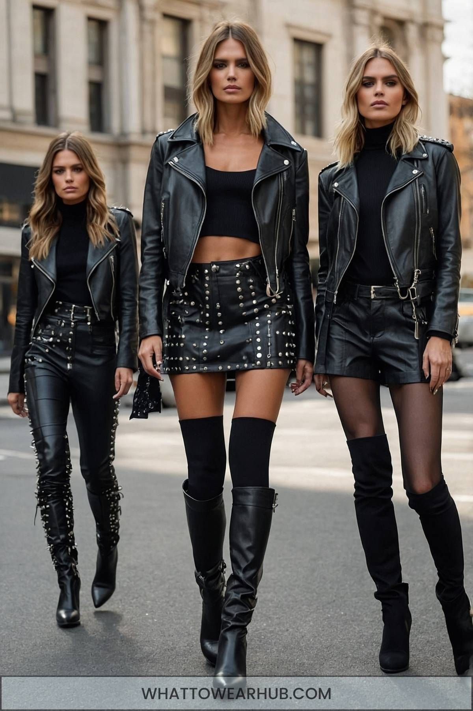

# 摇滚 Chic（Rock Chic）
> **状态**: reviewed | 最后更新: 2026-06-23 | 分类: 另类酷感 | **趋势**: 🏛️ 经典风格

## 📖 概述
- 发源年代: 1970s 朋克/摇滚场景，2000s 「Model Off-Duty」将其精致化为高级时尚
- 发源地: 纽约 CBGB / 伦敦 King's Road / 洛杉矶 Sunset Strip
- 风格关键词（5-8个）: 皮夹克、紧身牛仔裤、踝靴、做旧T恤、铆钉/金属元素、乱而有型、乐队
- 一句话定义: 摇滚明星的女朋友或她自己就是摇滚明星——皮夹克+紧身牛仔裤+踝靴+做旧乐队T恤。不是「朋克」（那是反时尚的），是「摇滚的时尚版」——保留了摇滚的酷，但加上了 Chic 的精致。

## 📜 历史文化
- **起源**: Rock Chic 是摇滚和时尚长期恋爱的产物。1970年代，Vivienne Westwood 和 Malcolm McLaren 在伦敦 King's Road 的 SEX 店铺将朋克变成了时尚语言——撕裂T恤+皮夹克+安全别针。1980-90s，Saint Laurent 和 Versace 将摇滚元素带入高级时尚——皮夹克+真丝裙的混搭。2000s，「Model Off-Duty」审美（Kate Moss 为代表）将摇滚风格精致化——不是真正的朋克在街上，而是超模下班后的皮夹克+紧身牛仔裤+踝靴。Hedi Slimane（在 Saint Laurent 和 Celine）是当代 Rock Chic 的高级时尚建筑师。
- **发展脉络**:
  - **1970s**: Vivienne Westwood + Malcolm McLaren ——将朋克引入时尚
  - **1980s**: Saint Laurent 的「叛逆优雅」——皮夹克+真丝裙
  - **1990s**: Kate Moss 和「Heroin Chic」——皮夹克+紧身牛仔裤+踝靴的 Model Off-Duty 公式
  - **2000s**: Hedi Slimane 在 Dior Homme 和 Saint Laurent——将摇滚风格精致化为高级成衣
  - **2010s**: Saint Laurent 的「摇滚缪斯」时代——Grunge 连衣裙+皮夹克+踝靴
  - **2020-2026**: Rock Chic 成为永恒的「酷女孩」模板——每个女孩的衣柜里都有一件皮夹克
- **文化意义**: Rock Chic 是关于「酷」（Cool）的时尚化——它让你看起来像刚从一场地下演出的后台出来，但实际上你只是从出租车上下来去赴一场晚餐。

## 🎨 美学特征
- **廓形特点**: 上松下紧——皮夹克 or 做旧外套略 oversize 在上，紧身牛仔裤或皮裤在下。核心是「I don't care」的廓形——皮夹克不拉链、T恤微皱、踝靴沾了点灰。
- **色板**:
  - 主色调：黑色(#000000)、灰色(#808080)、白色(#FFFFFF)、褪色蓝（牛仔）
  - 辅助色：红色（偶尔出现）、银色（铆钉/拉链）、豹纹（作为点缀）
  - 禁忌色：粉彩、驼色、金色——太「软」或太「有钱」的颜色不符合摇滚精神
  - 色板逻辑：黑白摄影的颜色——摇滚最有力量的照片几乎都是黑白的
- **面料偏好**: 皮革 > 牛仔 > 做旧棉 > 薄纱。面料要有「质感」和「叛逆感」——皮夹克要有穿的痕迹，牛仔裤要有磨损。
- **标志单品表**:

| 单品 | 品牌示例 | 选择要点 |
|------|---------|---------|
| 皮夹克（摩托车款） | Saint Laurent, Acne Studios, AllSaints | 黑色、不对称拉链、略 oversize、穿过几年的 |
| 紧身/直筒牛仔裤 | Levi's, Acne Studios, Frame | 黑色或水洗蓝、有真的磨损、不破洞太整齐 |
| 做旧乐队T恤 | vintage, Urban Outfitters | 真的 vintage、滚石/涅槃/金属乐队 |
| 尖头/方头踝靴 | Saint Laurent, Acne Studios, By Far | 黑色、尖头或方头、3-5cm跟 |
| 真丝吊带裙（反差单品） | Saint Laurent, Réalisation Par | 黑色或豹纹、贴身穿在皮夹克里——硬×软的经典公式 |
| 银饰/铆钉首饰 | Chrome Hearts, vintage, Etsy | 戒指/项链/手链——银色优于金色 |

## 🏷️ 代表品牌
### 核心品牌
| 品牌 | 国家 | 价位 | 一句话 |
|------|------|------|--------|
| Saint Laurent | 法国 | ¥¥¥¥ | Rock Chic 的时尚殿堂——Hedi Slimane 2012-2016 将品牌变成全球摇滚缪斯的专卖店 |
| Acne Studios | 瑞典 | ¥¥¥ | 皮夹克是镇店之宝——一件 Acne 皮夹克可以穿一辈子 |
| AllSaints | 英国 | ¥¥ | 东伦敦摇滚风的平价主力——皮夹克+做旧T恤+踝靴的完整衣橱 |
| Isabel Marant | 法国 | ¥¥¥ | 波西米亚×摇滚的巴黎混搭——踝靴+做旧牛仔+印花真丝 |
| Alexander McQueen | 英国 | ¥¥¥¥ | 摇滚的「黑暗艺术版」——皮夹克+薄纱裙+骷髅元素 |

### 平价替代
| 品牌 | 价位 | 说明 |
|------|------|------|
| AllSaints | ¥¥ | 本身已经是 Rock Chic 的平价核心 |
| Zara | ¥ | 季节性提供皮夹克和踝靴 |
| H&M | ¥ | 做旧乐队T恤的入门之选 |
| Levi's | ¥ | 紧身牛仔裤的 Rock Chic 标配 |

## 👤 风格偶像 & 名人
| 人物 | 身份 | 贡献 |
|------|------|------|
| Kate Moss | 模特 | Model Off-Duty 的终极 icon——皮夹克+紧身牛仔裤+踝靴的公式就是她定义的 |
| Debbie Harry | 音乐人 | Blondie 主唱，1970s CBGB 的摇滚女神——皮夹克+金发+厚底鞋 |
| Joan Jett | 音乐人 | 「摇滚女王」——皮夹克+黑发+紧身裤+吉他 |
| Patti Smith | 音乐人/诗人 | 1970s 纽约的「朋克诗人」——白衬衫+皮夹克+乱发+态度 |

### 穿着此风格的现代明星
| 人物 | 身份 | 为什么是 icon |
|------|------|---------------|
| Alexa Chung | 博主/设计师 | 2000s-2010s 的 Rock Chic 代言——皮夹克+碎花裙+踝靴 |
| Sienna Miller | 演员 | 2000s 的波西米亚摇滚混搭——皮夹克+印花裙+踝靴 |
| Taylor Swift（Reputation 时代） | 歌手 | 2017 Reputation 时代的暗黑摇滚造型 |

## 🔗 关联风格
- **父风格**: 前卫边缘 (Edgy Alternative)
- **子风格**: 朋克 Chic (Punk Chic)、Grunge Chic
- **平行风格**: 软垃圾摇滚（WF-23）——共享「摇滚/做旧/皮夹克」，但 Rock Chic 是「时尚化/精致化」，Soft Grunge 是「反时尚/原始」
- **对立风格**: 皇室浪漫（WF-32）——Rock Chic 在 CBGB 的地下演出，Royalcore 在凡尔赛宫的舞会
- **与姐妹风格差异**:
  1. vs 软垃圾摇滚（WF-23）：Rock Chic 穿皮夹克去高级餐厅，Soft Grunge 穿皮夹克去地下演出
  2. vs 都市酷感（WF-25）：Rock Chic 有「摇滚/乐队/音乐」的文化基因，Downtown Cool 只有「城市/建筑/设计」
  3. vs 英伦淑女（WF-43）：Rock Chic 是伦敦东区的「反叛」，British Lady 是伦敦西区的「优雅」

## 📈 流行趋势
- **当前状态**: 永恒的经典——Rock Chic 每 10 年换一批乐队，但皮夹克+紧身牛仔裤+踝靴的公式不变
- **流行区域**: 全球。伦敦/纽约/洛杉矶/东京——摇滚音乐活跃的城市
- **发展方向**:
  - 2025-2026：可持续皮夹克——植物基皮革和 vintage 皮夹克成为新一代 Rock Chic 的选择

## 💡 穿搭建议
- **适合体型**: 所有体型——皮夹克+紧身牛仔裤是万用公式
- **适合肤色**: 黑色对所有肤色友好
- **适合场合**: 演唱会、夜晚社交、约会、周末逛街
- **入门建议**:
  1. 投资一件好皮夹克——Acne Studios（投资款）或 AllSaints（平价）
  2. 一双黑色踝靴——尖头或方头，有一点跟
  3. 一件真正的 vintage 乐队T恤——不是仿品，去二手店找真品
  4. 「乱」是故意的——头发不用太整齐，皮夹克不用拉链，踝靴不用太新

---
*本文基于多源研究整理，AI 辅助生成。*
