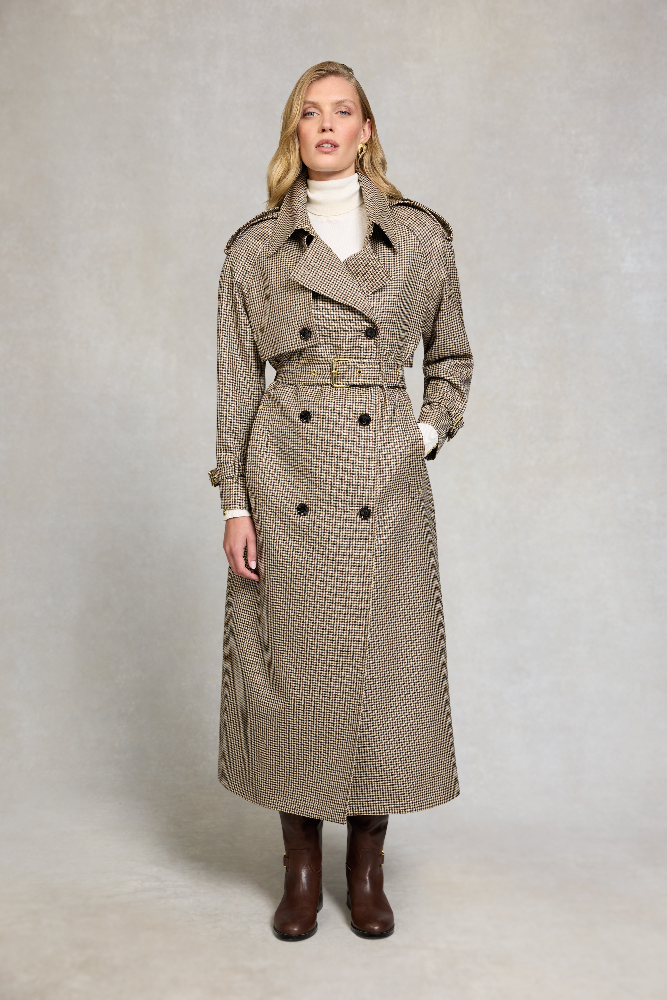

# 英伦淑女（British Lady）
> **状态**: reviewed | 最后更新: 2026-06-23 | 分类: 欧洲经典 | **趋势**: 🏛️ 经典风格

## 📖 概述
- 发源年代: 19 世纪维多利亚时代奠定，20 世纪戴安娜王妃和英剧（《唐顿庄园》《王冠》）全球推广
- 发源地: 英国（伦敦切尔西/肯辛顿 + 科茨沃尔德乡村庄园）
- 风格关键词（5-8个）: 风衣、粗花呢、珍珠耳环、丝巾、骑马裤、优雅、英式下午茶
- 一句话定义: 英国上流女性的衣橱——Burberry 风衣+粗花呢夹克+珍珠耳环+丝巾。不是美国东海岸的 Old Money（那是运动/学院），是英国乡村庄园+伦敦下午茶的优雅。像是刚从切尔西花展回来。

## 📜 历史文化
- **起源**: British Lady 是英国贵族和上流社会女性着装的现代化身。它的根源在维多利亚时代（1837-1901）的端庄和仪式感——那时候女性需要为每一个场合更换着装（早餐裙/散步裙/下午茶裙/晚宴裙）。这一传统在 20 世纪被英国王室女性（特别是伊丽莎白二世和戴安娜王妃）继承和现代化。1981年戴安娜嫁入王室后，她将英式优雅加入了更亲民、更时髦的元素——粗花呢夹克+牛仔、骑行裤+oversize 卫衣。当代 British Lady 由《唐顿庄园》(2010-2015) 和《王冠》(2016-2023) 等英剧持续向全球输出。
- **发展脉络**:
  - **1837-1901**: 维多利亚女王时代——奠定了英式女性端庄/仪式感的审美基础
  - **1920-40s**: 英国乡村庄园文化（《故园风雨后》的世界）——粗花呢+雨靴+蜡棉夹克
  - **1981-1997**: 戴安娜王妃时代——将英式优雅全球化，加入更亲民的元素
  - **2010-2015**: 《唐顿庄园》——将 1910-20s 的英式贵族审美重新带回全球荧幕
  - **2016-2023**: 《王冠》——伊丽莎白二世的一生，持续喂养 British Lady 的视觉库
  - **2025-2026**: British Lady 的「日常化」——风衣+珍珠+牛仔裤=日常版英式优雅
- **文化意义**: British Lady 是关于「得体」（Propriety）的美学——在一个「穿什么都行」的时代，它说：「有些规矩是有道理的。」它不是死板的保守，而是一种有礼貌的优雅。

## 🎨 美学特征
- **廓形特点**: 合身而有结构——风衣收腰、粗花呢夹克有腰线、A字裙或直筒裙。核心是「得体」——不过松（显邋遢）也不过紧（显暴露）。
- **色板**:
  - 主色调：驼色(#C4A882)、海军蓝(#1B2A4A)、猎人绿(#355E3B)、酒红(#722F37)
  - 辅助色：奶油白、灰色、米色
  - 禁忌色：荧光色、霓虹色、豹纹、大面积印花
  - 色板逻辑：英国乡村的颜色——秋天的落叶/冬天的常青树/春天的玫瑰园/夏天的薰衣草
- **面料偏好**: 粗花呢 > 羊毛 > 棉（风衣） > 羊绒 > 小羊皮。面料必须是天然的/耐用的/能穿数十年的。
- **标志单品表**:

| 单品 | 品牌示例 | 选择要点 |
|------|---------|---------|
| 风衣 (Trench Coat) | Burberry, Aquascutum, Mackintosh | 卡其色、双排扣、腰带收腰、及膝或中长 |
| 粗花呢夹克/马甲 | Chanel, Burberry, Barbour | 粗花呢或蜡棉、合身、大地色或绿色 |
| 珍珠耳环/项链 | Garrard, Asprey, vintage | 单粒珍珠耳环、小珍珠项链——不要太夸张 |
| 丝巾（小方巾） | Burberry, Liberty London, Hermès | 系在颈部（领结式）或包柄上 |
| 骑马裤/直筒裤 | Holland Cooper, Burberry, Barbour | 高腰、直筒或微喇、大地色或海军蓝 |
| 雨靴/马术靴 | Hunter, Barbour, Dubarry | 英国雨天多，雨靴是实用单品，但也可以很优雅 |

## 🏷️ 代表品牌
### 核心品牌
| 品牌 | 国家 | 价位 | 一句话 |
|------|------|------|--------|
| Burberry | 英国 | ¥¥¥¥ | 1856年创立，风衣的发明者（之一）——卡其色风衣+格纹丝巾=British Lady 的「制服」|
| Barbour | 英国 | ¥¥¥ | 1894年创立，蜡棉夹克是英国乡村的标配——一件 Barbour 穿30年 |
| Liberty London | 英国 | ¥¥-¥¥¥ | 1875年创立于伦敦摄政街，印花丝巾和面料的英国瑰宝 |
| Aquascutum | 英国 | ¥¥¥ | 1851年创立，风衣和防水羊毛的英国鼻祖——Burberry 的优雅竞争者 |
| Holland Cooper | 英国 | ¥¥¥ | 马术服装的现代英国品牌——粗花呢+骑马裤的当代版本 |

### 平价替代
| 品牌 | 价位 | 说明 |
|------|------|------|
| J.Crew | ¥¥ | 美式 Preppy，但有大量的英式风衣和粗花呢元素 |
| Massimo Dutti | ¥¥ | 西班牙优雅，风衣和羊毛外套的平价选择 |
| Uniqlo（U系列） | ¥ | 风衣和羊毛裤的平价入门 |
| Marks & Spencer | ¥ | 英国国民百货——风衣和珍珠的「最亲民」供应商 |

## 👤 风格偶像 & 名人
| 人物 | 身份 | 贡献 |
|------|------|------|
| 戴安娜王妃 | 英国王室 | British Lady 的现代 icon——风衣+珍珠+骑行裤+卫衣，同时兼具优雅和亲民 |
| 伊丽莎白二世 | 英国女王 | 用 70 年的统治定义了英式女性的着装密码——彩色大衣+帽子+珍珠 |
| 凯特王妃 (Catherine) | 英国王室 | 当代 British Lady 的代表——Burberry 风衣+粗花呢夹克+珍珠耳环 |
| Lady Mary Crawley（角色） | 《唐顿庄园》 | Michelle Dockery 饰演的 Lady Mary——1920s 英式贵族女性的现代审美翻译 |

## 🔗 关联风格
- **父风格**: 欧洲经典 (European Classic)
- **子风格**: 乡村淑女 (Country Lady)、伦敦淑女 (London Lady)
- **平行风格**: 巴黎 Chic（WF-34）——共享「优雅/淑女/精致」，但 British Lady 更「端庄/乡村/风衣」，Parisian Chic 更「性感/城市/粗花呢」
- **对立风格**: 女性街头（WF-28）——British Lady 在切尔西花展，Streetwear 在滑板场
- **与姐妹风格差异**:
  1. vs 巴黎 Chic（WF-34）：Parisian Chic 是「塞纳河畔+粗花呢+红唇」，British Lady 是「科茨沃尔德+风衣+珍珠」
  2. vs 老钱风（WF-18）：British Lady 更「英式/乡村/午后茶」，Old Money 更「美式/汉普顿/学院」
  3. vs 学院风（WF-07）：Preppy 是 British Lady 的「美式/年轻/校园版」

## 📈 流行趋势
- **当前状态**: 永恒经典——英式优雅是时尚的基准线
- **流行区域**: 全球。英国及英联邦国家 > 北美 > 东亚（日本对英式优雅有特殊的迷恋）
- **发展方向**:
  - 2025-2026：可持续——vintage Burberry 风衣是二手市场的「蓝筹股」
  - 「不完美的英式优雅」——风衣可以皱，雨靴可以旧，但依然优雅

## 💡 穿搭建议
- **适合体型**: 所有体型——风衣收腰+A字裙的公式对所有身形友好
- **适合肤色**: 驼色/海军蓝/猎人绿对所有肤色友好
- **适合场合**: 下午茶、花展、乡村周末、马术比赛、正式午宴
- **入门建议**:
  1. 从一件 Burberry 风衣开始（vintage 或现款）——这是 British Lady 最核心的单品
  2. 一对小珍珠耳环——单粒最经典
  3. 一条 Liberty 印花丝巾——系在颈部或包柄上
  4. 姿态——British Lady 不匆忙、不大声、不解释太多

---
*本文基于多源研究整理，AI 辅助生成。*
