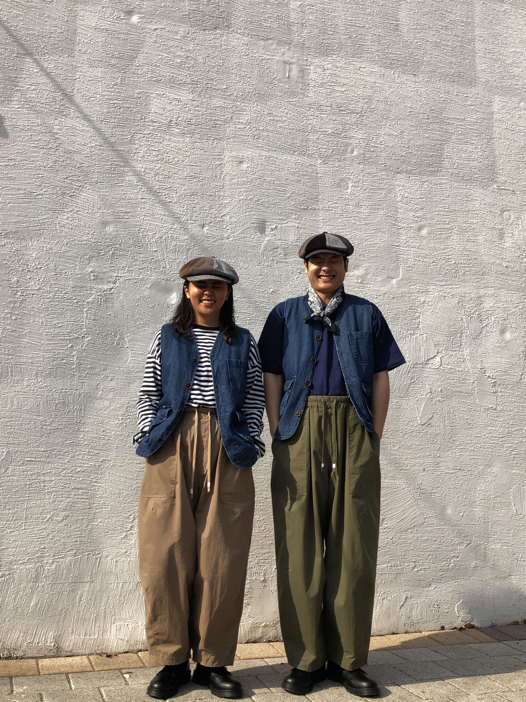

# 日系阿美咔叽（J-Amekaji）
> **状态**: reviewed | 最后更新: 2026-06-23 | 分类: 东亚风格 | **趋势**: 🎭 小众领域

## 📖 概述
- 发源年代: 1980-90s 日本兴起，2010s 后通过全球化复古文化输出
- 发源地: 日本（东京原宿/涩谷/中目黑），美学根源在美国 1950-60s 工作服和军装
- 风格关键词（5-8个）: 原牛牛仔裤、工装夹克、红翼皮靴、做旧、靛蓝染色、工匠精神、Selvedge
- 一句话定义: 日本人把美式复古工作服穿得比美国人还美国——原牛牛仔裤+工装夹克+Red Wing 皮靴+做旧皮包。不是「cosplay 美国人」，是对美式功能服装的「日本式深度研究+精益化」。

## 📜 历史文化
- **起源**: 「Amekaji」（アメカジ）是日语「American Casual」的音译缩写，但这个词描述的不是美国人穿的美式休闲，而是日本人「重新发现/研究/精益化」的美式复古。二战后，美国驻军将牛仔裤/工装靴/皮夹克带入日本，日本人将这些单品视为「美国生活方式」的圣物。当美国自身抛弃这些「旧式工作服」转向快时尚时，日本人开始反向输出——将 1950s Levi's 的织法、1940s 军装的剪裁、1930s 工装的细节进行考古式研究和完美复刻。品牌如 Kapital/Visvim/The Real McCoy's 的产品比真正的美国 vintage 更受全球复古迷追捧。
- **发展脉络**:
  - **1945-1950s**: 美国驻军将牛仔裤和工作靴带入日本——「美国梦」的视觉符号
  - **1970-80s**: 日本青年开始迷恋美式复古——原宿的 vintage 店和《Popeye》杂志定义 Amekaji
  - **1990s**: 日本复刻品牌崛起——The Real McCoy's (1997)/Visvim (2000)/Kapital (1984) 开始生产比原版更完美的复刻品
  - **2000-2010s**: 「蓝布屋」（Osaka 5）等日本原牛品牌向全球输出——日本制造的牛仔裤成为全球复古迷的圣杯
  - **2020-2026**: Amekaji 与 Gorpcore/City Boy 等日本当代风格融合
- **文化意义**: Amekaji 是关于「文化再创造」的极致案例——日本人把美国的功能性工作服变成了一门关于「面料/染色/缝制/做旧」的工匠哲学。

## 🎨 美学特征
- **廓形特点**: 宽松+实用——工装夹克略 oversize（方便里面叠穿），原牛牛仔裤直筒（经典 Levi's 1947 501版型）。核心是「不是为了时尚，是为了干活」的廓形——但被日本工匠精益到每一个针脚。
- **色板**:
  - 主色调：靛蓝(#3D5A80)、橄榄绿(#4A5D4A)、棕褐色(#8B7355)、卡其色(#C4A882)
  - 辅助色：白色（打底T恤）、灰色（运动衫）、橘色（安全色，工装衬里）
  - 禁忌色：荧光色、粉彩、黑色（过于城市/当代）
  - 色板逻辑：美国工装和军装的颜色——蓝色牛仔、绿色军装、棕色皮靴、卡其布裤
- **面料偏好**: 原牛 (Raw Selvedge Denim) > 重磅棉 > 帆布 > 皮革 > 羊毛。面料是 Amekaji 的信仰——磅数/染料/织法/做旧都是评判标准。
- **标志单品表**:

| 单品 | 品牌示例 | 选择要点 |
|------|---------|---------|
| 原牛牛仔裤 (Selvedge) | The Real McCoy's, Studio D'Artisan, Levi's Vintage | 日本制造、赤耳布边、磅数14oz+、未经洗涤 |
| 工装夹克 (Chore Coat) | Carhartt WIP, Kapital, orSlow | 帆布或牛仔布、多口袋、蓝色或橄榄绿 |
| M-65 军装外套 / MA-1 飞行员夹克 | The Real McCoy's, Buzz Rickson's | 复刻原版军装规格、橄榄绿/黑色/卡其色 |
| Red Wing 工装靴 | Red Wing, Danner, Rolling Dub Trio | 美国原版或日本复刻、固特异贴边、Crude 或 Oro 皮革 |
| 重磅棉T恤 | The Real McCoy's, Warehouse, 3sixteen | 管状编织、无侧缝、白色或灰色 |
| 做旧皮包/帆布包 | Filson, Kapital, Porter Yoshida | 天然皮革会随时间变色、帆布会随时间做旧 |

## 🏷️ 代表品牌
### 核心品牌
| 品牌 | 国家 | 价位 | 一句话 |
|------|------|------|--------|
| The Real McCoy's | 日本 | ¥¥¥¥ | 1997年创立，日本 Amekaji 复刻的巅峰——每一件产品都是对原版的「考古级」复刻 |
| Kapital | 日本 | ¥¥¥¥ | 1984年创立于仓敷，牛仔布+boho+手工——Amekaji 的「艺术版」|
| Visvim | 日本 | ¥¥¥¥¥ | 2000年创立，中村世纪将 Amekaji 变成了「民族+工艺奢侈」的全球现象 |
| Studio D'Artisan | 日本 | ¥¥¥ | 大阪五虎之一（1979年创立），日本原牛的奠基者之一 |
| Buzz Rickson's | 日本 | ¥¥¥ | 东洋企业旗下，军装复刻的日本巅峰——M-65/MA-1/B-15 的完美复刻 |

### 平价替代
| 品牌 | 价位 | 说明 |
|------|------|------|
| Uniqlo U | ¥ | Lemaire 设计的平价 Amekaji——宽腿裤+工装夹克 |
| Muji | ¥ | 日式简约 Amekaji——帆布鞋+棉质工装裤 |
| Carhartt WIP | ¥¥ | 美国工装的欧洲街头版——比日式 Amekaji 更便宜但精神同源 |
| Levi's Vintage Clothing | ¥¥¥ | Levi's 官方的复刻线——比日系复刻便宜 |

## 👤 风格偶像 & 名人
| 人物 | 身份 | 贡献 |
|------|------|------|
| 中村世纪 (Hiroki Nakamura) | 设计师 | Visvim 创始人——他将 Amekaji 从「复刻美式」提升到「全球工艺奢侈品」的高度 |
| 木村拓哉 | 演员/歌手 | 1990s-2000s 将 Amekaji 穿成亚洲大众审美的日本国民偶像 |
| 高橋盾 (Jun Takahashi) | 设计师 | UNDERCOVER 创始人——将 Amekaji 与朋克/艺术混搭 |

### 穿着此风格的现代博主
| 人物 | 身份 | 为什么是 icon |
|------|------|---------------|
| David Marx | 作家 | 《Ametora》一书的作者——他研究和记录了日本如何「收购」美国风格的全过程 |
| W. David Marx 笔下的读者 | — | 全球复古迷读《Ametora》后用原牛+工装靴实践日式 Amekaji |

## 🔗 关联风格
- **父风格**: 东西融合 (East-West Fusion)
- **子风格**: 原牛文化 (Raw Denim)、蓝染工坊 (Indigo Workshop)
- **平行风格**: 户外机能（WF-33）——Gorpcore 是现代户外科技，Amekaji 是 vintage 户外/工装复古
- **对立风格**: 意式风情（WF-35）——Amekaji 是「低调/靛蓝/工匠」，Italian Donna 是「色彩/华丽/曲线」
- **与姐妹风格差异**:
  1. vs 户外机能（WF-33）：Gorpcore 用 Gore-Tex 防雨，Amekaji 用帆布和皮革防雨——前者是科技，后者是传统
  2. vs 女性街头（WF-28）：Amekaji 更「工匠/复古/日本」，Streetwear 更「嘻哈/限量/Logo」

## 📈 流行趋势
- **当前状态**: 小众稳定——全球复古迷社群非常稳定但不会病毒式爆发
- **流行区域**: 日本 > 全球复古/工匠社区。东京原宿/中目黑是圣地
- **发展方向**:
  - 2025-2026：女性 Amekaji 的崛起——更多品牌推出女性剪裁的原牛和工装
  - 可持续完美匹配——Amekaji 的「买一件穿十年」的精神是可持续的天然答案

## 💡 穿搭建议
- **适合体型**: 所有体型——直筒裤+工装夹克是万用公式
- **适合肤色**: 靛蓝/橄榄绿/卡其色对所有肤色友好
- **适合场合**: 周末逛街、咖啡馆、工匠市集、复古展、旅行
- **入门建议**:
  1. 从一条日本原牛开始——Studio D'Artisan 或 Uniqlo Selvedge（最平价入门）
  2. 一件帆布工装夹克——Carhartt WIP 或 orSlow
  3. 一双 Red Wing 875——经典 Moc Toe，穿旧比穿新好看
  4. 耐心——Amekaji 的真谛是「让衣服随时间变老」，不急着一次性买齐

---
*本文基于多源研究整理，AI 辅助生成。*
