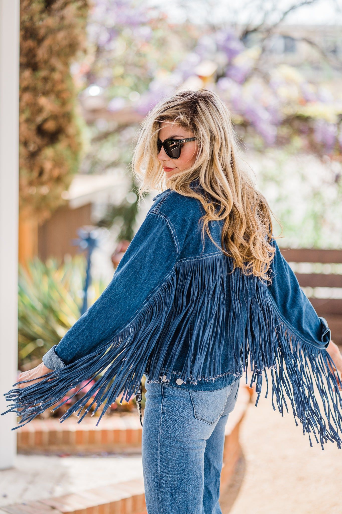

# 西部女郎（Western Babe）
> **状态**: reviewed | 最后更新: 2026-06-23 | 分类: 都市街头 | **趋势**: 🔥 流行趋势

## 📖 概述
- 发源年代: 2021-2022年 TikTok 爆发，根源在美国西部牛仔文化和 Country Music 时尚化
- 发源地: 美国（德克萨斯/纳什维尔/怀俄明）+ TikTok
- 风格关键词（5-8个）: 牛仔靴、牛仔帽、流苏、银色大腰带扣、牛仔布、Bolo Tie、西部衬衫
- 一句话定义: 把美国西部穿成时髦——牛仔靴+牛仔帽+流苏夹克+银色大腰带扣。不是在牧场里，是在音乐节上。是乡村音乐的酷女孩版。

## 📜 历史文化
- **起源**: Western Babe 是 TikTok 将美国西部文化「时尚化」的产物。西部风格在时尚界并不新鲜——1940s-50s 好莱坞西部片（John Wayne/Clint Eastwood）将牛仔靴和牛仔帽变成全球视觉语言；1980s Dolly Parton 将西部风格加上华丽的亮片和夸张发型；2010s Coachella 音乐节将「沙漠/牛仔/流苏」变成年轻人的节日穿搭。2021-2022年 TikTok #WesternBabe 爆发——年轻女性用 vintage 牛仔靴+碎花连衣裙+牛仔帽的混搭重新定义了「西部」。#WesternFashion 播放量超 50 亿。
- **发展脉络**:
  - **1940-50s**: 好莱坞西部片将牛仔审美全球化
  - **1970-80s**: Dolly Parton——西部+华丽+亮片的极致融合
  - **2010s**: Coachella 的「沙漠波西米亚」——牛仔靴+碎花裙+流苏的节日公式
  - **2021-2022**: TikTok #WesternBabe 爆发——Kacey Musgraves 和 Orville Peck 等「新乡村」音乐人推动
  - **2023-2024**: Beyoncé《Cowboy Carter》专辑——西部时尚的黑人女性叙事
  - **2025-2026**: Western Babe 从「节日穿搭」进入「日常穿搭」——牛仔靴+牛仔裤已经是城市街头的一部分
- **文化意义**: Western Babe 是将美国西部从「白男/保守」的刻板印象中解放出来的审美运动——它说：西部也可以是女性/酷/时髦/多元的。

## 🎨 美学特征
- **廓形特点**: 上合下松或上下收放——牛仔夹克或流苏外套在上，A字裙或微喇牛仔裤在下。核心是「西部廓形」——有腰线、有喇叭、有流苏的动感。
- **色板**:
  - 主色调：牛仔蓝(#5C7A92)、棕褐色(#8B7355)、黑色(#000000)、白(#FFFFFF)
  - 辅助色：红色（西部衬衫/头巾）、绿松石色(#40E0D0 首饰）、银色（腰带扣）
  - 禁忌色：荧光色、粉彩——西部不「甜」
  - 色板逻辑：美国西部的颜色——蓝牛仔、棕皮靴、白沙、绿松石、红头巾
- **面料偏好**: 牛仔布 > 皮革 > 流苏麂皮 > 棉。面料要「耐穿」——西部不是温室。
- **标志单品表**:

| 单品 | 品牌示例 | 选择要点 |
|------|---------|---------|
| 牛仔靴 (Cowboy Boots) | Lucchese, Tony Lama, vintage | 真皮、尖头、及膝或中筒、棕色/黑色/白色 |
| 牛仔夹克/衬衫 | Levi's, Wrangler, vintage | 蓝色牛仔、有口袋和缝线细节 |
| 流苏夹克/背心 | Saint Laurent, Free People, vintage | 麂皮、棕色/黑色、流苏要能动 |
| 银色大腰带扣+皮带 | vintage, Free People, Isabel Marant | 银色、大而明显的西部图案（鹰/马/星）|
| Bolo Tie（西部领绳） | vintage, local artisans | 银色绳扣+皮革绳——男孩和女孩都能戴 |
| 碎花连衣裙（反差单品） | Réalisation Par, Free People, vintage | 碎花+牛仔靴=Western Babe 的「硬×软」经典公式 |

## 🏷️ 代表品牌
### 核心品牌
| 品牌 | 国家 | 价位 | 一句话 |
|------|------|------|--------|
| Wrangler | 美国 | ¥-¥¥ | 1947年创立，与 Levi's/Lee 并列三大牛仔品牌——Wrangler 是「最西部」的那个 |
| Levi's | 美国 | ¥-¥¥ | 牛仔夹克和牛仔裤的全球标准制定者 |
| Lucchese | 美国 | ¥¥¥¥ | 1883年创立于德克萨斯，手工牛仔靴的巅峰——一双穿一辈子 |
| Saint Laurent | 法国 | ¥¥¥¥ | 将西部流苏和牛仔靴带入高级时尚——Hedi Slimane 在 SS14 和 FW15 的西部系列 |
| Free People | 美国 | ¥¥ | 波西米亚+西部混搭——流苏和牛仔靴的节日穿搭供应商 |

### 平价替代
| 品牌 | 价位 | 说明 |
|------|------|------|
| vintage / thrift | ¥ | 真正的 vintage 牛仔靴和牛仔夹克——比新品更有西部精神 |
| Zara | ¥ | 季节性提供牛仔靴和流苏单品 |
| H&M | ¥ | 西部衬衫和牛仔帽的入门之选 |
| Free People | ¥¥ | 本身已经是 Western Babe 的平价核心 |

## 👤 风格偶像 & 名人
| 人物 | 身份 | 贡献 |
|------|------|------|
| Dolly Parton | 歌手 | 1970s-至今的西部华丽女王——亮片+流苏+金发+大胸=「more is more」的西部 |
| Kacey Musgraves | 歌手 | 2010s-2020s 的「新乡村」——将西部风格精致化/时髦化 |
| Beyoncé | 歌手 | 2024年《Cowboy Carter》——黑人女性重新宣告对西部文化的拥有权 |
| Lil Nas X | 歌手 | 「Old Town Road」——将西部+嘻哈融合的病毒级跨界 |

## 🔗 关联风格
- **父风格**: 美式经典 (Americana)
- **子风格**: 牛仔核 (Cowboycore)、节日西部 (Festival Western)
- **平行风格**: 波西米亚（WF-09）——共享「流苏/麂皮/音乐节」，Boho 更「全球各民族/飘逸」，Western 更「美国西部/硬朗」
- **对立风格**: 英伦淑女（WF-43）——Western Babe 在德克萨斯牧场，British Lady 在科茨沃尔德庄园
- **与姐妹风格差异**:
  1. vs 波西米亚（WF-09）：Western 是「美国西部的硬朗浪漫」，Boho 是「全球游牧民族的飘逸浪漫」
  2. vs 马术优雅（WF-48）：共享「马/皮革/靴子」，但 Equestrian 是「英国贵族的马术」，Western 是「美国牛仔的牧场」

## 📈 流行趋势
- **当前状态**: 高峰期——Beyoncé 的《Cowboy Carter》将西部时尚推向了新的人群和叙事
- **流行区域**: 美国（德克萨斯/纳什维尔/西南各州）> 全球。乡村音乐听众和音乐节参与者是核心受众
- **发展方向**:
  - 2025-2026：西部风格「去白人化」——更多有色人种女性重新宣告西部文化的多元根源

## 💡 穿搭建议
- **适合体型**: 所有体型——牛仔夹克+A字裙或微喇牛仔裤是万用公式
- **适合肤色**: 牛仔蓝/棕色/白色对所有肤色友好；绿松石首饰对所有肤色出色
- **适合场合**: 音乐节、演唱会、乡村酒吧、周末 brunch、骑马、road trip
- **入门建议**:
  1. 从一双 vintage 牛仔靴开始——eBay 或二手店的真正 vintage 靴
  2. 一件牛仔夹克——Wrangler 或 Levi's
  3. 一条银色大腰带扣——vintage 或 Free People
  4. 混搭——牛仔靴+碎花连衣裙=硬×软=Western Babe 的灵魂公式

---
*本文基于多源研究整理，AI 辅助生成。*
