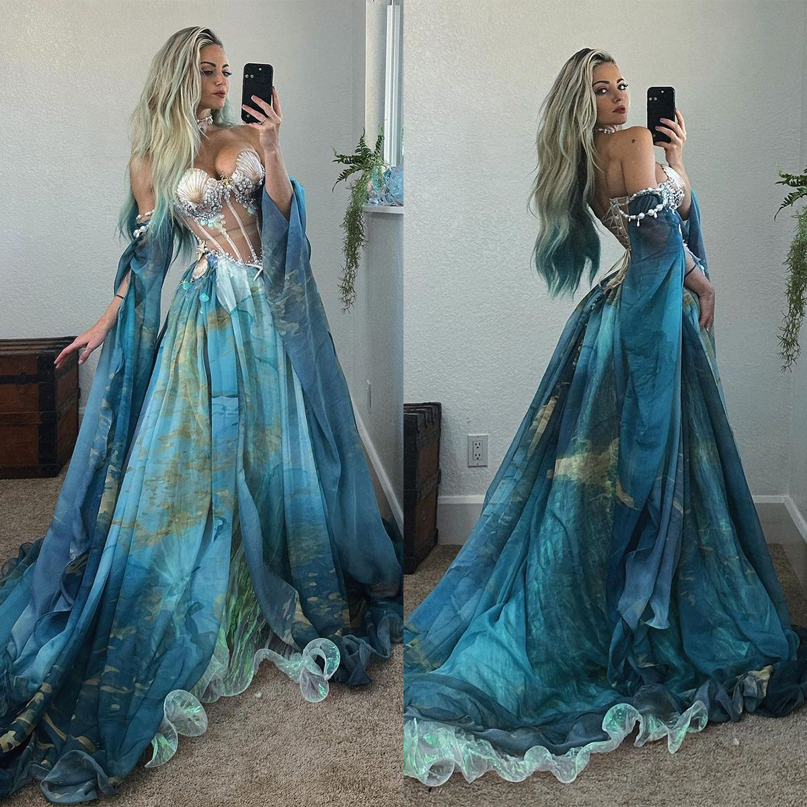

# 人鱼梦境（Mermaidcore）
> **状态**: reviewed | 最后更新: 2026-06-23 | 分类: 浪漫少女 | **趋势**: 🎭 小众领域

## 📖 概述
- 发源年代: 2022-2023年 TikTok 爆发，美学根源在神话/童话和海洋
- 发源地: 互联网 + 迪士尼《小美人鱼》的持续文化影响
- 风格关键词（5-8个）: 珠光面料、鳞片纹理、鱼尾裙、贝壳首饰、海蓝/紫/绿色、湿发感、珍珠
- 一句话定义: 像是刚从海浪里走出来的人鱼公主——珠光面料的鱼尾裙+贝壳首饰+珍珠+湿漉漉的长发。不是「去海边度假」，是「从海里回到陆地，但还没完全变回人类」。

## 📜 历史文化
- **起源**: Mermaidcore 是 Fairycore 的「海洋版」。如果说 Fairycore 是关于森林妖精，Mermaidcore 就是关于海洋人鱼。视觉参考包括：迪士尼《小美人鱼》(1989) 的 Ariel——紫色贝壳 bra+绿色鱼尾+红发；《加勒比海盗》中的美人鱼——珍珠+海藻长发+致命的美丽；以及神话中的人鱼原型（希腊神话的塞壬）。TikTok #Mermaidcore 播放量超 80 亿——远超预期，说明全球年轻女性对这个审美有深层的向往。2023年迪士尼真人版《小美人鱼》和后续的海洋时尚趋势持续推动。
- **发展脉络**:
  - **1989**: 迪士尼《小美人鱼》——Ariel 定义了「人鱼公主」的视觉公式
  - **2006-2010**: 《加勒比海盗4》中的美人鱼——更暗黑/更致命的美人鱼
  - **2022**: TikTok #Mermaidcore 爆发——珠光+鳞片+贝壳+湿发成为公式
  - **2023**: 迪士尼真人版《小美人鱼》——将 Mermaidcore 推向新的人群和肤色叙事
  - **2025-2026**: 保持小众但忠实的追随者——Mermaidcore 不追求「日常实穿」，它是纯粹的审美幻想
- **文化意义**: Mermaidcore 是关于「成为另一个物种」的审美幻想——在一个「做人太难」的时代，变成人鱼是一种浪漫的逃离。

## 🎨 美学特征
- **廓形特点**: 贴身+流线——鱼尾裙（mermaid skirt）紧贴身体到大腿中段然后展开，像鳞片的上衣或珠光针织衫包裹上身。核心是「人鱼线条」——从腰到膝盖的流线型身体。
- **色板**:
  - 主色调：人鱼绿(#20B2AA)、海蓝色(#0077B6)、薰衣草紫(#B8B5E0)、珠光白(#F5F5F5)
  - 辅助色：珊瑚粉、海沫绿、银色
  - 禁忌色：橙色、棕色、大地色——「陆地」的颜色
  - 色板逻辑：海洋的颜色——海水的蓝绿、贝壳的珠光白、海星的珊瑚粉、珍珠的银光
- **面料偏好**: 珠光面料 > 薄纱 > 丝绸 > 亮片 > 钩针编织。面料必须有「光泽」——像鱼鳞在阳光下反射的那种光泽。
- **标志单品表**:

| 单品 | 品牌示例 | 选择要点 |
|------|---------|---------|
| 鱼尾裙 (Mermaid Skirt) | Selkie, Free People, ASOS | 紧身至膝盖然后展开、中长或及踝、珠光或缎面 |
| 珠光/鳞片纹理上衣 | Free People, Cult Gaia, Etsy | 紧身、珠光色/人鱼绿/海蓝、鳞片图案 |
| 贝壳/海星首饰 | Etsy 手工, Alighieri, vintage | 真的贝壳或仿贝壳——项链/耳环/手链 |
| 珍珠（多层） | Chanel, Vivienne Westwood, Etsy | 多层珍珠项链——像人鱼从深海带来的宝藏 |
| 薄纱/雪纺披肩 | vintage, Etsy | 透明/半透明、海蓝色或白——像海浪的泡沫 |
| 湿发感造型 | — | 这是 Mermaidcore 的免费配饰——头发看起来像刚从海里出来 |

## 🏷️ 代表品牌
### 核心品牌
| 品牌 | 国家 | 价位 | 一句话 |
|------|------|------|--------|
| Cult Gaia | 美国 | ¥¥¥ | 珠光面料+贝壳元素+流线廓形——Mermaidcore 的「高级时尚版」|
| Selkie | 美国 | ¥¥-¥¥¥ | 蓬裙+珠光+人鱼灵感——Mermaidcore 的「公主版」|
| Free People | 美国 | ¥¥ | 波西米亚+海洋元素——贝壳首饰+珠光上衣的平价供应商 |
| Alighieri | 英国 | ¥¥¥ | 珠宝品牌，贝壳/海星/海洋遗迹灵感的珠宝——Mermaidcore 的「珠宝箱」|

### 平价替代
| 品牌 | 价位 | 说明 |
|------|------|------|
| ASOS | ¥ | 鱼尾裙和珠光单品 |
| Etsy 手工 | ¥-¥¥ | 真正的贝壳首饰和手工珠光上衣 |
| Zara | ¥ | 季节性提供珠光/缎面连衣裙 |

## 👤 风格偶像 & 名人
| 人物 | 身份 | 贡献 |
|------|------|------|
| Ariel（角色） | 迪士尼 | 1989年《小美人鱼》——她是所有 Mermaidcore 女生的「第一个美学记忆」|
| Halle Bailey | 演员/歌手 | 2023年迪士尼真人版《小美人鱼》中的 Ariel——将 Mermaidcore 带入 2020s 和新的肤色叙事 |
| Florence Welch | 歌手 | Florence + the Machine 的海洋/水元素视觉——不是人鱼，但她的海洋美学影响了 Mermaidcore |
| Gemma Ward | 模特 | 2000s 的「海洋精灵」——她的珠光皮肤+浅色头发+蓝绿色眼睛是人鱼的「陆地代理人」|

## 🔗 关联风格
- **父风格**: 浪漫女性化 (Romantic Feminine)
- **子风格**: 暗黑人鱼 (Dark Siren)、珍珠核 (Pearlcore)
- **平行风格**: 仙女垃圾（WF-26）——Fairy Grunge 在森林，Mermaidcore 在海洋——都是「非人类的美丽物种」幻想
- **对立风格**: 户外机能（WF-33）——Mermaidcore 在深海，Gorpcore 在山顶
- **与姐妹风格差异**:
  1. vs 仙女垃圾（WF-26）：Mermaidcore 是「海里的妖精」，Fairy Grunge 是「森林里的妖精」
  2. vs 度假逃逸（WF-37）：Resort Escape 是「在海滩上晒太阳」，Mermaidcore 是「在海里游着游着不想上岸了」

## 📈 流行趋势
- **当前状态**: 小众但高度忠实——不会成为大众趋势，但海洋/人鱼幻想不会消失
- **流行区域**: 全球（TikTok 驱动），沿海城市和海洋文化强的地区
- **发展方向**:
  - 2025-2026：从「cosplay 人鱼」到「海洋元素日常化」——珠光衬衫+牛仔裤+贝壳耳环

## 💡 穿搭建议
- **适合体型**: 梨形（鱼尾裙展露小腿和脚踝，0.85）、沙漏形（鱼尾裙包裹曲线，0.90）
- **适合肤色**: 人鱼绿/海蓝对所有肤色友好；珠光白对深肤色特别出色
- **适合场合**: 海边派对、泳池 party、音乐节、Halloween 变装（这是它的主场）
- **入门建议**:
  1. 从一对贝壳耳环开始——Mermaidcore 最低成本的入场券
  2. 一条珠光缎面中长裙——不一定是鱼尾裙，但要有「海洋的光泽」
  3. 多层珍珠项链——假珍珠也没关系
  4. 头发弄湿——这是 Mermaidcore 的终极免费配饰

---
*本文基于多源研究整理，AI 辅助生成。*
