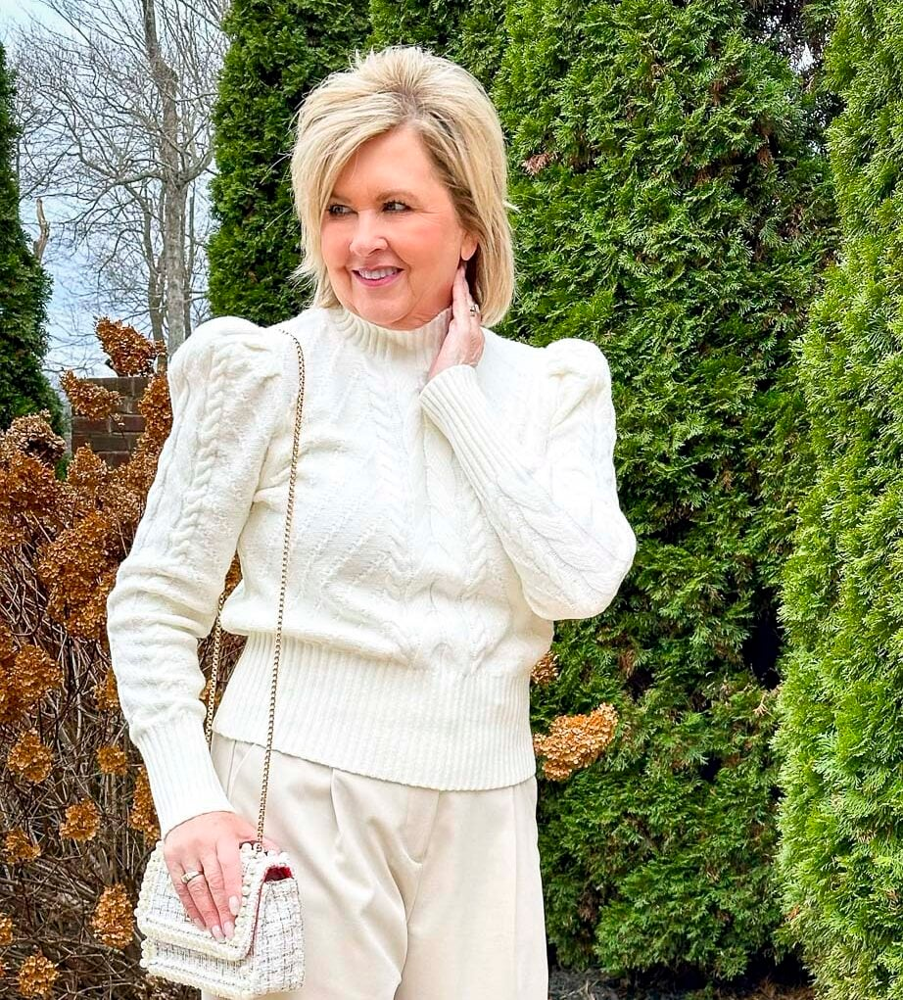

# 香草女孩（Vanilla Girl）
> **状态**: reviewed | 最后更新: 2026-06-23 | 分类: 奢华极简 | **趋势**: 🔥 流行趋势

## 📖 概述
- 发源年代: 2022-2023年 TikTok 爆发（#VanillaGirl）
- 发源地: 互联网（TikTok / Pinterest），是对 Clean Girl 和 Soft Girl 的「温暖化」改造
- 风格关键词（5-8个）: 奶油白、羊毛开衫、象牙针织衫、暖金色首饰、蜡烛、热可可、温暖舒适
- 一句话定义: 被加了香草和奶泡的生活——奶油白针织衫+象牙色羊毛开衫+暖金色首饰。Clean Girl 去了疗养院做了一次温暖的治疗，回来变成了 Vanilla Girl。

## 📜 历史文化
- **起源**: Vanilla Girl 是 Clean Girl 的「温暖版」和 Soft Girl 的「成熟版」。2022年末，在 Clean Girl 被批评「太冷/太排他/太追求完美」之后，TikTok 上出现了一个更温暖、更包容、更像「在家喝热可可」而不是「去普拉提课」的审美分支。#VanillaGirl 播放量超 40 亿。与 Clean Girl 的「slicked-back bun+金色耳环+中性基础款」公式不同，Vanilla Girl 的公式是「松散的辫子+奶油色针织衫+暖金色首饰+热饮」——它向世界传递的信号是：「我很舒适，你也可以。」
- **发展脉络**:
  - **2021**: Clean Girl 爆发——slicked-back bun+普拉提+绿色果汁
  - **2022年末**: Vanilla Girl 作为 Clean Girl 的「更温暖/更包容」的替代出现
  - **2023**: 与「Slow Living」和「Cozy Minimalism」生活方式趋势交汇
  - **2025-2026**: Vanilla Girl 和「香草美学」成为冬季的指定审美——奶油白+羊毛开衫+热可可
- **文化意义**: Vanilla Girl 是关于「温暖不需要道歉」——在一个要求你「高效/冷冻/紧绷」的世界里，它说：「我想穿得暖和、喝热可可、慢慢来。」

## 🎨 美学特征
- **廓形特点**: 宽松舒适——羊毛开衫 oversize，针织衫柔软贴肤，直筒裤或针织裤不紧勒。核心是「可以拥抱的廓形」——衣服看起来很好抱。
- **色板**:
  - 主色调：奶油白(#FFFDD0)、象牙白(#FFFFF0)、燕麦色(#F5F5DC)、浅驼(#D2C4B0)
  - 辅助色：浅灰、淡粉、淡棕
  - 禁忌色：黑色、深色、荧光色——任何太「硬」或太「亮」的颜色
  - 色板逻辑：拿铁、香草冰淇淋、燕麦粥、热可可上的奶泡——所有「可食用的温暖颜色」
- **面料偏好**: 羊毛 > 羊绒 > 安哥拉兔毛 > 棉针织 > 灯芯绒。面料必须是「温暖的/柔软的/可拥抱的」。
- **标志单品表**:

| 单品 | 品牌示例 | 选择要点 |
|------|---------|---------|
| 奶油白羊毛开衫 | Jenni Kayne, Nadaam, Uniqlo | 圆领或V领、oversize、奶油白或象牙白 |
| 象牙色修身针织衫 | Skims, COS, Uniqlo | 贴肤但不紧、奶油白/燕麦色、半高领 |
| 直筒针织裤/灯芯绒裤 | COS, Vince, Muji | 高腰、直筒、燕麦色/浅驼 |
| 暖金色首饰 | Mejuri, Missoma, vintage | 金色或玫瑰金、小吊坠、戒指可叠戴 |
| 奶油白球鞋/羊皮拖鞋 | Veja, Stan Smith, UGG | 白色或奶油白、可搭配白袜也可不穿袜 |
| 围巾/斗篷 | Acne Studios, COS, vintage | 羊毛或羊绒、奶油白/浅驼/格子 |

## 🏷️ 代表品牌
### 核心品牌
| 品牌 | 国家 | 价位 | 一句话 |
|------|------|------|--------|
| Jenni Kayne | 美国 | ¥¥¥ | 加州的「温暖极简」——羊毛开衫+奶油色针织衫的 Vanilla 殿堂 |
| Nadaam | 美国 | ¥¥ | DTC 羊绒品牌——$100 的羊绒开衫是 Vanilla Girl 的入门圣物 |
| Skims | 美国 | ¥¥ | 紧身针织衫和打底衫的 Vanilla Girl 首选 |
| COS | 瑞典 | ¥¥ | 建筑感温暖——羊毛大衣和针织裤的「不甜但暖」的版本 |

### 平价替代
| 品牌 | 价位 | 说明 |
|------|------|------|
| Uniqlo | ¥ | 羊毛开衫和针织衫的平价之王——特别是 U 系列 |
| Muji | ¥ | 日式温暖极简——羊毛袜/针织衫/围巾 |
| Arket | ¥¥ | 瑞典温暖——羊毛和羊绒的北欧平价版 |
| & Other Stories | ¥¥ | 更浪漫的 Vanilla Girl——加了蕾丝和蝴蝶结的奶油白 |

## 👤 风格偶像 & 名人
| 人物 | 身份 | 贡献 |
|------|------|------|
| Matilda Djerf | 瑞典博主 | 虽然她是「瑞典甜美」，但她的奶油白开衫+金色首饰+松散发型的造型完美命中 Vanilla Girl |
| Sofia Richie Grainge | 模特 | 她的「安静的奢华」中有强烈的 Vanilla Girl 元素——奶油白+金色首饰+不费力 |
| Ana de Armas | 演员 | 多次以奶油白+暖金色造型出现——Vanilla Girl 的「好莱坞版本」|

## 🔗 关联风格
- **父风格**: 温馨极简 (Cozy Minimalist)
- **子风格**: 针织核 (Knitcore)、热可可美学 (Hot Cocoa Aesthetic)
- **平行风格**: 干净女孩（WF-19）——Vanilla Girl 是 Clean Girl 的「温暖版」，加了羊毛/开衫/围巾
- **对立风格**: 暗黑女性力（WF-31）——Vanilla Girl 在阳光下喝热可可，Dark Feminine 在红酒暗光下
- **与姐妹风格差异**:
  1. vs 干净女孩（WF-19）：Clean Girl 去做普拉提，Vanilla Girl 在沙发上裹着羊毛毯
  2. vs 软妹风（WF-16）：Vanilla Girl 更成熟/更温暖/更中性，Soft Girl 更少女/更粉/更甜
  3. vs 北欧冷淡（WF-36）：Scandi Cool 是「灰蓝色+建筑廓形」，Vanilla Girl 是「奶油白+温暖舒适」——共享北欧基因，但温度不同

## 📈 流行趋势
- **当前状态**: 季节性高峰——每年秋冬 Vanilla Girl 都会重新回温
- **流行区域**: 全球（TikTok 驱动），冷气候地区更 applicable
- **发展方向**:
  - 2025-2026：从「季节性」走向「全年」——轻薄版 Vanilla Girl（亚麻替代羊毛）是春夏版本

## 💡 穿搭建议
- **适合体型**: 所有体型——宽松开衫+直筒针织裤包容一切
- **适合肤色**: 奶油白/象牙白对所有肤色友好——特别是深肤色穿冰淇淋白非常出色
- **适合场合**: 在家办公（满分）、周末 brunch、咖啡馆、逛农贸市场、冬季散步
- **入门建议**:
  1. 从一件奶油白羊毛开衫开始——Jenni Kayne 或 Nadaam
  2. 一件象牙色半高领针织衫——Skims 或 Uniqlo U
  3. 一条直筒针织裤或燕麦色灯芯绒裤
  4. 暖金色小首饰——戒指和耳环的叠戴
  5. 一杯热可可——这是最低成本的 Vanilla Girl 配饰

---
*本文基于多源研究整理，AI 辅助生成。*
