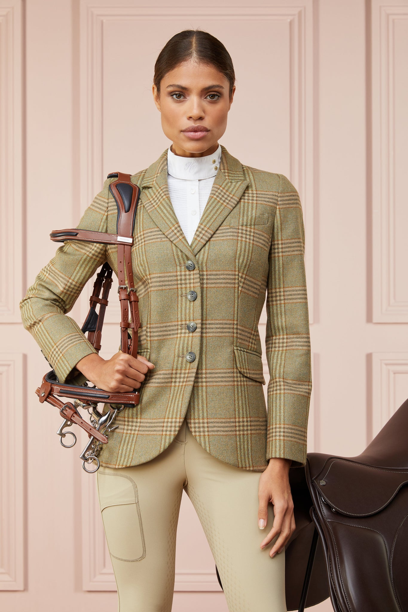

# 马术优雅（Equestrian）
> **状态**: reviewed | 最后更新: 2026-06-23 | 分类: 欧洲经典 | **趋势**: 🏛️ 经典风格

## 📖 概述
- 发源年代: 19 世纪英国马术传统，2020s 因 Harry Styles 和 Gucci 联名重获时尚关注
- 发源地: 英国乡村马厩 + 法国 Chantilly 马术传统
- 风格关键词（5-8个）: 马术靴、骑兵夹克、骑马裤、粗花呢、马衔扣、皮革、马厩
- 一句话定义: 从马厩到秀场的优雅——骑马裤+高筒马术靴+粗花呢骑兵夹克+马衔扣细节。不是在马背上，是刚从马背上下来，但依然优雅得体。

## 📜 历史文化
- **起源**: 马术时尚是「运动时尚化」最早的例子之一。19 世纪，英国贵族将骑马作为日常运动，需要专门的功能性服装——骑马裤（breeches）允许膝盖弯曲，高筒靴保护小腿不被马镫摩擦，粗花呢夹克保暖且耐用。当这些功能性单品被穿出马厩、进入日常社交场合时，「马术优雅」就诞生了。20世纪，Hermès（1837年创立，最初是马具制造商）将马术工艺变成了奢侈的符号——它的马衔扣/马鞍针/马具皮革至今仍是品牌DNA。Gucci 的马衔扣乐福鞋（1953年创造）是将马术元素带入日常的经典案例。
- **发展脉络**:
  - **19 世纪**: 英国贵族马术传统——骑马裤+高筒靴+粗花呢夹克的功能性组合
  - **1837**: Hermès 创立于巴黎，最初为马具制造商——马术皮革工艺后来变成了 Birkin/Kelly 包的基础
  - **1953**: Gucci 马衔扣乐福鞋诞生——马术元素进入日常鞋履
  - **1970-80s**: Ralph Lauren 将马球（Polo）和马术审美商业化——Polo 衫和粗花呢夹克的全球普及
  - **2015**: Gucci 在 Alessandro Michele 领导下全面复兴马术元素——马衔扣/骑兵夹克/高筒靴
  - **2020-2026**: Harry Styles 在 Gucci 广告和日常中将马术元素带入新一代年轻人的审美
- **文化意义**: 马术优雅是关于「阶层和运动的优雅交集」——它告诉你：运动不需要穿运动服，优雅不需要待在室内。

## 🎨 美学特征
- **廓形特点**: 上紧下合——骑兵夹克有收腰（belted或剪裁），骑马裤在膝盖以上紧贴，膝盖以下略展开（方便弯曲），高筒靴贴合小腿。核心是「专业骑手的廓形」。
- **色板**:
  - 主色调：猎人绿(#355E3B)、海军蓝(#1B2A4A)、驼色(#C4A882)、黑色(#000000)
  - 辅助色：酒红（骑马夹克的衬里）、白色（骑马衬衫）、棕色（皮靴）
  - 禁忌色：荧光色、粉彩、印花——马术不「甜」不「乱」
  - 色板逻辑：英国乡村马厩和骑术比赛的颜色——草地绿、泥土棕、皮革黑、天际蓝
- **面料偏好**: 粗花呢 > 皮革 > 羊毛 > 棉府绸 > 麂皮。面料要「耐用」——马术服装必须经得起实际的户外使用。
- **标志单品表**:

| 单品 | 品牌示例 | 选择要点 |
|------|---------|---------|
| 骑兵夹克 (Equestrian Blazer) | Gucci, Holland Cooper, Ralph Lauren | 粗花呢或羊毛、收腰、双排扣或单排、有骑马补丁 |
| 骑马裤/紧身马裤 | Holland Cooper, Pikeur, Ariat | 高腰、膝盖以上紧贴、膝盖以下略展开、大地色或白色 |
| 高筒马术靴 | Gucci, Hermès, Ariat | 及膝、黑色或棕色、皮革、简约无装饰 |
| 马衔扣乐福鞋/腰带 | Gucci, Hermès, Tod's | 马衔扣细节——最经典的「马术信号」|
| 真丝马术围巾 | Hermès, vintage | 小方巾系在颈部——马术传统中的「点睛之笔」|
| 马术帽/头盔（美学参考）| — | 不需要真的戴头盔上街，但遮阳帽或硬挺的羊毛帽是马术审美的「态度配件」|

## 🏷️ 代表品牌
### 核心品牌
| 品牌 | 国家 | 价位 | 一句话 |
|------|------|------|--------|
| Hermès | 法国 | ¥¥¥¥¥ | 1837年创立于巴黎，从马具制造商成为全球奢侈之巅——马术工艺+马鞍针+马衔扣是品牌DNA |
| Gucci | 意大利 | ¥¥¥¥ | 马衔扣乐福鞋和骑兵夹克——马术元素进入日常时尚的终极入口 |
| Ralph Lauren | 美国 | ¥¥¥ | Polo 线和粗花呢夹克——将马球/马术审美变成全球化的「美式贵族」|
| Holland Cooper | 英国 | ¥¥¥ | 英国马术服装的当代代表——骑马裤+粗花呢夹克+高筒靴 |
| Ariat | 美国 | ¥¥-¥¥¥ | 真正的马术装备品牌——如果你是骑手，你穿 Ariat |

### 平价替代
| 品牌 | 价位 | 说明 |
|------|------|------|
| Zara | ¥ | 骑兵夹克和高筒靴的季节性供应 |
| Massimo Dutti | ¥¥ | 西班牙优雅，粗花呢夹克和皮革腰带的平价选择 |
| Barbour | ¥¥¥ | 英国蜡棉夹克——虽然不是「马术」，但同属英国乡村优雅传统 |

## 👤 风格偶像 & 名人
| 人物 | 身份 | 贡献 |
|------|------|------|
| 戴安娜王妃 | 英国王室 | 多次穿着马术风格服装——粗花呢夹克+马术靴。她本人也骑马 |
| 安妮公主 | 英国王室 | 伊丽莎白二世的女儿，奥运会马术选手——真正的「骑在马上的公主」|
| Charlotte Casiraghi | 摩纳哥王室 | Grace Kelly 的孙女，职业马术运动员+Gucci 面孔——马术优雅的当代化身 |
| Harry Styles | 歌手 | Gucci 广告中的马术元素——高筒靴+骑兵夹克+真丝围巾——将马术带入 Z 世代 |

## 🔗 关联风格
- **父风格**: 欧洲经典 (European Classic)
- **子风格**: 马球风 (Polo Style)、乡村骑手 (Country Rider)
- **平行风格**: 网球名媛（WF-38）——共享「运动+优雅+贵族」，Equestrian 在马厩，Tenniscore 在网球场
- **对立风格**: 女性街头（WF-28）——Equestrian 在英国乡村马厩，Streetwear 在纽约街头
- **与姐妹风格差异**:
  1. vs 网球名媛（WF-38）：共享「精英运动」精神，但马术更「户外/粗犷/皮革」，网球更「精致/白色/棉质」
  2. vs 英伦淑女（WF-43）：Equestrian 是 British Lady 的「马厩版本」——更为功能性、更户外
  3. vs 西部女郎（WF-45）：Equestrian 是「英国贵族的马术」，Western Babe 是「美国牛仔的牧场」——同样是马/皮革/靴子，但是两个世界

## 📈 流行趋势
- **当前状态**: 经典稳定——马术元素每隔几年就会被 Gucci/Hermès 重新注入新的时尚活力
- **流行区域**: 英国 > 法国 > 美国东海岸。马术传统强的地区
- **发展方向**:
  - 2025-2026：马术元素「日常化」——马衔扣腰带+牛仔裤+高筒靴=日常版 Equestrian
  - 可持续皮革——植物鞣制皮革和马术 vintage 单品的再利用

## 💡 穿搭建议
- **适合体型**: 所有体型——收腰骑兵夹克+高筒靴是万用公式
- **适合肤色**: 猎人绿/海军蓝/驼色对所有肤色友好
- **适合场合**: 马术比赛（当然）、乡村周末、户外早午餐、秋冬通勤
- **入门建议**:
  1. 从一双高筒皮革马术靴开始——Ariat（真正的马术品牌）或 Gucci（时尚版）
  2. 一条马衔扣腰带——Gucci 或平价替代
  3. 一件粗花呢夹克——Ralph Lauren 或 Holland Cooper
  4. 一条真丝小方巾系在颈部——这是最低成本的「马术信号」

---
*本文基于多源研究整理，AI 辅助生成。*
