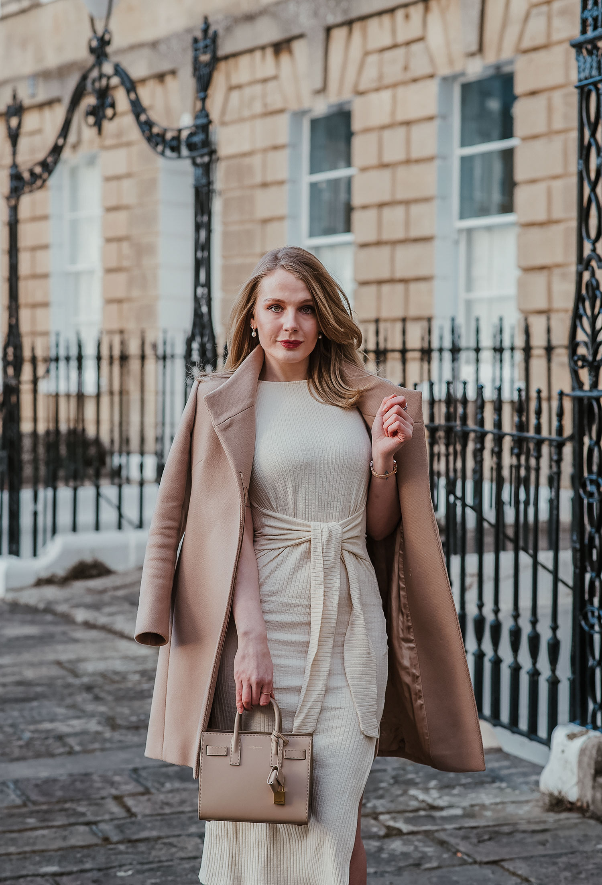

# 端庄优雅（Modest Chic）
> **状态**: reviewed | 最后更新: 2026-06-23 | 分类: 文化优雅 | **趋势**: 🏛️ 经典风格

## 📖 概述
- 发源年代: 2010s 后期兴起，2020s 全面进入主流时尚，源自宗教端庄传统和现代女性自主选择的交汇
- 发源地: 全球（中东/东南亚/非洲/欧美并存），无单一地理中心
- 风格关键词（5-8个）: 长袖、高领、及踝长裙、层叠、宽松廓形、颜色协调、端庄但时尚
- 一句话定义: 端庄不是隐藏自己，是选择不暴露——及踝长裙+高领上衣+宽松廓形+精妙的颜色和面料搭配。不是「被要求遮掩」，是「自主选择遮掩并因此感到有力量」。

## 📜 历史文化
- **起源**: Modest Chic 是 2010s 后期最引人注目的时尚运动之一。它的根源在多种宗教的端庄传统——伊斯兰教的 hijab/abaya、犹太教的 tznius、基督教的 modesty dressing——但它的现代版本超越了宗教边界。2010s，一批穆斯林时尚博主（如 Dina Tokio/Habiba Da Silva/Summersalbums）开始在 Instagram 和 YouTube 上展示「端庄也可以时尚」，撕掉了「端庄=乏味/过时/强迫」的标签。2017-2018年，奢侈品牌开始注意到这个市场——Dolce & Gabbana 推出 hijab 和 abaya 系列、Nike 推出 Pro Hijab、Halima Aden 成为首位戴 hijab 走国际时装周的模特。2020s，Modest Chic 从「穆斯林时尚」扩展到所有选择端庄着装的女性——不论宗教原因、个人偏好、还是时尚兴趣。
- **发展脉络**:
  - **2010-2015**: 穆斯林时尚博主开始在 YouTube/Instagram 上建立社群——#HijabFashion 标签诞生
  - **2016**: Dolce & Gabbana 推出首个奢侈 hijab/abaya 系列
  - **2017**: Nike Pro Hijab——运动品牌进入端庄时尚市场；Halima Aden 在 Kanye West 的 Yeezy 秀上戴 hijab 走秀
  - **2019-2020**: Modest Fashion Week 在伊斯坦布尔/伦敦/雅加达等城市举办
  - **2022-2026**: Modest Chic 成为主流时尚的一部分——不只是「穆斯林时尚」，而是所有选择「覆盖更多皮肤」的女性的时尚选项
- **文化意义**: Modest Chic 是关于「女性自主权」的时尚宣言——不暴露也可以很美、很时尚、很有力量。它说：「我选择遮多少皮肤是我的权利，不是你的规则。」

## 🎨 美学特征
- **廓形特点**: 宽松+层叠——及踝长裙或阔腿裤在外面，宽松长袖衬衫或高领内搭在里面。核心是「覆盖但有廓形」——不是「套在袋子里」，是通过面料和比例游戏创造优雅的线条。
- **色板**:
  - 主色调：驼色(#C4A882)、奶油白(#FFFDD0)、暗绿(#4A5D4A)、暗蓝(#1B2A4A)
  - 辅助色：黑、白、灰、酒红、深紫
  - 禁忌色：荧光色、霓虹色——端庄风格的颜色是「安静的/有深度的」
  - 色板逻辑：大地色+宝石色——自然的/有质感的所有颜色
- **面料偏好**: 真丝 > 羊毛 > 棉 > 亚麻 > 绉布。面料要有「流动感」或「结构感」——因为廓形宽松，面料必须要么流动飘逸要么挺括有型。
- **标志单品表**:

| 单品 | 品牌示例 | 选择要点 |
|------|---------|---------|
| 及踝长裙/长连衣裙 | COS, The Row, Uniqlo, ASOS Modest | A字或直筒、及踝长度、纯色或低调印花 |
| 高领/半高领上衣 | COS, Uniqlo, Skims | 合身但不紧、长袖、可当内搭也可单穿 |
| 宽松长袖衬衫 | Equipment, COS, Arket | oversize、领口可系可不系、白色/奶油色/蓝 |
| 阔腿长裤 | The Row, COS, Vince | 高腰、及地、垂坠 |
| 围巾/头巾 (Hijab/Shawl) | Haute Hijab, Vela Scarves, Silk Collections | 真丝或棉、纯色或低调印花、可包头也可当围巾 |
| 结构感长外套 | Max Mara, COS, Uniqlo U | 及踝或过膝、羊毛或羊绒、收腰或无腰均可 |

## 🏷️ 代表品牌
### 核心品牌
| 品牌 | 国家 | 价位 | 一句话 |
|------|------|------|--------|
| The Modist | 全球平台 | ¥¥-¥¥¥¥ | 2017年创立，奢侈品端庄时尚电商——Modest Chic 的「百货商店」|
| Haute Hijab | 美国/全球 | ¥¥ | 头巾和端庄时尚的 DTC 品牌——让头巾成为时尚宣言 |
| Dolce & Gabbana | 意大利 | ¥¥¥¥ | 2016年推出奢侈 hijab/abaya 系列——第一个进入端庄市场的高级时尚品牌 |
| COS | 瑞典 | ¥¥ | 高领上衣+及踝裙+宽松衬衫的平价端庄制服供应商 |

### 平价替代
| 品牌 | 价位 | 说明 |
|------|------|------|
| Uniqlo | ¥ | 高领上衣、宽松长裤、及踝裙的平价之王 |
| Muji | ¥ | 日式简约端庄——亚麻和棉的长袖长裙 |
| ASOS（Modest 线） | ¥ | ASOS 的端庄时尚专区——从日常到派对 |
| Arket | ¥¥ | 瑞典端正——羊毛大衣和宽松长裤的端庄版本 |

## 👤 风格偶像 & 名人
| 人物 | 身份 | 贡献 |
|------|------|------|
| Halima Aden | 模特 | 首位戴 hijab 走国际时装周和登《Sports Illustrated》泳装特辑的模特——她单枪匹马改变了时尚界对端庄的看法 |
| Dina Tokio | 博主 | 最早将「穆斯林时尚」带入 YouTube 主流的博主之一——2011年开始创作 |
| Habiba Da Silva | 博主 | 英籍巴西裔穆斯林博主——她的端庄混搭风格影响了一代 Modest Chic 女性 |
| 玛丽 (Mary, 耶稣母亲) | 历史/宗教人物 | 在所有宗教艺术中被描绘为端庄着装——她是 Modest Chic 的「终极原型」|

## 🔗 关联风格
- **父风格**: 文化优雅 (Cultural Elegance)
- **子风格**: 穆斯林时尚 (Muslim Fashion)、犹太端庄 (Tznius Style)、基督教端庄
- **平行风格**: 静奢风（WF-17）——共享「覆盖/品质/不炫耀」，Quiet Luxury 的「安静」= Modest Chic 的「端庄」在审美上有大量重叠
- **对立风格**: Y2K 千禧复古（WF-10）——Modest Chic 覆盖皮肤，Y2K 露出皮肤
- **与姐妹风格差异**:
  1. vs 静奢风（WF-17）：Modest Chic 有宗教/文化/个人选择的「遮盖」意图，Quiet Luxury 的遮盖只是审美的巧合
  2. vs 极简（WF-06）：共享「少即是多」，Modest Chic 的「少」是皮肤暴露的少，Minimalist 的「少」是装饰的少

## 📈 流行趋势
- **当前状态**: 持续增长——端庄时尚市场预计 2025-2030 年 CAGR 8-10%
- **流行区域**: 中东 > 东南亚（印尼/马来） > 欧洲 > 北美。穆斯林人口多的地区是核心市场
- **发展方向**:
  - 2025-2026：Modest Chic 从「穆斯林专属」走向「全体女性的自主选择」——更多非穆斯林女性因为喜欢覆盖而选择端庄
  - 运动端庄——Nike Pro Hijab 开创的「运动+端庄」领域继续扩大

## 💡 穿搭建议
- **适合体型**: 所有体型——宽松廓形天然包容一切
- **适合肤色**: 大地色+宝石色对所有肤色友好
- **适合场合**: 几乎所有场合（除了海滩/泳池）——这正是 Modest Chic 的优势
- **入门建议**:
  1. 从一条及踝长裙开始——COS 或 Uniqlo，A字或直筒
  2. 一件高领长袖上衣——可当内搭也可单穿
  3. 一件宽松长袖白衬衫——可当外搭也可塞进裙子里
  4. 端庄不是限制——是另一种形式和比例的自由

---
*本文基于多源研究整理，AI 辅助生成。*
