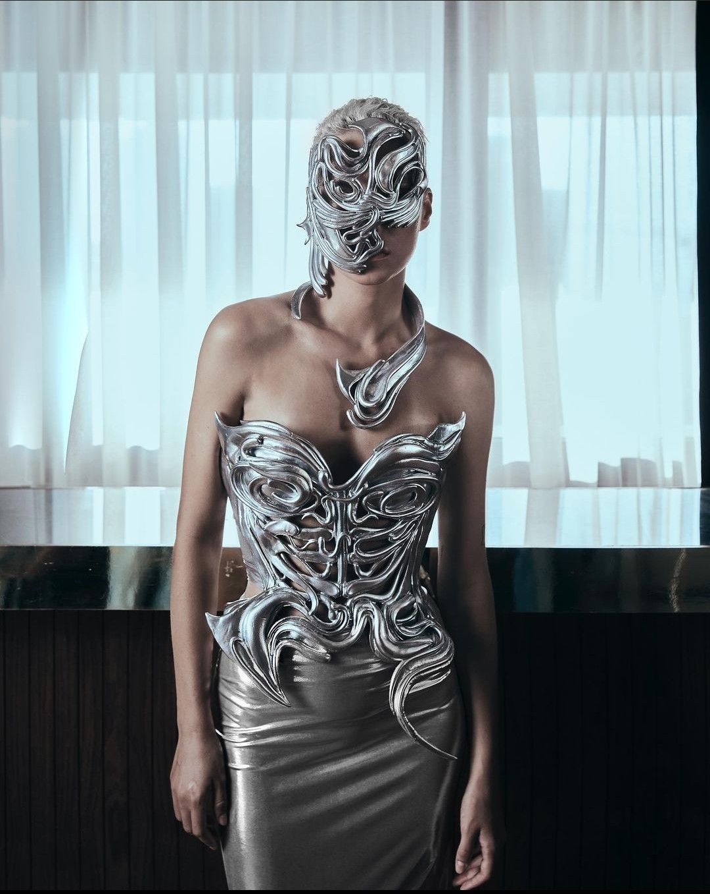

# Y3K 未来感（Cyber Y3K）
> **状态**: reviewed | 最后更新: 2026-06-23 | 分类: 未来先锋 | **趋势**: 🎭 小众领域

## 📖 概述
- 发源年代: 2022-2023年 TikTok 爆发（#Y3K），是对 Y2K（2000年代复古）的「向前看」回应
- 发源地: 互联网（TikTok / Instagram），视觉参考来自科幻电影/赛博朋克/后人类想象
- 风格关键词（5-8个）: 金属面料、外星墨镜、解构廓形、3D打印、银色/全息色、未来感、数字
- 一句话定义: 像 3000 年的人给 2020s 的我们发来的时尚传真——金属/全息面料+外星墨镜+解构廓形。不是「复古未来」（那是 Y2K 的想象），是「现在的我们想象 3000 年的人类穿什么」。

## 📜 历史文化
- **起源**: Y3K 是 Y2K 的「对立面」。Y2K 是 2000 年代的人对未来的想象（金属色/全息/外星人——但那个「未来」已经过去了）；Y3K 是 2020s 的人对 3000 年（Year 3000，缩写 Y3K）的想象——是现在的我们用最新的面料技术、3D打印、和 AI 美学工具来设计「未来的衣服」。TikTok #Y3K 和 #CyberY3K 播放量超 60 亿。视觉参考包括：赛博朋克（《银翼杀手》《赛博朋克 2077》）、后人类艺术（Grimes 的音乐视觉/Michèle Lamy 的风格）、以及 AI 生成的「现在还不存在但看起来可以存在」的服装。
- **发展脉络**:
  - **1982**: 《银翼杀手》——赛博朋克视觉的奠基
  - **1999-2003**: 《黑客帝国》三部曲——黑色皮衣+墨镜+绿代码的未来主义
  - **2010s**: Grimes 和 FKA twigs 的音乐视觉——后人类/外星/数字美学的先行者
  - **2020-2021**: Y2K 复古大爆发——所有人都在怀旧 2000 年代
  - **2022-2023**: TikTok #Y3K——「不怀旧了，向前看。3000 年我们会穿什么？」
  - **2024-2026**: AI 生成的服装图像和 3D打印技术的进步让 Y3K 从「幻想」逐步走向「可穿着」
- **文化意义**: Y3K 是关于「未来想象权」的时尚宣言——在一个被气候危机/AI焦虑/社会动荡压得喘不过气的时代，它说：「我们仍然可以想象一个未来，而且这个未来可以很美。」

## 🎨 美学特征
- **廓形特点**: 解构+不对称+外星——衣服不必跟随人体线条。肩可以比头高，袖可以比身长，裤可以比腿宽。廓形逻辑是「如果人体进化了三只手或者翅膀，衣服该怎么设计？」
- **色板**:
  - 主色调：银色/全息(#C0C0C0)、黑色(#000000)、白色(#FFFFFF)、电光蓝(#00FFFF)
  - 辅助色：霓虹绿、紫色、透明
  - 禁忌色：驼色、大地色、印花——任何太「自然」或太「过去」的颜色
  - 色板逻辑：LCD屏幕、金属铬、激光光束、全息投影的颜色
- **面料偏好**: 金属面料 > PVC/透明塑料 > 3D打印材料 > 尼龙 > 高科技合成面料。面料必须是「地球上不常见的」——反光、透明、结构性的。
- **标志单品表**:

| 单品 | 品牌示例 | 选择要点 |
|------|---------|---------|
| 外星墨镜/全脸面罩 | Gentle Monster, Balenciaga, vintage | 不规则形状、全息镜片、或完全遮住眼睛 |
| 金属/全息面料上衣 | Balenciaga, Mugler, Area | 银色/全息色/镜面、不对称廓形、紧身或结构性强 |
| 解构阔腿裤/降落伞裤 | Balenciaga, Rick Owens, Dion Lee | 超宽腿、多搭带/多口袋、黑色或银色 |
| 厚底/异形靴子 | Balenciaga (Cargo), Demonia, Naked Wolfe | 厚底、尖头或方头、黑色/银色/透明 |
| 3D打印首饰/面饰 | Etsy 手工, 独立设计师 | 像从外星来的——人脸饰件/指环延伸到手指之外 |
| 赛博朋克风格外套 | Acronym, Nike ACG, Rick Owens | 多搭带/多口袋/功能性+未来感的融合——Techwear 是 Y3K 的「实用版」|

## 🏷️ 代表品牌
### 核心品牌
| 品牌 | 国家 | 价位 | 一句话 |
|------|------|------|--------|
| Balenciaga | 法国/西班牙 | ¥¥¥¥ | Demna Gvasalia 的解构廓形+外星墨镜+厚底靴——Y3K 的「高级时尚旗舰」|
| Mugler | 法国 | ¥¥¥¥ | 1970s 创立，外星性感+金属面料+尖锐廓形的先驱——Casey Cadwallader 时代的 Mugler 是 Y3K 的圣殿 |
| Rick Owens | 美国/意大利 | ¥¥¥¥ | 暗黑+外星+解构——Rick Owens 的世界从 1994 年就住在 3000 年 |
| Gentle Monster | 韩国 | ¥¥ | 外星墨镜和实验性眼镜的全球之王——每一副都像为未来的自己准备的 |
| Area | 美国 | ¥¥¥ | 水晶+金属+全息——Y3K 的「华丽/派对版」|

### 平价替代
| 品牌 | 价位 | 说明 |
|------|------|------|
| ASOS（Collusion） | ¥ | 银色/全息面料单品的入门之选 |
| Zara | ¥ | 季节性提供金属色和解构廓形 |
| Demonia | ¥¥ | 外星厚底鞋和靴子的平价之王 |
| Etsy 3D 打印 | ¥-¥¥ | 真正 3D 打印的首饰和面饰——来自全球独立设计师 |

## 👤 风格偶像 & 名人
| 人物 | 身份 | 贡献 |
|------|------|------|
| Grimes | 歌手 | 后人类/外星/数字美学的音乐+视觉先行者——Y3K 的教母 |
| FKA twigs | 歌手/舞者 | 外星身体+解构服装+数字美学的完美结合 |
| Björk | 歌手 | 1990s 至今的未来主义——她的 Alexander McQueen 和 Iris van Herpen 造型是 Y3K 的原型 |
| Zendaya | 演员 | 《沙丘》全球宣传期间穿着的 Mugler/Balenciaga 未来主义造型——Y3K 的「大片版」|
| Michèle Lamy | 艺术家/设计师 | Rick Owens 的妻子和缪斯——她的身体本身就是 Y3K 宣言 |

## 🔗 关联风格
- **父风格**: 未来先锋 (Avant-Garde Future)
- **子风格**: 赛博朋克风 (Cyberpunk)、数字妖精 (Digi-Fairy)
- **平行风格**: Y2K 千禧复古（WF-10）——Y2K 是「2000年的人想象未来」，Y3K 是「2020s的人想象3000年」
- **对立风格**: 田园牧歌（WF-13）——Y3K 在赛博朋克城市，Cottagecore 在野花草地
- **与姐妹风格差异**:
  1. vs Y2K（WF-10）：Y2K 是「过去对未来的想象」（已经过时了），Y3K 是「现在对未来的想象」（仍然在生成中）
  2. vs 户外机能（WF-33）：Gorpcore 是「保护身体免受自然环境伤害」，Y3K 是「保护身体免受数字/赛博环境伤害」

## 📈 流行趋势
- **当前状态**: 上升期——AI 美学和 3D打印技术的进步正在将 Y3K 从「幻想」推向「现实」
- **流行区域**: 全球（互联网原生审美），韩国/日本（数字文化和 K-pop 的 Y3K 版本）有平行表达
- **发展方向**:
  - 2025-2026：AI 生成的服装设计被实际生产——Midjourney/DALL·E 提出的廓形被设计师落地
  - 3D 打印珠宝和面饰的普及——Y3K 最便宜的入场券

## 💡 穿搭建议
- **适合体型**: 所有体型——解构廓形完全脱离人体线条
- **适合肤色**: 银色/全息色对所有肤色友好——各种肤色配银色都像来自未来
- **适合场合**: 派对、音乐节、时尚周、艺术展、任何「我需要被注意到」的场合
- **入门建议**:
  1. 从一副外星墨镜开始——Gentle Monster 或 Balenciaga
  2. 一件银色/全息面料的上衣——Mugler（投资款）或 Zara（平价）
  3. 一双厚底异形靴——Demonia 或 Balenciaga Cargo
  4. 一件 3D 打印首饰（Etsy）——这是最低成本但也最「Y3K」的配饰
  5. 姿态：想象你来自 3000 年，不是来毁灭地球的，是来观察人类穿搭的

---
*本文基于多源研究整理，AI 辅助生成。*
